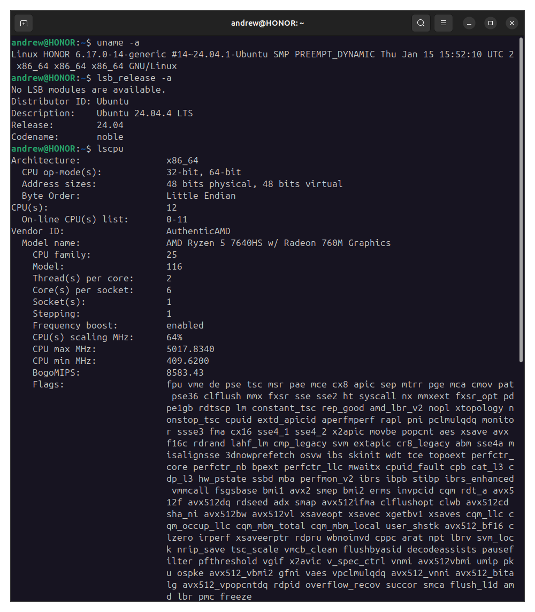
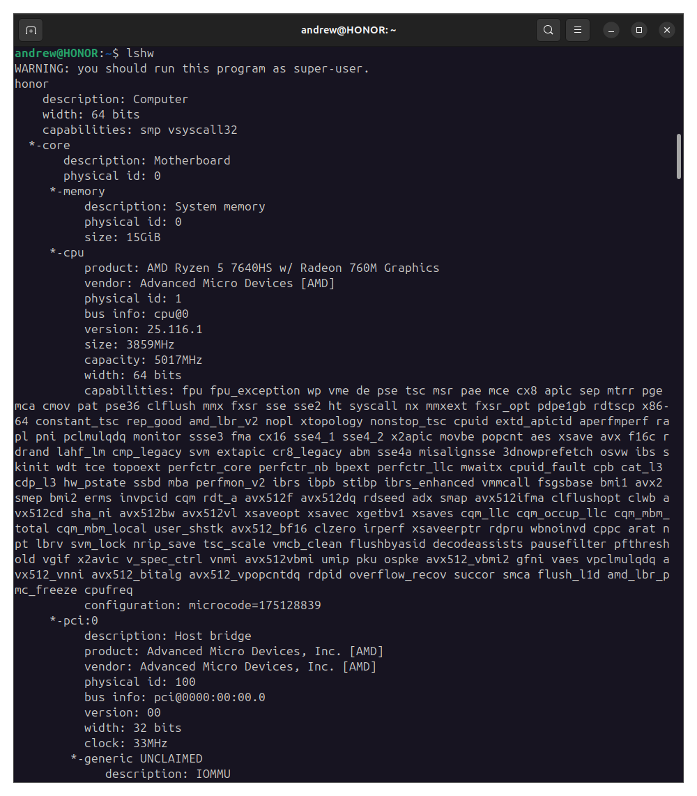

# Домашнее задание к занятию «Архитектура компьютера. Операционная система» - Лукинов Андрей

### Цель задания

На лекции вы узнали, что такое операционная система и какие функции она выполняет. Теперь вы поработаете с операционной системой, которая установлена на вашем домашнем или рабочем ПК. В результате выполнения этого задания вы:
- научитесь запускать терминал
- получите данные о вашей системе из командной строки

### Задание

Если вы работаете в **ОС Windows**, то запустите командную строку и введите команды:
- wmic cpu get caption, deviceid, name, numberofcores, maxclockspeed, status
- winver
- ver
- выполните msinfo32
- systeminfo

Если вы работаете в **ОС X**, то запустите терминал и введите команды:
- sw_vers
- uname -a
- system_profiler
- sysctl -n machdep.cpu.brand_string
- system_profiler SPHardwareDataType

Если вы работаете в **ОС Linux**, то запустите терминал и введите команды:
- uname -a
- lsb_release -a
- lscpu
- lshw

Что выводит каждая их этих команд?

Ответ

*Ответ приведите в виде снимков экрана с комментарием в свободной форме*

**ОС Windows**

- wmic cpu get... — Показывает подробную информацию о процессоре (модель, количество ядер, максимальную тактовую частоту и состояние).
- winver — Открывает окно «О программе Windows», где указана версия и сборка ОС.
- ver — Выводит в командной строке номер версии Windows (например, Microsoft Windows [Version 10.0.19045.3693]).
- msinfo32 — Открывает графическую утилиту «Сведения о системе», содержащую полную сводку о конфигурации оборудования и ПО.
- systeminfo — Показывает в командной строке подробную конфигурацию компьютера (версия ОС, производитель, общий объем памяти, сетевые адаптеры и т.д.).

**ОС X (macOS)**

- sw_vers — Выводит название, версию и сборку операционной системы macOS.
- uname -a — Отображает общую информацию о ядре системы (название ядра, версия, архитектура процессора, дата сборки).
- system_profiler — Мощная утилита, показывающая детальный отчёт обо всём аппаратном и программном обеспечении Mac.
- sysctl -n machdep.cpu.brand_string — Выводит точную модель и частоту процессора (например, *Intel Core i7-9750H*).
- system_profiler SPHardwareDataType — Показывает только сводку по «железу»: модель Mac, количество памяти, серийный номер и тип процессора.

**ОС Linux**

- uname -a — Показывает информацию о ядре Linux, имени хоста и архитектуре системы.
- lsb_release -a — Выводит данные о дистрибутиве Linux (название и версия, например, Ubuntu 22.04).
- lscpu — Отображает архитектуру процессора, количество ядер, потоков, модель CPU и его частоту.
- lshw — Утилита для просмотра полной конфигурации оборудования (обычно требует прав суперпользователя sudo).

