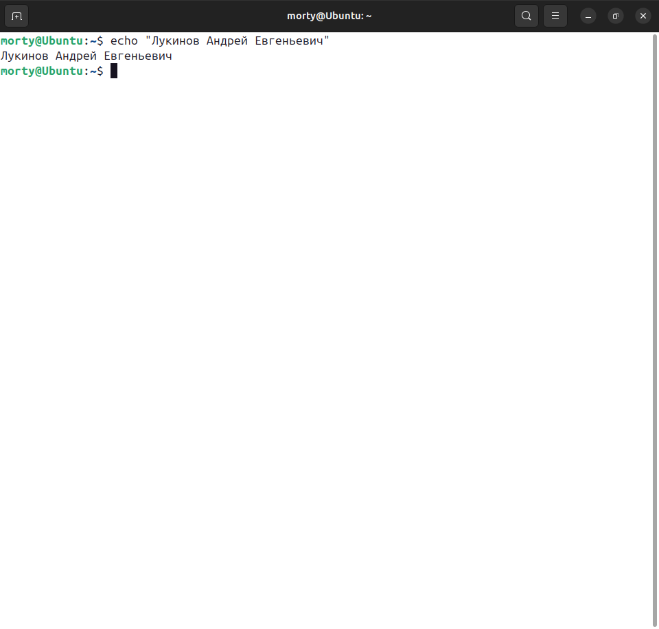
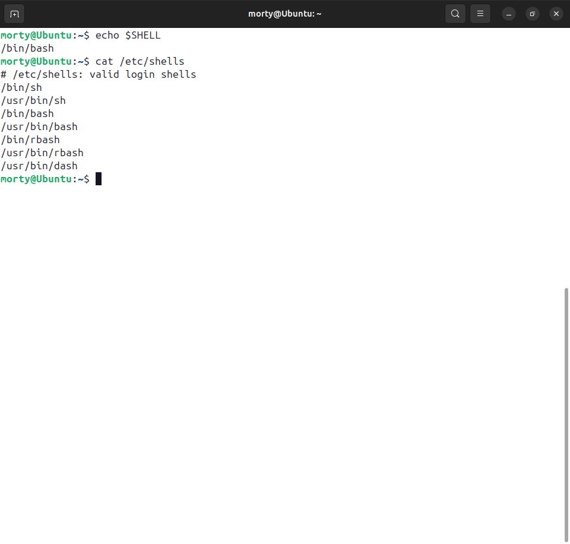
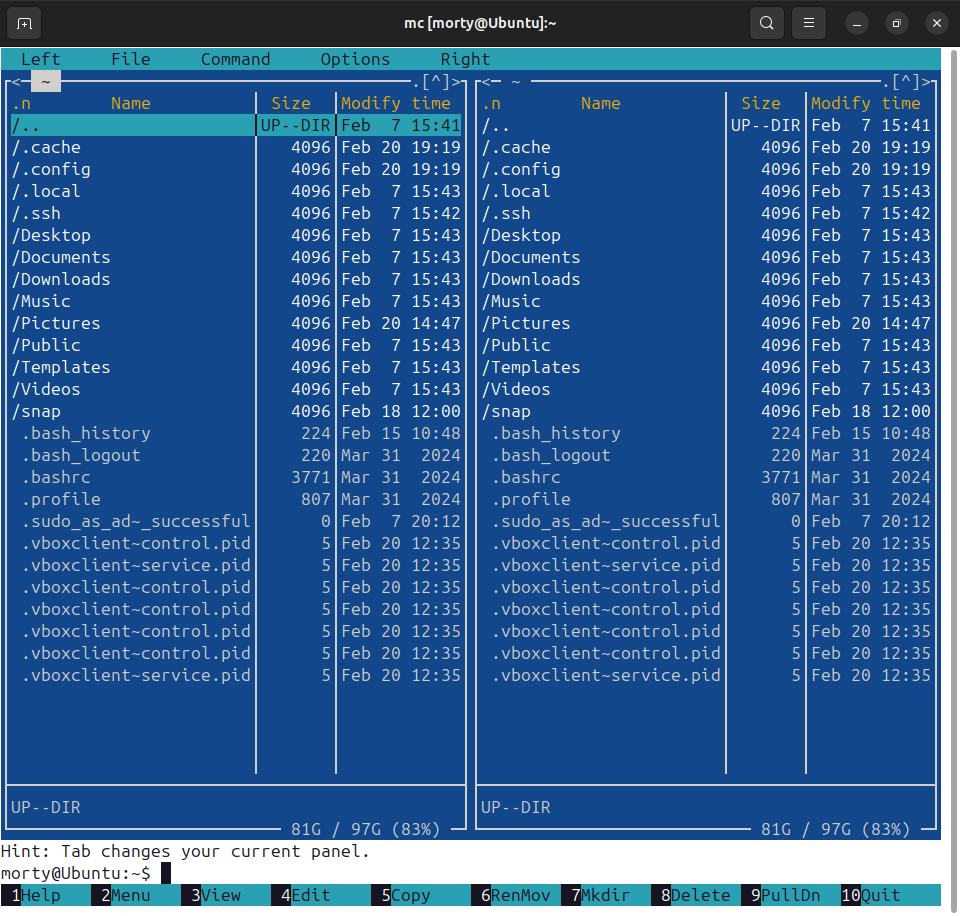
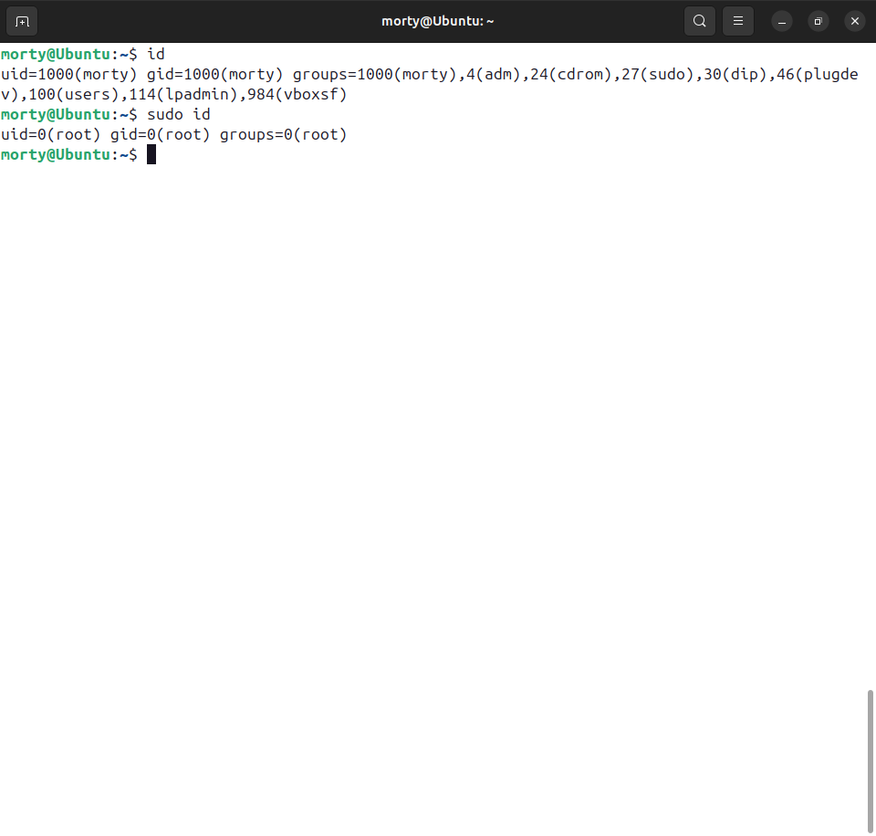

# Домашнее задание к занятию "Знакомство с операционной системой Linux" - Лукинов Андрей

## Задание 1

1. Подготовьте рабочее пространство:

- Скачайте с сайта [VirtualBox](https://www.virtualbox.org/) и установите на свой компьютер
- Создайте новую виртуальную машину
- Скачайте [Ubuntu](https://ubuntu.com/download/desktop)
- Установите Ubuntu на вашу виртуальную машину

Ответ

*Сделайте скриншот консоли, где в строке ввода будет ваше ФИО.*

## Задание 2

Запустите терминал и выполните команды:

- echo $SHELL
- cat /etc/shells

Ответ

*Ответ приведите в виде снимка экрана и прокомментируйте в свободной форме результаты выполнения указанных команд*

- `echo $SHELL` покажет путь к вашей текущей командной оболочке
- `cat /etc/shells` покажет список всех доступных оболочек в системе

## Задание 3

Установите при помощи утилиты **apt** файловый менеджер **mc**. 

Ответ

*Решение приведите в виде последовательности команд или снимка экрана*

- Установка командой `sudo apt update && sudo apt install mc -y`
  

## Задание 4* (необязательно выполнение)
Его выполнение необязательное и не влияет на получение зачёта по домашнему заданию. Можете его решить, если хотите лучше разобраться в материале.

Выполните следующие команды:

1. id
2. sudo id

Ответ

*Объясните, почему вывод одной и той же команды отличается в этих случаях.*

- `id` покажет ваш UID (user ID), GID (group ID) и группы, в которые вы входите
- `sudo id` покажет информацию о пользователе root (UID=0), так как sudo временно повышает привилегии до уровня суперпользователя

