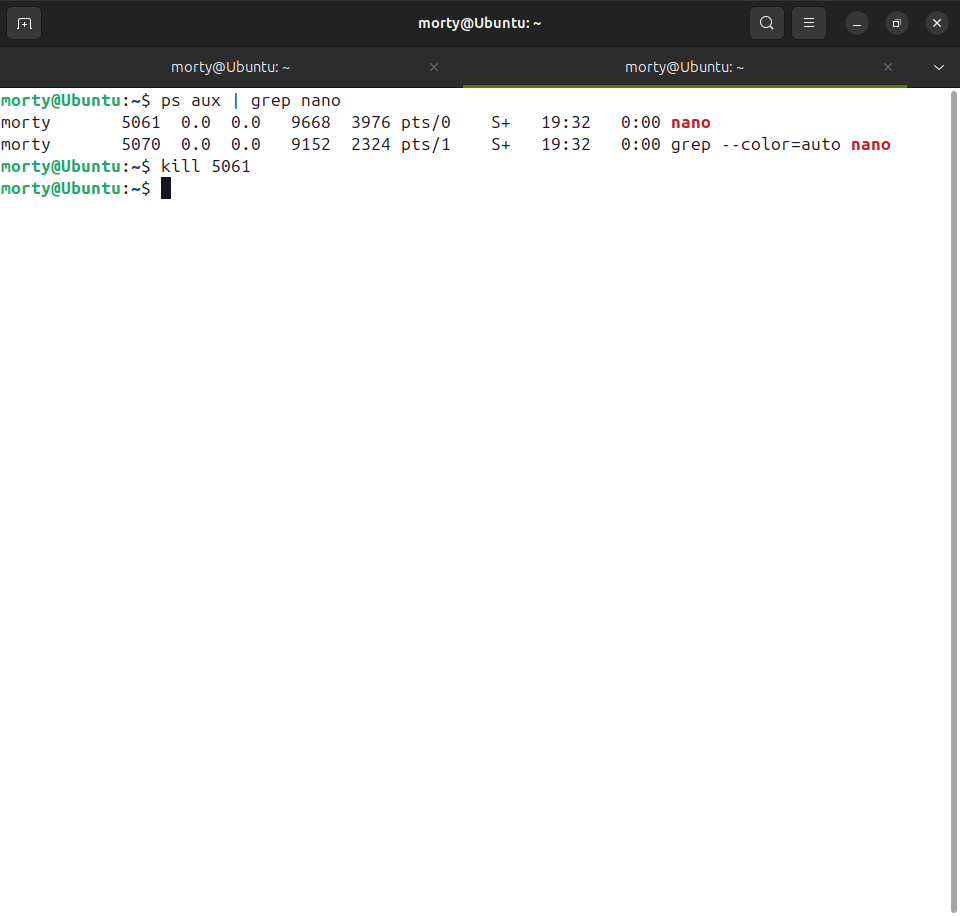
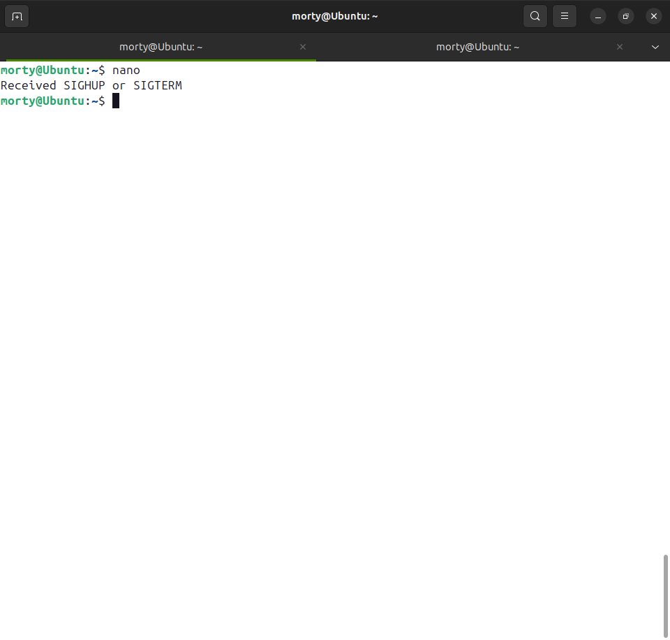
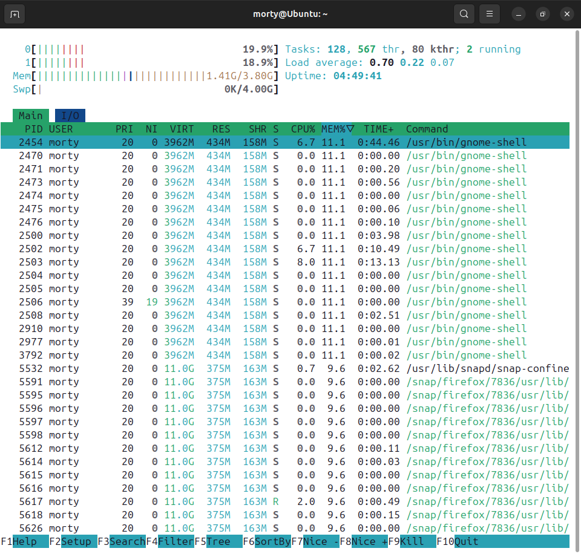
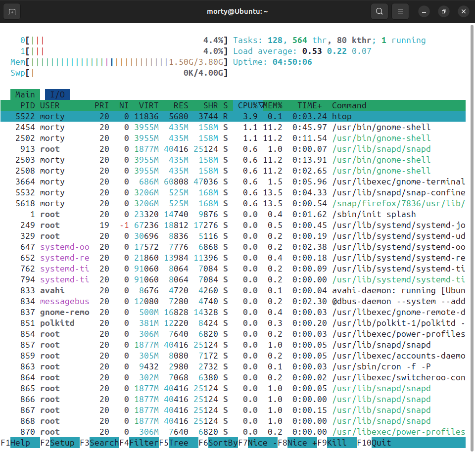
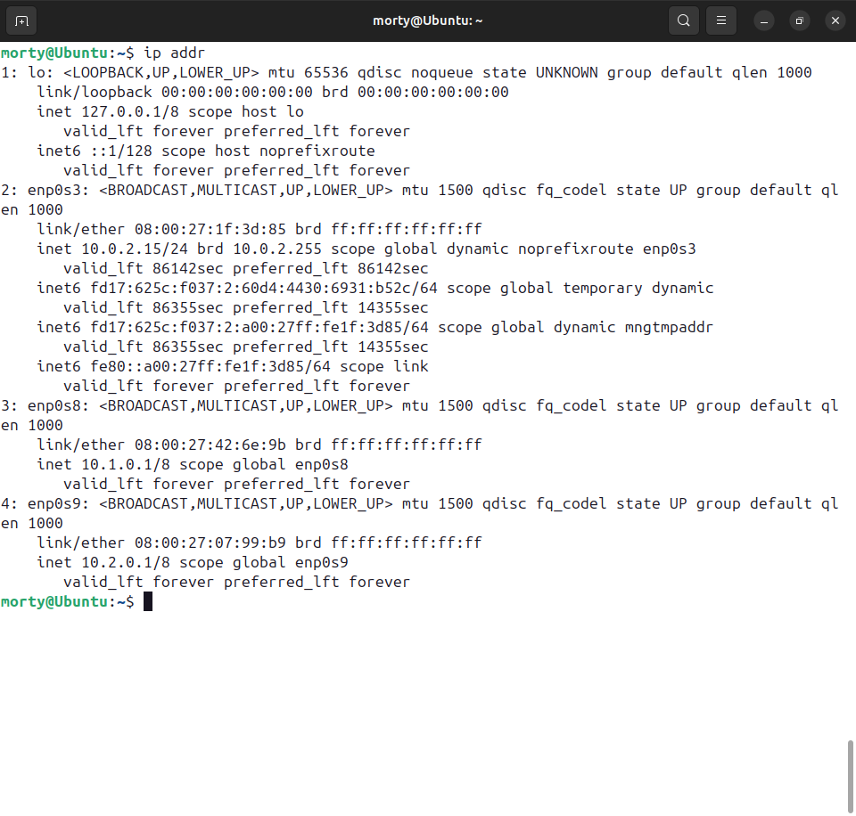

# Домашнее задание к занятию "Основы работы в терминале ОС Linux" - Лукинов Андрей

## Задание 1. Процессы

1. Запустите текстовый редактор nano
2. Откройте ещё одно окно терминала
3. С помощью команды `ps` определите PID запущенного процесса
4. Выполните команду `kill PID`

Что произошло в терминале с nano?

<details>
<summary>Ответ</summary>

*Ответ приведите в виде последовательности команд и снимка экрана*





- `nano` - Запуск nano в первом терминале
- `ps aux | grep nano` - Поиск PID процесса nano во второй вкладке терминала
- `kill <PID>` - Завершить процесс

</details>

## Задание 2. Утилита htop

1. Установите утилиту htop
2. С помощью htop ответьте на вопросы:
   - Какие процессы занимают больше всего памяти?
   - Какие процессы занимают больше всего процессорного времени?

<details>
<summary>Ответ</summary>

*Приведите ответ в виде снимков экрана*

- Команда для установки  `sudo apt update && sudo apt install htop -y`


**Процессы, занимающие больше всего памяти**


**Процессы, занимающие больше всего CPU**

**Горячие клавиши htop:**
- F6 - выбрать столбец для сортировки
- F3 - поиск
- F9 - завершить процесс
- F10 - выход

</details>

## Задание 3. Работа с сетью

1. Добавьте в виртуальную машину два дополнительных сетевых адаптера с внутренней (internal) сетью
2. Настройте на первом из них адрес 10.1.0.1 маску подсети 255.0.0.0
3. Настройте на втором из них адрес 10.2.0.1 маску подсети 255.0.0.0
4. На обоих интерфейсах настройте адрес dns-сервера как 8.8.8.8 и шлюз по умолчанию 10.1.1.1
5. Выполните команду ip addr

<details>
<summary>Ответ</summary>

*Приведите ответ в виде снимка экрана с выполненной командой ip addr*



```bash
# Просмотр доступных интерфейсов
ip link show

# Настройка первого интерфейса
sudo ip addr add 10.1.0.1/8 dev enp0s8
sudo ip link set enp0s8 up

# Настройка второго интерфейса
sudo ip addr add 10.2.0.1/8 dev enp0s9
sudo ip link set enp0s9 up

# Настройка DNS (временная)
sudo sh -c 'echo "nameserver 8.8.8.8" > /etc/resolv.conf'

# Просмотр результата
ip addr
```

</details>