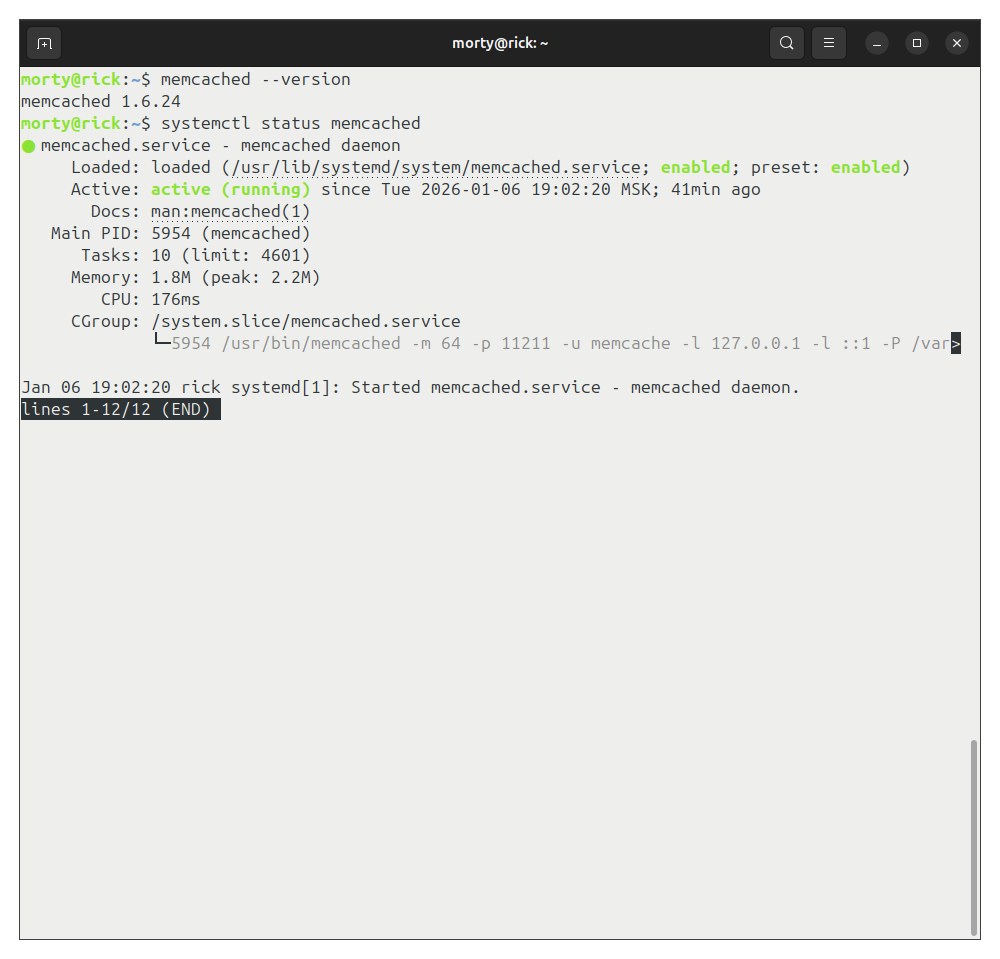
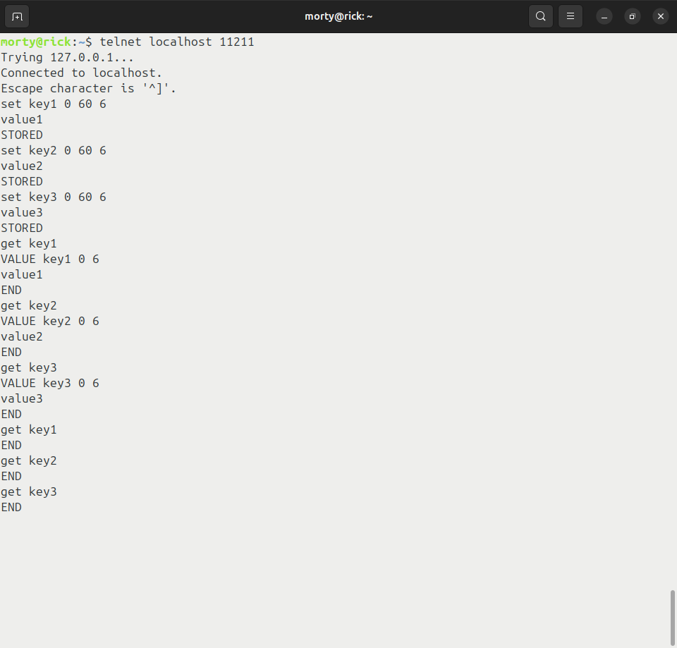
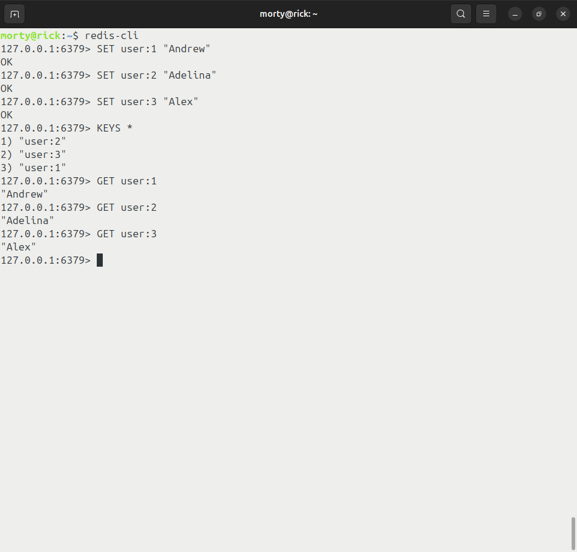

# Домашнее задание к занятию «Кеширование Redis/memcached» - Лукинов Андрей

## Задание 1. Кеширование 

Приведите примеры проблем, которые может решить кеширование. 

<details>
<summary>Ответ</summary>

- Кеширование помогает решать проблемы с производительностью, задержками и нагрузкой на системы, особенно когда одни и те же данные или результаты запросов запрашиваются много раз.

  1. *Высокая задержка при доступе к данным*
  - Если приложение часто читает одни и те же данные из медленного хранилища (например, базы данных, диска или внешнего API), каждый запрос будет тратить много времени. Кеширование решает это, сохраняя «горячие» данные в быстрой памяти (RAM) или рядом с приложением, чтобы последующие запросы отдавались почти мгновенно.
  2. *Перегрузка базы данных или API*
  - При большом количестве пользователей или запросов основное хранилище (база, файловая система, внешний сервис) может не справляться с нагрузкой, что приводит к долгим ответам или отказам. Кеш позволяет «съесть» часть запросов, не доходя до основного хранилища, и тем самым снизить нагрузку на него.
  3. *Повторные тяжёлые вычисления*
  - Некоторые операции (сложные SQL‑запросы, агрегации, машинное обучение, генерация отчётов) требуют много ресурсов и времени.​ Кеширование результата таких операций позволяет не пересчитывать их каждый раз, а просто отдать сохранённый результат.
  4. *Пиковые нагрузки*
  - Во время пиков (распродажи, события, анонсы) число запросов резко возрастает, и система может не выдержать нагрузку. Кеш помогает «сгладить» пики, отдавая часто запрашиваемые данные из памяти, а не перегружая основные сервисы.
  5. *Медленные внешние сервисы*
  - Если приложение зависит от медленных или нестабильных внешних API (например, погода, курсы валют, доставка), каждый запрос к ним будет тормозить работу.
  6. *Повторные запросы к одним и тем же данным*
  - В приложениях часто бывает, что одни и те же данные запрашиваются многократно (например, справочники, настройки, профили пользователей). Кеш позволяет сохранить эти данные один раз и отдавать их при последующих запросах, не обращаясь к источнику.​
  7. *Снижение затрат на инфраструктуру*
  - Чем больше запросов идёт в медленные и дорогие хранилища (например, облачные базы, внешние API), тем выше стоимость использования.​
  8. *Повышение отказоустойчивости*
  - Если основной источник данных временно недоступен (база упала, API не отвечает), кеш может отдавать старые, но ещё актуальные данные, пока проблема не решится. Это позволяет приложению продолжать работать в «деградированном режиме» и не падать полностью.

</details>

## Задание 2. Memcached

Установите и запустите memcached.

<details>
<summary>Использованный код</summary>

```bash
sudo apt install memcached libmemcached-tools -y
sudo systemctl enable memcached
sudo systemctl start memcached
sudo systemctl status memcached
```



</details>

## Задание 3. Удаление по TTL в Memcached

Запишите в memcached несколько ключей с любыми именами и значениями, для которых выставлен TTL 5. 

<details>
<summary>Скриншот</summary>

- Есть поправка, TTL поставил больше, потому что при значении 5, оно слишком быстро удаляется. Принцип тот же, но с большим значением. Знаю, что правильная команда `set key1 0 5 5`, установил просто для удобства. И число байт увеличил на 1, чтобы было более удобночитаемо.



</details>

## Задание 4. Запись данных в Redis

Запишите в Redis несколько ключей с любыми именами и значениями. 

<details>
<summary>Скриншот</summary>



</details>

## Задание 5*. Работа с числами 

Запишите в Redis ключ key5 со значением типа "int" равным числу 5. Увеличьте его на 5, чтобы в итоге в значении лежало число 10.  

<details>
<summary>Скриншот</summary>


</details>