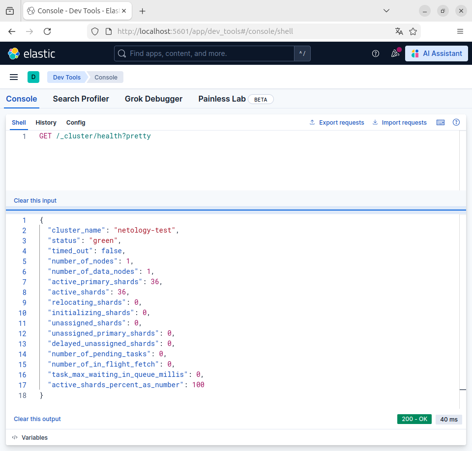
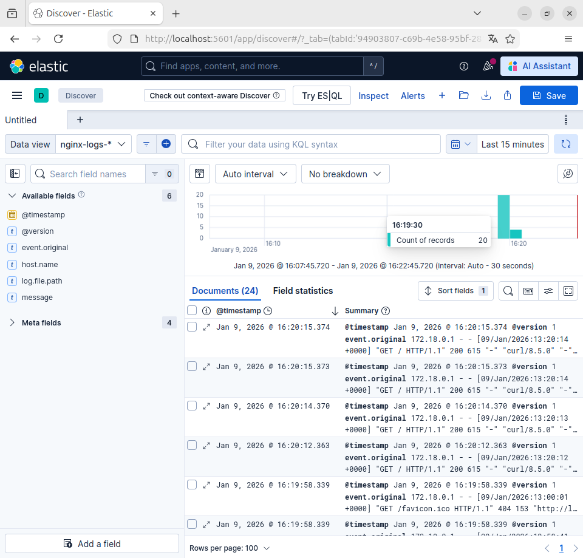
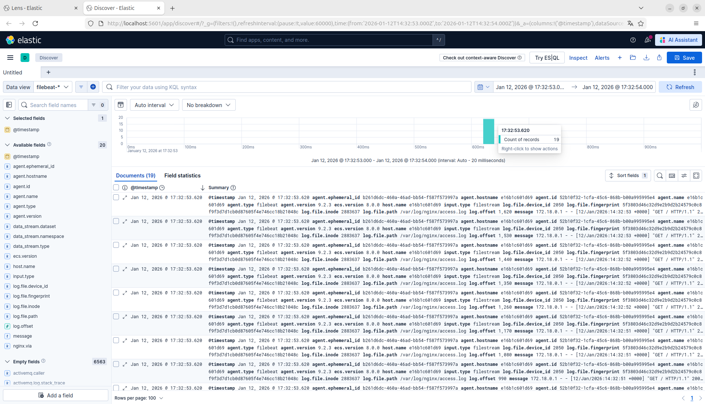

# Домашнее задание к занятию «ELK» - Лукинов Андрей

Дополнительные ресурсы

- [docker-compose elasticsearch + kibana](11-03/docker-compose.yaml);
- [поднимаем elk в docker](https://www.elastic.co/guide/en/elasticsearch/reference/7.17/docker.html);
- [поднимаем elk в docker с filebeat и docker-логами](https://www.sarulabs.com/post/5/2019-08-12/sending-docker-logs-to-elasticsearch-and-kibana-with-filebeat.html);
- [конфигурируем logstash](https://www.elastic.co/guide/en/logstash/7.17/configuration.html);
- [плагины filter для logstash](https://www.elastic.co/guide/en/logstash/current/filter-plugins.html);
- [конфигурируем filebeat](https://www.elastic.co/guide/en/beats/libbeat/5.3/config-file-format.html);
- [привязываем индексы из elastic в kibana](https://www.elastic.co/guide/en/kibana/7.17/index-patterns.html);
- [как просматривать логи в kibana](https://www.elastic.co/guide/en/kibana/current/discover.html);
- [решение ошибки increase vm.max_map_count elasticsearch](https://stackoverflow.com/questions/42889241/how-to-increase-vm-max-map-count).

Пошаговое выполнение

- [Файл с шагами](files/step_by_step.md)

## Задание 1. Elasticsearch 

Установите и запустите Elasticsearch, после чего поменяйте параметр cluster_name на случайный. 

Скриншот

*Приведите скриншот команды 'curl -X GET 'localhost:9200/_cluster/health?pretty', сделанной на сервере с установленным Elasticsearch. Где будет виден нестандартный cluster_name*.

## Задание 2. Kibana

Установите и запустите Kibana.

Скриншоты

*Приведите скриншот интерфейса Kibana на странице http://<ip вашего сервера>:5601/app/dev_tools#/console, где будет выполнен запрос GET /_cluster/health?pretty*.

## Задание 3. Logstash

Установите и запустите Logstash и Nginx. С помощью Logstash отправьте access-лог Nginx в Elasticsearch.

Скринтшот

*Приведите скриншот интерфейса Kibana, на котором видны логи Nginx.*

## Задание 4. Filebeat. 

Установите и запустите Filebeat. Переключите поставку логов Nginx с Logstash на Filebeat. 

Скриншот

*Приведите скриншот интерфейса Kibana, на котором видны логи Nginx, которые были отправлены через Filebeat.*

## Задание 5*. Доставка данных (Доделаю позднее)

Настройте поставку лога в Elasticsearch через Logstash и Filebeat любого другого сервиса , но не Nginx. 
Для этого лог должен писаться на файловую систему, Logstash должен корректно его распарсить и разложить на поля. 

*Приведите скриншот интерфейса Kibana, на котором будет виден этот лог и напишите лог какого приложения отправляется.*