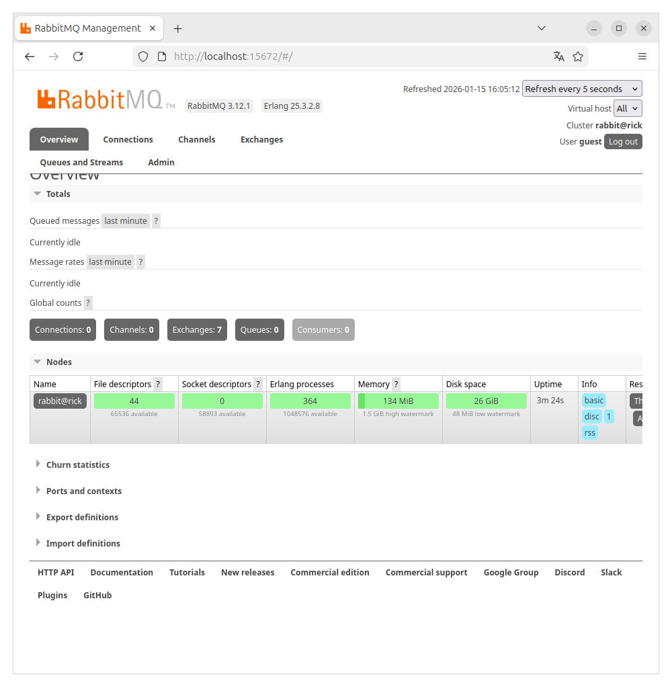
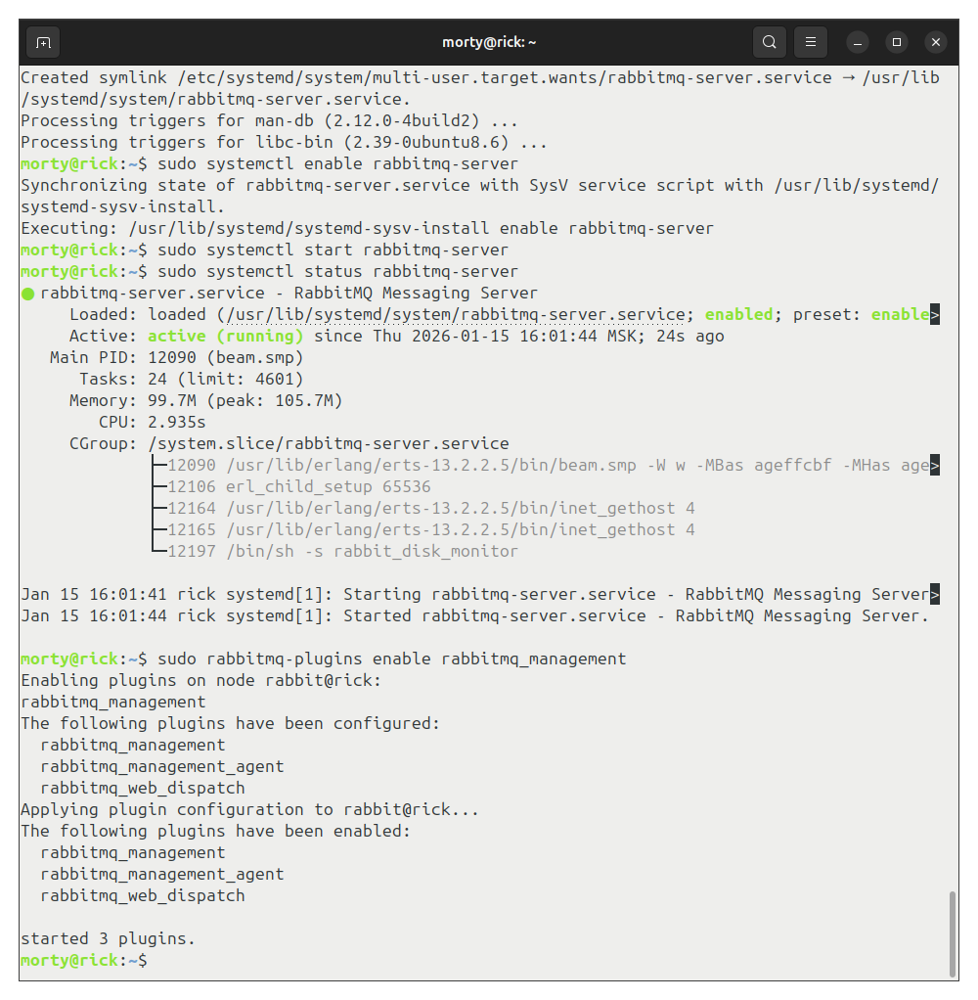
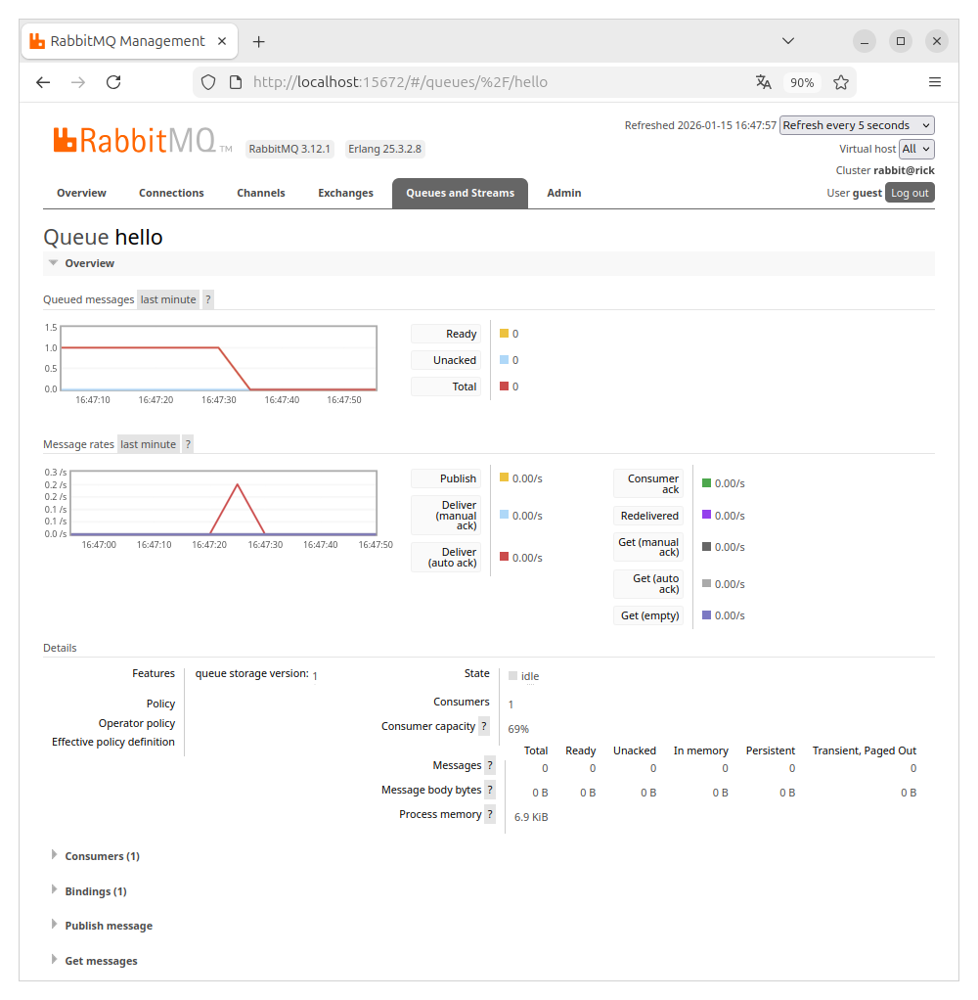
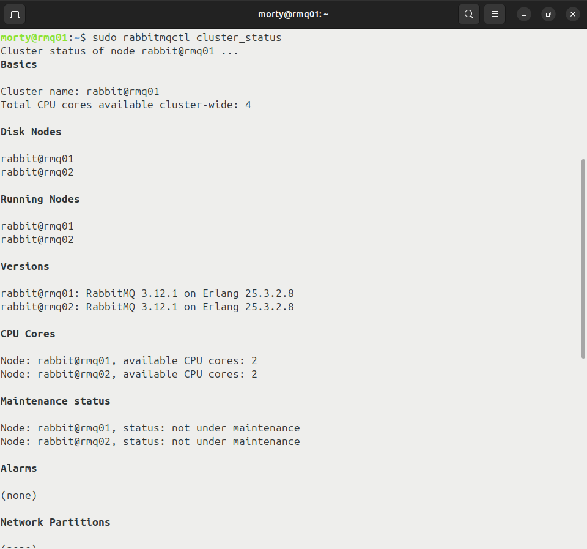
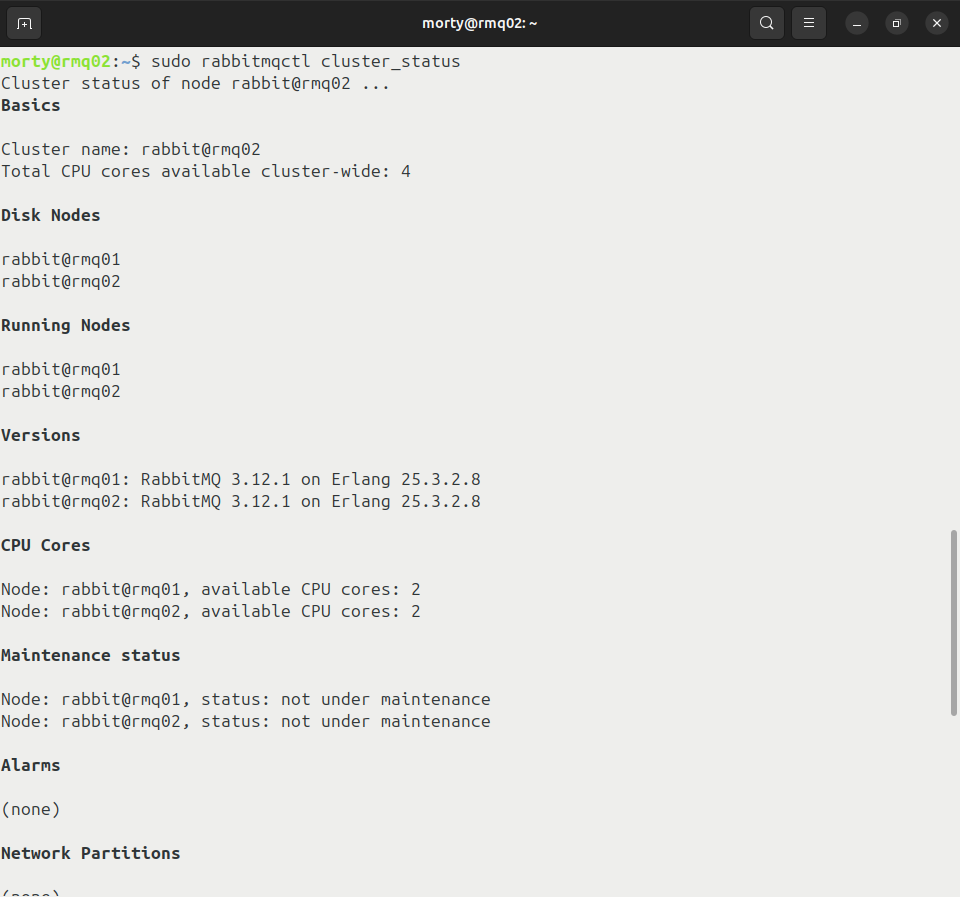
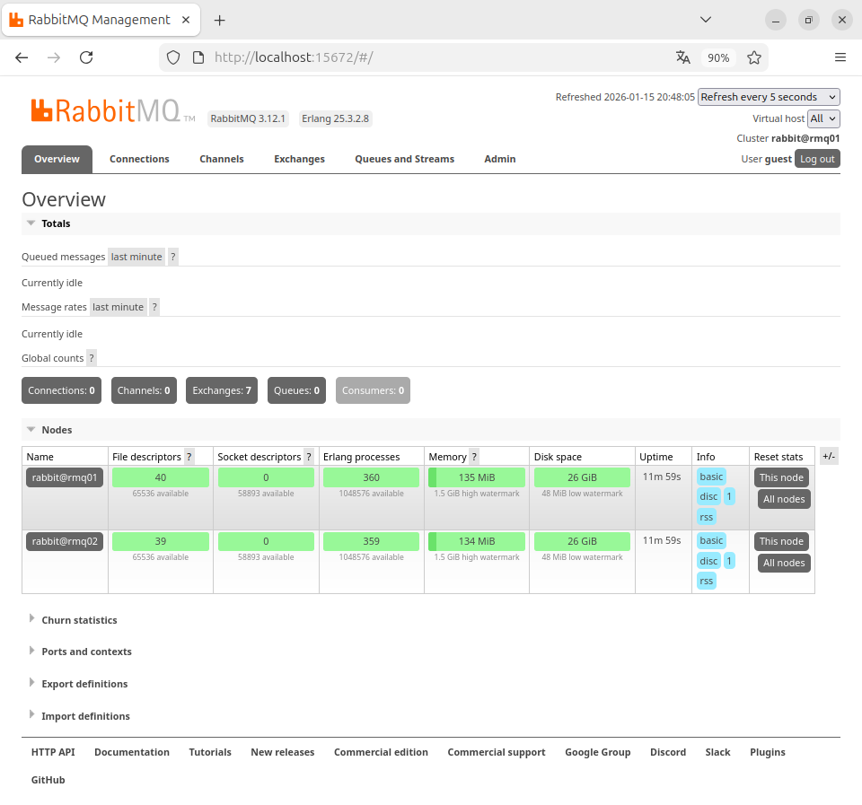
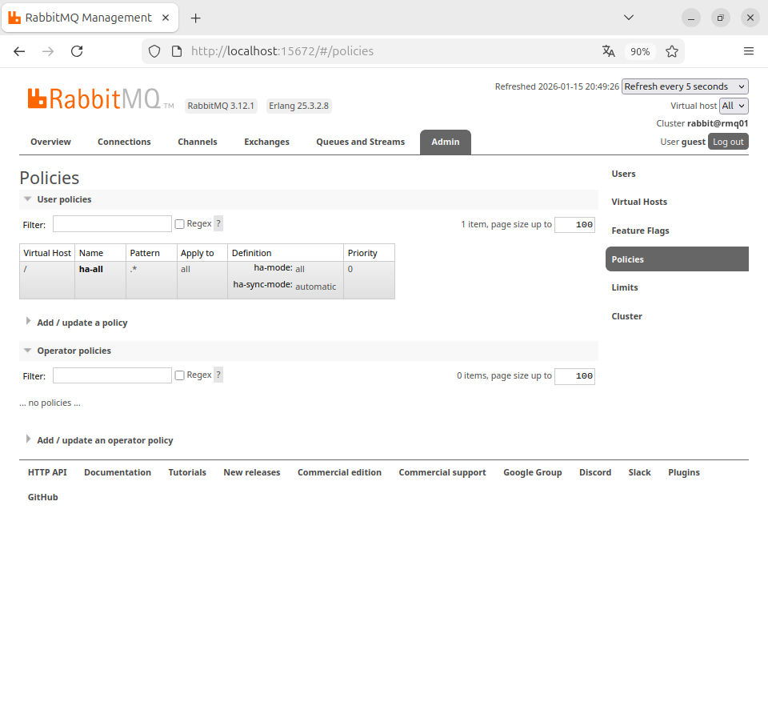
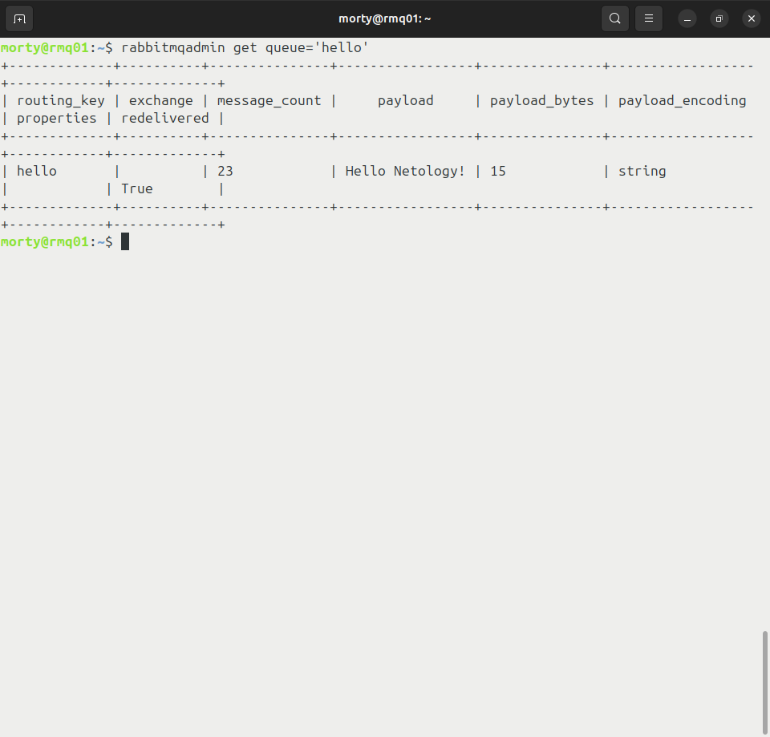

# Домашнее задание к занятию  «Очереди RabbitMQ» - Лукинов Андрей

## Задание 1. Установка RabbitMQ

Используя Vagrant или VirtualBox, создайте виртуальную машину и установите RabbitMQ.
Добавьте management plug-in и зайдите в веб-интерфейс.

Скриншоты

*Итогом выполнения домашнего задания будет приложенный скриншот веб-интерфейса RabbitMQ.*

(Веб-интерфейс RabbitMQ)

(Включение management plug-in)

## Задание 2. Отправка и получение сообщений

Используя приложенные скрипты, проведите тестовую отправку и получение сообщения.
Для отправки сообщений необходимо запустить скрипт producer.py.

Для работы скриптов вам необходимо установить Python версии 3 и библиотеку Pika.
Также в скриптах нужно указать IP-адрес машины, на которой запущен RabbitMQ, заменив localhost на нужный IP.

Зайдите в веб-интерфейс, найдите очередь под названием hello и сделайте скриншот.
После чего запустите второй скрипт consumer.py и сделайте скриншот результата выполнения скрипта

Скриншоты

*В качестве решения домашнего задания приложите оба скриншота, сделанных на этапе выполнения.*

(Очередь Hello)

(Запуск consumer.py)

## Задание 3. Подготовка HA кластера

Используя Vagrant или VirtualBox, создайте вторую виртуальную машину и установите RabbitMQ.
Добавьте в файл hosts название и IP-адрес каждой машины, чтобы машины могли видеть друг друга по имени.

Затем объедините две машины в кластер и создайте политику ha-all на все очереди.

Скриншоты

*В качестве решения домашнего задания приложите скриншоты из веб-интерфейса с информацией о доступных нодах в кластере и включённой политикой.*

(rabbitmqctl cluster_status на rmq01)

(rabbitmqctl cluster_status на rmq02)

(В браузере)

(Политики)

(rabbitmqadmin get queue='hello' на rmq01)

(rabbitmqadmin get queue='hello' на rmq02)

(Вывод команды consumer.py на rmq02)

## Задание 4*. Ansible playbook

Напишите плейбук, который будет производить установку RabbitMQ на любое количество нод и объединять их в кластер.
При этом будет автоматически создавать политику ha-all.

*Готовый плейбук разместите в своём репозитории.*

