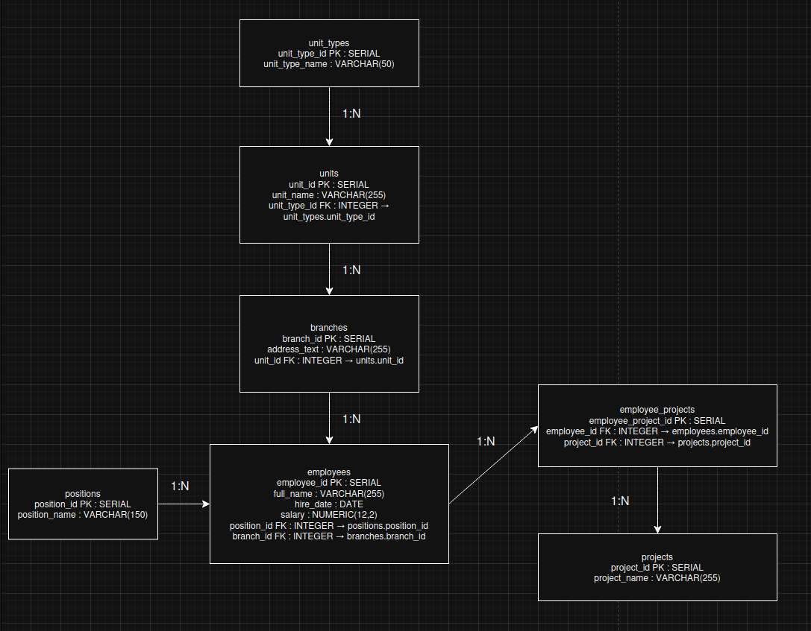

# Домашнее задание к занятию «Базы данных» - Лукинов Андрей

## Легенда

Заказчик передал вам [файл в формате Excel](./files/hw-12-1.xlsx), в котором сформирован отчёт. 

На основе этого отчёта нужно выполнить следующие задания.

## Задание 1

Опишите не менее семи таблиц, из которых состоит база данных. Определите:

- какие данные хранятся в этих таблицах,
- какой тип данных у столбцов в этих таблицах, если данные хранятся в PostgreSQL.

Начертите схему полученной модели данных. Можете использовать онлайн-редактор: https://app.diagrams.net/

Этапы реализации:
1.	Внимательно изучите предоставленный вам файл с данными и подумайте, как можно сгруппировать данные по смыслу.
2.	Разбейте исходный файл на несколько таблиц и определите список столбцов в каждой из них. 
3.	Для каждого столбца подберите подходящий тип данных из PostgreSQL. 
4.	Для каждой таблицы определите первичный ключ (PRIMARY KEY).
5.	Определите типы связей между таблицами. 
6.	Начертите схему модели данных.
На схеме должны быть чётко отображены:
  - все таблицы с их названиями,
  - все столбцы  с указанием типов данных,
  - первичные ключи (они должны быть явно выделены),
  - линии, показывающие связи между таблицами.

Результатом выполнения задания должен стать скриншот получившейся схемы базы данных.

Ответ

# Перечень таблиц

1. **employees (Сотрудники)**
  - Хранит личные данные сотрудников.​
    - employee_id SERIAL PRIMARY KEY
    - full_name VARCHAR(255) NOT NULL — «ФИО сотрудника»
    - position_id INTEGER NOT NULL — FK на positions.position_id
    - hire_date DATE NOT NULL — «Дата найма» (значения вроде 200113 интерпретировать как дату в формате DDMMYY при загрузке)
    - branch_id INTEGER NOT NULL — FK на branches.branch_id

2. **positions (Должности)**
   - Справочник должностей.​
     - position_id SERIAL PRIMARY KEY
     - position_name VARCHAR(150) NOT NULL — «Должность» (ведущий QA инженер, специалист, старший инженер и т.п.)

3. **unit_types (Типы подразделений)**
  - Справочник типов подразделений (Группа, Отдел, Департамент).​
    - unit_type_id SERIAL PRIMARY KEY
    - unit_type_name VARCHAR(50) NOT NULL — «Тип подразделения»

4. **units (Структурные подразделения)**
   - Справочник конкретных подразделений.
     - unit_id SERIAL PRIMARY KEY
     - unit_name VARCHAR(255) NOT NULL — «Структурное подразделение» (Группа CRM 2, Центр разработки Medio и т.п.)
     - unit_type_id INTEGER NOT NULL — FK на unit_types.unit_type_id

5. **branches (Филиалы / адреса)**
   - Хранит адреса филиалов, чтобы не дублировать текст.
     - branch_id SERIAL PRIMARY KEY
     - address_text VARCHAR(255) NOT NULL — «Адрес филиала» (регион, город, улица, дом)
     - unit_id INTEGER NOT NULL — FK на units.unit_id

6. **projects (Проекты)**
   - Справочник проектов, на которые назначены сотрудники. В отчёте проекты заключены в фигурные скобки и иногда перечислены через запятую — каждое уникальное имя проекта выносится отдельно.
     - project_id SERIAL PRIMARY KEY
     - project_name VARCHAR(255) NOT NULL — значение из «Проект на который назначен» (например, Итэлма Инженерный корпус, Сколково и т.п.)

7. **employee_projects (Назначения на проекты)**
   - Таблица связи «сотрудник–проект» с возможностью учёта оклада/ставки на конкретном проекте.​
     - employee_project_id SERIAL PRIMARY KEY
     - employee_id INTEGER NOT NULL — FK на employees.employee_id
     - project_id INTEGER NOT NULL — FK на projects.project_id
     - salary NUMERIC(12,2) NOT NULL — «Оклад» для данного сотрудника (можно хранить здесь, если оклад проектно‑зависим)

# Типы данных и ключи

- **Кратко по типам для PostgreSQL:​**
  - Идентификаторы: SERIAL (или BIGSERIAL) для PK, INTEGER для FK
  - Текстовые поля: VARCHAR(n) (или TEXT, если длина не критична)
  - Деньги/оклад: NUMERIC(12,2) (избегать float)
  - Даты найма: DATE

- **Первичные ключи (PRIMARY KEY): все поля *_id в перечисленных таблицах.​**
- **Внешние ключи (FOREIGN KEY):**
  - employees.position_id -> positions.position_id
  - employees.branch_id -> branches.branch_id
  - units.unit_type_id -> unit_types.unit_type_id
  - branches.unit_id -> units.unit_id
  - employee_projects.employee_id -> employees.employee_id
  - employee_projects.project_id -> projects.project_id​

## Задание 2*

1. Разверните СУБД Postgres на своей хостовой машине, на виртуальной машине или в контейнере docker.
2. Опишите схему, полученную в предыдущем задании, с помощью скрипта SQL.
3. Создайте в вашей полученной СУБД новую базу данных и выполните полученный ранее скрипт для создания вашей модели данных.

В качестве решения приложите SQL скрипт и скриншот диаграммы.

Для написания и редактирования sql удобно использовать  специальный инструмент dbeaver.

Скриншоты

