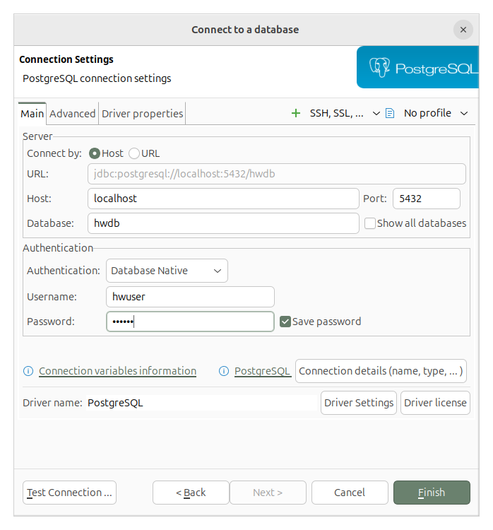
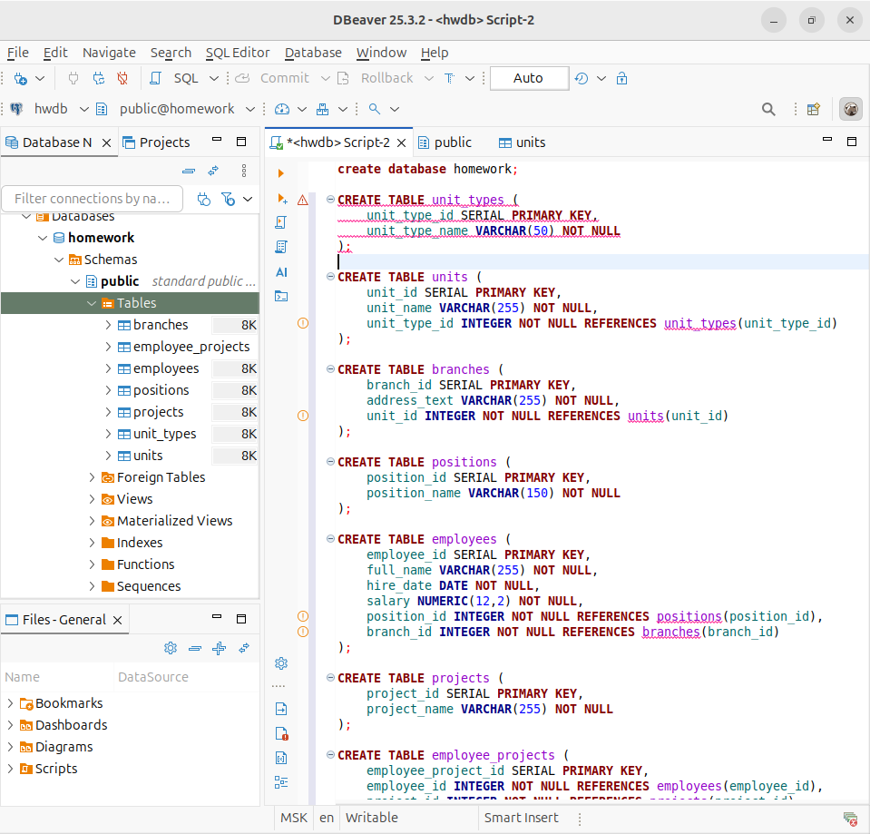
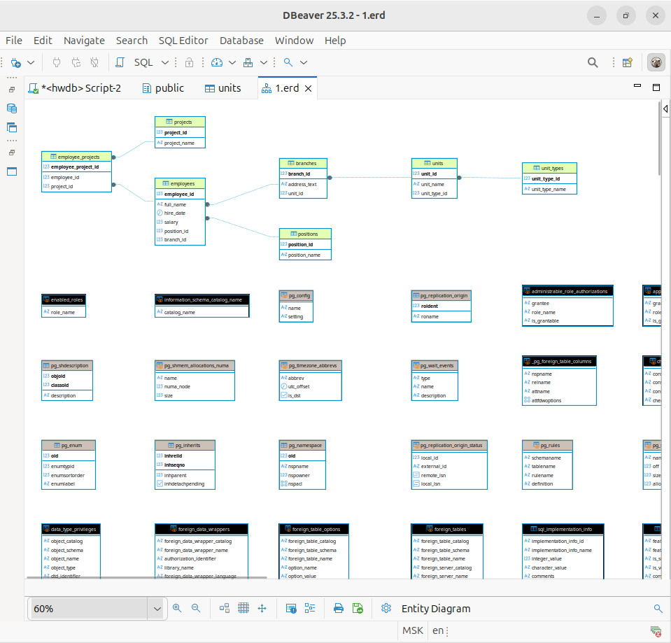

<details>
<summary>Задание 2</summary>

1. Запустить PostgreSQL в Docker
   
<details>
<summary>Docker команда</summary>

```bash
docker pull postgres:18

docker run -d \
  --name hwpostgres \
  -e POSTGRES_USER=hwuser \
  -e POSTGRES_PASSWORD=hwpass \
  -e POSTGRES_DB=hwdb \
  -p 5432:5432 \
  postgres:18

```

2. Установить DBeaver

`sudo snap install dbeaver-ce --classic`

3. Подключиться к базе

- Host: localhost
- Port: 5432
- Database: hwdb
- Username: hwuser
- Password: hwpass



4. Создать схему

- [Файл для создание схемы](./hw_table.sql)
- Построить ER‑диаграмму:
  - Правой кнопкой по базе -> ER Diagram





</details>