# Домашнее задание к занятию «Работа с данными (DDL/DML)» - Лукинов Андрей

## Задание 1
1.1. Поднимите чистый инстанс MySQL версии 8.0+. Можно использовать локальный сервер или контейнер Docker.

Скриншот

1.2. Создайте учётную запись sys_temp. 

Скриншот

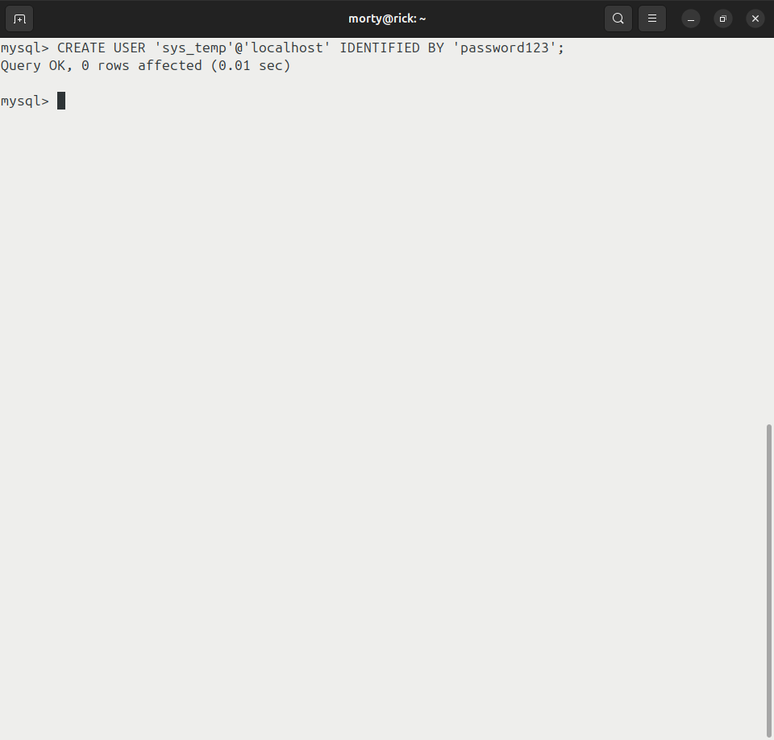

1.3. Выполните запрос на получение списка пользователей в базе данных. (скриншот)

Скриншот

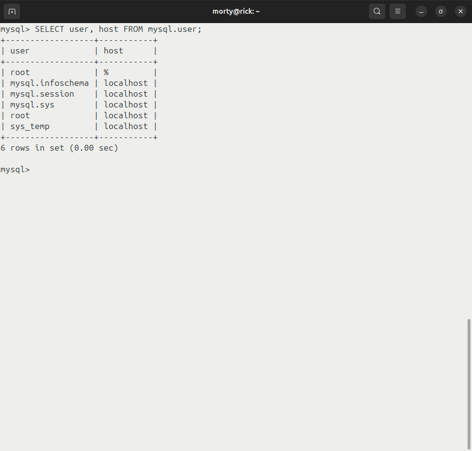

1.4. Дайте все права для пользователя sys_temp. 

Скриншот

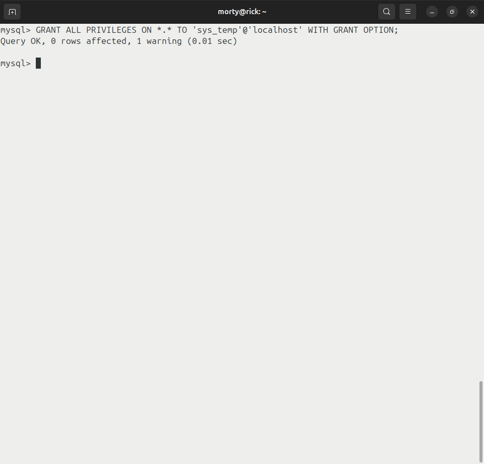

1.5. Выполните запрос на получение списка прав для пользователя sys_temp. (скриншот)

Скриншот

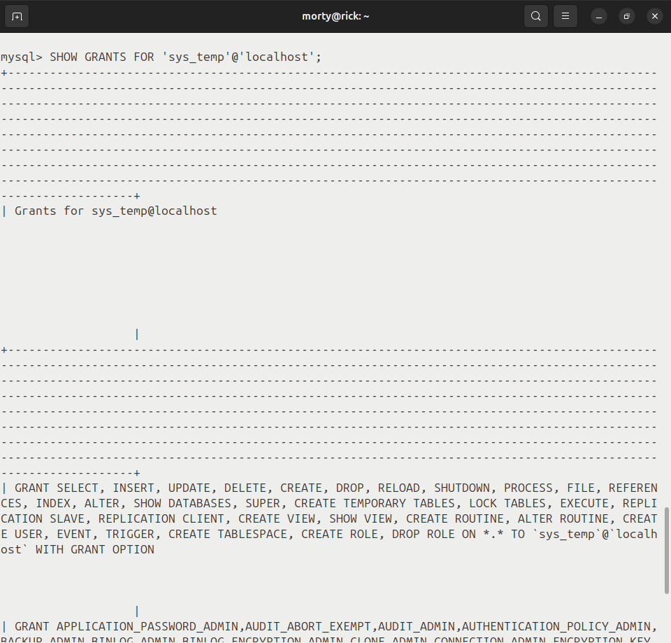

1.6.1. Переподключитесь к базе данных от имени sys_temp.

Скриншот

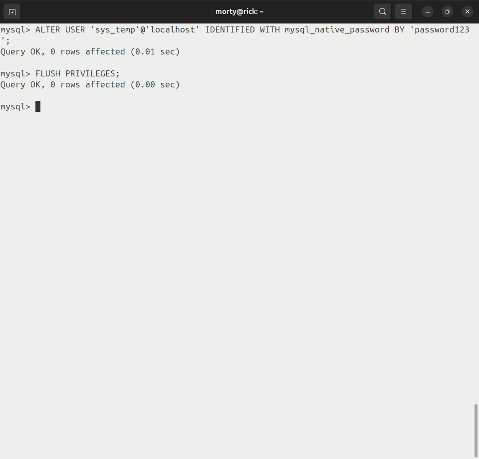

1.6.2. По ссылке https://downloads.mysql.com/docs/sakila-db.zip скачайте дамп базы данных.

Скриншот

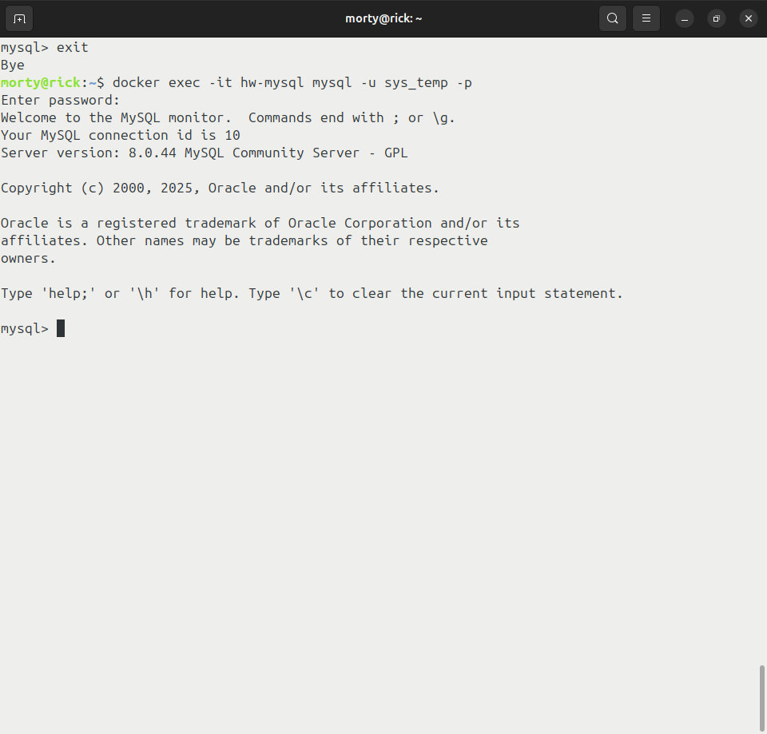

1.7. Восстановите дамп в базу данных.

Скриншот

1.8. При работе в IDE сформируйте ER-диаграмму получившейся базы данных. При работе в командной строке используйте команду для получения всех таблиц базы данных. (скриншот)

Скриншоты

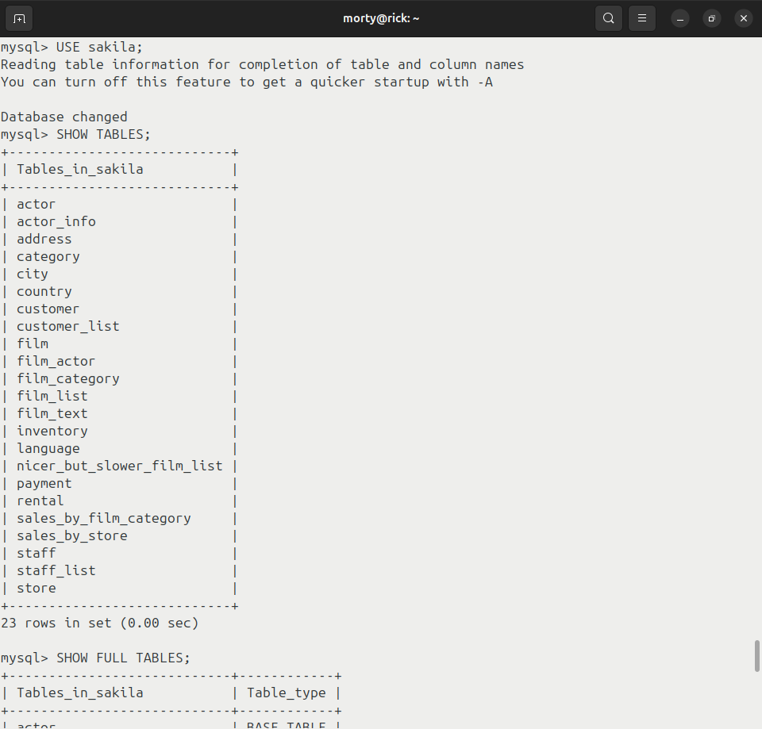

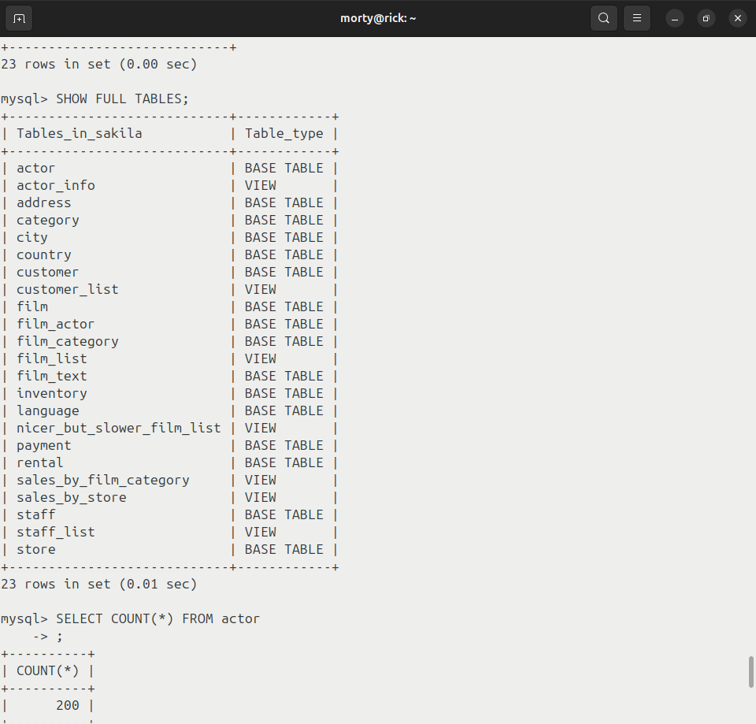

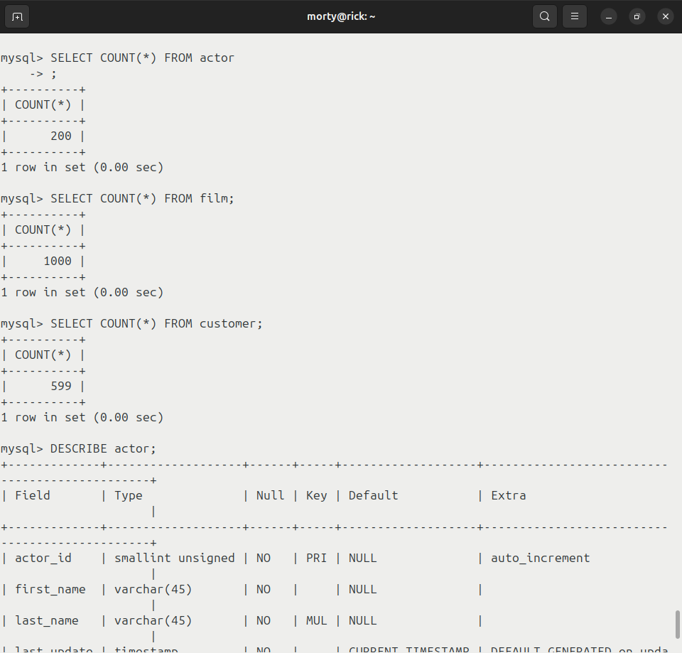

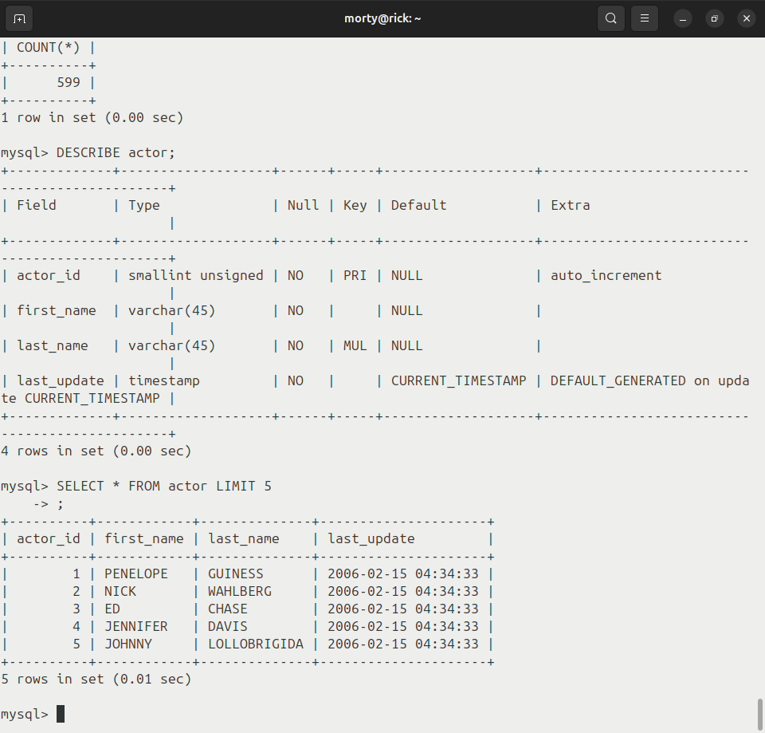

*Результатом работы должны быть скриншоты обозначенных заданий, а также [простыня](./files/step_by_step.md) со всеми запросами.*

## Задание 2
Составьте таблицу, используя любой текстовый редактор или Excel, в которой должно быть два столбца: в первом должны быть названия таблиц восстановленной базы, во втором названия первичных ключей этих таблиц.

Скриншот

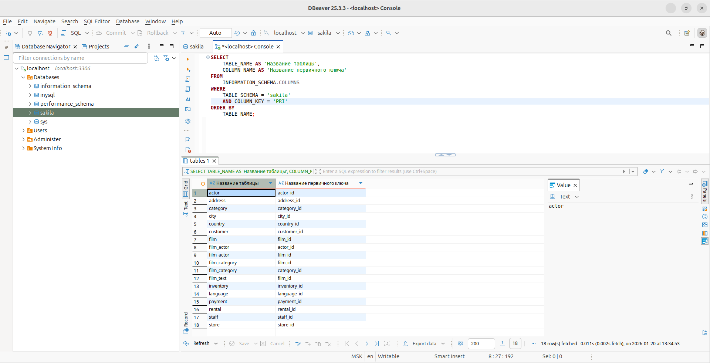

## Задание 3*
3.1. Уберите у пользователя sys_temp права на внесение, изменение и удаление данных из базы sakila.

3.2. Выполните запрос на получение списка прав для пользователя sys_temp.

Название

*Результатом работы должны быть скриншоты обозначенных заданий, а также [простыня](./files/step_by_step.md) со всеми запросами.*

