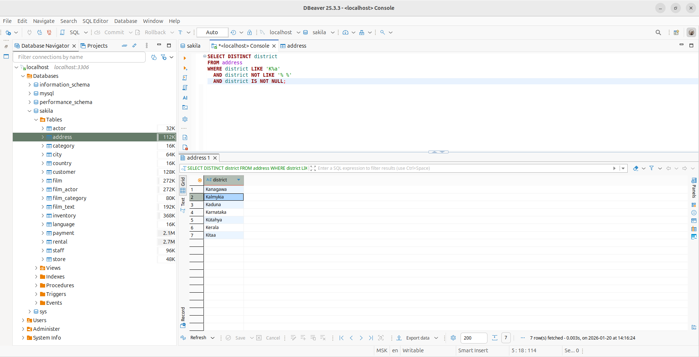
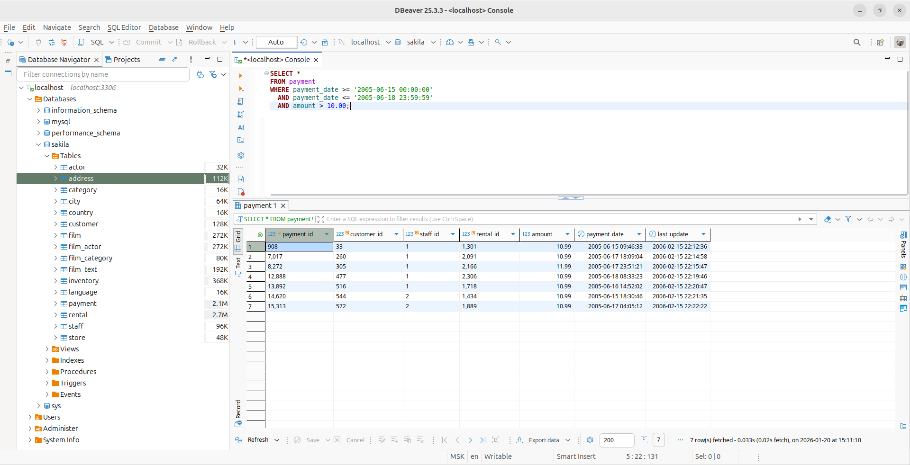
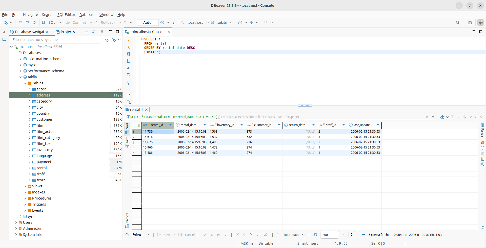
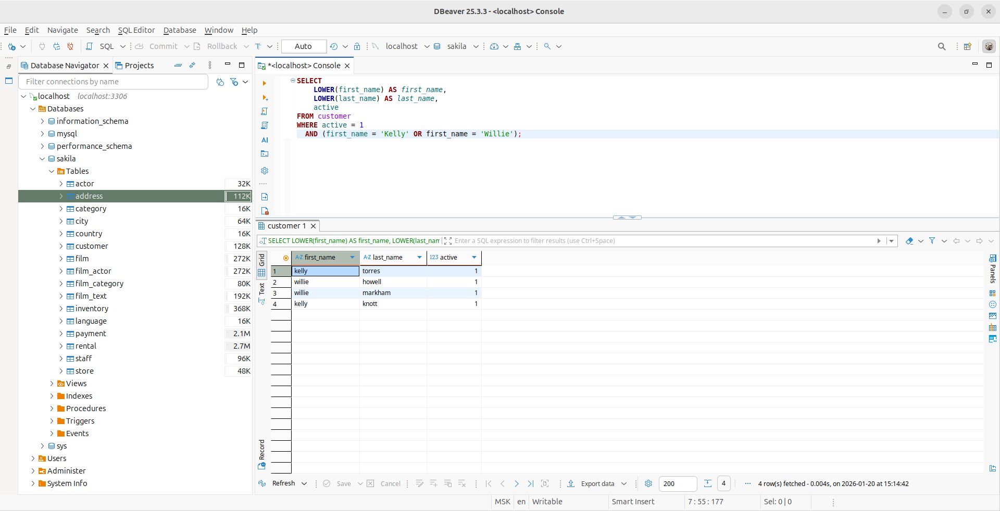
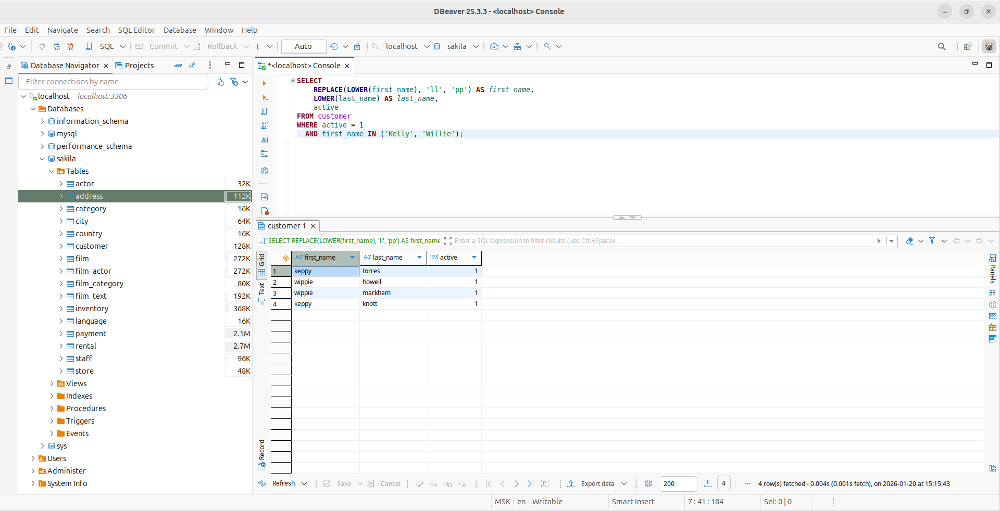
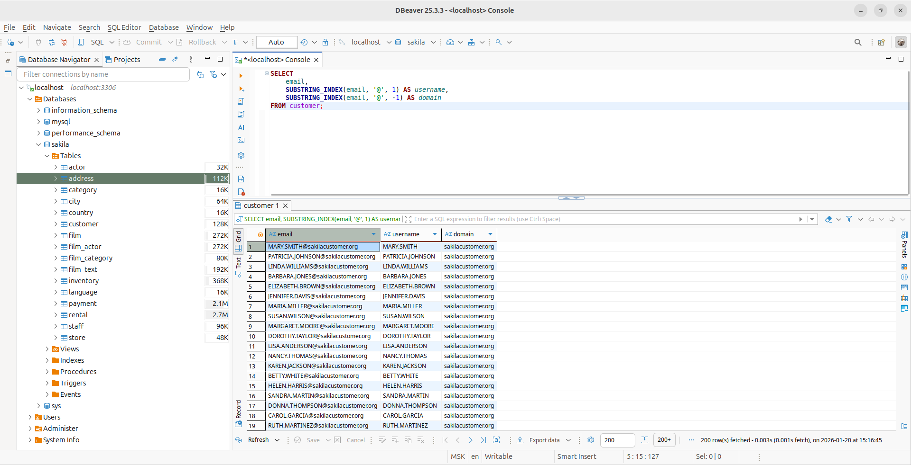
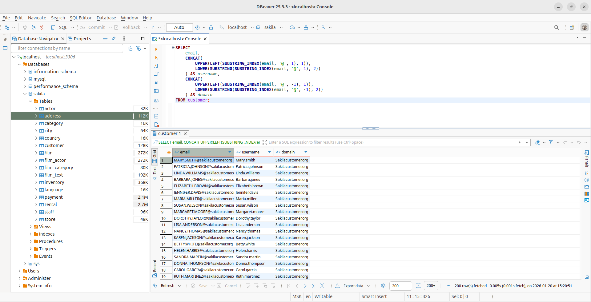

# Домашнее задание к занятию «SQL. Часть 1»

## Задание 1

Получите уникальные названия районов из таблицы с адресами, которые начинаются на “K” и заканчиваются на “a” и не содержат пробелов.

Скриншот

## Задание 2

Получите из таблицы платежей за прокат фильмов информацию по платежам, которые выполнялись в промежуток с 15 июня 2005 года по 18 июня 2005 года **включительно** и стоимость которых превышает 10.00.

Скриншот

## Задание 3

Получите последние пять аренд фильмов.

Скриншот

## Задание 4

Одним запросом получите активных покупателей, имена которых Kelly или Willie. 

Сформируйте вывод в результат таким образом:

Скриншоты

- все буквы в фамилии и имени из верхнего регистра переведите в нижний регистр,

- замените буквы 'll' в именах на 'pp'.

## Задание 5*

Выведите Email каждого покупателя, разделив значение Email на две отдельных колонки: в первой колонке должно быть значение, указанное до @, во второй — значение, указанное после @.

Скриншот

## Задание 6*

Доработайте запрос из предыдущего задания, скорректируйте значения в новых колонках: первая буква должна быть заглавной, остальные — строчными.

Скриншот

