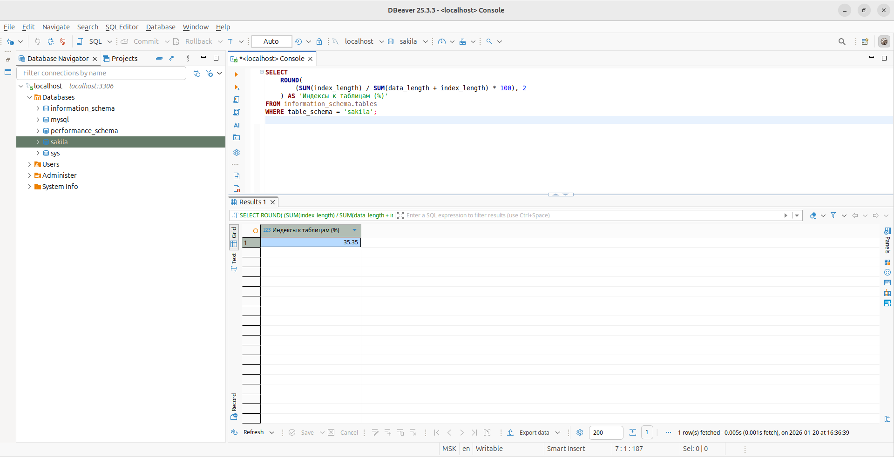
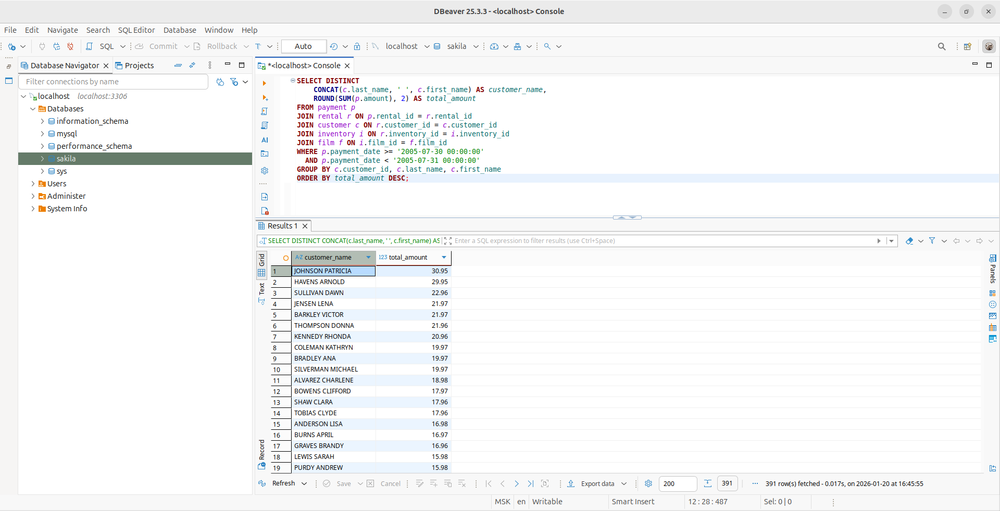

# Домашнее задание к занятию «Индексы» - Лукинов Андрей

## Задание 1

Напишите запрос к учебной базе данных, который вернёт процентное отношение общего размера всех индексов к общему размеру всех таблиц.

<details>
<summary>Ответ</summary>

```sql
SELECT 
    ROUND(
        (SUM(index_length) / SUM(data_length + index_length) * 100), 2
    ) AS 'Индексы к таблицам (%)'
FROM information_schema.tables 
WHERE table_schema = 'sakila';
```



</details>

## Задание 2

Выполните explain analyze следующего запроса:

<details>
<summary>Исходный код</summary>

```sql
select distinct concat(c.last_name, ' ', c.first_name), sum(p.amount) over (partition by c.customer_id, f.title)
from payment p, rental r, customer c, inventory i, film f
where date(p.payment_date) = '2005-07-30' and p.payment_date = r.rental_date and r.customer_id = c.customer_id and i.inventory_id = r.inventory_id
```

</details>


- перечислите узкие места;
- оптимизируйте запрос: внесите корректировки по использованию операторов, при необходимости добавьте индексы.

<details>
<summary>Ответ</summary>

1. Анализ проблем:
  - Cartesian product из-за устаревшего синтаксиса `FROM table1, table2`
  - Функция `DATE()` на индексированном поле `payment_date` — убивает индекс
  - Нет `JOIN film` — неопределенное отношение
  - DISTINCT + оконная функция — избыточны



</details>

## Задание 3*

Самостоятельно изучите, какие типы индексов используются в PostgreSQL. Перечислите те индексы, которые используются в PostgreSQL, а в MySQL — нет.

<details>
<summary>Ответ</summary>

Индексы PostgreSQL (отсутствуют в MySQL):
- **GIN (Generalized Inverted Index)** — для полнотекстового поиска, JSONB, массивы
- **GiST (Generalized Search Tree)** — геопространственные данные, полнотекст
- **SP-GiST (Space-Partitioned GiST)** — для неравномерных данных (Point clouds)
- **BRIN (Block Range Index)** — для очень больших таблиц с естественным порядком
- **Hash Index** — хеш-таблицы (ограниченная поддержка в MySQL)
- **Bloom Filter Index (расширение)** — вероятностный поиск
- **Partial Indexes** — условные индексы (WHERE active = true)
- **Expression Indexes** — индексы на выражениях (LOWER(email))
- **Multi-column functional indexes** — сложные выражения

</details>