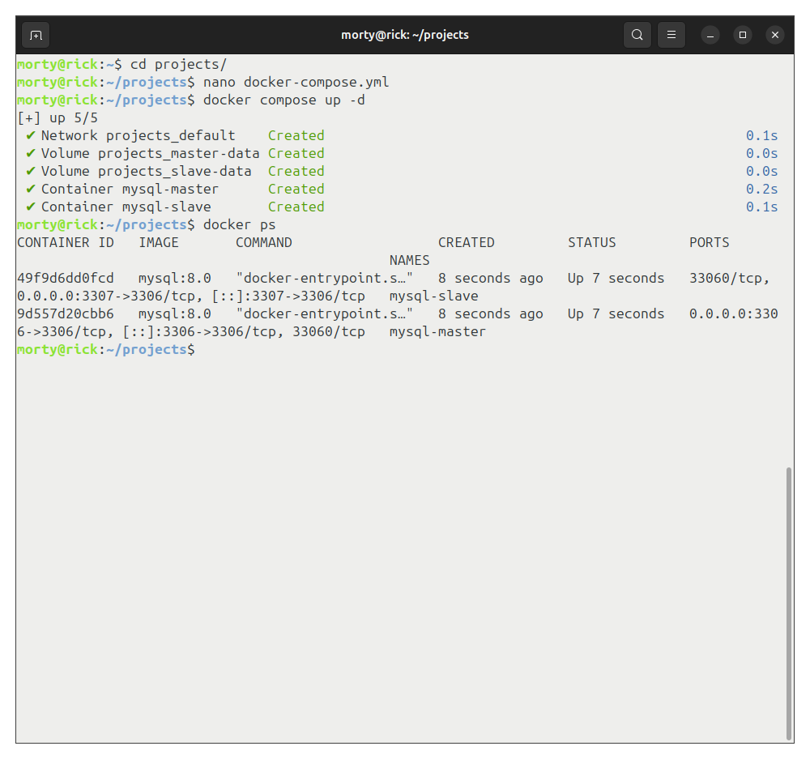
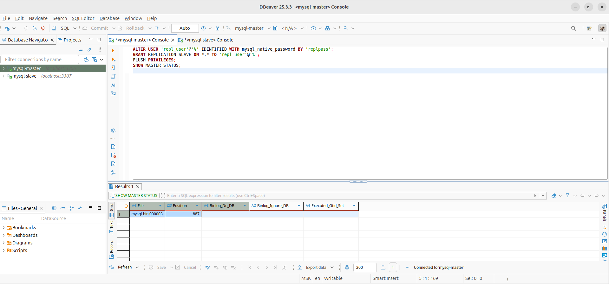
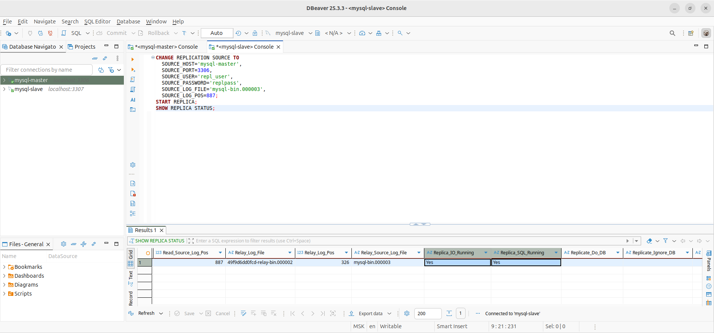
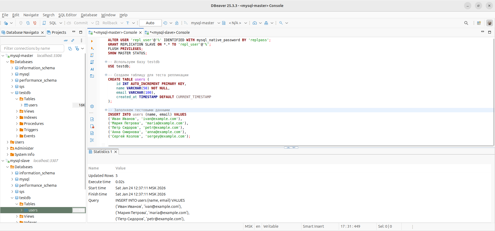
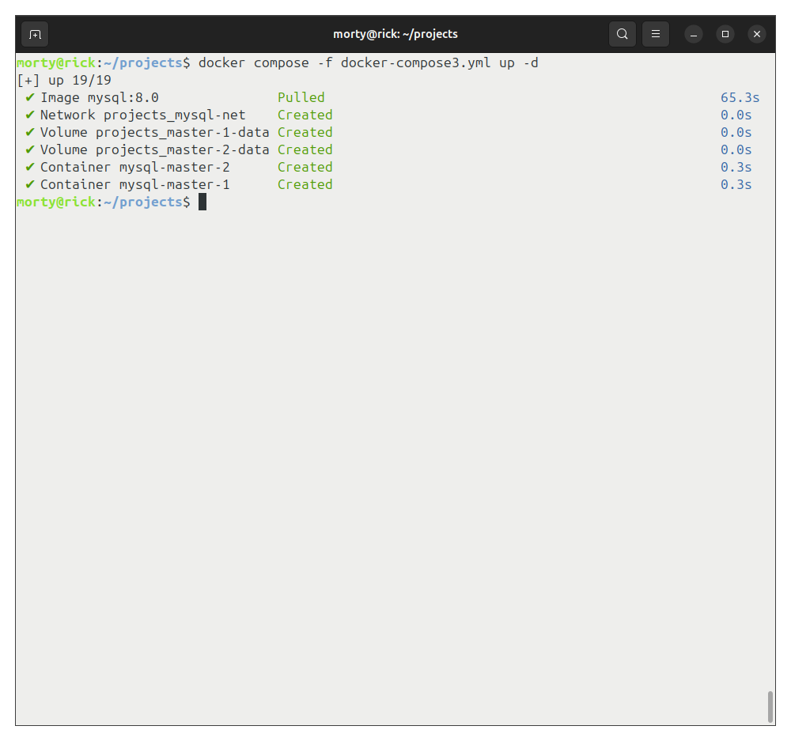
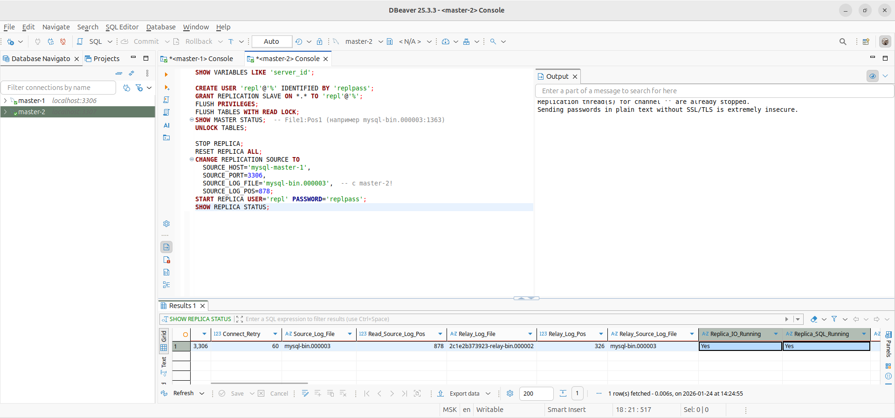

# Домашнее задание к занятию «Репликация и масштабирование. Часть 1» - Лукинов Андрей

## Задание 1

На лекции рассматривались режимы репликации master-slave, master-master, опишите их различия.

Ответ

*Ответить в свободной форме.*

- Master-slave репликация подразумевает одностороннюю синхронизацию данных: мастер-сервер принимает все операции записи, а slave-серверы только чтение и получают обновления асинхронно от мастера. Это упрощает управление, масштабирует чтение и подходит для бэкапов, но slave не может принимать записи, что ограничивает доступность при сбое мастера. 
- Master-master позволяет обоим серверам принимать записи и реплицировать изменения друг другу, повышая доступность и распределяя нагрузку на запись, но требует разрешения конфликтов (например, автоинкремент) и сложнее в настройке.

## Задание 2

Выполните конфигурацию master-slave репликации, примером можно пользоваться из лекции.

Скриншоты

*Приложите скриншоты конфигурации, выполнения работы: состояния и режимы работы серверов.*

## Задание 3* 

Выполните конфигурацию master-master репликации. Произведите проверку.

Скриншоты

*Приложите скриншоты конфигурации, выполнения работы: состояния и режимы работы серверов.*

