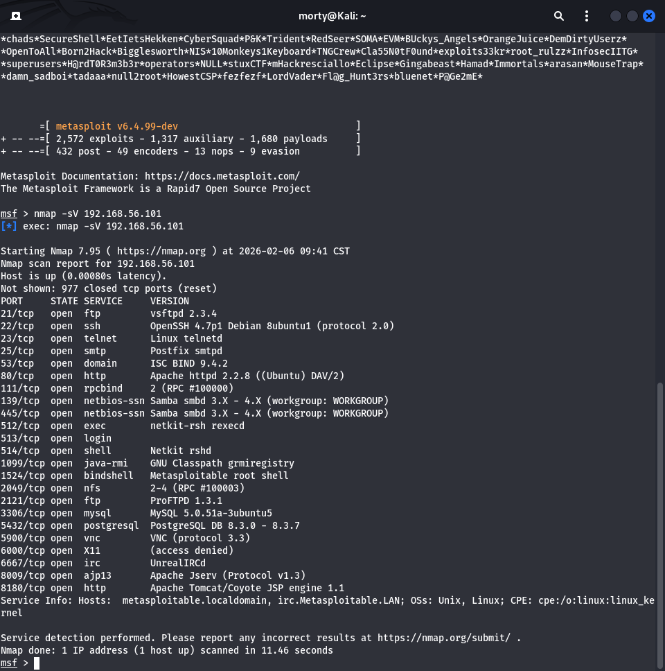
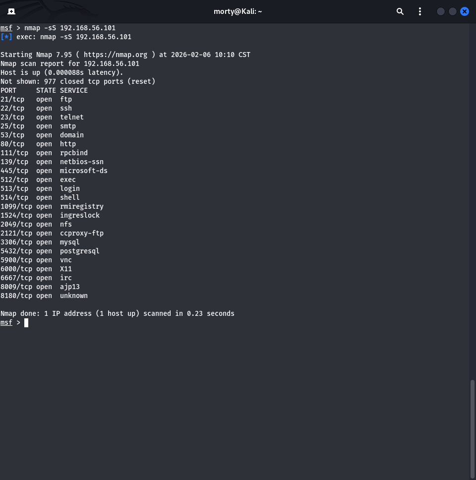
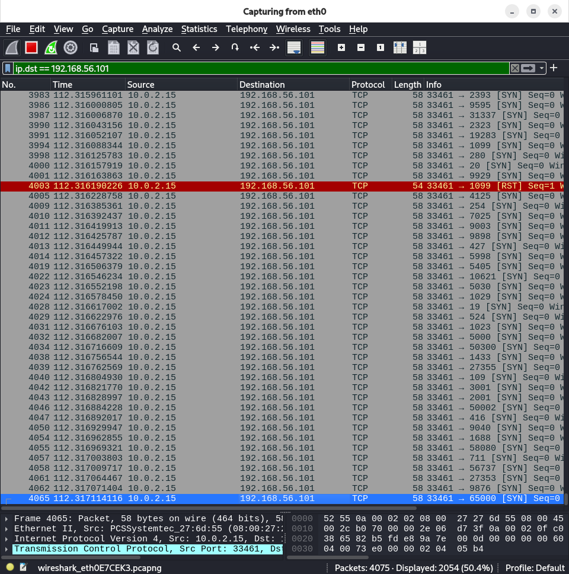
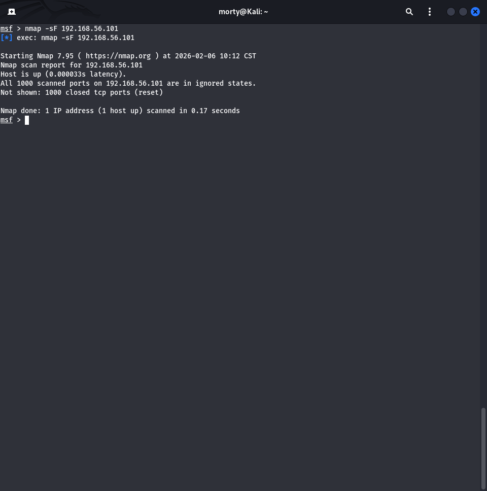
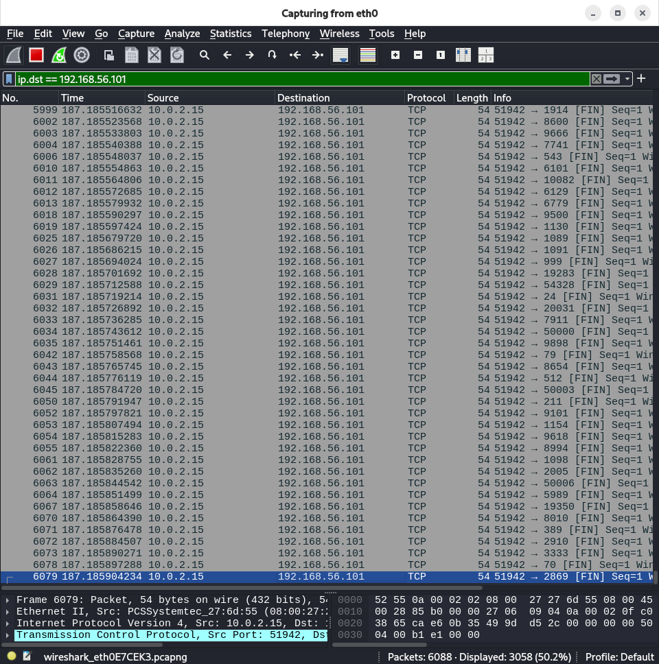
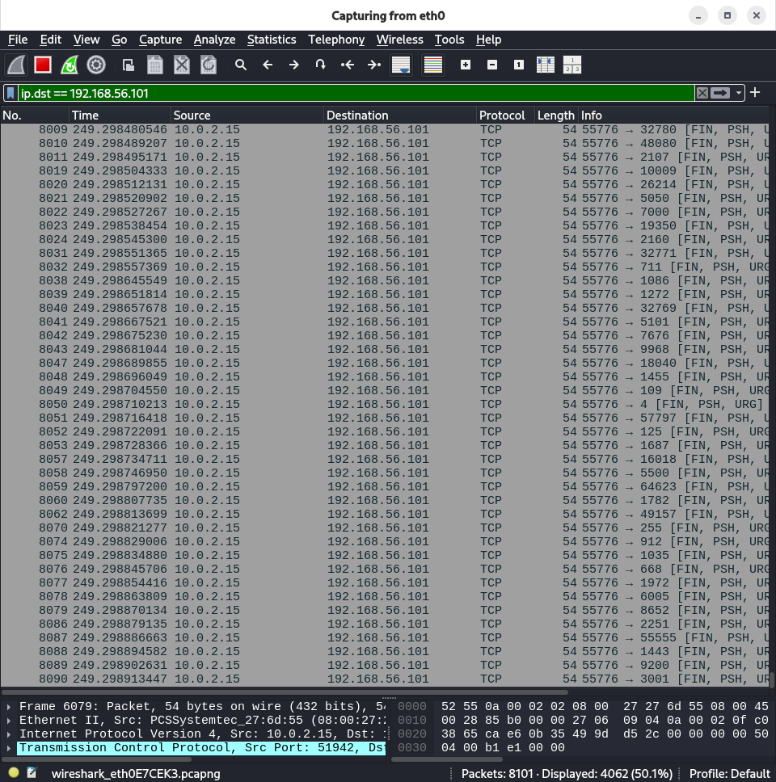
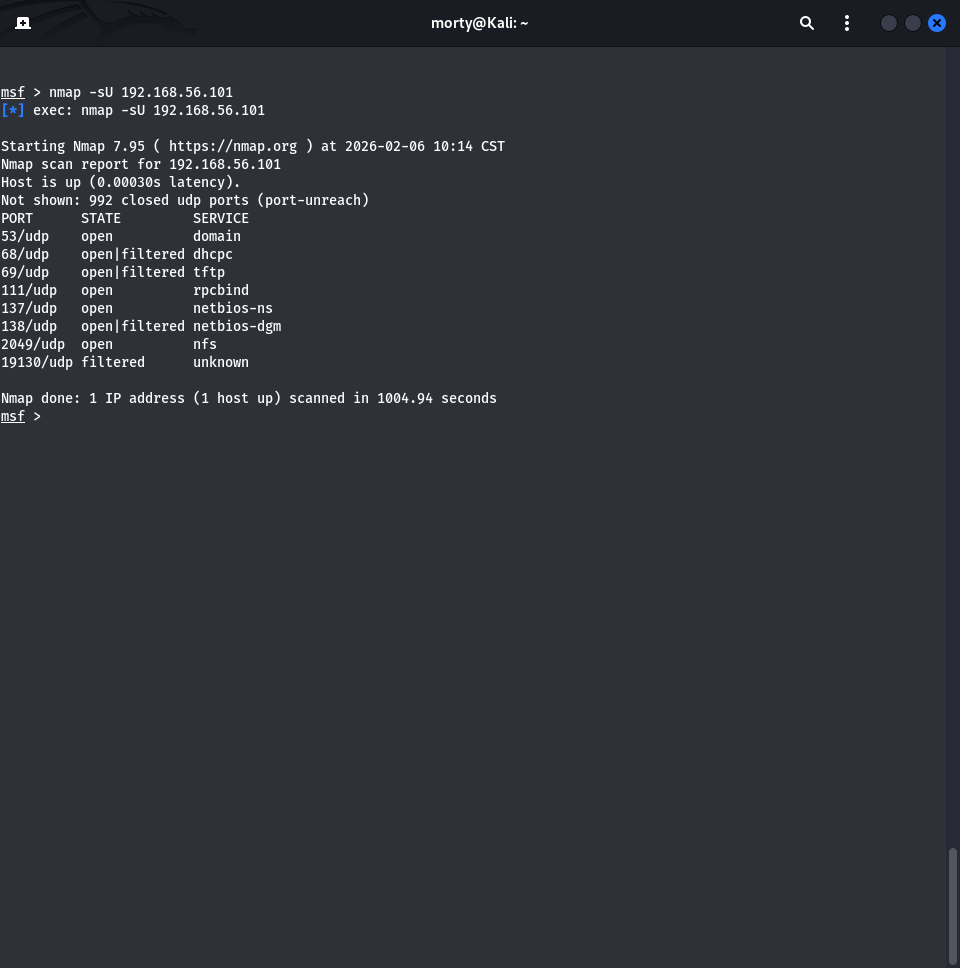
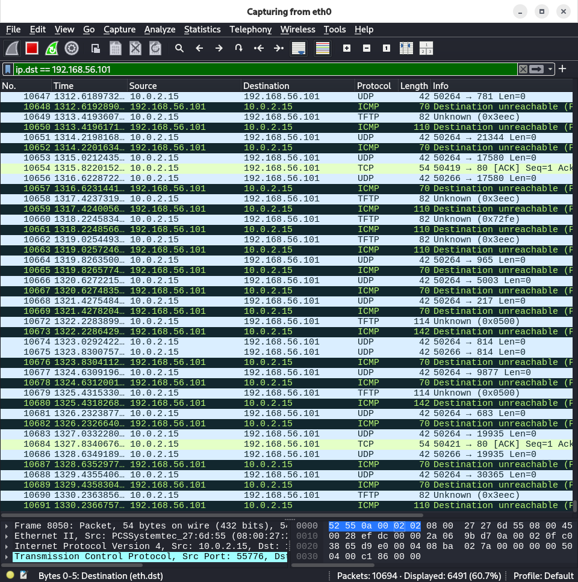

# Домашнее задание к занятию «Уязвимости и атаки на информационные системы» - Лукинов Андрей

## Задание 1

Скачайте и установите виртуальную машину Metasploitable: https://sourceforge.net/projects/metasploitable/.

Это типовая ОС для экспериментов в области информационной безопасности, с которой следует начать при анализе уязвимостей.

Просканируйте эту виртуальную машину, используя **nmap**.

Попробуйте найти уязвимости, которым подвержена эта виртуальная машина.

Сами уязвимости можно поискать на сайте https://www.exploit-db.com/.

Для этого нужно в поиске ввести название сетевой службы, обнаруженной на атакуемой машине, и выбрать подходящие по версии уязвимости.

Ответьте на следующие вопросы:

- Какие сетевые службы в ней разрешены?

  

  
Ответ

  

  **Основные службы:**
  - 21/tcp - FTP (vsftpd 2.3.4)
  - 22/tcp - SSH (OpenSSH 4.7p1)
  - 23/tcp - Telnet
  - 25/tcp - SMTP (Postfix)
  - 53/tcp - DNS (ISC BIND 9.4.2)
  - 80/tcp - HTTP (Apache 2.2.8)
  - и т.д.

  

- Какие уязвимости были вами обнаружены? (список со ссылками: достаточно трёх уязвимостей)

  

  
Ответ

  1. **Уязвимость в vsftpd 2.3.4 (Backdoor Command Execution)**
  - Служба: FTP (порт 21)
  - Версия: vsftpd 2.3.4
  - Ссылка на Exploit-DB: [Exploit #17491](https://www.exploit-db.com/exploits/17491)
  - Описание: При подключении к серверу и отправке символа ":)" в конце имени пользователя, активируется бэкдор, который открывает порт 6200 для выполнения команд.

  2. **Уязвимость в UnrealIRCd 3.2.8.1 (Backdoor)**

  - Служба: IRC (порт 6667)
  - Версия: UnrealIRCd 3.2.8.1
  - Ссылка на Exploit-DB: [Exploit #13853](https://www.exploit-db.com/exploits/13853)
  - Описание: Уязвимость позволяет выполнить произвольные команды путем отправки специально сформированной строки "AB" перед командой.

  3. **Уязвимость в Samba 3.X (Username map script Command Execution)**

  - Служба: SMB (порты 139, 445)
  - Версия: Samba 3.x
  - Ссылка на Exploit-DB: [Exploit #16320](https://www.exploit-db.com/exploits/16320)
  - Описание: Позволяет выполнить произвольные команды с правами root путем отправки специально сформированного запроса.

  

  
## Задание 2

Проведите сканирование Metasploitable в режимах SYN, FIN, Xmas, UDP.

Запишите сеансы сканирования в Wireshark.

Ответьте на следующие вопросы:

- Чем отличаются эти режимы сканирования с точки зрения сетевого трафика?

  

  
Ответ

  1. **SYN-сканирование:**
    - Наиболее "нормальный" вид трафика
    - Напоминает начало легитимных соединений
    - Легче обнаруживается системами защиты

  2. **FIN/Xmas-сканирование:**
    - Аномальный трафик (пакеты без SYN)
    - Меньше похож на нормальные соединения
    - Может обходить простые firewall правила

  3. **UDP-сканирование:**
    - Совсем другой протокол
    - Много ICMP-ответов на закрытые порты
    - Очень медленное из-за таймаутов

  

- Как отвечает сервер?

  

  
Ответ

  **SYN-сканирование (-sS)**

  - Команда: `nmap -sS ip-address`
  - Сетевой трафик:
    - Отправляются TCP-пакеты с флагом SYN
    - Не устанавливается полное TCP-соединение
    - Ответы сервера:
      - SYN-ACK -> порт открыт
      - RST -> порт закрыт
      - Нет ответа -> порт фильтруется
  - После получения SYN-ACK, сканер отправляет RST для завершения

  (SYN-сканирование (-sS))

  (SYN-сканирование (-sS))

  **FIN-сканирование (-sF)**

  - Команда: `nmap -sF ip-address`
  - Сетевой трафик:
    - Отправляются TCP-пакеты только с флагом FIN
    - Нарушает нормальную процедуру TCP
    - Ответы сервера:
      - Нет ответа -> порт открыт (RFC 793)
      - RST -> порт закрыт
  - Эффективно обходит некоторые межсетевые экраны

  (FIN-сканирование (-sF))

  (FIN-сканирование (-sF))

  **Xmas-сканирование (-sX)**

  - Команда: `nmap -sX ip-address`
  - Сетевой трафик:
    - Отправляются TCP-пакеты с флагами FIN, PSH и URG
    - Название от "рождественской елки" (все флаги "горят")
    - Ответы сервера: Аналогичны FIN-сканированию
      - Нет ответа -> порт открыт
      - RST -> порт закрыт
  - Может обходить некоторые системы обнаружения вторжений

  (Xmas-сканирование (-sX))

  (Xmas-сканирование (-sX))

  **UDP-сканирование (-sU)**

  - Команда: `nmap -sU ip-address`
  - Сетевой трафик:
    - Отправляются UDP-пакеты на целевые порты
    - Ответы сервера:
      - Нет ответа -> порт открыт/фильтруется
      - ICMP Port Unreachable -> порт закрыт
      - UDP-ответ -> порт открыт (редко)
  - Медленное сканирование из-за таймаутов

  (UDP-сканирование (-sU))

  (UDP-сканирование (-sU))

  
