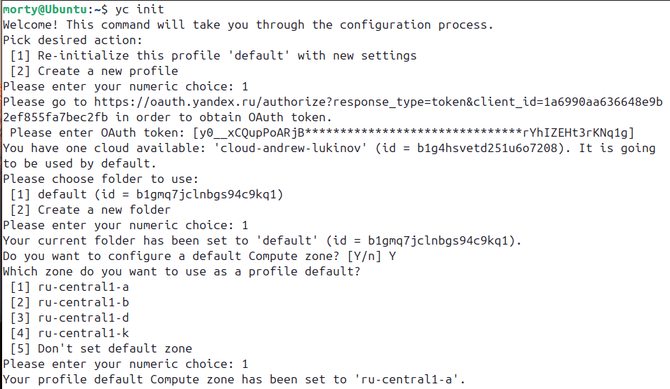

# План выполнения работы

**Этап 1: Подготовка окружения**

- Установка и настройка необходимого ПО

    <details>
    <summary>Ответ</summary>

    ```bash
    # Обновление пакетов
    sudo apt update && sudo apt upgrade -y

    # Установка Terraform
    # Скачиваем с зеркала нужную версию https://hashicorp-releases.yandexcloud.net/terraform/

    cd Downloads/ && unzip terraform_1.15.0-alpha20260218_linux_amd64.zip -d ./terraform
    sudo cp ./terraform/terraform /usr/bin/terraform
    sudo chmod +x /usr/bin/terraform 
    cd && sudo nano .terraformrc

    # Добавить в .terraformrc

    provider_installation {
        network_mirror {
            url = "https://terraform-mirror.yandexcloud.net/"
            include = ["registry.terraform.io/*/*"]
        }
        direct {
            exclude = ["registry.terraform.io/*/*"]
        }
    }

    # Установка Ansible
    sudo apt install ansible -y

    # Установка yandex-cloud CLI
    curl -sSL https://storage.yandexcloud.net/yandexcloud-yc/install.sh | bash
    # Перезапустите терминал или выполните: source ~/.bashrc

    # Установка jq для работы с JSON
    sudo apt install jq -y
    ```

    </details>

- Настройка доступа к Yandex Cloud
    - `yc init` следуем инструкции

    

- Создание структуры проекта
    - `mkdir -p ~/project/{terraform,ansible,scripts} && cd ~/project`

**Этап 2: Создание сети и security groups (Terraform)**

- Создание VPC и подсетей
- Настройка security groups
- Создание bastion host

**Этап 3: Развертывание веб-серверов и балансировщика (Terraform)**

- Создание ВМ для веб-серверов в разных зонах
- Настройка target group, backend group, HTTP router
- Создание Application Load Balancer

**Этап 4: Настройка веб-серверов (Ansible)**

- Установка и настройка nginx
- Размещение статических файлов сайта

**Этап 5: Развертывание мониторинга (Terraform + Ansible)**

- Создание ВМ для Prometheus и Grafana
- Установка и настройка Prometheus, Node Exporter, Nginx Log Exporter
- Установка и настройка Grafana

**Этап 6: Развертывание системы логирования (Terraform + Ansible)**

- Создание ВМ для Elasticsearch и Kibana
- Установка и настройка Elasticsearch, Kibana, Filebeat

**Этап 7: Настройка резервного копирования**

- Настройка snapshot-копий дисков

**Этап 8: Тестирование и проверка**

- Проверка работы сайта
- Проверка мониторинга
- Проверка сбора логов
- Проверка резервного копирования

<details>
<summary>Ответ</summary>


</details>