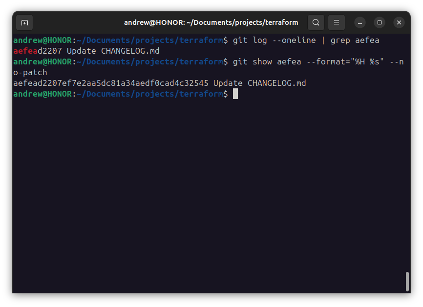
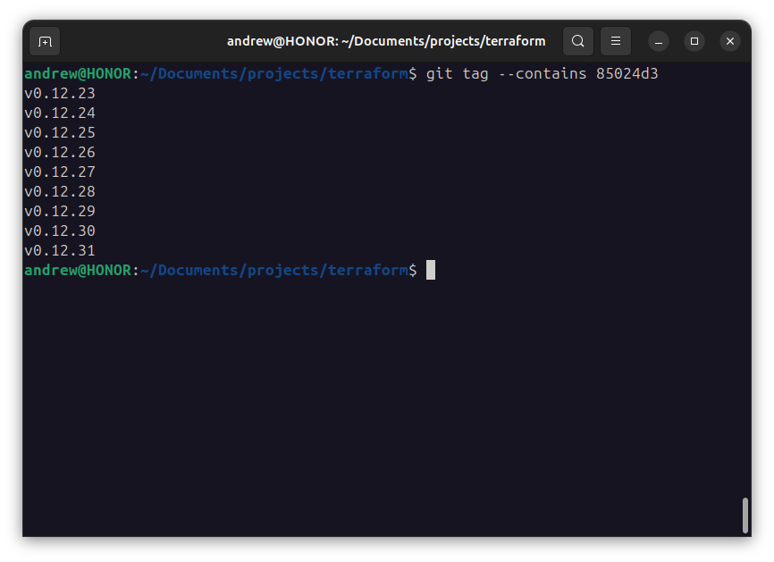
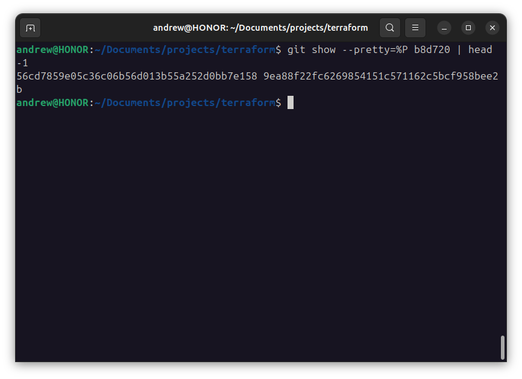
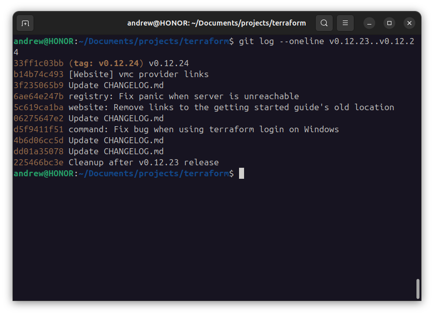
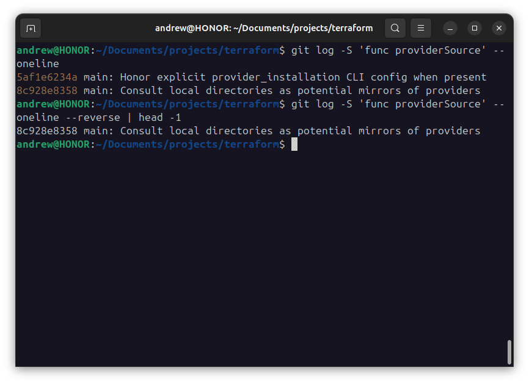
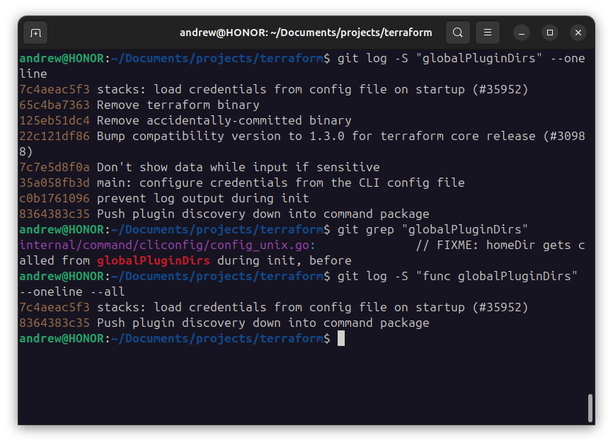
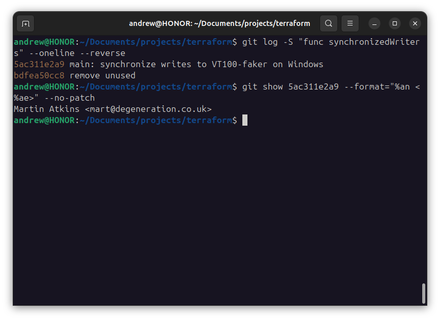

# Домашнее задание к занятию «Инструменты Git» - Лукинов Андрей

## Задание

В клонированном репозитории:

1. Найдите полный хеш и комментарий коммита, хеш которого начинается на `aefea`.
2. Ответьте на вопросы.

* Какому тегу соответствует коммит `85024d3`?
* Сколько родителей у коммита `b8d720`? Напишите их хеши.
* Перечислите хеши и комментарии всех коммитов, которые были сделаны между тегами  v0.12.23 и v0.12.24.
* Найдите коммит, в котором была создана функция `func providerSource`, её определение в коде выглядит так: `func providerSource(...)` (вместо троеточия перечислены аргументы).
* Найдите все коммиты, в которых была изменена функция `globalPluginDirs`.
* Кто автор функции `synchronizedWriters`?

Ответ

*В качестве решения ответьте на вопросы и опишите, как были получены эти ответы.*

1. `git log --oneline | grep aefea` - короткий хеш; `git show aefea --format="%H %s" --no-patch` - полный хеш.
   
   

2. Ответы на вопросы.

* Какому тегу соответствует коммит `85024d3`?
  * `git tag --contains 85024d3`
  * 
* Сколько родителей у коммита `b8d720`? Напишите их хеши.
  * 2 родителя
  * `git show --pretty=%P b8d720 | head -1`
  * 
* Перечислите хеши и комментарии всех коммитов, которые были сделаны между тегами  v0.12.23 и v0.12.24.
  * 33ff1c03bb, b14b74c493, 3f235065b9, 6ae64e247b, 5c619ca1ba, 06275647e2, d5f9411f51, 4b6d06cc5d, dd01a35078, 225466bc3e
  * 
* Найдите коммит, в котором была создана функция `func providerSource`, её определение в коде выглядит так: `func providerSource(...)` (вместо троеточия перечислены аргументы).
  * `git log -S 'func providerSource' --oneline` - все значения
  * `git log -S 'func providerSource' --oneline --reverse | head -1` - впервые добавлена
  * 
* Найдите все коммиты, в которых была изменена функция `globalPluginDirs`.
  * `git log -S "globalPluginDirs" --oneline` - все коммиты где упоминается эта функция
  * `git grep "globalPluginDirs"` - поиск по всему коду
  * `git log -S "func globalPluginDirs" --oneline --all` - ищем во всех коммитах, когда функция существовала
  * 
* Кто автор функции `synchronizedWriters`? `git tag --contains 85024d3`
  * `git log -S "func synchronizedWriters" --oneline --reverse` - найти коммит, где функция была создана
  * `git show 5ac311e2a9 --format="%an <%ae>" --no-patch` - посмотрим автора первого коммита
  * 

