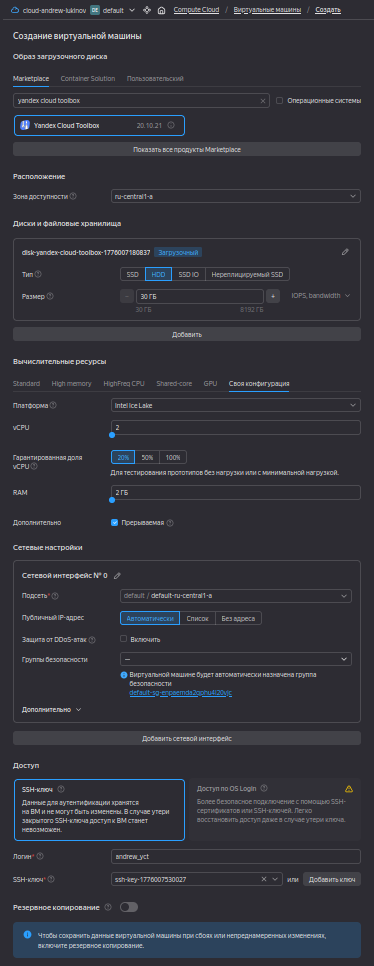
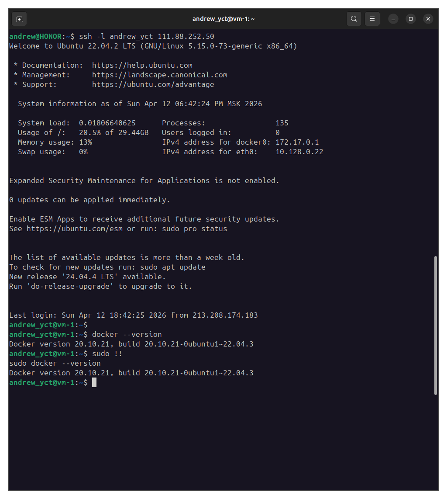
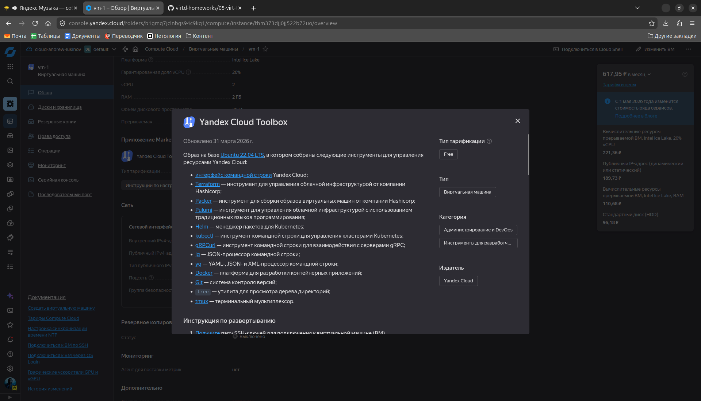
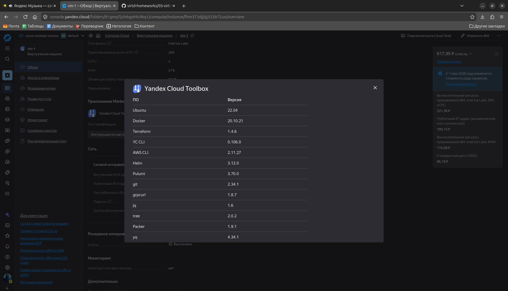

# Домашнее задание по занятию "Введение в виртуализацию. Типы и функции гипервизоров. Обзор рынка вендоров и областей применения" - Лукинов Андрей

## Задача 1
1. Создайте через web-интерфейс Yandex Cloud - VPC и виртуальную машину из инструкции конфигурации "эконом-ВМ" с публичным ip-адресом. В пункте "Выбор образа/загрузочного диска" выберите вкладку "Cloud Marketplace" , щелкните "Посмотреть больше", найдите образ "Yandex Cloud Toolbox".

    

2. Убедитесь, что вы можете подключиться к консоли ВМ через ssh, используя публичный ip-адрес. Убедитесь, что на ВМ установлен Docker с помощью команды ```docker --version``` (команду выполните от имени root пользователя)!

    

3. Узнайте в инструкции Яндекс, какие еще инструменты предустановлены в данном образе.

    

    

4. Оставьте ВМ работать, пока она не выключится самостоятельно! Опция "прерываемая" выключит ее не позже чем через 24 часа. 
5. Для наглядности подождите еще 1 сутки.
6. Перейдите по [ссылке ](https://console.cloud.yandex.ru/billing?section=accounts). Выберите свой платежный аккаунт. Перейдите на вкладку детализация (фильтр "По продуктам") и оцените график потребления финансов.
7. Удалите ВМ или пользуйтесь ею при выполнении последующих домашних заданий курса обучения.

## Задача 2
Выберите один из вариантов платформы в зависимости от задачи. Здесь нет однозначно верного ответа так как все зависит от конкретных условий: финансирование, компетенции специалистов, удобство использования, надежность, требования ИБ и законодательства, фазы луны.

Тип платформы:

- физические сервера;

    <details>
    <summary>Физические сервера</summary>

    **Что это:** «Железо» целиком - реальный компьютер/сервер со своим CPU, RAM, дисками, сетевыми картами. Никакой прослойки между ОС и оборудованием.

    **Как «едят»:**
    - Покупаете/арендуете сервер в стойку.
    - Ставите ОС (Windows Server, Linux) прямо на железо.
    - ОС получает 100% ресурсов без дележа с соседями.

    **Плюсы:** максимальная производительность, предсказуемая задержка, прямой доступ к GPU/специализированным устройствам.
    **Минусы:** дорого, сложно масштабировать, один сервер = одна ОС, при отказе железа - всё падает.

    </details>

- паравиртуализация;

    <details>
    <summary>Паравиртуализация</summary>

    **Что это:** Поверх железа устанавливается **гипервизор** (VMware ESXi, KVM, Hyper-V). Он эмулирует виртуальное железо, и внутри запускаются полноценные **виртуальные машины (ВМ)** со своими ОС.

    **Как «едят»:**
    - На одном физическом сервере запускаете 5–50 ВМ.
    - Каждая ВМ думает, что у неё своё железо, но ресурсы делятся через гипервизор.
    - Гостевая ОС знает, что работает в виртуальной среде, и «помогает» гипервизору (отсюда «пара» - специальные драйверы для производительности).

    **Плюсы:** изоляция между ВМ, живые миграции, снапшоты, запуск разных ОС (Windows + Linux рядом).
    **Минусы:** небольшой оверхед (~2–10%), сложность настройки, нужно лицензирование (для VMware).

    </details>

- виртуализация уровня ОС;

    <details>
    <summary>Виртуализация уровня ОС</summary>

    **Что это:** Одна ОС (Linux, реже Windows) установлена на физическом сервере или ВМ. Внутри неё запускаются **изолированные контейнеры** - они используют ядро хост-ОС, но имеют своё файловое пространство, сеть, переменные окружения.

    **Как «едят»:**
    - Устанавливаете Docker, containerd, LXC.
    - Запускаете контейнеры из образов (например, docker run nginx).
    - Контейнер стартует за секунды, весит мегабайты (вместо гигабайтов ВМ).

    **Плюсы:** очень быстро, минимальный оверхед (~1–3%), высокая плотность (сотни контейнеров на сервер), удобно для микросервисов.
    **Минусы:** все контейнеры делят одно ядро ОС (проблемы с безопасностью при утечке), нельзя запустить Windows-контейнер на Linux-хосте (и наоборот), сложнее с постоянными данными.

    </details>

Задачи:

- высоконагруженная база данных MySql, критичная к отказу;
  
    <details>
    <summary>Ответ</summary>

    **Выбор: физические сервера** (кластер из 2+ узлов + репликация/отказоустойчивый кластер, либо физический сервер + резервный в режиме cold standby).

    **Критерии:**
    - *Производительность ввода-вывода:* Базы данных критичны к задержкам дисковых операций и сетевого стека. Виртуализация (даже паравиртуализация) вносит накладные расходы на прерывания и память.
    - *Предсказуемость:* «Шумные соседи» исключены - вся память, CPU и IOPS только у БД.
    - *Надёжность при отказе:* Для критичных систем часто важна возможность прямого управления железом (IPMI, RAID, батарейный кэш контроллера). При краше гипервизора падают все виртуалки, а при краше физического сервера - только одна БД, но её проще переключить на реплику.
    - *Паравиртуализация* (Xen, KVM) иногда допустима, но при очень высоких нагрузках начинаются проблемы с latency.

    </details>

- различные web-приложения;
  
    <details>
    <summary>Ответ</summary>

    **Выбор: виртуализация уровня ОС** (контейнеры: Docker, containerd, оркестрация Kubernetes).

    **Критерии:**
    - *Плотность размещения:* На одном физическом сервере можно запустить десятки-сотни контейнеров.
    - *Быстрота развёртывания и обновления:* Для веб-приложений критичны быстрые релизы и масштабирование под нагрузку. Контейнеры стартуют за секунды.
    - *Утилизация ресурсов:* Нет оверхеда на гостевые ОС (как у паравиртуализации).
    - *Независимость окружений:* Каждое приложение получает свой изолированный набор библиотек и переменных.

    </details>

- Windows-системы для использования бухгалтерским отделом;
  
    <details>
    <summary>Ответ</summary>

    **Выбор: паравиртуализация** (например, VMware vSphere, KVM + QEMU с гостевой Windows).

    **Критерии:**
    - *Совместимость с ОС:* Виртуализация уровня ОС (контейнеры) не поддерживает Windows в качестве изолированного окружения (Windows Containers существуют, но для бухгалтерского ПО с GUI они не подходят).
    - *Удобство администрирования:* На паравиртуализации удобно делать снапшоты перед обновлением 1С или Налогоплательщика ЮЛ, живую миграцию VM при обновлении физического сервера.
    - *Изоляция от других систем:* Бухгалтерия - критичный отдел, его ВМ лучше отделить от веб-серверов.
    - *Физические сервера невыгодны:* Windows-лицензии стоят дорого, лучше уплотнить несколько ВМ на одном мощном сервере (но не переусердствовать, чтобы избежать шумных соседей).

    </details>

- системы, выполняющие высокопроизводительные расчёты на GPU.

    <details>
    <summary>Ответ</summary>

    **Выбор: физические сервера с прямым доступом к GPU** (возможна **паравиртуализация с PCIe-passthrough**, если нужна изоляция или несколько задач на одном узле с GPU-виртуализацией типа vGPU).

    **Критерии:**
    - *Прямой доступ к GPU:* Контейнеры и классическая паравиртуализация без passthrough имеют огромный оверхед для CUDA/OpenCL. Только физический доступ даёт максимальную производительность.
    - *Отсутствие «шумных соседей» по шине PCIe:* Виртуализация может перераспределять прерывания, увеличивая латентность.
    - *Стабильность расчётов:* Длительные расчёты (сутки+) критичны к любой нестабильности гипервизора.
    - *Исключение:* Если нужно делить один мощный GPU между несколькими задачами (например, ML-инференс), то используют vGPU от NVIDIA (это вариант паравиртуализации с поддержкой виртуализации GPU). Но для тренировочных расчётов - только физический.

    </details>

## Задача 3
Выберите подходящую систему управления виртуализацией для предложенного сценария. Опишите ваш выбор.

Сценарии:

1. 100 виртуальных машин на базе Linux и Windows, общие задачи, нет особых требований. Преимущественно Windows based-инфраструктура, требуется реализация программных балансировщиков нагрузки, репликации данных и автоматизированного механизма создания резервных копий.

    <details>
    <summary>Ответ</summary>

    **Выбор: Microsoft Hyper-V** (в составе Windows Server с System Center).

    **Ключевые критерии:**
    - **Родная поддержка Windows:** Лучшая совместимость и производительность для гостевых Windows-систем, что критично при их большинстве .
    - **Экосистема:** System Center Virtual Machine Manager (SCVMM) обеспечивает централизованное управление сотнями ВМ, программные балансировщики и репликацию Hyper-V Replica .
    - **Бэкапы:** Встроенные средства и интеграция с большинством систем резервного копирования (VSS).

    </details>

2. Требуется наиболее производительное бесплатное open source-решение для виртуализации небольшой (20-30 серверов) инфраструктуры на базе Linux и Windows виртуальных машин.

    <details>
    <summary>Ответ</summary>

    **Выбор: Proxmox Virtual Environment (Proxmox VE).**

    **Ключевые критерии:**
    - **Бесплатность и Open Source:** Полнофункциональная версия без скрытых ограничений .
    - **Производительность:** Использует KVM (тип 1) - оверхед минимален, производительность близка к физической .
    - **Управление:** Веб-интерфейс для управления кластером, встроенные бэкапы, live-миграция.
    - **Поддержка ОС:** Отлично работает с Linux и корректно с Windows (требуются VirtIO-драйверы).

    **Почему не XCP-ng:** Тоже хорош, но Proxmox имеет более простое «все-в-одном» развертывание и шире распространён в сегменте 20-30 серверов 

    </details>

3. Необходимо бесплатное, максимально совместимое и производительное решение для виртуализации Windows-инфраструктуры.

    <details>
    <summary>Ответ</summary>

    **Выбор: Microsoft Hyper-V Server** (бесплатная отдельная редакция гипервизора).

    **Ключевые критерии:**
    - **Максимальная совместимость:** Разработан Microsoft для Windows - драйверы, интеграционные службы и гостевые ОС «из коробки» .
    - **Бесплатность:** Отдельный продукт Hyper-V Server (не требует лицензии Windows Server) .
    - **Производительность:** Гипервизор 1-го типа без оверхеда на хост-ОС.
    - **Минус:** Управление через командную строку или Windows Admin Center (нет удобного веб-интерфейса как у Proxmox).

    </details>

4. Необходимо рабочее окружение для тестирования программного продукта на нескольких дистрибутивах Linux.

    <details>
    <summary>Ответ</summary>

    **Выбор: Виртуализация 2-го типа (на рабочей станции).**

    **Лучшие варианты:**
    1. **GNOME Boxes** (для пользователей Linux-хоста) :
      - Максимальная простота: автоматически скачивает и устанавливает дистрибутивы.
      - Идеален для быстрого тестирования без тонкой настройки.
    2. **VMware Workstation Pro** (для Windows/Linux-хоста) :
      - Стал бесплатным для всех.
      - Лучшая поддержка периферии, снапшотов и сетевых режимов.
    3. **VirtualBox** (альтернатива, полностью Open Source):
      - Чуть медленнее, но очень гибкий и кроссплатформенный.

    **Почему не гипервизоры 1-го типа (Proxmox, ESXi)?**
    Они избыточны для тестовой рабочей станции - требуют отдельного сервера или сложной установки на ПК с потерей основной ОС.

    </details>

## Задача 4
Опишите возможные проблемы и недостатки гетерогенной среды виртуализации (использования нескольких систем управления виртуализацией одновременно) и что необходимо сделать для минимизации этих рисков и проблем. Если бы у вас был выбор, создавали бы вы гетерогенную среду или нет?

<details>
<summary>Ответ</summary>

Гетерогенная среда виртуализации - это когда в одной организации одновременно используются **две и более систем управления** (например, VMware + Hyper-V + Proxmox + OpenStack).

**Основные проблемы и недостатки**

1. **Усложнение администрирования**
  - Разные консоли управления - нужно знать и поддерживать VMware vCenter, Hyper-V Manager, Proxmox Web UI, возможно, CLI для каждого.
  - Разные навыки сотрудников - администраторы должны быть «универсалами» или нанимать специалистов под каждую платформу.
  - Двойная работа - политики бэкапов, обновления, мониторинг настраиваются отдельно для каждой системы.

2. **Рост затрат**
  - Лицензии - даже если одна платформа бесплатна, другая может требовать платной поддержки.
  - Обучение - курсы, сертификации, время на переключение контекста.
  - Инфраструктура управления - дополнительные серверы для системных контроллеров, хранилища метаданных.

3. **Проблемы с резервным копированием и восстановлением**
  - Разные агенты и форматы бэкапов (Veeam для VMware, Windows Server Backup для Hyper-V, vzdump для Proxmox).
  - Сложность организации единой политики хранения и восстановления.
  - При аварии нужно помнить, какая ВМ где лежала.

4. **Отсутствие единой живой миграции и балансировки нагрузки**
  - Нельзя переместить ВМ с VMware на Hyper-V на лету (нужна конвертация и остановка).
- Невозможно распределять нагрузку между разными гипервизорами автоматически.

1. **Усложнение мониторинга и оповещения**
  - Нужны разные метрики (VMware - ESXTOP, Hyper-V - PerfMon, Proxmox - собственный API).
  - Единая система мониторинга (Zabbix, Prometheus) требует дополнительных адаптеров.

2. **Риски при обновлениях и совместимости**
  - Обновление одной платформы может сломать интеграцию с общим хранилищем (iSCSI, NFS).
  - Разные версии драйверов гостевых ОС для разных гипервизоров.

3. **Безопасность и ИБ**
  - Две поверхности атаки вместо одной.
  - Разные модели разграничения доступа (RBAC в VMware vs AD-интеграция в Hyper-V).
  - Сложнее аудировать и применять единые политики.

**Как минимизировать риски**

1. **Внедрить единую систему управления (оркестратор)**
  - VMware Aria (бывший vRealize) - умеет управлять VMware + Hyper-V + KVM.
  - OpenStack - если нужна полная унификация поверх KVM и других.
  - Red Hat Satellite + RHEV.

2. **Использовать общее хранилище и сеть**
  - Единая СХД (iSCSI, FC, NFS), доступная всем гипервизорам.
  - VLAN-сегментация для разных платформ, но с единой политикой маршрутизации.

3. **Единая система резервного копирования**
  - Veeam Backup & Replication - поддерживает VMware, Hyper-V, Proxmox (ограниченно), физические серверы.
  - Acronis Cyber Backup - аналогично.

4. **Централизованный мониторинг**
  - Zabbix + шаблоны для всех типов гипервизоров.
  - Prometheus + Grafana с экспортёрами под каждую платформу.

5. **Унифицировать процессы**
  - Единый портал для заявок на ВМ (ServiceNow, Jira).
  - Общий регламент: как запросить ВМ, как делать бэкап, как восстанавливать.
  - Документировать маппинг «ВМ → платформа → гипервизор».

6. **Автоматизировать рутину**
  - Ansible/Terraform для provisioning на всех платформах (разные модули, но единый код-репозиторий).
  - Скрипты инвентаризации, собирающие информацию со всех систем.

7. **Усилить ИБ**
  - Единый LDAP/AD для аутентификации администраторов всех платформ.
  - Централизованный сбор логов (ELK, Splunk) со всех гипервизоров.

**Создавали бы вы гетерогенную среду?**

**Да, в редких случаях:**

- Поглощение / слияние компаний - уже есть две устоявшиеся платформы, миграция дороже, чем поддержка двух.
- Специфические требования законодательства - например, для ГИС нужно использовать только российский zVirt, а для коммерческих задач - привычный VMware.
- Поэтапная миграция - переезд с VMware на KVM/Hyper-V, когда часть ВМ ещё на старой платформе.
- Изоляция критичных систем - например, физическая безопасность требует, чтобы СУБД работала на одном типе гипервизора, а DMZ - на другом (разные векторы атак).

**Нет, если вы проектируете с нуля:**

- Одна платформа (правильно подобранная) всегда дешевле, проще и надёжнее.
- Исключение - если вам жизненно нужны две платформы для тестирования переносимости (например, вы разрабатываете облачную платформу и обязаны поддерживать и KVM, и Hyper-V).

</details>