# Домашнее задание к занятию 4 «Оркестрация группой Docker контейнеров на примере Docker Compose» - Лукинов Андрей

## Задача 1

Сценарий выполнения задачи:
- Установите docker и docker compose plugin на свою linux рабочую станцию или ВМ.
- Если dockerhub недоступен создайте файл /etc/docker/daemon.json с содержимым: ```{"registry-mirrors": ["https://mirror.gcr.io", "https://daocloud.io", "https://c.163.com/", "https://registry.docker-cn.com"]}```
- Зарегистрируйтесь и создайте публичный репозиторий  с именем "custom-nginx" на https://hub.docker.com (ТОЛЬКО ЕСЛИ У ВАС ЕСТЬ ДОСТУП);
- скачайте образ nginx:1.29.0;
- Создайте Dockerfile и реализуйте в нем замену дефолтной индекс-страницы(/usr/share/nginx/html/index.html), на файл index.html с содержимым:
  ```
  <html>
  <head>
  Hey, Netology
  </head>
  <body>
  <h1>I will be DevOps Engineer!</h1>
  </body>
  </html>
  ```
- Соберите и отправьте созданный образ в свой dockerhub-репозитории c tag 1.0.0 (ТОЛЬКО ЕСЛИ ЕСТЬ ДОСТУП). 
- Предоставьте ответ в виде [ссылки](https://hub.docker.com/repository/docker/vndr3w/custom-nginx/general).

  <details>
  <summary>Скриншот</summary>

  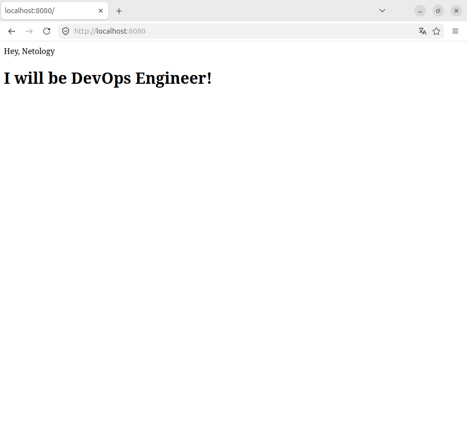

  </details>

## Задача 2

1. Запустите ваш образ custom-nginx:1.0.0 командой docker run в соответвии с требованиями:
- имя контейнера "ФИО-custom-nginx-t2"
- контейнер работает в фоне
- контейнер опубликован на порту хост системы 127.0.0.1:8080
2. Не удаляя, переименуйте контейнер в "custom-nginx-t2"
3. Выполните команду ```date +"%d-%m-%Y %T.%N %Z" ; sleep 0.150 ; docker ps ; ss -tlpn | grep 127.0.0.1:8080  ; docker logs custom-nginx-t2 -n1 ; docker exec -it custom-nginx-t2 base64 /usr/share/nginx/html/index.html```
4. Убедитесь с помощью curl или веб браузера, что индекс-страница доступна.

    <details>
    <summary>Ответ</summary>

    В качестве ответа приложите скриншоты консоли, где видно все введенные команды и их вывод.

    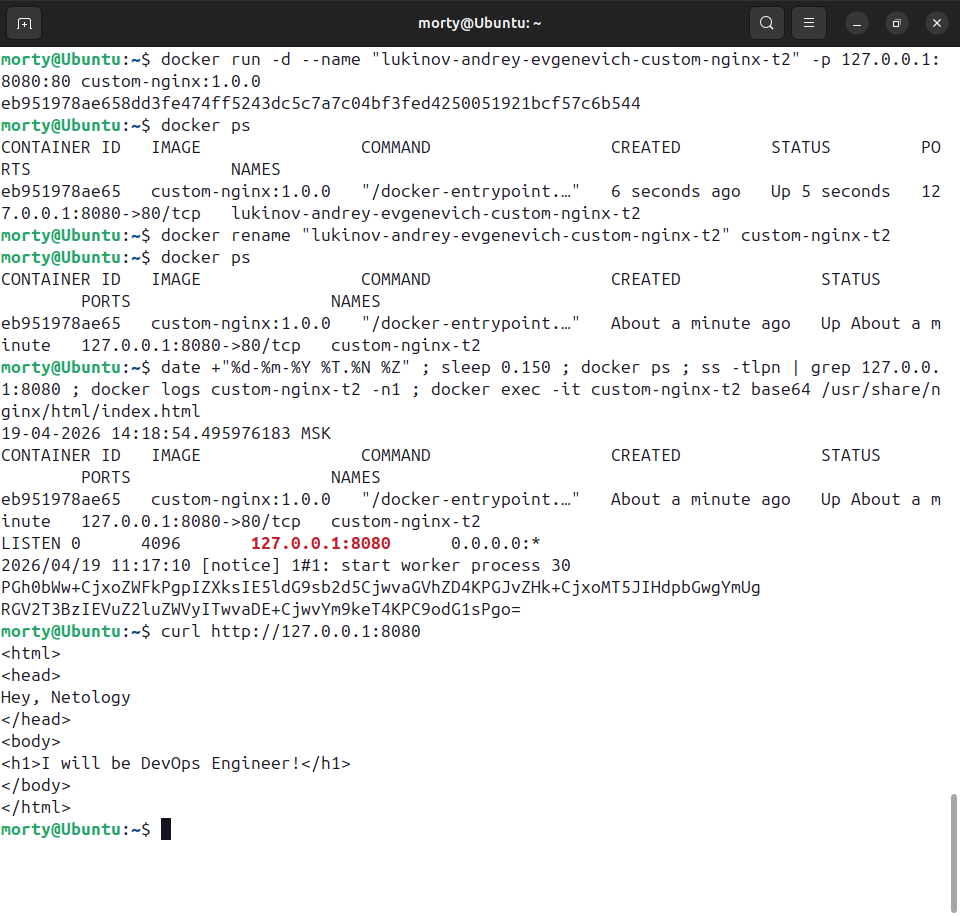

    ```bash
    docker run -d --name "lukinov-andrey-evgenevich-custom-nginx-t2" -p 127.0.0.1:8080:80 custom-nginx:1.0.0

    docker ps

    docker rename "lukinov-andrey-evgenevich-custom-nginx-t2" custom-nginx-t2

    docker ps -a | grep custom-nginx-t2

    date +"%d-%m-%Y %T.%N %Z" ; sleep 0.150 ; docker ps ; ss -tlpn | grep 127.0.0.1:8080 ; docker logs custom-nginx-t2 -n1 ; docker exec -it custom-nginx-t2 base64 /usr/share/nginx/html/index.html

    curl http://127.0.0.1:8080
    ```

    </details>

## Задача 3

1. Воспользуйтесь docker help или google, чтобы узнать как подключиться к стандартному потоку ввода/вывода/ошибок контейнера "custom-nginx-t2".
   - `docker attach custom-nginx-t2`
2. Подключитесь к контейнеру и нажмите комбинацию Ctrl-C.
3. Выполните ```docker ps -a``` и объясните своими словами почему контейнер остановился.
   - В контейнере custom-nginx-t2 главный процесс — nginx (PID 1). Команда docker attach передаёт сигнал SIGINT (Ctrl+C) прямо в этот процесс. Nginx по умолчанию не обрабатывает SIGINT как перезагрузку, а завершает работу. Как только PID 1 завершается, Docker останавливает контейнер.
4. Перезапустите контейнер
   - `docker start custom-nginx-t2` -> `docker ps`
5. Зайдите в интерактивный терминал контейнера "custom-nginx-t2" с оболочкой bash.
   - `docker exec -it custom-nginx-t2 bash`
6. Установите любимый текстовый редактор(vim, nano итд) с помощью apt-get.
   - `apt-get update` -> `apt-get install -y nano`
7. Отредактируйте файл "/etc/nginx/conf.d/default.conf", заменив порт "listen 80" на "listen 81".
   - `nano /etc/nginx/conf.d/default.conf`
8. Запомните(!) и выполните команду ```nginx -s reload```, а затем внутри контейнера ```curl http://127.0.0.1:80 ; curl http://127.0.0.1:81```.
9.  Выйдите из контейнера, набрав в консоли  ```exit``` или Ctrl-D.
10. Проверьте вывод команд: ```ss -tlpn | grep 127.0.0.1:8080``` , ```docker port custom-nginx-t2```, ```curl http://127.0.0.1:8080```. Кратко объясните суть возникшей проблемы.
       - При запуске контейнера был опубликован порт 127.0.0.1:8080 -> 80 (внутренний порт контейнера).
       - Внутри контейнера было изменение listen 80 -> listen 81.
       - Nginx теперь слушает порт 81, но Docker продолжает пробрасывать трафик с хоста (8080) на порт 80 контейнера.
       - В итоге: хост стучится в 8080 -> Docker перенаправляет на порт 80 контейнера, а там ничего не слушает. Доступ к странице потерян.
11. Это дополнительное, необязательное задание. * Попробуйте самостоятельно исправить конфигурацию контейнера, используя доступные источники в интернете. Не изменяйте конфигурацию nginx и не удаляйте контейнер. Останавливать контейнер можно. [пример источника](https://www.baeldung.com/linux/assign-port-docker-container)
   - `docker stop custom-nginx-t2` -> `sudo systemctl stop docker.socket` -> `sudo systemctl stop docker` -> `sudo -i` -> `cd /var/lib/docker/containers` -> выбираем нужный контейнер -> `nano hostconfig.json` -> меняем порт на установленный -> выходим и запускаем docker
12. Удалите запущенный контейнер "custom-nginx-t2", не останавливая его.(воспользуйтесь --help или google)
   - `docker rm -f custom-nginx-t2`

<details>
<summary>Скриншоты</summary>

В качестве ответа приложите скриншоты консоли, где видно все введенные команды и их вывод.

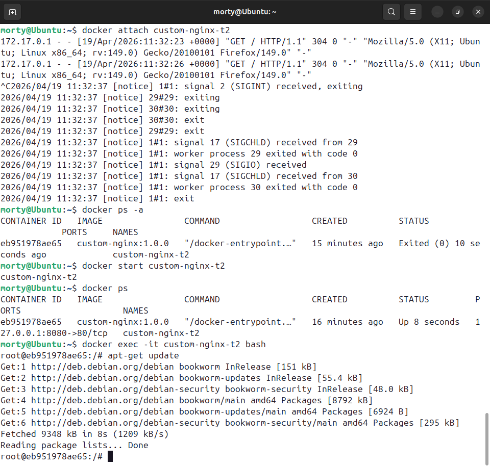

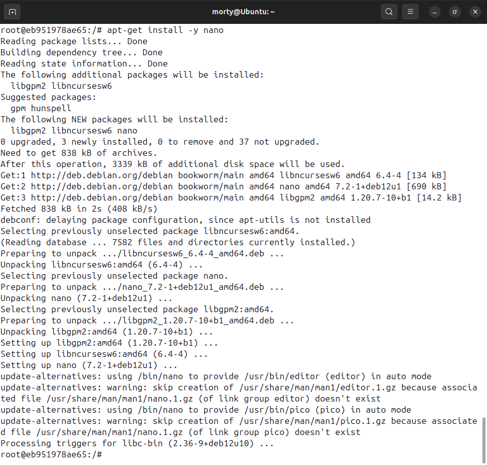

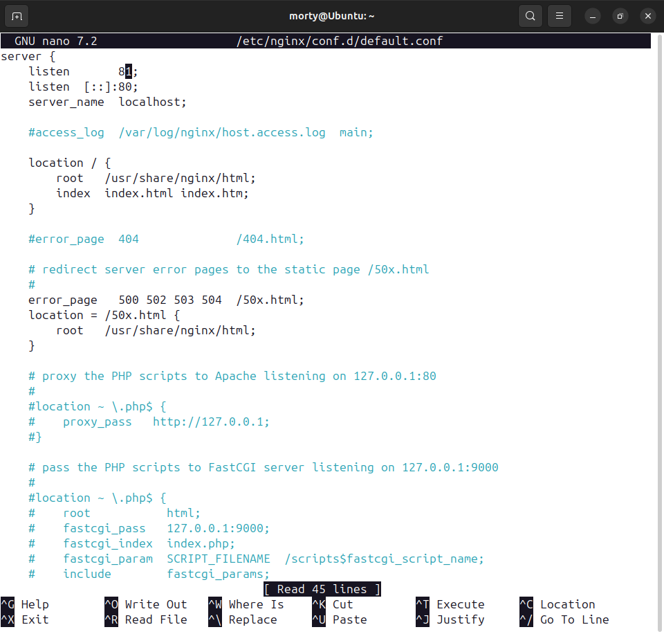

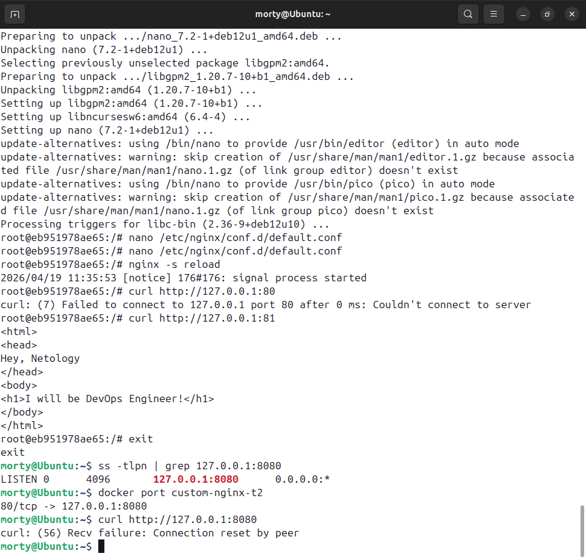

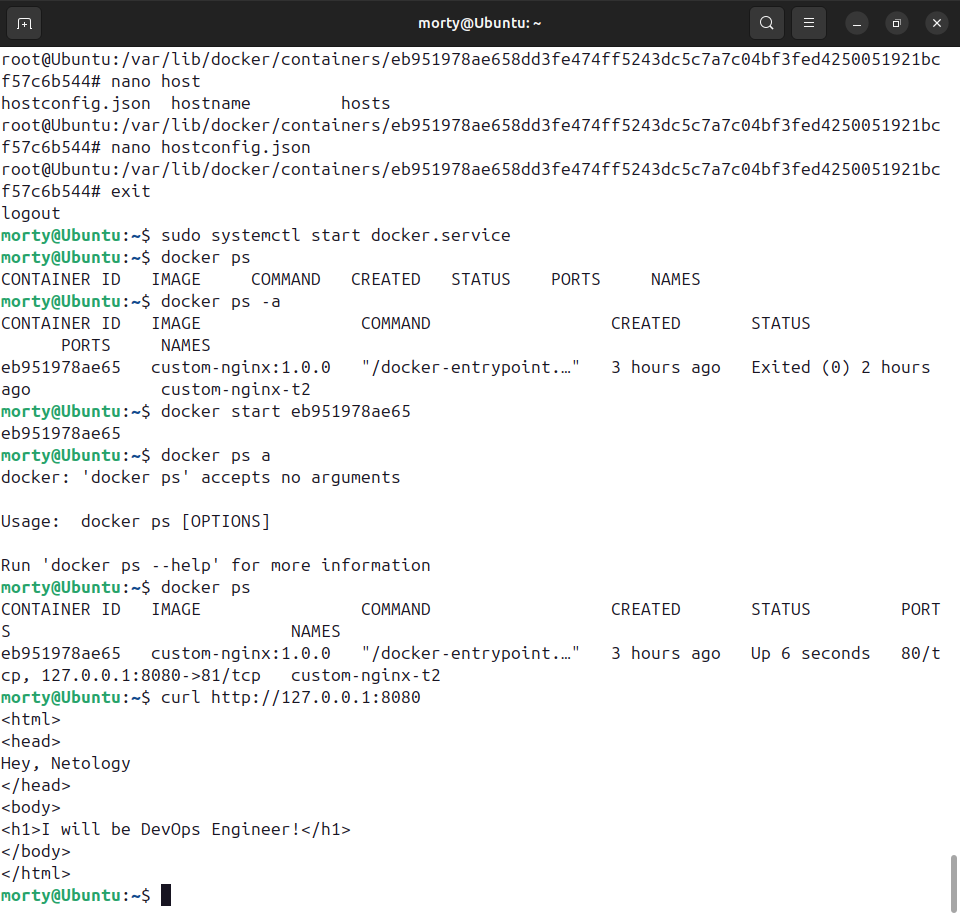

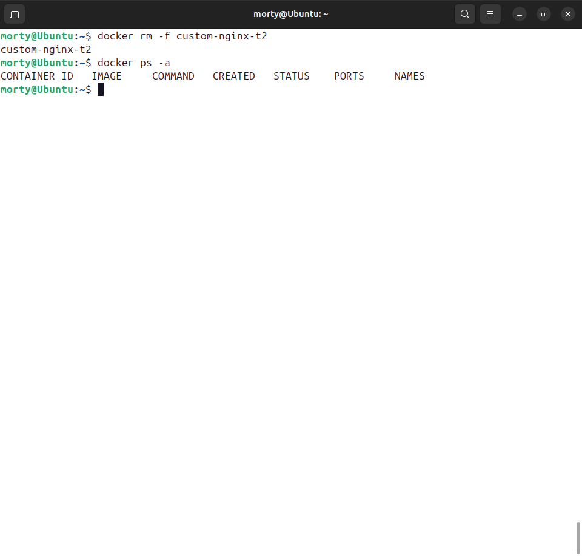

</details>

## Задача 4

- Запустите первый контейнер из образа ***centos*** c любым тегом в фоновом режиме, подключив папку  текущий рабочий каталог ```$(pwd)``` на хостовой машине в ```/data``` контейнера, используя ключ -v.
  - `docker run -d --name centos_container -v $(pwd):/data centos:centos7.9.2009 tail -f /dev/null`
- Запустите второй контейнер из образа ***debian*** в фоновом режиме, подключив текущий рабочий каталог ```$(pwd)``` в ```/data``` контейнера.
  - `docker run -d --name debian_container -v $(pwd):/data debian:trixie-backports tail -f /dev/null` 
- Подключитесь к первому контейнеру с помощью ```docker exec``` и создайте текстовый файл любого содержания в ```/data```.
  - `docker exec -it centos_container bash`
- Добавьте ещё один файл в текущий каталог ```$(pwd)``` на хостовой машине.
  - `echo "Hello from host machine" > host_file.txt`
- Подключитесь во второй контейнер и отобразите листинг и содержание файлов в ```/data``` контейнера.
  - `docker exec -it debian_container bash`

<details>
<summary>Скриншоты</summary>

В качестве ответа приложите скриншоты консоли, где видно все введенные команды и их вывод.

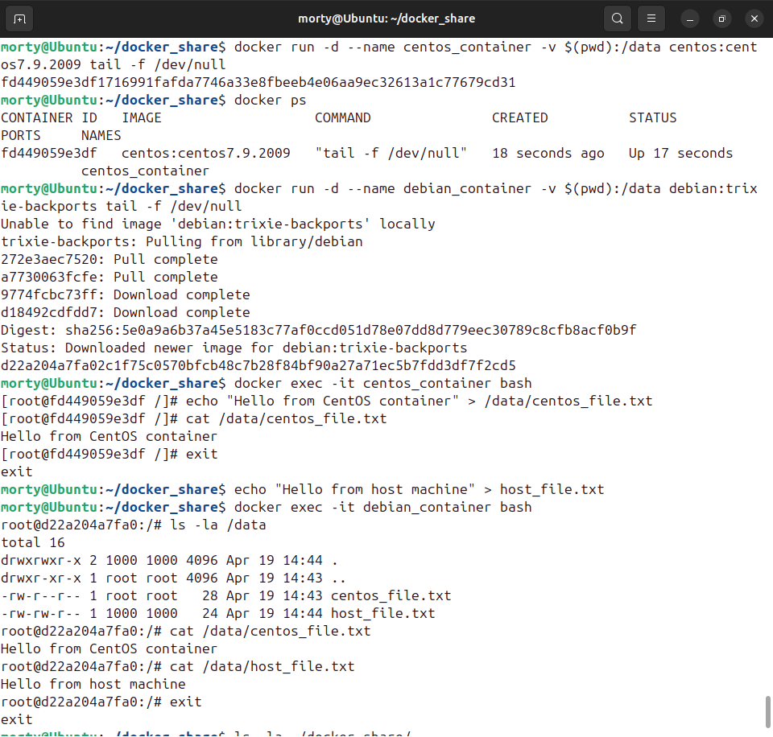

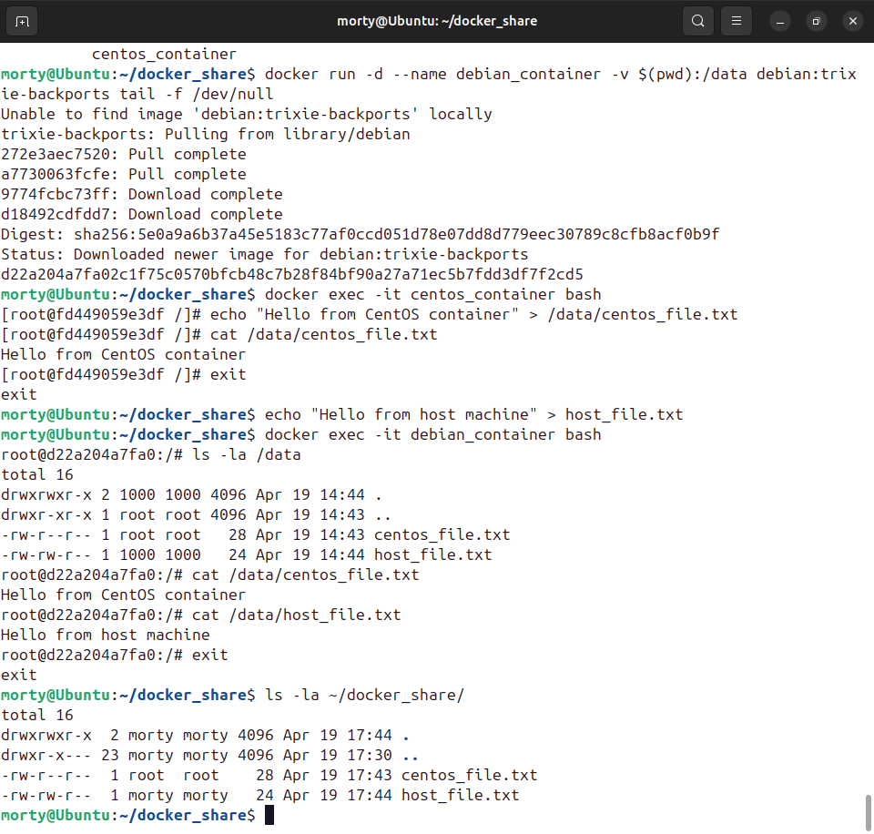

</details>

## Задача 5

1. Создайте отдельную директорию(например /tmp/netology/docker/task5) и 2 файла внутри него.
"compose.yaml" с содержимым:
```
version: "3"
services:
  portainer:
    network_mode: host
    image: portainer/portainer-ce:latest
    volumes:
      - /var/run/docker.sock:/var/run/docker.sock
```
"docker-compose.yaml" с содержимым:
```
version: "3"
services:
  registry:
    image: registry:2

    ports:
    - "5000:5000"
```

И выполните команду "docker compose up -d". Какой из файлов был запущен и почему? (подсказка: https://docs.docker.com/compose/compose-application-model/#the-compose-file )

   - `mkdir -p /tmp/netology/docker/task5 && cd /tmp/netology/docker/task5`
   - 
      ```bash
      cat > compose.yaml <<EOF
      version: "3"
      services:
        portainer:
          network_mode: host
          image: portainer/portainer-ce:latest
          volumes:
            - /var/run/docker.sock:/var/run/docker.sock
      EOF
      ```
   - 
      ```bash
      cat > docker-compose.yaml <<EOF
      version: "3"
      services:
        registry:
          image: registry:2
          ports:
            - "5000:5000"
      EOF
      ```
   - `docker compose up -d`
   - Был запущен compose.yaml. Причина описана в документации Docker Compose, если флаг -f не указан, Compose ищет в текущей директории файл compose.yaml (или compose.yml). Если его нет, ищет docker-compose.yaml/docker-compose.yml. Таким образом, compose.yaml имеет приоритет над docker-compose.yaml при автоматическом поиске.

2. Отредактируйте файл compose.yaml так, чтобы были запущенны оба файла. (подсказка: https://docs.docker.com/compose/compose-file/14-include/)

    ```bash
    cat > compose.yaml <<EOF
    include:
      - docker-compose.yaml

    services:
      portainer:
        network_mode: host
        image: portainer/portainer-ce:latest
        volumes:
          - /var/run/docker.sock:/var/run/docker.sock
    EOF
    ```
3. Выполните в консоли вашей хостовой ОС необходимые команды чтобы залить образ custom-nginx как custom-nginx:latest в запущенное вами, локальное registry. Дополнительная документация: https://distribution.github.io/distribution/about/deploying/

    ```bash
    # Шаг 3.1: Убедимся, что образ custom-nginx:1.0.0 существует (из задачи 1)
    docker images | grep custom-nginx

    # Шаг 3.2: Тегируем образ для локального registry
    docker tag custom-nginx:1.0.0 localhost:5000/custom-nginx:latest

    # Шаг 3.3: Пушим образ в локальный registry
    docker push localhost:5000/custom-nginx:latest

    # Шаг 3.4: Проверяем, что образ появился в registry
    curl -X GET http://localhost:5000/v2/_catalog
    ```
4. Откройте страницу "https://127.0.0.1:9000" и произведите начальную настройку portainer.(логин и пароль адмнистратора)

    ```
    1. Откройте в браузере: https://127.0.0.1:9000
    2. Браузер предупредит о небезопасном соединении (самоподписанный сертификат). Нажмите "Продолжить" / "Advanced" → "Proceed".
    3. Создайте администратора.
    4. Выберите "Get Started" → "Local" (окружение Docker)
    5. Перейдите на вкладку "Stacks" → "Add stack" → "Web editor"
    6. Вставьте следующий компоуз:

        version: '3'

        services:
          nginx:
            image: 127.0.0.1:5000/custom-nginx
            ports:
              - "9090:80"

    7. Назовите стек (например, my-nginx) и нажмите "Deploy the stack"
    ```

5. Откройте страницу "http://127.0.0.1:9000/#!/home", выберите ваше local  окружение. Перейдите на вкладку "stacks" и в "web editor" задеплойте следующий компоуз:

```
version: '3'

services:
  nginx:
    image: 127.0.0.1:5000/custom-nginx
    ports:
      - "9090:80"
```
6. Перейдите на страницу "http://127.0.0.1:9000/#!/2/docker/containers", выберите контейнер с nginx и нажмите на кнопку "inspect". В представлении <> Tree разверните поле "Config" и сделайте скриншот от поля "AppArmorProfile" до "Driver".

7. Удалите любой из манифестов компоуза(например compose.yaml).  Выполните команду "docker compose up -d". Прочитайте warning, объясните суть предупреждения и выполните предложенное действие. Погасите compose-проект ОДНОЙ(обязательно!!) командой.

    ```bash
    rm compose.yaml

    docker compose up -d

    # Суть предупреждения: Docker Compose ищет файл compose.yaml, но не находит его, поэтому автоматически использует docker-compose.yaml как резервный вариант. Это стандартное поведение, описанное в документации .

    # Предложенное действие: Само предупреждение не требует действий — Compose сам переключился на доступный файл. Но если вы хотите избежать предупреждения в будущем, можно явно указать файл через -f
    
    docker compose down
    ```

<details>
<summary>Скриншоты</summary>

В качестве ответа приложите скриншоты консоли, где видно все введенные команды и их вывод, файл compose.yaml , скриншот portainer c задеплоенным компоузом.

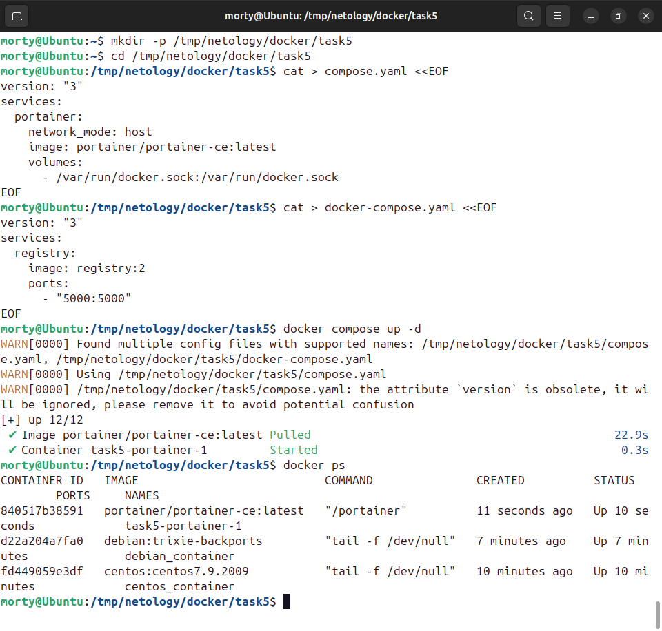

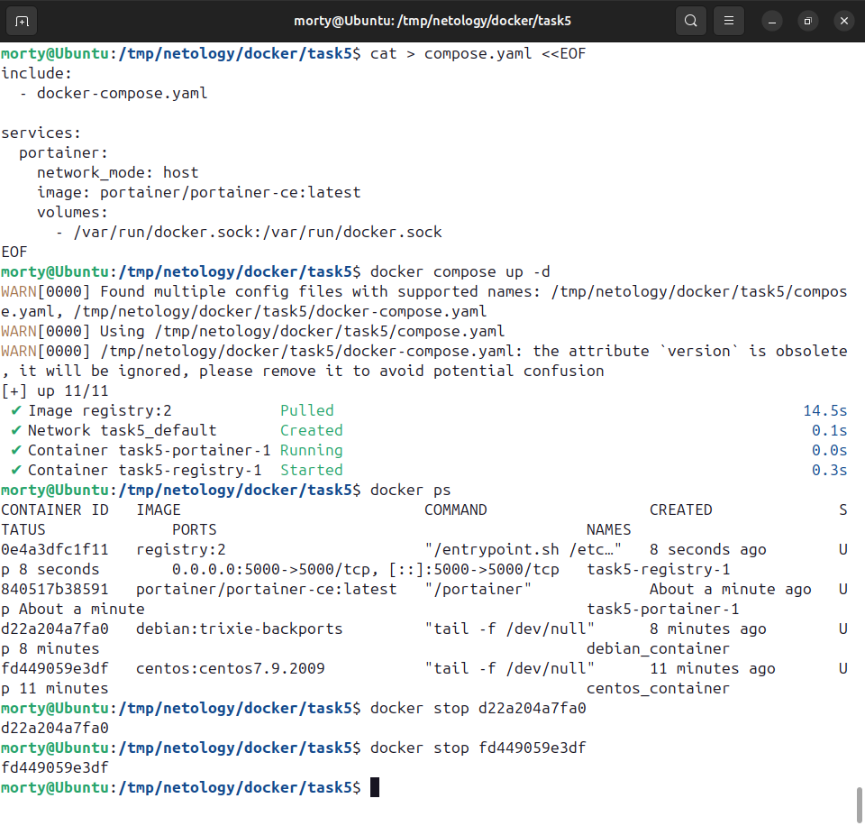

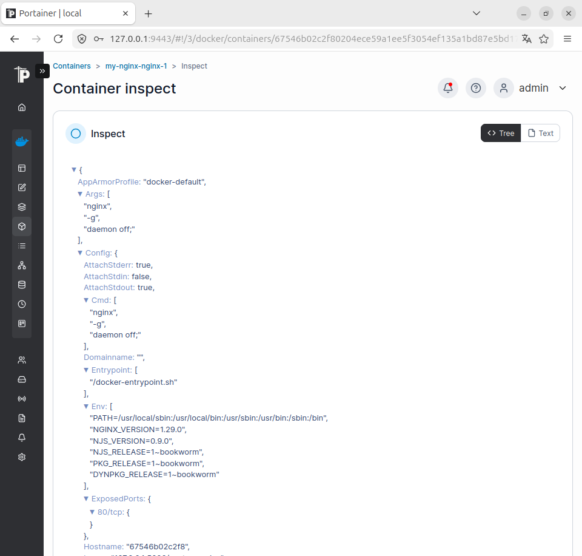

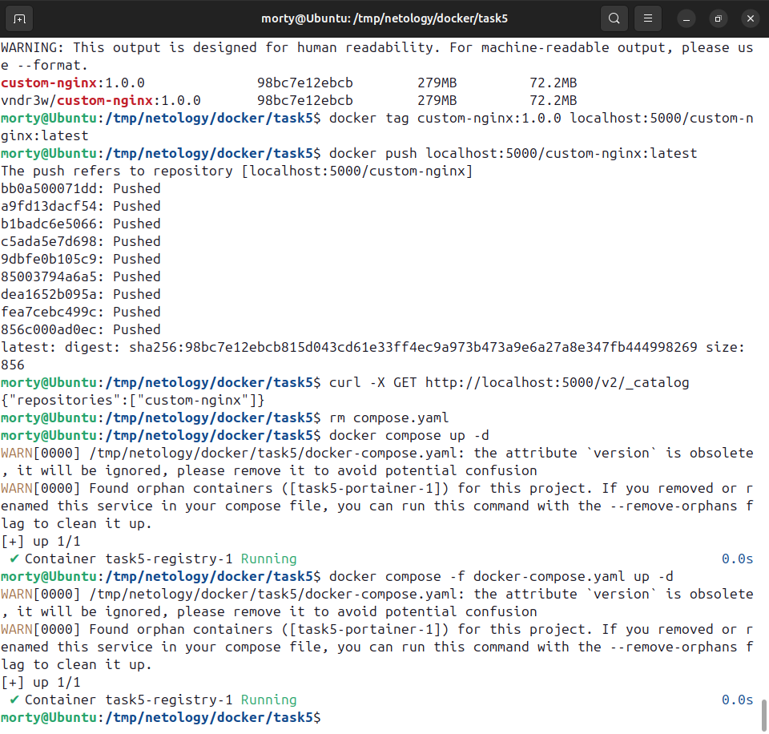

</details>