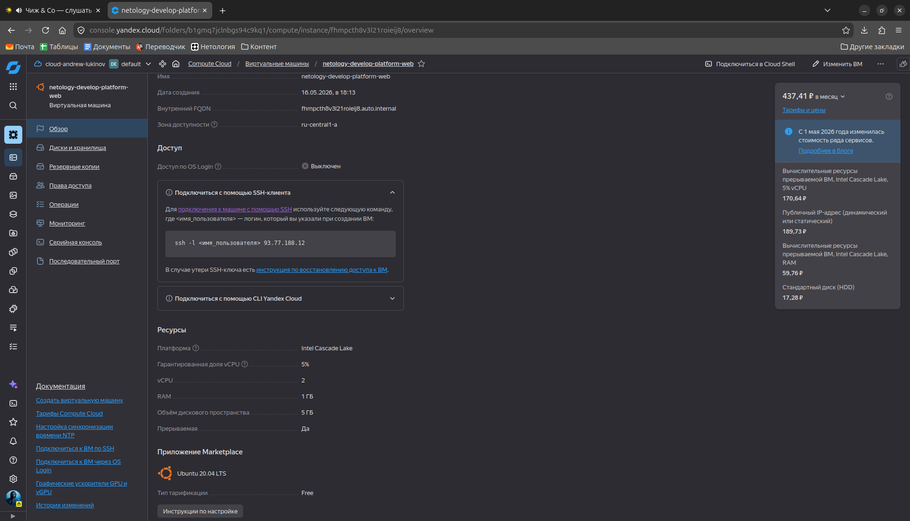
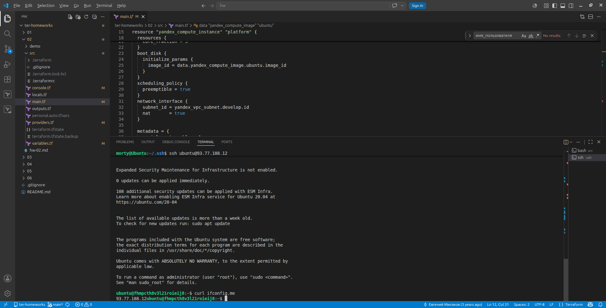
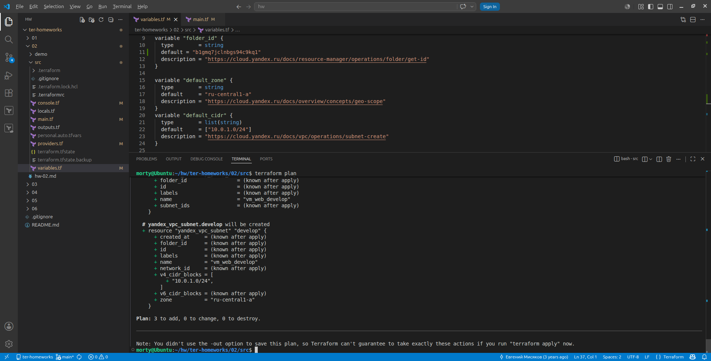
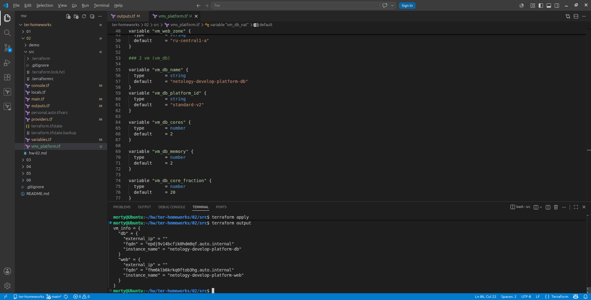
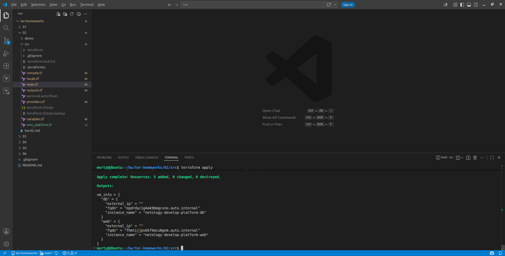

# Домашнее задание к занятию «Основы Terraform. Yandex Cloud» - Лукинов Андрей

## Задание 1

<details>
<summary>Задание 1 и ответы</summary>

В качестве ответа всегда полностью прикладывайте ваш terraform-код в git.
Убедитесь что ваша версия **Terraform** ~>1.12.0

1. Изучите проект. В файле variables.tf объявлены переменные для Yandex provider.
2. Создайте сервисный аккаунт и ключ. [service_account_key_file](https://terraform-provider.yandexcloud.net).
4. Сгенерируйте новый или используйте свой текущий ssh-ключ. Запишите его открытую(public) часть в переменную **vms_ssh_public_root_key**.
5. Инициализируйте проект, выполните код. Исправьте намеренно допущенные синтаксические ошибки. Ищите внимательно, посимвольно. Ответьте, в чём заключается их суть.
6. Подключитесь к консоли ВМ через ssh и выполните команду ``` curl ifconfig.me```.
Примечание: К OS ubuntu "out of a box, те из коробки" необходимо подключаться под пользователем ubuntu: ```"ssh ubuntu@vm_ip_address"```. Предварительно убедитесь, что ваш ключ добавлен в ssh-агент: ```eval $(ssh-agent) && ssh-add``` Вы познакомитесь с тем как при создании ВМ создать своего пользователя в блоке metadata в следующей лекции.;
8. Ответьте, как в процессе обучения могут пригодиться параметры ```preemptible = true``` и ```core_fraction=5``` в параметрах ВМ.

В качестве решения приложите:

- скриншот ЛК Yandex Cloud с созданной ВМ, где видно внешний ip-адрес;

  

- скриншот консоли, curl должен отобразить тот же внешний ip-адрес;

  

- ответы на вопросы:
  - [Пошаговое выполнение задания](./files/step_by_step.md)
  - В инструкции к яндекс облаку сказано, что стандарта 4 нет, к тому же была опечатка в слове standarT.
  - Количество ядер не соответсвует требованиям яндекс облака.
  - Изменил путь к файлу с ключом.
  - Захардкодил ключ для доступа к ВМ.
  - `preemptible = true` – делает виртуальную машину прерываемой. Это сильно удешевляет стоимость, но VM может быть остановлена в любой момент (максимум живёт 24 часа).
  - `core_fraction = 5` – гарантирует только 5% производительности физического ядра (burst-модель). Это самый дешёвый тариф.
  - [Файлы с которыми запускал первое задание](./files/src_1/)

</details>

## Задание 2

<details>
<summary>Задание 2 и ответы</summary>

1. Замените все хардкод-**значения** для ресурсов **yandex_compute_image** и **yandex_compute_instance** на **отдельные** переменные. К названиям переменных ВМ добавьте в начало префикс **vm_web_** .  Пример: **vm_web_name**.
2. Объявите нужные переменные в файле variables.tf, обязательно указывайте тип переменной. Заполните их **default** прежними значениями из main.tf. 
3. Проверьте terraform plan. Изменений быть не должно.

  

  - [Файлы с которыми запускал второе задание](./files/src_2/)
  - [Пошаговое выполнение задания](./files/step_by_step.md)

</details>

## Задание 3

<details>
<summary>Задание 3 и ответы</summary>

1. Создайте в корне проекта файл 'vms_platform.tf' . Перенесите в него все переменные первой ВМ.
2. Скопируйте блок ресурса и создайте с его помощью вторую ВМ в файле main.tf: **"netology-develop-platform-db"** ,  ```cores  = 2, memory = 2, core_fraction = 20```. Объявите её переменные с префиксом **vm_db_** в том же файле ('vms_platform.tf').  ВМ должна работать в зоне "ru-central1-b"
3. Примените изменения.

  - [Файлы с которыми запускал третье задание](./files/src_3/)
  - [Пошаговое выполнение задания](./files/step_by_step.md)

</details>


## Задание 4

<details>
<summary>Задание 4 и ответ</summary>

1. Объявите в файле outputs.tf **один** output , содержащий: instance_name, external_ip, fqdn для каждой из ВМ в удобном лично для вас формате.(без хардкода!!!)
2. Примените изменения.

В качестве решения приложите вывод значений ip-адресов команды ```terraform output```.

  

  - Нет ip, потому что поймал ограничение на создание ВМ с внешними айпи.
  - [Файлы с которыми запускал четвёртое задание](./files/src_4/)

</details>

## Задание 5

<details>
<summary>Задание 5 и ответ</summary>

1. В файле locals.tf опишите в **одном** local-блоке имя каждой ВМ, используйте интерполяцию ${..} с НЕСКОЛЬКИМИ переменными по примеру из лекции.
2. Замените переменные внутри ресурса ВМ на созданные вами local-переменные.
3. Примените изменения.

  

  - [Файлы с которыми запускал пятое задание](./files/src_5/)
  - [Пошаговое выполнение задания](./files/step_by_step.md)

</details>

## Задание 6

<details>
<summary>Ответ</summary>

1. Вместо использования трёх переменных  ".._cores",".._memory",".._core_fraction" в блоке  resources {...}, объедините их в единую map-переменную **vms_resources** и  внутри неё конфиги обеих ВМ в виде вложенного map(object).  
   ```
   пример из terraform.tfvars:
   vms_resources = {
     web={
       cores=2
       memory=2
       core_fraction=5
       hdd_size=10
       hdd_type="network-hdd"
       ...
     },
     db= {
       cores=2
       memory=4
       core_fraction=20
       hdd_size=10
       hdd_type="network-ssd"
       ...
     }
   }
   ```
3. Создайте и используйте отдельную map(object) переменную для блока metadata, она должна быть общая для всех ваших ВМ.
   ```
   пример из terraform.tfvars:
   metadata = {
     serial-port-enable = 1
     ssh-keys           = "ubuntu:ssh-ed25519 AAAAC..."
   }
   ```  
  
5. Найдите и закоментируйте все, более не используемые переменные проекта.
6. Проверьте terraform plan. Изменений быть не должно.

  - [Файлы с которыми запускал шестое задание](./files/src_6/)
  - [Пошаговое выполнение задания](./files/step_by_step.md)

</details>

## Эти задания доделаю позже 

<details>
<summary>*</summary>

## Задание 7*

Изучите содержимое файла console.tf. Откройте terraform console, выполните следующие задания: 

1. Напишите, какой командой можно отобразить **второй** элемент списка test_list.
2. Найдите длину списка test_list с помощью функции length(<имя переменной>).
3. Напишите, какой командой можно отобразить значение ключа admin из map test_map.
4. Напишите interpolation-выражение, результатом которого будет: "John is admin for production server based on OS ubuntu-20-04 with X vcpu, Y ram and Z virtual disks", используйте данные из переменных test_list, test_map, servers и функцию length() для подстановки значений.

**Примечание**: если не догадаетесь как вычленить слово "admin", погуглите: "terraform get keys of map"

В качестве решения предоставьте необходимые команды и их вывод.

## Задание 8*

1. Напишите и проверьте переменную test и полное описание ее type в соответствии со значением из terraform.tfvars:
```
test = [
  {
    "dev1" = [
      "ssh -o 'StrictHostKeyChecking=no' ubuntu@62.84.124.117",
      "10.0.1.7",
    ]
  },
  {
    "dev2" = [
      "ssh -o 'StrictHostKeyChecking=no' ubuntu@84.252.140.88",
      "10.0.2.29",
    ]
  },
  {
    "prod1" = [
      "ssh -o 'StrictHostKeyChecking=no' ubuntu@51.250.2.101",
      "10.0.1.30",
    ]
  },
]
```
2. Напишите выражение в terraform console, которое позволит вычленить строку "ssh -o 'StrictHostKeyChecking=no' ubuntu@62.84.124.117" из этой переменной.

## Задание 9*

Используя инструкцию https://cloud.yandex.ru/ru/docs/vpc/operations/create-nat-gateway#tf_1, настройте для ваших ВМ nat_gateway. Для проверки уберите внешний IP адрес (nat=false) у ваших ВМ и проверьте доступ в интернет с ВМ, подключившись к ней через serial console. Для подключения предварительно через ssh измените пароль пользователя: ```sudo passwd ubuntu```

</details>