# Домашнее задание к занятию «Управляющие конструкции в коде Terraform» - Лукинов Андрей

<details>
<summary><b>Задание 1</b></summary>

1. Изучите проект.
2. Инициализируйте проект, выполните код. 

Приложите скриншот входящих правил «Группы безопасности» в ЛК Yandex Cloud.

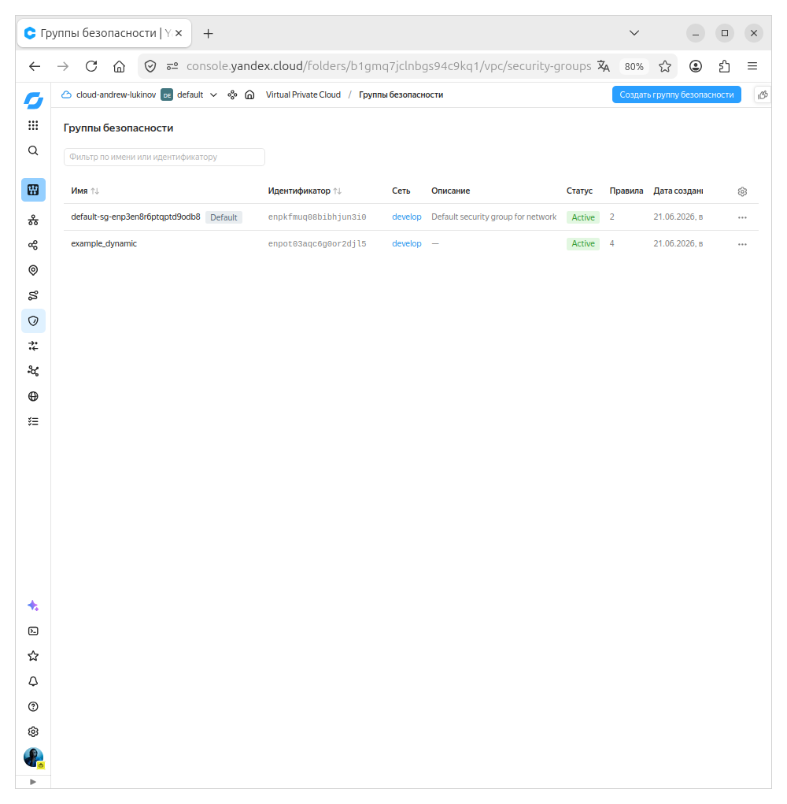

</details>

---

<details>
<summary><b>Задание 2</b></summary>

1. Создайте файл count-vm.tf. Опишите в нём создание двух **одинаковых** ВМ  web-1 и web-2 (не web-0 и web-1) с минимальными параметрами, используя мета-аргумент **count loop**. Назначьте ВМ созданную в первом задании группу безопасности.(как это сделать узнайте в документации провайдера yandex/compute_instance )
2. Создайте файл for_each-vm.tf. Опишите в нём создание двух ВМ для баз данных с именами "main" и "replica" **разных** по cpu/ram/disk_volume , используя мета-аргумент **for_each loop**. Используйте для обеих ВМ одну общую переменную типа:

    ```
    variable "each_vm" {
      type = list(object({  vm_name=string, cpu=number, ram=number, disk_volume=number }))
    }
    ```  

3. ВМ, описанные в файле count-vm.tf, должны создаваться после ВМ, описанных в файле for_each-vm.tf.
4. Используйте функцию file в local-переменной для считывания ключа ~/.ssh/id_rsa.pub и его последующего использования в блоке metadata, взятому из ДЗ 2.
5. Инициализируйте проект, выполните код.

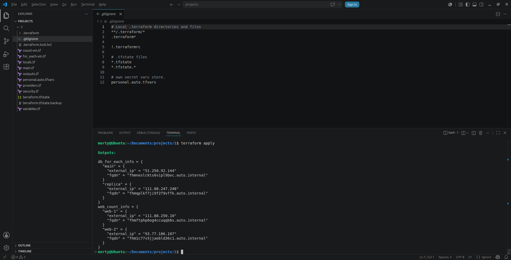

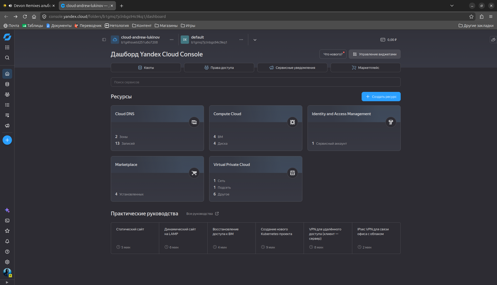

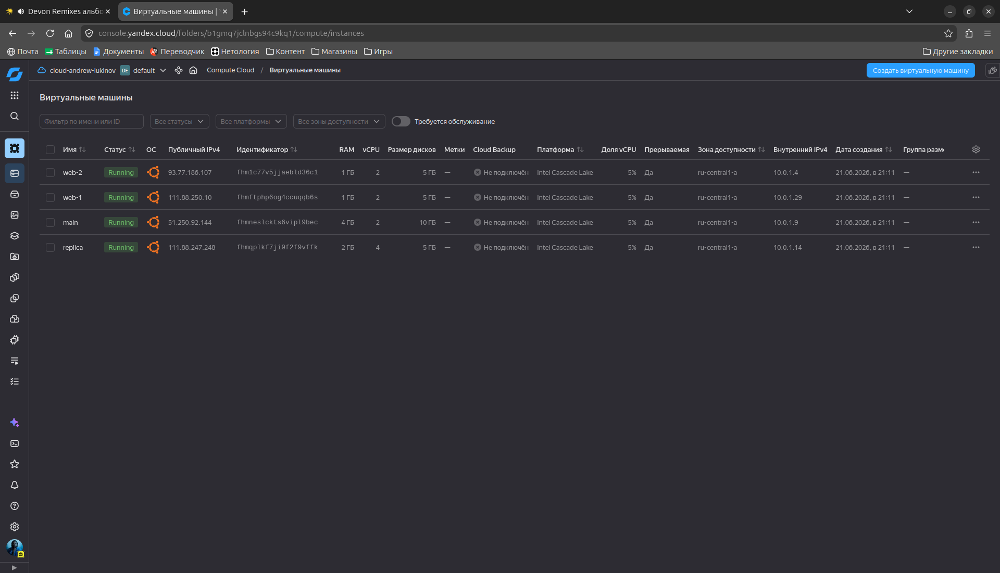

[Файлы с которыми запускал задание](./files/src_2/)

</details>

---

<details>
<summary><b>Задание 3</b></summary>

1. Создайте 3 одинаковых виртуальных диска размером 1 Гб с помощью ресурса yandex_compute_disk и мета-аргумента count в файле **disk_vm.tf** .
2. Создайте в том же файле **одиночную**(использовать count или for_each запрещено из-за задания №4) ВМ c именем "storage". Используйте блок **dynamic secondary_disk{..}** и мета-аргумент for_each для подключения созданных вами дополнительных дисков.

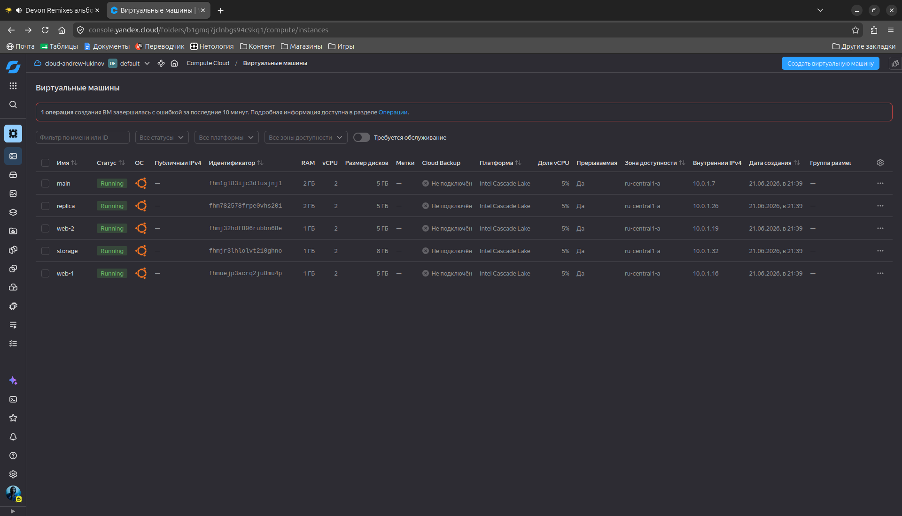

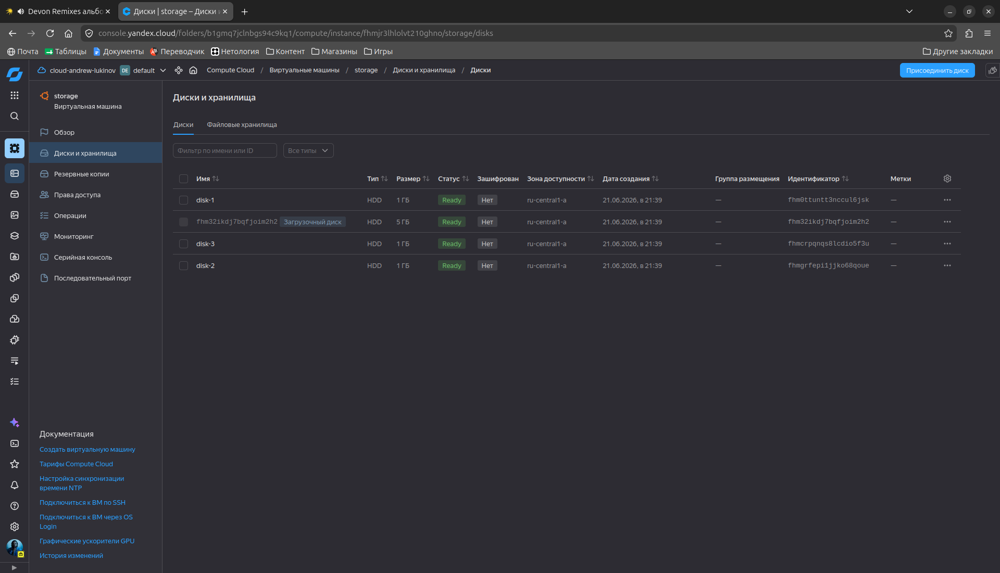

</details>

---

<details>
<summary><b>Задание 4</b></summary>

1. В файле ansible.tf создайте inventory-файл для ansible.
Используйте функцию tepmplatefile и файл-шаблон для создания ansible inventory-файла из лекции.
Готовый код возьмите из демонстрации к лекции [**demonstration2**](https://github.com/netology-code/ter-homeworks/tree/main/03/demo).
Передайте в него в качестве переменных группы виртуальных машин из задания 2.1, 2.2 и 3.2, т. е. 5 ВМ.
2. Инвентарь должен содержать 3 группы и быть динамическим, т. е. обработать как группу из 2-х ВМ, так и 999 ВМ.
3. Добавьте в инвентарь переменную  [**fqdn**](https://cloud.yandex.ru/docs/compute/concepts/network#hostname).
    ``` 
    [webservers]
    web-1 ansible_host=<внешний ip-адрес> fqdn=<полное доменное имя виртуальной машины>
    web-2 ansible_host=<внешний ip-адрес> fqdn=<полное доменное имя виртуальной машины>

    [databases]
    main ansible_host=<внешний ip-адрес> fqdn=<полное доменное имя виртуальной машины>
    replica ansible_host<внешний ip-адрес> fqdn=<полное доменное имя виртуальной машины>

    [storage]
    storage ansible_host=<внешний ip-адрес> fqdn=<полное доменное имя виртуальной машины>
    ```
    Пример fqdn: ```web1.ru-central1.internal```(в случае указания переменной hostname(не путать с переменной name)); ```fhm8k1oojmm5lie8i22a.auto.internal```(в случае отсутвия перменной hostname - автоматическая генерация имени,  зона изменяется на auto). нужную вам переменную найдите в документации провайдера или terraform console.
4. Выполните код. Приложите скриншот получившегося файла. 

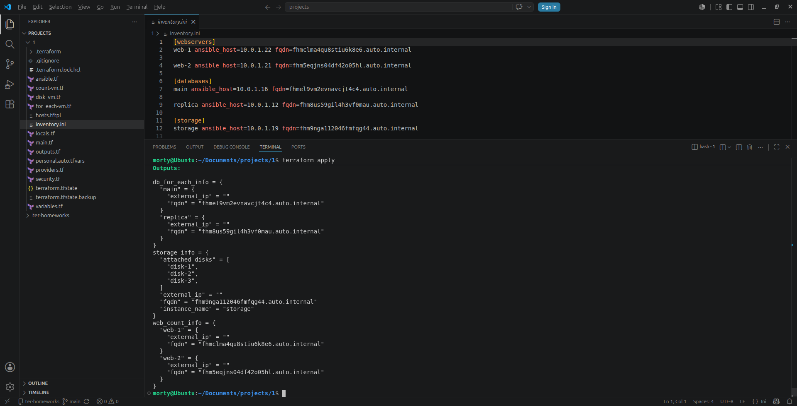

[Файлы с которыми запускал задание](./files/src_4/)

</details>

---

<details>
<summary><b>Задание 5*</b></summary>

1. Напишите output, который отобразит ВМ из ваших ресурсов count и for_each в виде списка словарей :
    ``` 
    [
    {
      "name" = 'имя ВМ1'
      "id"   = 'идентификатор ВМ1'
      "fqdn" = 'Внутренний FQDN ВМ1'
    },
    {
      "name" = 'имя ВМ2'
      "id"   = 'идентификатор ВМ2'
      "fqdn" = 'Внутренний FQDN ВМ2'
    },
    ....
    ...итд любое количество ВМ в ресурсе(те требуется итерация по ресурсам, а не хардкод) !!!!!!!!!!!!!!!!!!!!!
    ]
    ```
    Приложите скриншот вывода команды ```terrafrom output```.

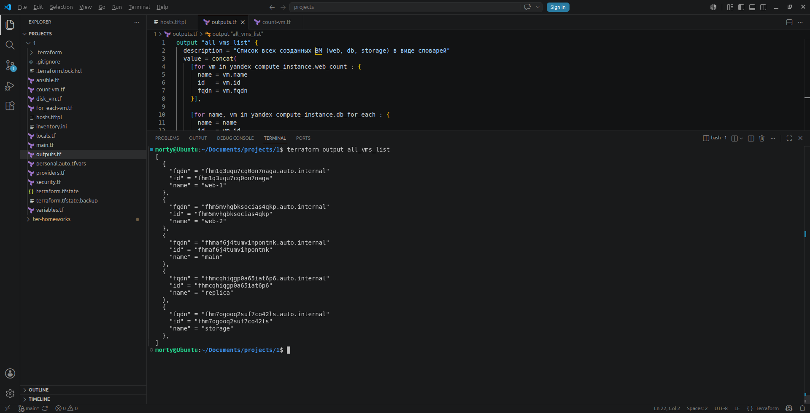

[Файлы с которыми запускал задание](./files/src_5/)

</details>

---

<details>
<summary><b>Задание 6*</b></summary>

1. Используя null_resource и local-exec, примените ansible-playbook к ВМ из ansible inventory-файла.
Готовый код возьмите из демонстрации к лекции [**demonstration2**](https://github.com/netology-code/ter-homeworks/tree/main/03/demo).
3. Модифицируйте файл-шаблон hosts.tftpl. Необходимо отредактировать переменную ```ansible_host="<внешний IP-address или внутренний IP-address если у ВМ отсутвует внешний адрес>```.

Для проверки работы уберите у ВМ внешние адреса(nat=false). Этот вариант используется при работе через bastion-сервер.
Для зачёта предоставьте код вместе с основной частью задания.

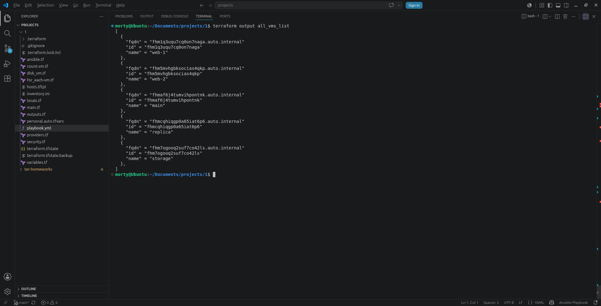

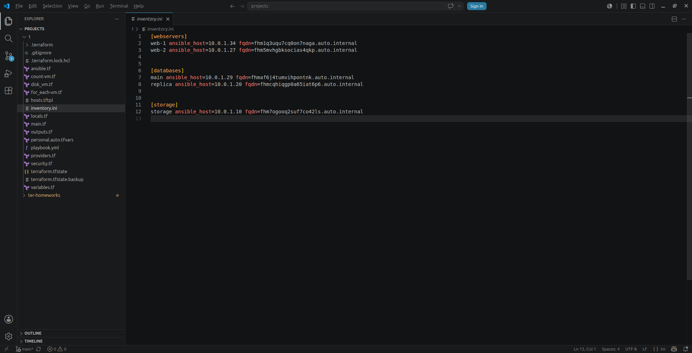

[Файлы с которыми запускал задание](./files/src_6/)

</details>

---

<details>
<summary><b>Задание 7*</b></summary>

Ваш код возвращает вам следущий набор данных: 
```
> local.vpc
{
  "network_id" = "enp7i560tb28nageq0cc"
  "subnet_ids" = [
    "e9b0le401619ngf4h68n",
    "e2lbar6u8b2ftd7f5hia",
    "b0ca48coorjjq93u36pl",
    "fl8ner8rjsio6rcpcf0h",
  ]
  "subnet_zones" = [
    "ru-central1-a",
    "ru-central1-b",
    "ru-central1-c",
    "ru-central1-d",
  ]
}
```
Предложите выражение в terraform console, которое удалит из данной переменной 3 элемент из: subnet_ids и subnet_zones.(значения могут быть любыми) Образец конечного результата:
```
> <некое выражение>
{
  "network_id" = "enp7i560tb28nageq0cc"
  "subnet_ids" = [
    "e9b0le401619ngf4h68n",
    "e2lbar6u8b2ftd7f5hia",
    "fl8ner8rjsio6rcpcf0h",
  ]
  "subnet_zones" = [
    "ru-central1-a",
    "ru-central1-b",
    "ru-central1-d",
  ]
}
```

  <details>
  <summary><b>Ответ</b></summary>

  ```bash
  {
    network_id   = local.vpc.network_id
    subnet_ids   = concat(slice(local.vpc.subnet_ids, 0, 2), slice(local.vpc.subnet_ids, 3, length(local.vpc.subnet_ids)))
    subnet_zones = concat(slice(local.vpc.subnet_zones, 0, 2), slice(local.vpc.subnet_zones, 3, length(local.vpc.subnet_zones)))
  }
  ```
  </details>

</details>

---

<details>
<summary><b>Задание 8*</b></summary>

Идентифицируйте и устраните намеренно допущенную в tpl-шаблоне ошибку. Обратите внимание, что terraform сам сообщит на какой строке и в какой позиции ошибка!
```
[webservers]
%{~ for i in webservers ~}
${i["name"]} ansible_host=${i["network_interface"][0]["nat_ip_address"] platform_id=${i["platform_id "]}}
%{~ endfor ~}
```
  <details>
  <summary><b>Ответ</b></summary>

  ```bash
  [webservers]
  %{~ for i in webservers ~}
  ${i["name"]} ansible_host=${i["network_interface"][0]["nat_ip_address"]} platform_id=${i["platform_id"]}
  %{~ endfor ~}
  ```
  - После nat_ip_address добавлена закрывающая `}`
  - Убран пробел внутри "platform_id"

  </details>

</details>

---

<details>
<summary><b>Задание 9*</b></summary>

Напишите  terraform выражения, которые сформируют списки:
1. ["rc01","rc02","rc03","rc04",rc05","rc06",rc07","rc08","rc09","rc10....."rc99"] те список от "rc01" до "rc99"
2. ["rc01","rc02","rc03","rc04",rc05","rc06","rc11","rc12","rc13","rc14",rc15","rc16","rc19"....."rc96"] те список от "rc01" до "rc96", пропуская все номера, заканчивающиеся на "0","7", "8", "9", за исключением "rc19"

  <details>
  <summary><b>Ответ</b></summary>

  1. [for n in range(1, 100) : format("rc%02d", n)]

  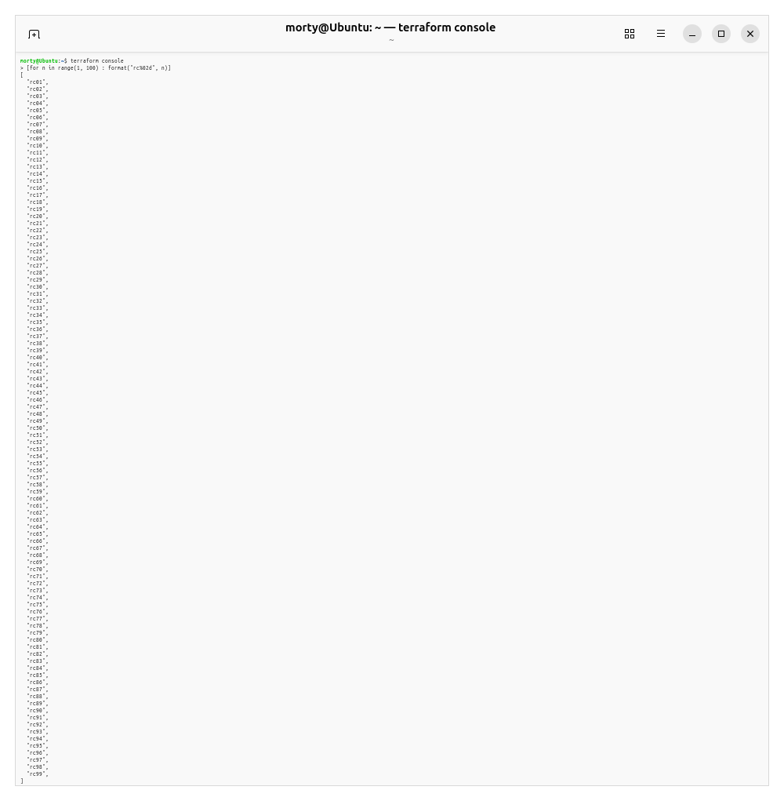

  2. [for n in range(1, 97) : format("rc%02d", n) if (n % 10 != 0 && n % 10 != 7 && n % 10 != 8 && n % 10 != 9) || n == 19]

  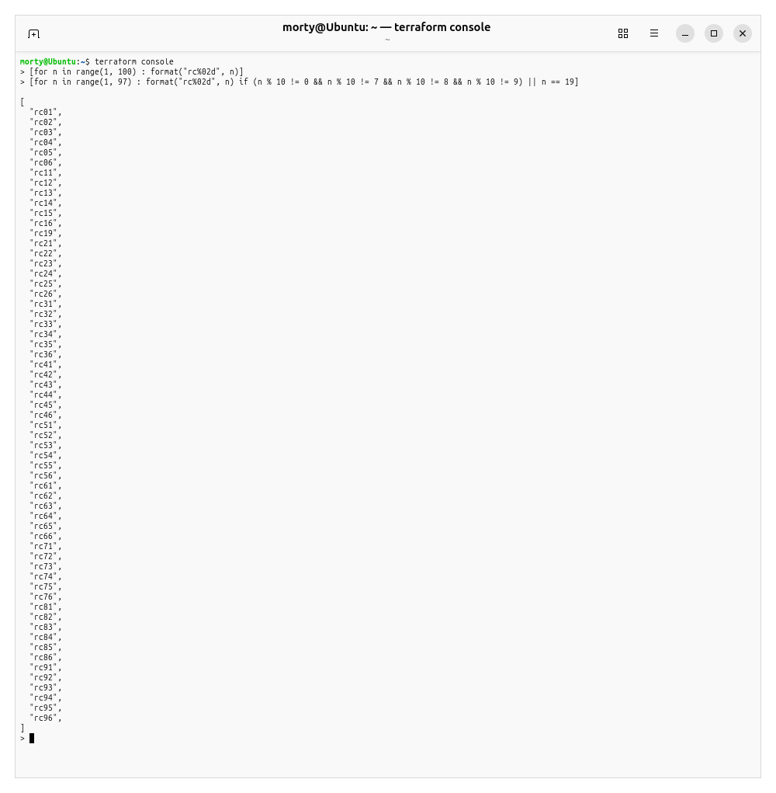

  </details>

</details>