# Домашнее задание к занятию «Продвинутые методы работы с Terraform» - Лукинов Андрей

<details>
<summary><b>Задание 1</b></summary>

1. Возьмите из [**демонстрации к лекции готовый код**](https://github.com/netology-code/ter-homeworks/tree/main/04/demonstration1) для создания с помощью двух вызовов remote-модуля -> двух ВМ, относящихся к разным проектам (marketing и analytics) используйте labels для обозначения принадлежности.  В файле cloud-init.yml необходимо использовать переменную для ssh-ключа вместо хардкода. Передайте ssh-ключ в функцию template_file в блоке vars ={}. Воспользуйтесь [**примером**](https://grantorchard.com/dynamic-cloudinit-content-with-terraform-file-templates/). Обратите внимание, что ssh-authorized-keys принимает в себя список, а не строку.
2. Добавьте в файл cloud-init.yml установку nginx.
3. Предоставьте скриншот подключения к консоли и вывод команды ```sudo nginx -t```, скриншот консоли ВМ yandex cloud с их метками. Откройте terraform console и предоставьте скриншот содержимого модуля. Пример: > module.marketing_vm

<details>
<summary><b>Ответ</b></summary>

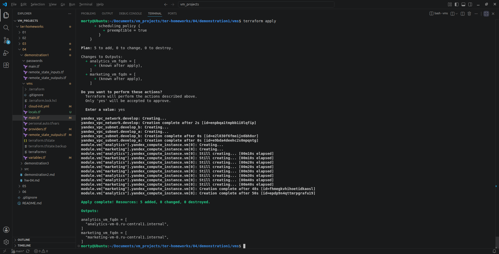

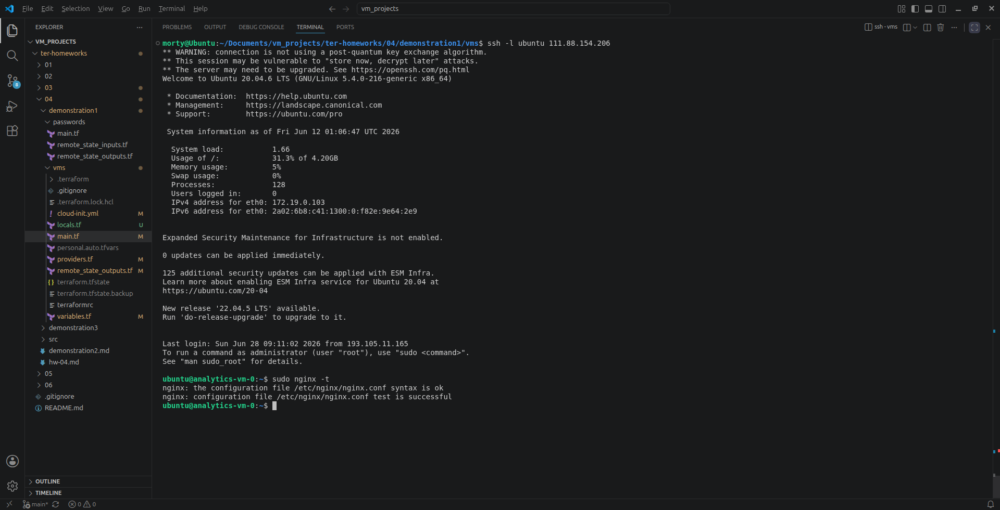

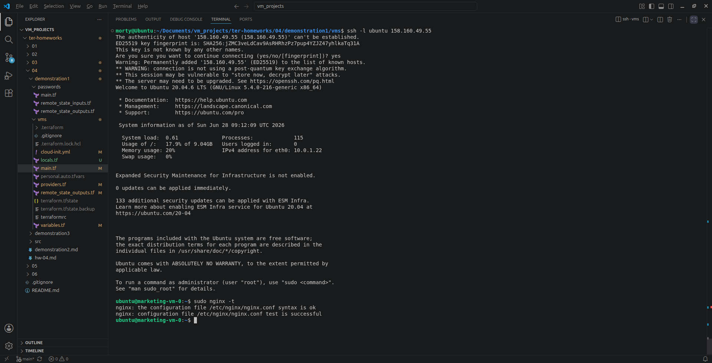

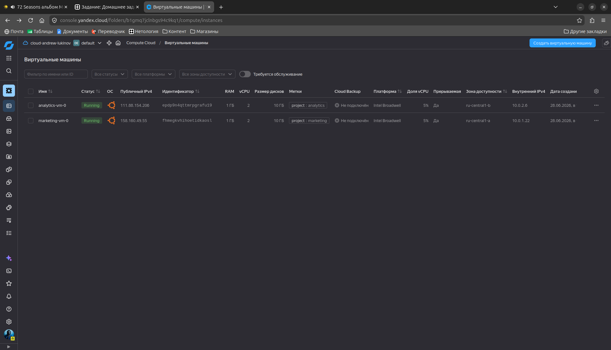

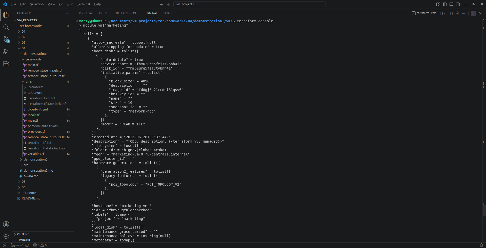

[Файлы с которыми запускал задание](./files/src_1/)

</details>

</details>

---

<details>
<summary><b>Задание 2</b></summary>

1. Напишите локальный модуль vpc, который будет создавать 2 ресурса: **одну** сеть и **одну** подсеть в зоне, объявленной при вызове модуля, например: ```ru-central1-a```.
2. Вы должны передать в модуль переменные с названием сети, zone и v4_cidr_blocks.
3. Модуль должен возвращать в root module с помощью output информацию о yandex_vpc_subnet. Пришлите скриншот информации из terraform console о своем модуле. Пример: > module.vpc_dev  
4. Замените ресурсы yandex_vpc_network и yandex_vpc_subnet созданным модулем. Не забудьте передать необходимые параметры сети из модуля vpc в модуль с виртуальной машиной.
5. Сгенерируйте документацию к модулю с помощью terraform-docs.
 
    Пример вызова

    ```
    module "vpc_dev" {
    source       = "./vpc"
    env_name     = "develop"
    zone = "ru-central1-a"
    cidr = "10.0.1.0/24"
    }
    ```

<details>
<summary><b>Ответ</b></summary>

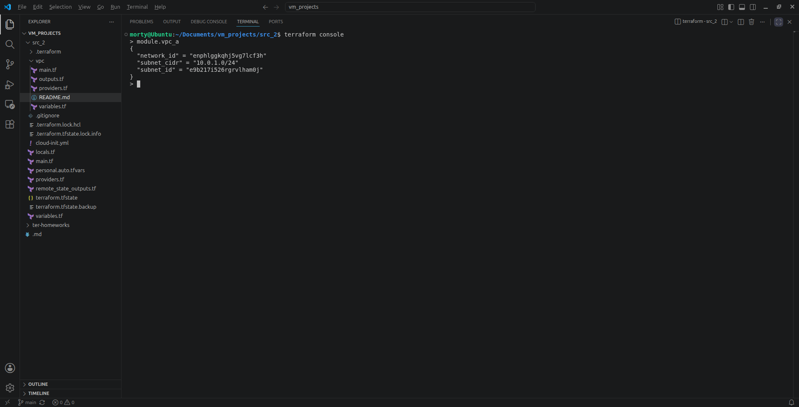

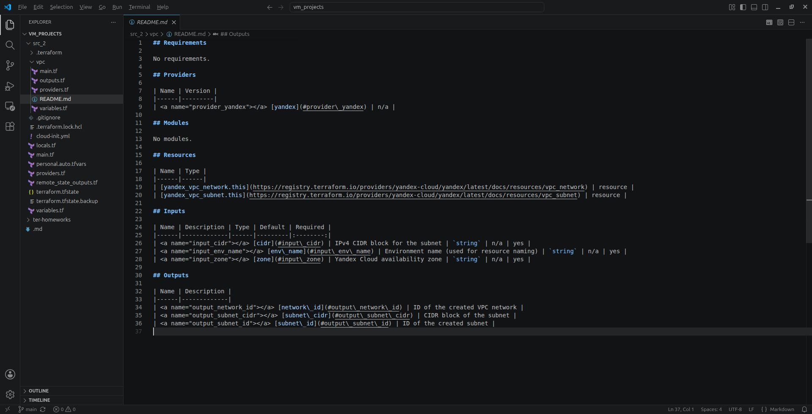

[Файлы с которыми запускал задание](./files/src_2/)

</details>

</details>

---

<details>
<summary><b>Задание 3</b></summary>

1. Выведите список ресурсов в стейте.
2. Полностью удалите из стейта модуль vpc.
3. Полностью удалите из стейта модуль vm.
4. Импортируйте всё обратно. Проверьте terraform plan. Значимых(!!) изменений быть не должно.
Приложите список выполненных команд и скриншоты процессы.

<details>
<summary><b>Ответ</b></summary>

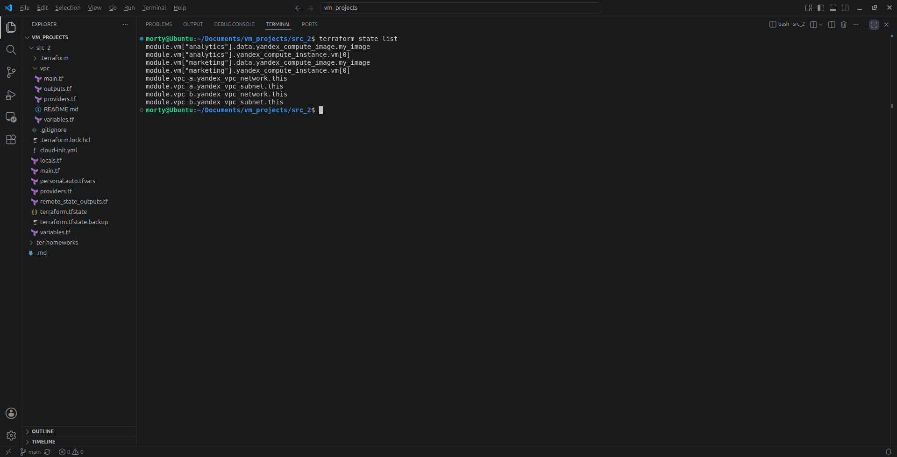

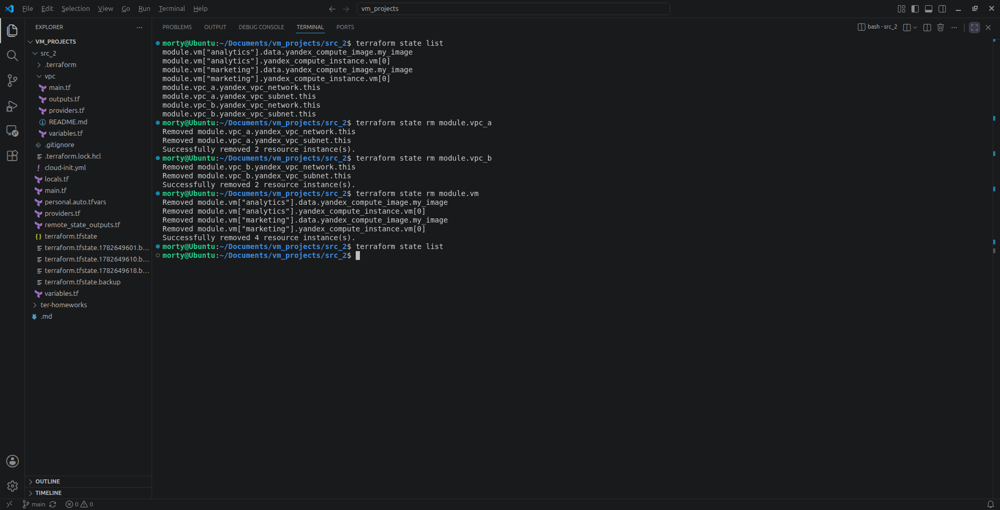

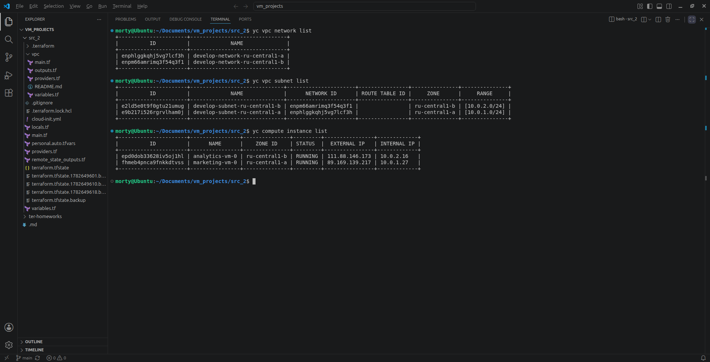

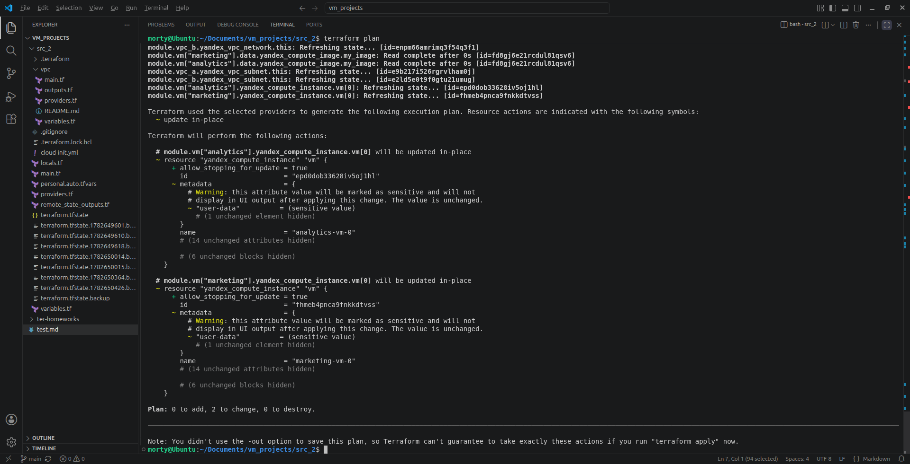

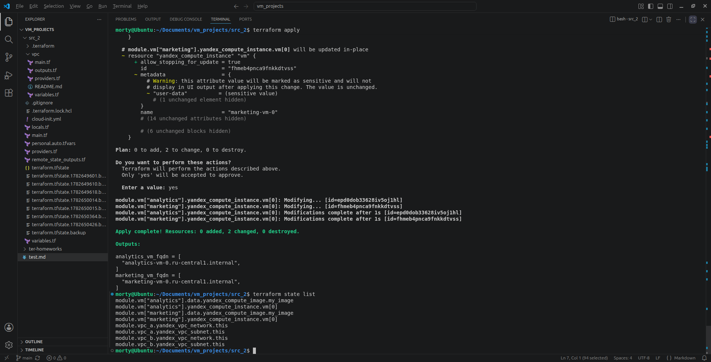

</details>

</details>

---

<details>
<summary><b>Задание 4*</b></summary>

Измените модуль vpc так, чтобы он мог создать подсети во всех зонах доступности, переданных в переменной типа list(object) при вызове модуля.  
  
Пример вызова
```
module "vpc_prod" {
source       = "./vpc"
env_name     = "production"
subnets = [
    { zone = "ru-central1-a", cidr = "10.0.1.0/24" },
    { zone = "ru-central1-b", cidr = "10.0.2.0/24" },
    { zone = "ru-central1-c", cidr = "10.0.3.0/24" },
]
}

module "vpc_dev" {
source       = "./vpc"
env_name     = "develop"
subnets = [
    { zone = "ru-central1-a", cidr = "10.0.1.0/24" },
]
}
```

Предоставьте код, план выполнения, результат из консоли YC.

<details>
<summary><b>Ответ</b></summary>

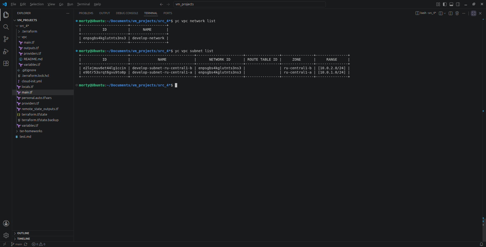

[Файлы с которыми запускал задание](./files/src_4*/)

</details>

</details>

---

<details>
<summary><b>Задание 5*</b></summary>

1. Напишите модуль для создания кластера managed БД Mysql в Yandex Cloud с одним или несколькими(2 по умолчанию) хостами в зависимости от переменной HA=true или HA=false. Используйте ресурс yandex_mdb_mysql_cluster: передайте имя кластера и id сети.
2. Напишите модуль для создания базы данных и пользователя в уже существующем кластере managed БД Mysql. Используйте ресурсы yandex_mdb_mysql_database и yandex_mdb_mysql_user: передайте имя базы данных, имя пользователя и id кластера при вызове модуля.
3. Используя оба модуля, создайте кластер example из одного хоста, а затем добавьте в него БД test и пользователя app. Затем измените переменную и превратите сингл хост в кластер из 2-х серверов.
4. Предоставьте план выполнения и по возможности результат. Сразу же удаляйте созданные ресурсы, так как кластер может стоить очень дорого. Используйте минимальную конфигурацию.

<details>
<summary><b>Ответ</b></summary>

Создание с HA=false

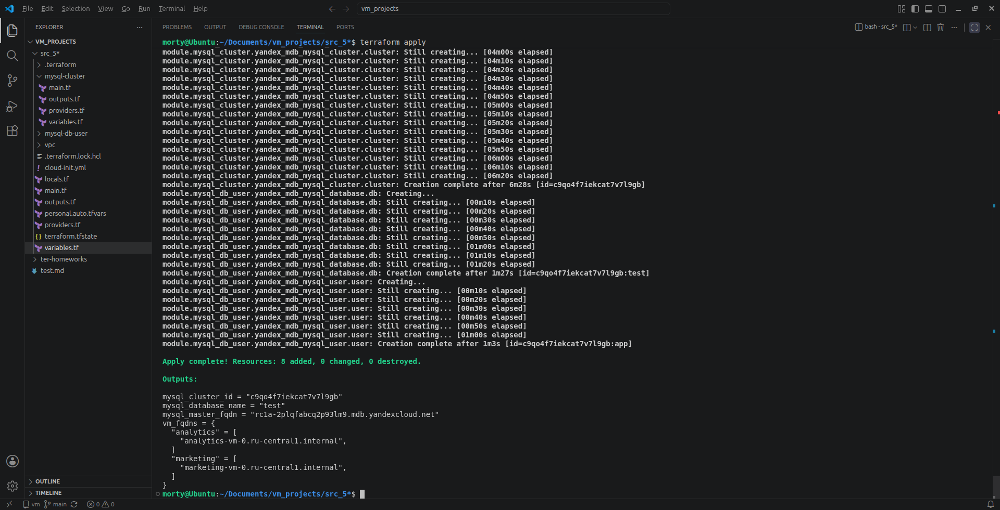

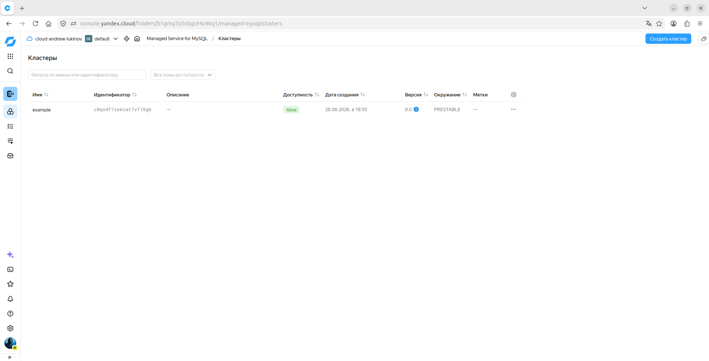

Создание с HA=true

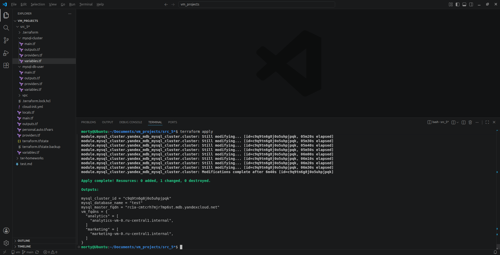

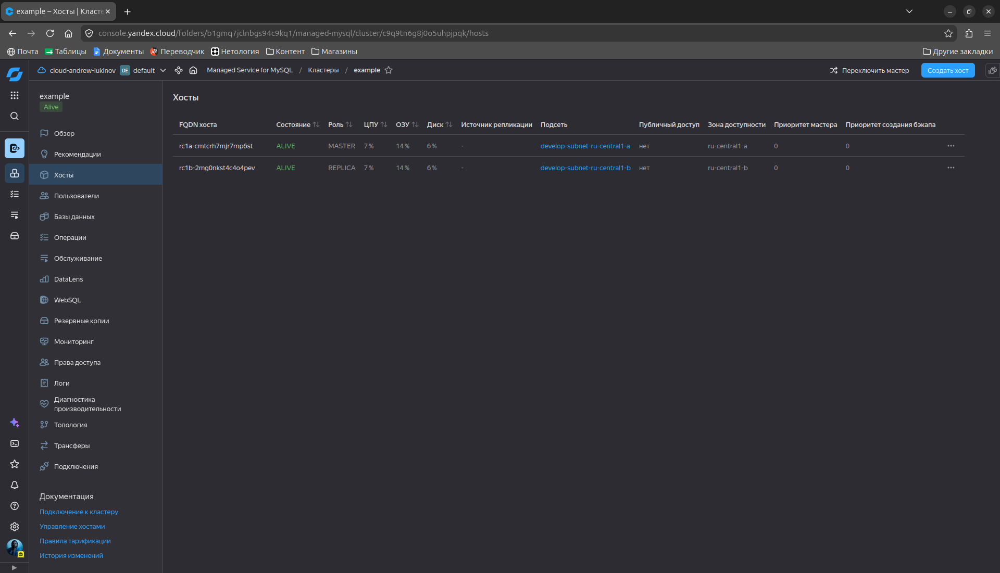

[Файлы с которыми запускал задание](./files/src_5*/)

</details>

</details>

---

<details>
<summary><b>Задание 6*</b></summary>

1. Используя готовый yandex cloud terraform module и пример его вызова(examples/simple-bucket): https://github.com/terraform-yc-modules/terraform-yc-s3 . Создайте и не удаляйте для себя s3 бакет размером 1 ГБ(это бесплатно), он пригодится вам в ДЗ к 5 лекции.

<details>
<summary><b>Ответ</b></summary>

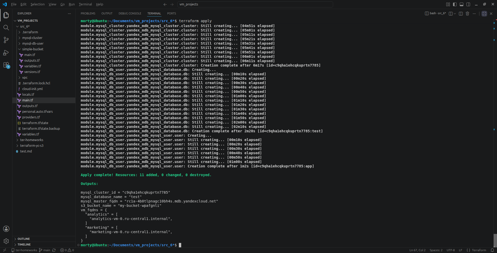

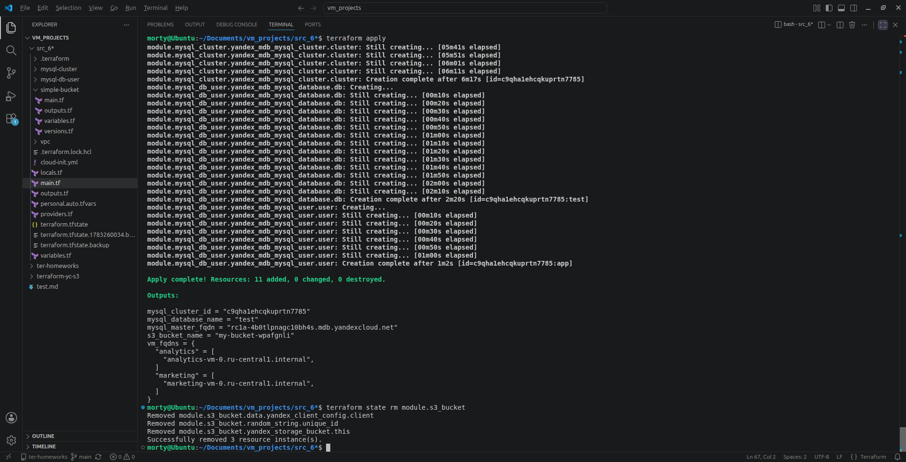

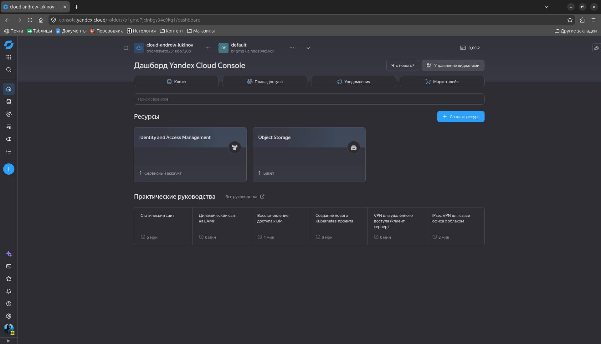

[Файлы с которыми запускал задание](./files/src_6*/)

</details>

</details>

---

<details>
<summary><b>Задание 7*</b></summary>

1. Разверните у себя локально vault, используя docker-compose.yml в проекте.
2. Для входа в web-интерфейс и авторизации terraform в vault используйте токен "education".
3. Создайте новый секрет по пути http://127.0.0.1:8200/ui/vault/secrets/secret/create
    Path: example  
    secret data key: test 
    secret data value: congrats!  
4. Считайте этот секрет с помощью terraform и выведите его в output по примеру:
    ```
    provider "vault" {
    address = "http://<IP_ADDRESS>:<PORT_NUMBER>"
    skip_tls_verify = true
    token = "education"
    }
    data "vault_generic_secret" "vault_example"{
    path = "secret/example"
    }

    output "vault_example" {
    value = "${nonsensitive(data.vault_generic_secret.vault_example.data)}"
    } 

    Можно обратиться не к словарю, а конкретному ключу:
    terraform console: >nonsensitive(data.vault_generic_secret.vault_example.data.<имя ключа в секрете>)
    ```
5. Попробуйте самостоятельно разобраться в документации и записать новый секрет в vault с помощью terraform.

<details>
<summary><b>Ответ</b></summary>

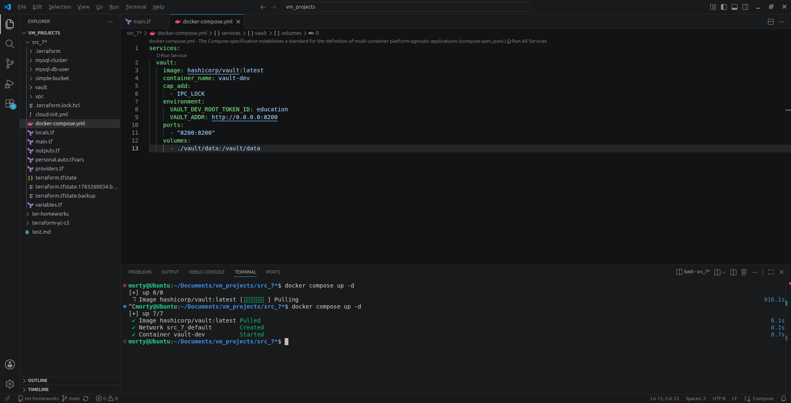

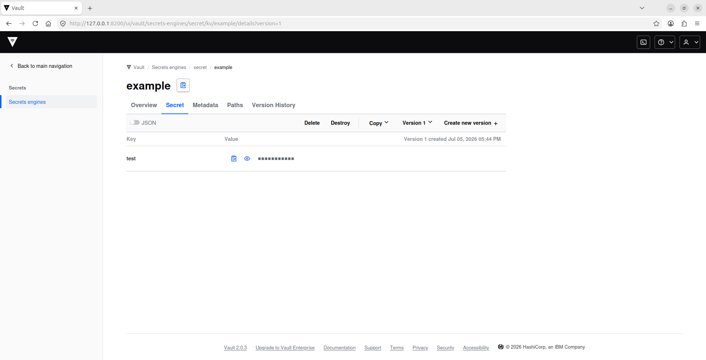

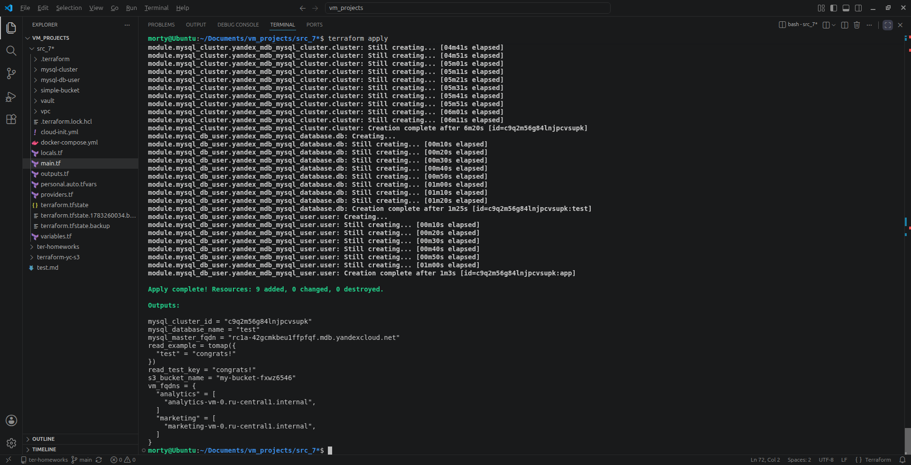

[Файлы с которыми запускал задание](./files/src_7*/)

</details>

</details>

---

<details>
<summary><b>Задание 8*</b></summary>

Попробуйте самостоятельно разобраться в документаци и с помощью terraform remote state разделить root модуль на два отдельных root-модуля: создание VPC , создание ВМ.

<details>
<summary><b>Ответ</b></summary>

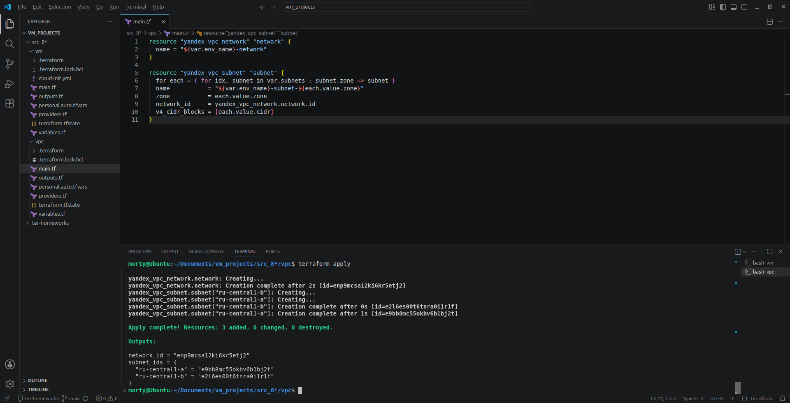

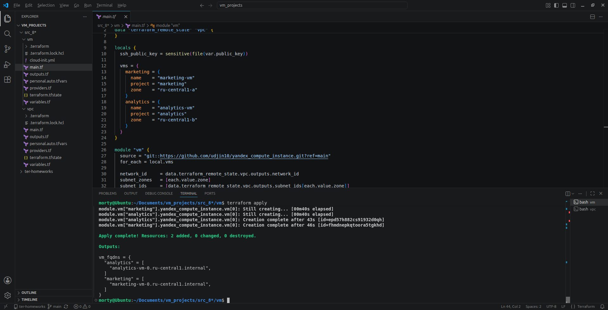

[Файлы с которыми запускал задание](./files/src_8*/)

</details>

</details>