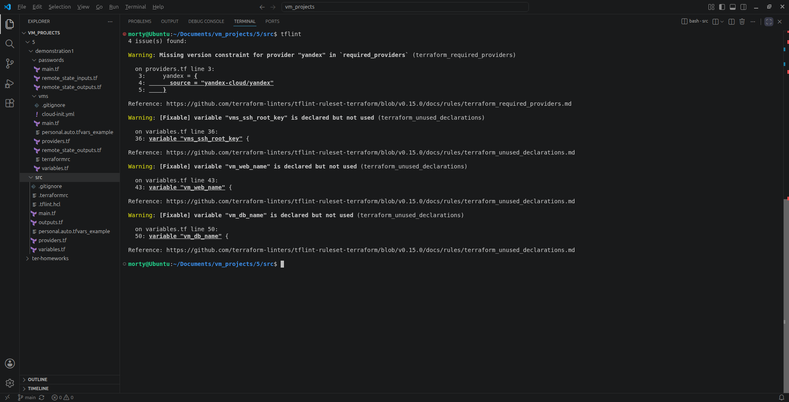
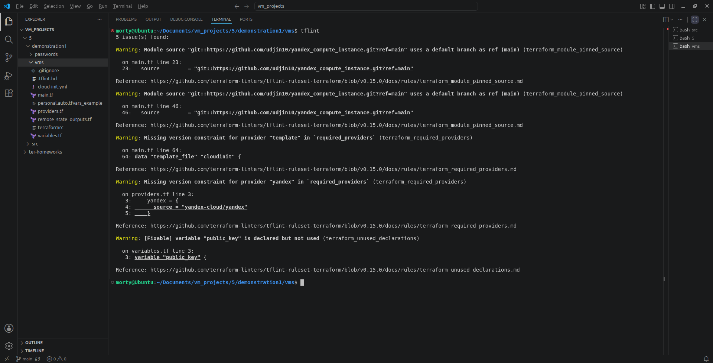
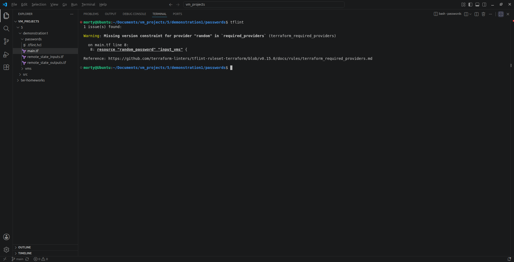
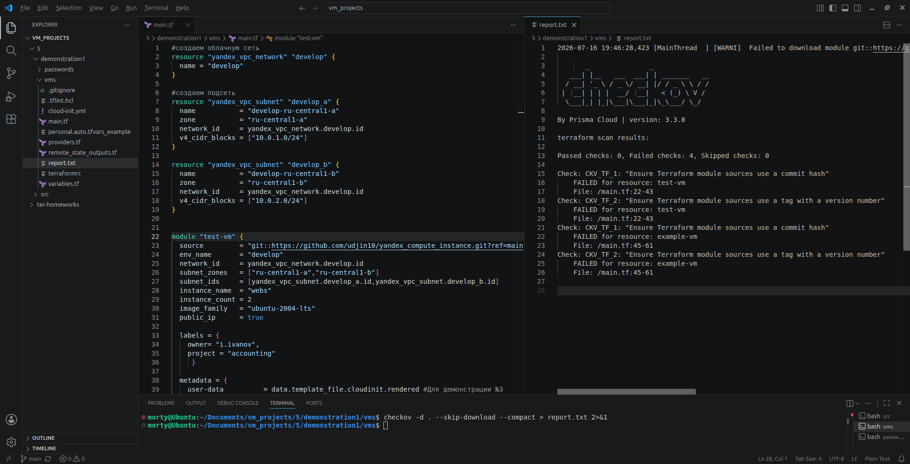
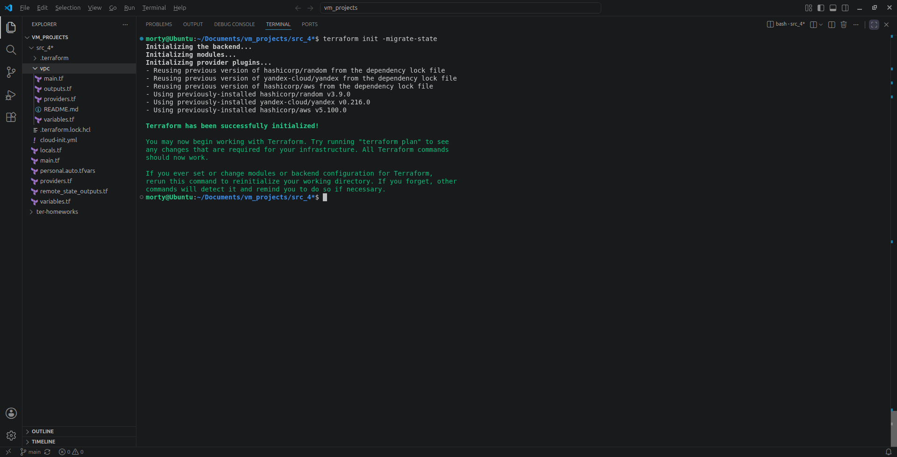
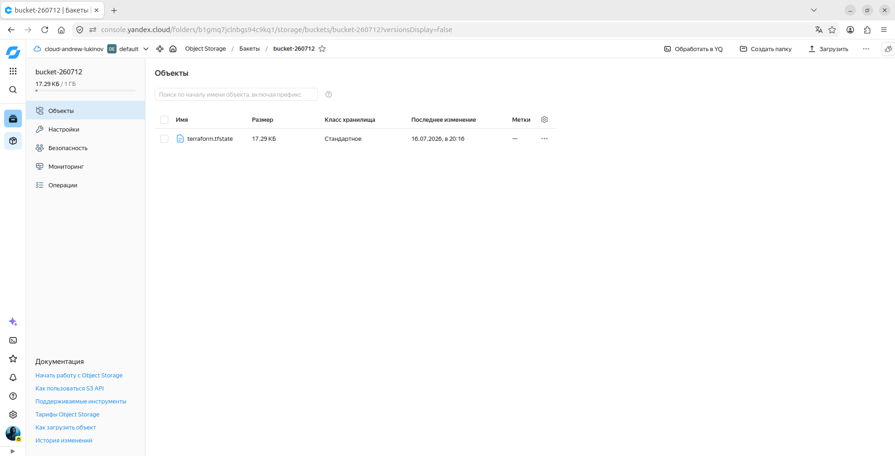
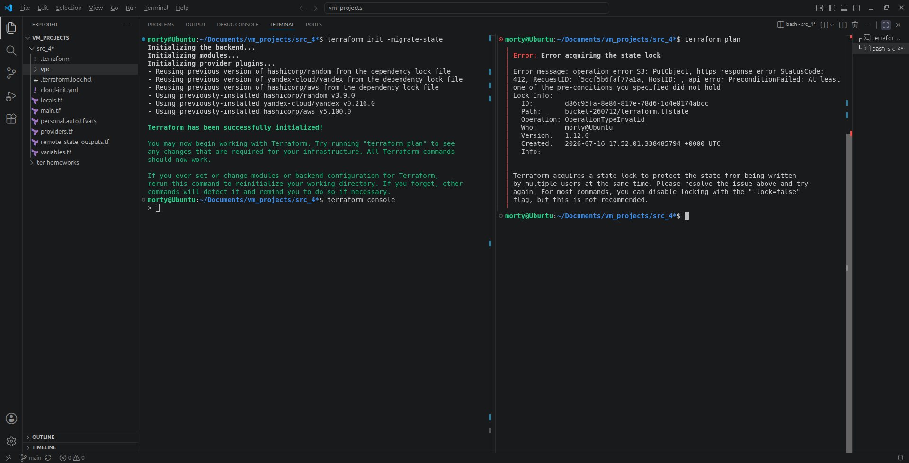
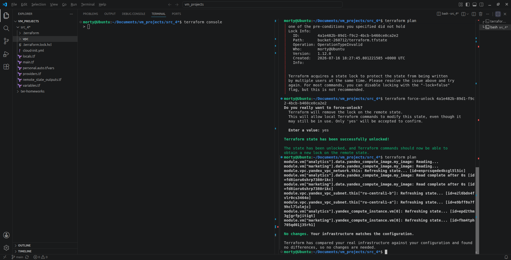

# Домашнее задание к занятию «Использование Terraform в команде» - Лукинов Андрей

<details>
<summary><b>Задание 1</b></summary>

1. Возьмите код:
   - из [ДЗ к лекции 4](https://github.com/netology-code/ter-homeworks/tree/main/04/src),
   - из [демо к лекции 4](https://github.com/netology-code/ter-homeworks/tree/main/04/demonstration1).
2. Проверьте код с помощью tflint и checkov. Вам не нужно инициализировать этот проект.
3. Перечислите, какие **типы** ошибок обнаружены в проекте (без дублей).

<details>
<summary><b>Ответ</b></summary>

Через tflint папка /src:

- Пропущена версия провайдера.
- Переменная "vms_ssh_root_key" объявлена, но не используется.
- Переменная "vm_web_name" объявлена, но не используется.
- Переменная "vm_db_name" объявлена, но не используется.



Через tflint папка /demonstration1/vms:

- Переменная "public_key" объявлена, но не используется.
- Остальные ошибки вроде бы не критичные, либо повторяются.



Через tflint папка /demonstration1/passwords:

- Пропущена версия провайдера.



Через checkov замечания нашлись только по пути demonstration1/vms:

- Требование, чтобы в модулях test-vm и example-vm был указан коммит-хеш.
- Требование, чтобы в модуле test-vm и example-vm был указан тег с версией.



</details>
</details>

---

<details>
<summary><b>Задание 2</b></summary>

1. Возьмите ваш GitHub-репозиторий с **выполненным ДЗ 4** в ветке 'terraform-04' и сделайте из него ветку 'terraform-05'.
2. Настройте remote state с встроенными блокировками:
   - Создайте S3 bucket в Yandex Cloud для хранения state (если еще не создан)
   - Создайте service account с правами на чтение/запись в bucket
   - Настройте backend в providers.tf с использованием нового механизма блокировок:
     ```hcl
     terraform {
       required_version = "~>1.12.0"
       
       backend "s3" {
         bucket  = "ваш-bucket-name"
         key     = "terraform.tfstate"
         region  = "ru-central1"
         
         # Встроенный механизм блокировок (Terraform >= 1.6)
         # Не требует отдельной базы данных!
         use_lockfile = true
         
         endpoints = {
           s3 = "https://storage.yandexcloud.net"
         }
         
         skip_region_validation      = true
         skip_credentials_validation = true
         skip_requesting_account_id  = true
         skip_s3_checksum            = true
       }
     }
     ```
   - Выполните `terraform init -migrate-state` для миграции state в S3
   - Предоставьте скриншоты процесса настройки и миграции
3. Закоммитьте в ветку 'terraform-05' все изменения.
4. Откройте в проекте terraform console, а в другом окне из этой же директории попробуйте запустить terraform apply.
5. Пришлите ответ об ошибке доступа к state (блокировка должна сработать автоматически).
6. Принудительно разблокируйте state командой `terraform force-unlock <LOCK_ID>`. Пришлите команду и вывод.

**Примечание:** В Terraform >= 1.6 появился встроенный механизм блокировок через `use_lockfile = true`. 
Это упрощает настройку - больше не нужно создавать отдельную базу данных (YDB в режиме DynamoDB) для хранения блокировок.
Lock-файл создается автоматически в том же S3 bucket рядом с state-файлом с именем `<key>.lock.info`.

<details>
<summary><b>Ответ</b></summary>









</details>
</details>

---
  
<details>
<summary><b>Задание 3</b></summary>

1. Сделайте в GitHub из ветки 'terraform-05' новую ветку 'terraform-hotfix'.
2. Проверье код с помощью tflint и checkov, исправьте все предупреждения и ошибки в 'terraform-hotfix', сделайте коммит.
3. Откройте новый pull request 'terraform-hotfix' --> 'terraform-05'. 
4. Вставьте в комментарий PR результат анализа tflint и checkov, план изменений инфраструктуры из вывода команды terraform plan.
5. Пришлите ссылку на PR для ревью. Вливать код в 'terraform-05' не нужно.

<details>
<summary><b>Ответ</b></summary>


</details>
</details>

---

<details>
<summary><b>Задание 4</b></summary>

1. Напишите переменные с валидацией и протестируйте их, заполнив default верными и неверными значениями. Предоставьте скриншоты проверок из terraform console. 

- type=string, description="ip-адрес" — проверка, что значение переменной содержит верный IP-адрес с помощью функций cidrhost() или regex(). Тесты:  "192.168.0.1" и "1920.1680.0.1";
- type=list(string), description="список ip-адресов" — проверка, что все адреса верны. Тесты:  ["192.168.0.1", "1.1.1.1", "127.0.0.1"] и ["192.168.0.1", "1.1.1.1", "1270.0.0.1"].

<details>
<summary><b>Ответ</b></summary>


</details>
</details>

---

<details>
<summary><b>Задание 5*</b></summary>

1. Напишите переменные с валидацией:
- type=string, description="любая строка" — проверка, что строка не содержит символов верхнего регистра;
- type=object — проверка, что одно из значений равно true, а второе false, т. е. не допускается false false и true true:
```
variable "in_the_end_there_can_be_only_one" {
    description="Who is better Connor or Duncan?"
    type = object({
        Dunkan = optional(bool)
        Connor = optional(bool)
    })

    default = {
        Dunkan = true
        Connor = false
    }

    validation {
        error_message = "There can be only one MacLeod"
        condition = <проверка>
    }
}
```

<details>
<summary><b>Ответ</b></summary>


</details>
</details>

---

<details>
<summary><b>Задание 6*</b></summary>

1. Настройте любую известную вам CI/CD-систему. Если вы ещё не знакомы с CI/CD-системами, настоятельно рекомендуем вернуться к этому заданию после изучения Jenkins/Teamcity/Gitlab.
2. Скачайте с её помощью ваш репозиторий с кодом и инициализируйте инфраструктуру.
3. Уничтожьте инфраструктуру тем же способом.

<details>
<summary><b>Ответ</b></summary>


</details>
</details>

---

<details>
<summary><b>Задание 7*</b></summary>

1. Настройте отдельный terraform root модуль, который будет создавать инфраструктуру для remote state:
   - S3 bucket для tfstate с версионированием
   - Сервисный аккаунт с необходимыми правами (storage.editor)
   - Static access key для сервисного аккаунта
2. Output должен содержать:
   - Имя bucket
   - Access key ID и Secret key (sensitive)
   - Пример конфигурации backend для использования
3. После создания инфраструктуры используйте outputs для настройки backend в основном проекте.

**Примечание:** Так как используется `use_lockfile = true`, создавать YDB/DynamoDB больше не требуется.
Блокировки реализованы встроенным механизмом Terraform и хранятся в том же S3 bucket. 

<details>
<summary><b>Ответ</b></summary>


</details>
</details>

---

<details>
<summary><b>Задание</b></summary>


<details>
<summary><b>Ответ</b></summary>


</details>
</details>