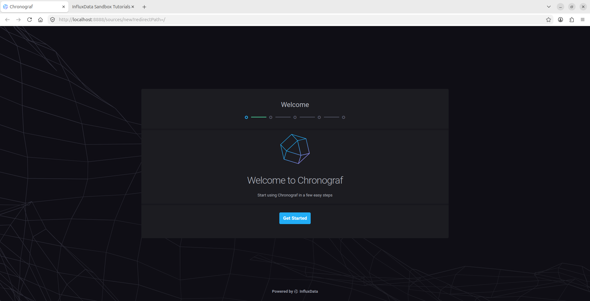
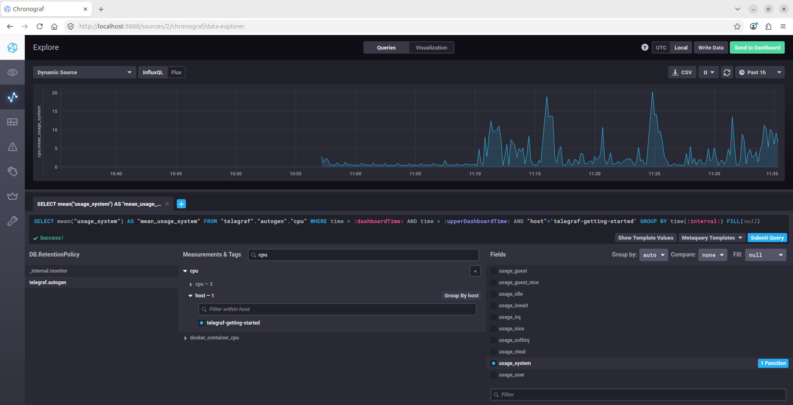
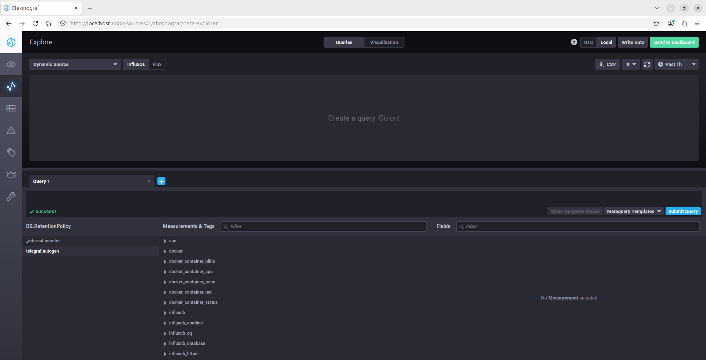

# Домашнее задание к занятию "Системы мониторинга" - Лукинов Андрей

<details>
<summary><b>Задания и ответы</b></summary>

<details>
<summary><b>Обязательные задания</b></summary>

1. Вас пригласили настроить мониторинг на проект. На онбординге вам рассказали, что проект представляет из себя платформу для вычислений с выдачей текстовых отчетов, которые сохраняются на диск. Взаимодействие с платформой осуществляется по протоколу http. Также вам отметили, что вычисления загружают ЦПУ. Какой минимальный набор метрик вы выведите в мониторинг и почему?

    - HTTP -> RPS, количество запросов по кодам ответа, latency p50/p95/p99 -> понять нагрузку, ошибки и скорость ответа
    - CPU -> CPU utilization, load average, run queue, throttling -> вычисления грузят CPU, а это главный ресурс
    - Память -> used/available, swap usage -> вычисления могут потреблять много RAM
    - Диск -> free space, free inodes, write IOPS, write latency, ошибки записи -> отчёты сохраняются на диск, можно забить место/inodes
    - Сервис -> up/down, restart count -> базовая доступность
    - Бизнес -> отчётов создано/упало, время генерации отчёта, очередь -> понимать, выполняем ли мы работу для клиента

2. Менеджер продукта посмотрев на ваши метрики сказал, что ему непонятно что такое RAM/inodes/CPUla. Также он сказал, что хочет понимать, насколько мы выполняем свои обязанности перед клиентами и какое качество обслуживания. Что вы можете ему предложить?

    - Предложить дашборд «Качество обслуживания»:
        - Доступность - % успешных запросов.
        - Успешность - % отчётов, сгенерированных без ошибок.
        - Скорость - p95/p99 времени ответа и времени генерации отчёта.
        - Пропускная способность - сколько отчётов в час/день мы обрабатываем.
        - Очередь - сколько задач ждёт обработки.
        - Нарушения SLA - сколько раз и на сколько мы вышли за обязательства.
        - Error budget - сколько ошибок ещё можно допустить до нарушения SLA.
        - Инциденты - количество, MTTR, влияние на клиентов.

3. Вашей DevOps команде в этом году не выделили финансирование на построение системы сбора логов. Разработчики в свою очередь хотят видеть все ошибки, которые выдают их приложения. Какое решение вы можете предпринять в этой ситуации, чтобы разработчики получали ошибки приложения?

    - Приложения пишут структурированные логи в stdout/stderr.
    - Docker/Systemd уже собирает их:
        - docker logs <container>;
        - journalctl -u <service>.
    - Настроить logrotate, чтобы не забить диск.
    - Для ошибок использовать бесплатный self-hosted Sentry или Loki + Promtail + Grafana на существующем железе.
    - Собирать не все логи, а только ERROR/WARN, с request_id, стектрейсом и контекстом.
    - Настроить алерты в Telegram/Slack/email по ошибкам через Prometheus Alertmanager, Sentry или простой webhook.
    - Разработчикам дать доступ к docker logs/journalctl и к Sentry/Loki.

4. Вы, как опытный SRE, сделали мониторинг, куда вывели отображения выполнения SLA=99% по http кодам ответов. Вычисляете этот параметр по следующей формуле: summ_2xx_requests/summ_all_requests. Данный параметр не поднимается выше 70%, но при этом в вашей системе нет кодов ответа 5xx и 4xx. Где у вас ошибка?

    - Ошибка: в знаменателе учитываются все запросы, а в числителе - только 2xx. Если 4xx/5xx нет, значит остальные 30% - это, скорее всего, 3xx (редиректы, например HTTP -> HTTPS) или 1xx.
    - Также стоит исключить из SLA служебные запросы: healthcheck, метрики, внутренние вызовы.

5. Опишите основные плюсы и минусы pull и push систем мониторинга.

    - Pull:
        - Плюсы: централизованная конфигурация; легко понять, что target down; не нужно открывать порты наружу; удобно отлаживать через curl; меньше риск перегрузки сервера
        - Минусы: плохо работает через NAT/firewall; сложно для короткоживущих job; target должен отдавать endpoint; нужно service discovery

    - Push:
        - Плюсы: работает через NAT/firewall; удобно для batch/короткоживущих задач; не нужно открывать endpoint; легко отправлять из любого места	
        - Минусы: сложнее отличить «сервис упал» от «нет данных»; нужна авторизация; возможна перегрузка приёмника; конфигурация размазана по агентам

6. Какие из ниже перечисленных систем относятся к push модели, а какие к pull? А может есть гибридные?

    - Prometheus - Pull. Для batch есть Pushgateway — гибридный сценарий
    - TICK - Push. Telegraf отправляет метрики в InfluxDB
    - Zabbix - Гибрид: passive checks — pull, active checks и trapper — push
    - VictoriaMetrics - Гибрид: умеет pull через vmagent и push через remote write/Influx line protocol
    - Nagios - В основном pull, но есть passive checks — push

7. Склонируйте себе [репозиторий](https://github.com/influxdata/sandbox/tree/master) и запустите TICK-стэк, используя технологии docker и docker-compose.

    В виде решения на это упражнение приведите скриншот веб-интерфейса ПО chronograf (`http://localhost:8888`).

    P.S.: если при запуске некоторые контейнеры будут падать с ошибкой - проставьте им режим `Z`, например `./data:/var/lib:Z`

    

8. Перейдите в веб-интерфейс Chronograf (http://localhost:8888) и откройте вкладку Data explorer.
        
    - Нажмите на кнопку Add a query
    - Изучите вывод интерфейса и выберите БД telegraf.autogen
    - В `measurments` выберите cpu->host->telegraf-getting-started, а в `fields` выберите usage_system. Внизу появится график утилизации cpu.
    - Вверху вы можете увидеть запрос, аналогичный SQL-синтаксису. Поэкспериментируйте с запросом, попробуйте изменить группировку и интервал наблюдений.

    Для выполнения задания приведите скриншот с отображением метрик утилизации cpu из веб-интерфейса.

    

9. Изучите список [telegraf inputs](https://github.com/influxdata/telegraf/tree/master/plugins/inputs). 

    - Добавьте в конфигурацию telegraf следующий плагин - [docker](https://github.com/influxdata/telegraf/tree/master/plugins/inputs/docker):

        ```
        [[inputs.docker]]
        endpoint = "unix:///var/run/docker.sock"
        ```

        Дополнительно вам может потребоваться донастройка контейнера telegraf в `docker-compose.yml` дополнительного volume и 
        режима privileged:
        ```
        telegraf:
            image: telegraf:1.4.0
            privileged: true
            volumes:
            - ./etc/telegraf.conf:/etc/telegraf/telegraf.conf:Z
            - /var/run/docker.sock:/var/run/docker.sock:Z
            links:
            - influxdb
            ports:
            - "8092:8092/udp"
            - "8094:8094"
            - "8125:8125/udp"
        ```

        После настройки перезапустите telegraf, обновите веб интерфейс и приведите скриншотом список `measurments` в веб-интерфейсе базы telegraf.autogen. Там должны появиться метрики, связанные с docker.

        

    - Факультативно можете изучить какие метрики собирает telegraf после выполнения данного задания.
        - Telegraf с docker-плагином собирает: количество контейнеров, статусы, CPU, память, сеть, блочный I/O, образы, информацию о Docker daemon и т.д.

</details>

<details>
<summary><b>Дополнительное задание (со звездочкой*) - необязательно к выполнению</b></summary>

1. Вы устроились на работу в стартап. На данный момент у вас нет возможности развернуть полноценную систему мониторинга, и вы решили самостоятельно написать простой python3-скрипт для сбора основных метрик сервера. Вы, как опытный системный-администратор, знаете, что системная информация сервера лежит в директории `/proc`. Также, вы знаете, что в системе Linux есть  планировщик задач cron, который может запускать задачи по расписанию.

Суммировав все, вы спроектировали приложение, которое:
- является python3 скриптом
- собирает метрики из папки `/proc`
- складывает метрики в файл 'YY-MM-DD-awesome-monitoring.log' в директорию /var/log (YY - год, MM - месяц, DD - день)
- каждый сбор метрик складывается в виде json-строки, в виде:
  + timestamp (временная метка, int, unixtimestamp)
  + metric_1 (метрика 1)
  + metric_2 (метрика 2)
  
     ...
     
  + metric_N (метрика N)
  
- сбор метрик происходит каждую 1 минуту по cron-расписанию

Для успешного выполнения задания нужно привести:

а) работающий код python3-скрипта,

б) конфигурацию cron-расписания,

в) пример верно сформированного 'YY-MM-DD-awesome-monitoring.log', имеющий не менее 5 записей,

P.S.: количество собираемых метрик должно быть не менее 4-х.
P.P.S.: по желанию можно себя не ограничивать только сбором метрик из `/proc`.

2. В веб-интерфейсе откройте вкладку `Dashboards`. Попробуйте создать свой dashboard с отображением:

    - утилизации ЦПУ
    - количества использованного RAM
    - утилизации пространства на дисках
    - количество поднятых контейнеров
    - аптайм
    - ...
    - фантазируйте)
    
    ---

</details>

</details>