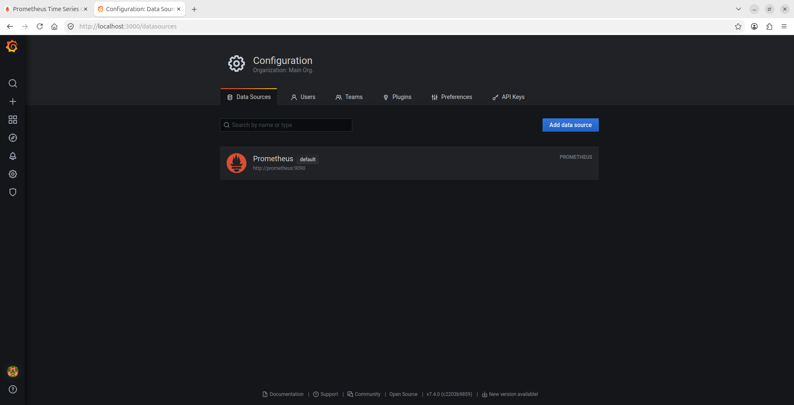
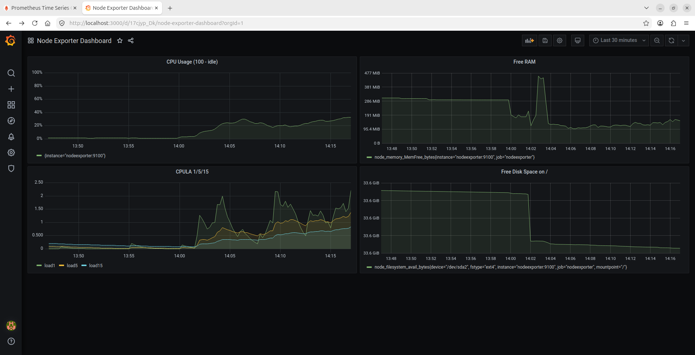
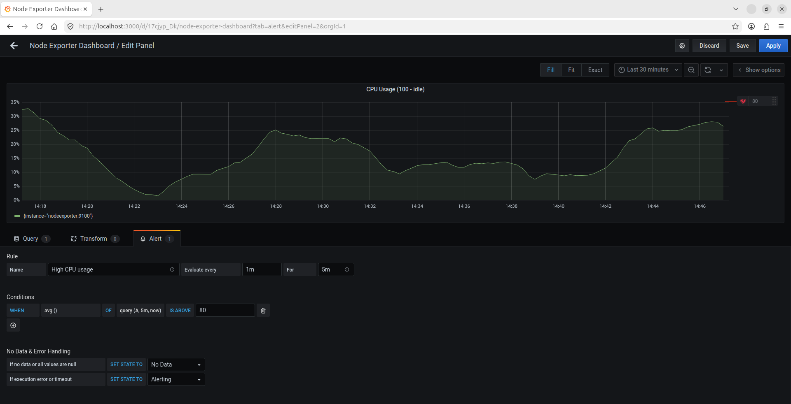
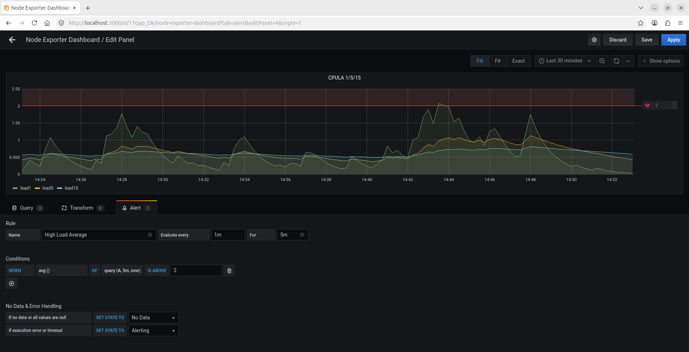
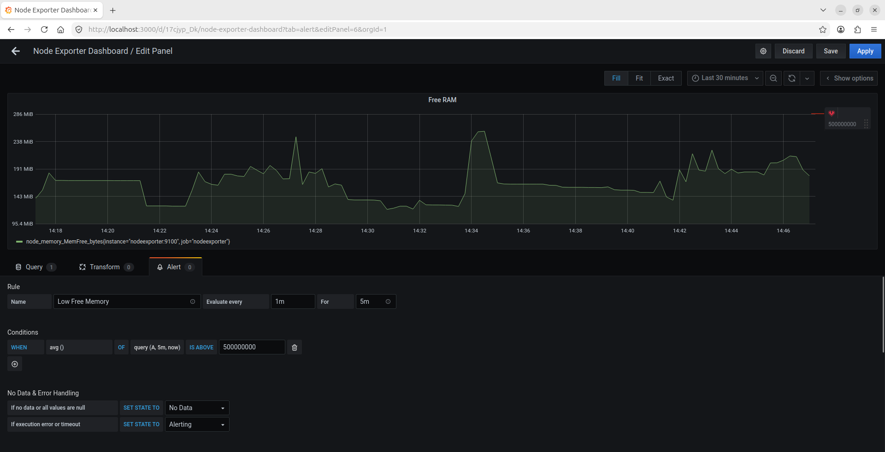
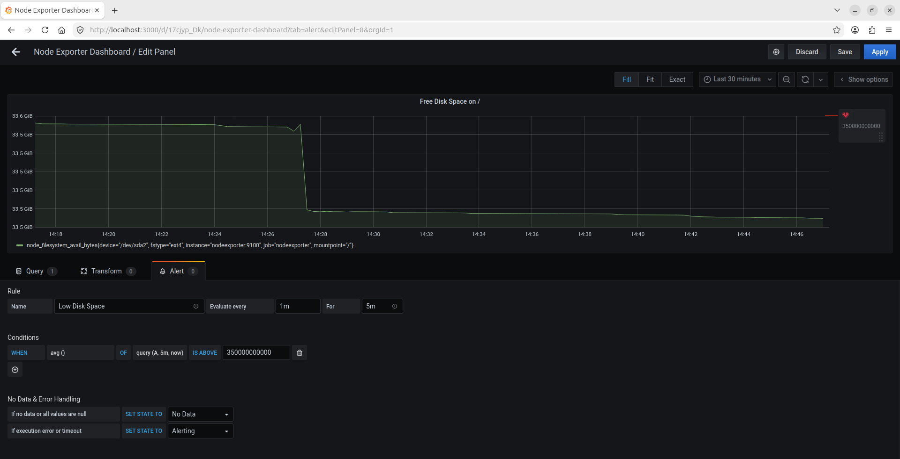
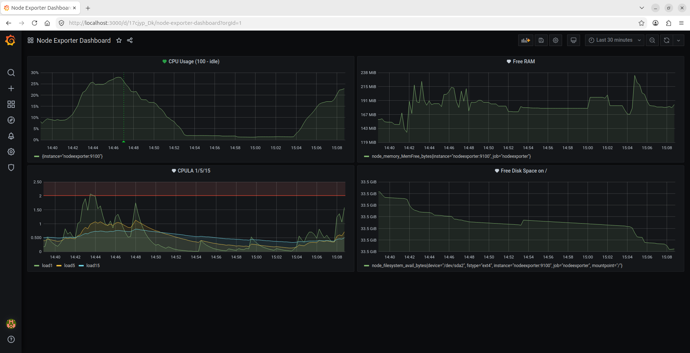

# Домашнее задание к занятию «Средство визуализации Grafana» - Лукинов Андрей

<details>
<summary><b>Обязательные задания</b></summary>

### Задание 1

1. Используя директорию [help](./help) внутри этого домашнего задания, запустите связку prometheus-grafana.
2. Зайдите в веб-интерфейс grafana, используя авторизационные данные, указанные в манифесте docker-compose.
3. Подключите поднятый вами prometheus, как источник данных.
4. Решение домашнего задания — скриншот веб-интерфейса grafana со списком подключенных Datasource.

    

## Задание 2

Изучите самостоятельно ресурсы:

1. [PromQL tutorial for beginners and humans](https://valyala.medium.com/promql-tutorial-for-beginners-9ab455142085).
2. [Understanding Machine CPU usage](https://www.robustperception.io/understanding-machine-cpu-usage).
3. [Introduction to PromQL, the Prometheus query language](https://grafana.com/blog/2020/02/04/introduction-to-promql-the-prometheus-query-language/).

    Создайте Dashboard и в ней создайте Panels:

    - утилизация CPU для nodeexporter (в процентах, 100-idle);
    - CPULA 1/5/15;
    - количество свободной оперативной памяти;
    - количество места на файловой системе.

    Для решения этого задания приведите promql-запросы для выдачи этих метрик, а также скриншот получившейся Dashboard.

    

    - Promql-запросы:
        - "CPU Usage (100 - idle)": 100 - (avg by (instance) (rate(node_cpu_seconds_total{mode="idle"}[5m])) * 100)
        - "CPULA 1/5/15": load1 = node_load1{job="nodeexporter"} , load5 = node_load5{job="nodeexporter"}, load15 = node_load15{job="nodeexporter"}
        - "Free RAM": node_memory_MemFree_bytes{job="nodeexporter"}
        - "Free Disk Space on /": node_filesystem_avail_bytes{job="nodeexporter", mountpoint="/"}

## Задание 3

1. Создайте для каждой Dashboard подходящее правило alert — можно обратиться к первой лекции в блоке «Мониторинг».

    

    

    

    

2. В качестве решения задания приведите скриншот вашей итоговой Dashboard.

    

## Задание 4

1. Сохраните ваш Dashboard.Для этого перейдите в настройки Dashboard, выберите в боковом меню «JSON MODEL». Далее скопируйте отображаемое json-содержимое в отдельный файл и сохраните его.
2. В качестве решения задания приведите листинг этого файла.

    <details>
    <summary>json</summary>

    ```json
    {
    "annotations": {
        "list": [
        {
            "builtIn": 1,
            "datasource": "-- Grafana --",
            "enable": true,
            "hide": true,
            "iconColor": "rgba(0, 211, 255, 1)",
            "name": "Annotations & Alerts",
            "type": "dashboard"
        }
        ]
    },
    "editable": true,
    "gnetId": null,
    "graphTooltip": 0,
    "id": 1,
    "links": [],
    "panels": [
        {
        "alert": {
            "alertRuleTags": {},
            "conditions": [
            {
                "evaluator": {
                "params": [
                    80
                ],
                "type": "gt"
                },
                "operator": {
                "type": "and"
                },
                "query": {
                "params": [
                    "A",
                    "5m",
                    "now"
                ]
                },
                "reducer": {
                "params": [],
                "type": "avg"
                },
                "type": "query"
            }
            ],
            "executionErrorState": "alerting",
            "for": "5m",
            "frequency": "1m",
            "handler": 1,
            "name": "High CPU usage",
            "noDataState": "no_data",
            "notifications": []
        },
        "aliasColors": {},
        "bars": false,
        "dashLength": 10,
        "dashes": false,
        "datasource": null,
        "fieldConfig": {
            "defaults": {
            "color": {},
            "custom": {},
            "thresholds": {
                "mode": "absolute",
                "steps": []
            },
            "unit": "percent"
            },
            "overrides": []
        },
        "fill": 1,
        "fillGradient": 0,
        "gridPos": {
            "h": 8,
            "w": 12,
            "x": 0,
            "y": 0
        },
        "hiddenSeries": false,
        "id": 2,
        "legend": {
            "avg": false,
            "current": false,
            "max": false,
            "min": false,
            "show": true,
            "total": false,
            "values": false
        },
        "lines": true,
        "linewidth": 1,
        "nullPointMode": "null",
        "options": {
            "alertThreshold": true
        },
        "percentage": false,
        "pluginVersion": "7.4.0",
        "pointradius": 2,
        "points": false,
        "renderer": "flot",
        "seriesOverrides": [],
        "spaceLength": 10,
        "stack": false,
        "steppedLine": false,
        "targets": [
            {
            "expr": "100 - (avg by (instance) (rate(node_cpu_seconds_total{mode=\"idle\"}[5m])) * 100)",
            "interval": "",
            "legendFormat": "",
            "refId": "A"
            }
        ],
        "thresholds": [
            {
            "colorMode": "critical",
            "fill": true,
            "line": true,
            "op": "gt",
            "value": 80,
            "visible": true
            }
        ],
        "timeFrom": null,
        "timeRegions": [],
        "timeShift": null,
        "title": "CPU Usage (100 - idle)",
        "tooltip": {
            "shared": true,
            "sort": 0,
            "value_type": "individual"
        },
        "type": "graph",
        "xaxis": {
            "buckets": null,
            "mode": "time",
            "name": null,
            "show": true,
            "values": []
        },
        "yaxes": [
            {
            "format": "percent",
            "label": null,
            "logBase": 1,
            "max": null,
            "min": null,
            "show": true
            },
            {
            "format": "short",
            "label": null,
            "logBase": 1,
            "max": null,
            "min": null,
            "show": true
            }
        ],
        "yaxis": {
            "align": false,
            "alignLevel": null
        }
        },
        {
        "alert": {
            "alertRuleTags": {},
            "conditions": [
            {
                "evaluator": {
                "params": [
                    500000000
                ],
                "type": "gt"
                },
                "operator": {
                "type": "and"
                },
                "query": {
                "params": [
                    "A",
                    "5m",
                    "now"
                ]
                },
                "reducer": {
                "params": [],
                "type": "avg"
                },
                "type": "query"
            }
            ],
            "executionErrorState": "alerting",
            "for": "5m",
            "frequency": "1m",
            "handler": 1,
            "name": "Low Free Memory",
            "noDataState": "no_data",
            "notifications": []
        },
        "aliasColors": {},
        "bars": false,
        "dashLength": 10,
        "dashes": false,
        "datasource": null,
        "fieldConfig": {
            "defaults": {
            "custom": {},
            "unit": "bytes"
            },
            "overrides": []
        },
        "fill": 1,
        "fillGradient": 0,
        "gridPos": {
            "h": 8,
            "w": 12,
            "x": 12,
            "y": 0
        },
        "hiddenSeries": false,
        "id": 6,
        "legend": {
            "avg": false,
            "current": false,
            "max": false,
            "min": false,
            "show": true,
            "total": false,
            "values": false
        },
        "lines": true,
        "linewidth": 1,
        "nullPointMode": "null",
        "options": {
            "alertThreshold": true
        },
        "percentage": false,
        "pluginVersion": "7.4.0",
        "pointradius": 2,
        "points": false,
        "renderer": "flot",
        "seriesOverrides": [],
        "spaceLength": 10,
        "stack": false,
        "steppedLine": false,
        "targets": [
            {
            "expr": "node_memory_MemFree_bytes{job=\"nodeexporter\"}",
            "interval": "",
            "legendFormat": "",
            "refId": "A"
            }
        ],
        "thresholds": [
            {
            "colorMode": "critical",
            "fill": true,
            "line": true,
            "op": "gt",
            "value": 500000000,
            "visible": true
            }
        ],
        "timeFrom": null,
        "timeRegions": [],
        "timeShift": null,
        "title": "Free RAM",
        "tooltip": {
            "shared": true,
            "sort": 0,
            "value_type": "individual"
        },
        "type": "graph",
        "xaxis": {
            "buckets": null,
            "mode": "time",
            "name": null,
            "show": true,
            "values": []
        },
        "yaxes": [
            {
            "format": "bytes",
            "label": null,
            "logBase": 1,
            "max": null,
            "min": null,
            "show": true
            },
            {
            "format": "short",
            "label": null,
            "logBase": 1,
            "max": null,
            "min": null,
            "show": true
            }
        ],
        "yaxis": {
            "align": false,
            "alignLevel": null
        }
        },
        {
        "alert": {
            "alertRuleTags": {},
            "conditions": [
            {
                "evaluator": {
                "params": [
                    2
                ],
                "type": "gt"
                },
                "operator": {
                "type": "and"
                },
                "query": {
                "params": [
                    "A",
                    "5m",
                    "now"
                ]
                },
                "reducer": {
                "params": [],
                "type": "avg"
                },
                "type": "query"
            }
            ],
            "executionErrorState": "alerting",
            "for": "5m",
            "frequency": "1m",
            "handler": 1,
            "name": "High Load Average",
            "noDataState": "no_data",
            "notifications": []
        },
        "aliasColors": {},
        "bars": false,
        "dashLength": 10,
        "dashes": false,
        "datasource": null,
        "fieldConfig": {
            "defaults": {
            "color": {},
            "custom": {},
            "thresholds": {
                "mode": "absolute",
                "steps": []
            },
            "unit": "short"
            },
            "overrides": []
        },
        "fill": 1,
        "fillGradient": 0,
        "gridPos": {
            "h": 8,
            "w": 12,
            "x": 0,
            "y": 8
        },
        "hiddenSeries": false,
        "id": 4,
        "legend": {
            "avg": false,
            "current": false,
            "max": false,
            "min": false,
            "show": true,
            "total": false,
            "values": false
        },
        "lines": true,
        "linewidth": 1,
        "nullPointMode": "null",
        "options": {
            "alertThreshold": true
        },
        "percentage": false,
        "pluginVersion": "7.4.0",
        "pointradius": 2,
        "points": false,
        "renderer": "flot",
        "seriesOverrides": [],
        "spaceLength": 10,
        "stack": false,
        "steppedLine": false,
        "targets": [
            {
            "expr": "node_load1{job=\"nodeexporter\"}",
            "interval": "",
            "legendFormat": "load1",
            "refId": "A"
            },
            {
            "expr": "node_load5{job=\"nodeexporter\"}",
            "hide": false,
            "interval": "",
            "legendFormat": "load5",
            "refId": "B"
            },
            {
            "expr": "node_load15{job=\"nodeexporter\"}",
            "hide": false,
            "interval": "",
            "legendFormat": "load15",
            "refId": "C"
            }
        ],
        "thresholds": [
            {
            "colorMode": "critical",
            "fill": true,
            "line": true,
            "op": "gt",
            "value": 2,
            "visible": true
            }
        ],
        "timeFrom": null,
        "timeRegions": [],
        "timeShift": null,
        "title": "CPULA 1/5/15",
        "tooltip": {
            "shared": true,
            "sort": 0,
            "value_type": "individual"
        },
        "type": "graph",
        "xaxis": {
            "buckets": null,
            "mode": "time",
            "name": null,
            "show": true,
            "values": []
        },
        "yaxes": [
            {
            "format": "short",
            "label": null,
            "logBase": 1,
            "max": null,
            "min": null,
            "show": true
            },
            {
            "format": "short",
            "label": null,
            "logBase": 1,
            "max": null,
            "min": null,
            "show": true
            }
        ],
        "yaxis": {
            "align": false,
            "alignLevel": null
        }
        },
        {
        "alert": {
            "alertRuleTags": {},
            "conditions": [
            {
                "evaluator": {
                "params": [
                    350000000000
                ],
                "type": "gt"
                },
                "operator": {
                "type": "and"
                },
                "query": {
                "params": [
                    "A",
                    "5m",
                    "now"
                ]
                },
                "reducer": {
                "params": [],
                "type": "avg"
                },
                "type": "query"
            }
            ],
            "executionErrorState": "alerting",
            "for": "5m",
            "frequency": "1m",
            "handler": 1,
            "name": "Low Disk Space",
            "noDataState": "no_data",
            "notifications": []
        },
        "aliasColors": {},
        "bars": false,
        "dashLength": 10,
        "dashes": false,
        "datasource": null,
        "fieldConfig": {
            "defaults": {
            "custom": {},
            "unit": "bytes"
            },
            "overrides": []
        },
        "fill": 1,
        "fillGradient": 0,
        "gridPos": {
            "h": 8,
            "w": 12,
            "x": 12,
            "y": 8
        },
        "hiddenSeries": false,
        "id": 8,
        "legend": {
            "avg": false,
            "current": false,
            "max": false,
            "min": false,
            "show": true,
            "total": false,
            "values": false
        },
        "lines": true,
        "linewidth": 1,
        "nullPointMode": "null",
        "options": {
            "alertThreshold": true
        },
        "percentage": false,
        "pluginVersion": "7.4.0",
        "pointradius": 2,
        "points": false,
        "renderer": "flot",
        "seriesOverrides": [],
        "spaceLength": 10,
        "stack": false,
        "steppedLine": false,
        "targets": [
            {
            "expr": "node_filesystem_avail_bytes{job=\"nodeexporter\", mountpoint=\"/\"}",
            "interval": "",
            "legendFormat": "",
            "refId": "A"
            }
        ],
        "thresholds": [
            {
            "colorMode": "critical",
            "fill": true,
            "line": true,
            "op": "gt",
            "value": 350000000000,
            "visible": true
            }
        ],
        "timeFrom": null,
        "timeRegions": [],
        "timeShift": null,
        "title": "Free Disk Space on /",
        "tooltip": {
            "shared": true,
            "sort": 0,
            "value_type": "individual"
        },
        "type": "graph",
        "xaxis": {
            "buckets": null,
            "mode": "time",
            "name": null,
            "show": true,
            "values": []
        },
        "yaxes": [
            {
            "format": "bytes",
            "label": null,
            "logBase": 1,
            "max": null,
            "min": null,
            "show": true
            },
            {
            "format": "short",
            "label": null,
            "logBase": 1,
            "max": null,
            "min": null,
            "show": true
            }
        ],
        "yaxis": {
            "align": false,
            "alignLevel": null
        }
        }
    ],
    "refresh": false,
    "schemaVersion": 27,
    "style": "dark",
    "tags": [],
    "templating": {
        "list": []
    },
    "time": {
        "from": "now-30m",
        "to": "now"
    },
    "timepicker": {},
    "timezone": "",
    "title": "Node Exporter Dashboard",
    "uid": "17cjyp_Dk",
    "version": 5
    }
    ```

    </details>

    [Файл json](./files/dashboard_export.json)

</details>

<details>
<summary><b>Задание повышенной сложности</b></summary>

**При решении задания 1** не используйте директорию [help](./help) для сборки проекта. Самостоятельно разверните grafana, где в роли источника данных будет выступать prometheus, а сборщиком данных будет node-exporter:

- grafana;
- prometheus-server;
- prometheus node-exporter.

За дополнительными материалами можете обратиться в официальную документацию grafana и prometheus.

В решении к домашнему заданию также приведите все конфигурации, скрипты, манифесты, которые вы 
использовали в процессе решения задания.

**При решении задания 3** вы должны самостоятельно завести удобный для вас канал нотификации, например, Telegram или email, и отправить туда тестовые события.

В решении приведите скриншоты тестовых событий из каналов нотификаций.

</details>