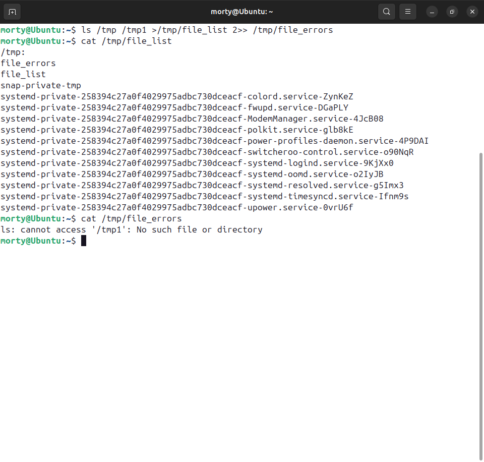
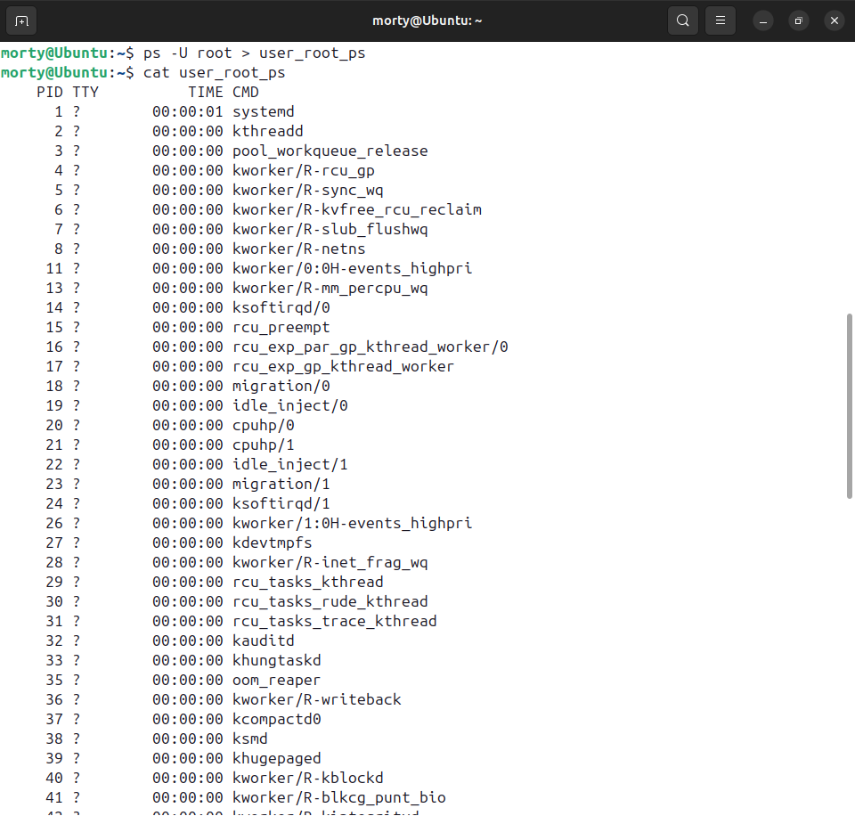
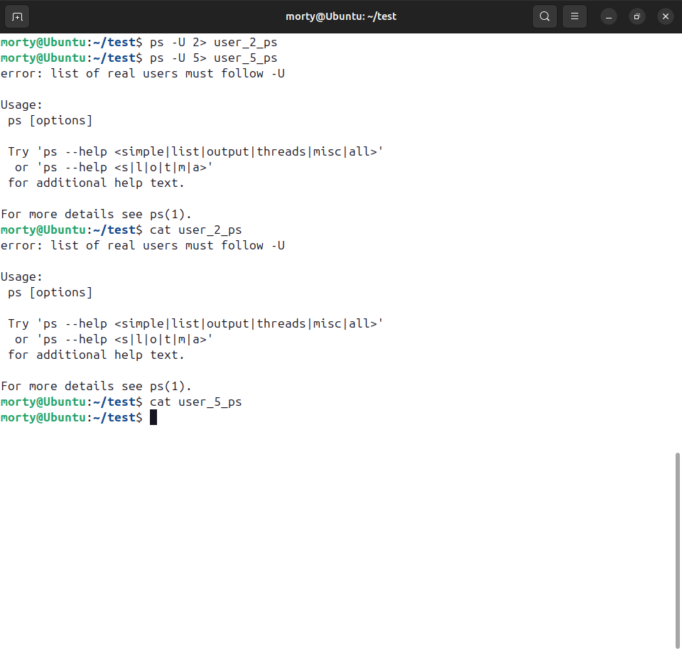

# Домашнее задание к занятию "Процессы, управление процессами" - Лукинов Андрей

## Задание 1

Измените команду ```ls /tmp /tmp1```так, чтобы:

1. Результат работы (список файлов) для текущего запуска команды выводился в файл /tmp/file_list.
2. Ошибки для каждого запуска добавлялись в файл /tmp/file_errors.

Примечание к заданию:
1. Создавать /tmp1 не требуется. Директория должна отсутствовать для генерации вывода stderr.
2. Задание необходимо выполнить одной командой.

<details>
<summary>Ответ</summary>

*В качестве решения пришлите полученную команду и скриншот терминала с выводом содержимого созданных файлов*



Команда `ls /tmp /tmp1 > /tmp/file_list 2>> /tmp/file_errors`
- stdout (список файлов) записывается в файл /tmp/file_list (каждый запуск заново, перезаписывая)
  - `>` - перенаправляет stdout в файл (перезаписывая его)
- stderr (ошибки) добавляются в файл /tmp/file_errors
  - `2>>` - перенаправляет stderr в файл (добавляя в конец)
  
</details>


## Задание 2

Напишите команду, которая выводит все запущенные процессы пользователя root в файл *"user_root_ps"*.

<details>
<summary>Ответ</summary>



Команда `ps -U root > user_root_ps`

</details>

## Задание 3

Начинающий администратор захотел вывести все запущенные процессы пользователя с логином "2" в файл *"user_2_ps"*.

Для этого он набрал команду:

```
ps -U 2> user_2_ps
```

Затем, он аналогично повторил для пользователя с логином "5" вывод в файл "user_5_ps":

```
ps -U 5> user_5_ps
```

**Вопрос:**

Почему вывод этих команд и содержимое файлов сильно отличаются друг от друга?  Как должны выглядеть правильные команды?

**Примечание:**

Если у вас в системе нет пользователей "2" и/или "5" (это нормальная ситуация), то утилита ps выводит только одну строку:

```
 PID TTY          TIME CMD     
```
<details>
<summary>Ответ</summary>

*Ответ приведите в виде снимка экрана с комментариями в свободной форме.*



Здесь ошибка в том, что нет пробела между 2/5 и перенаправлением >

Корректные команды:
- `ps -U 2 > user_2_ps`
- `ps -U 5 > user_5_ps`

</details>