# Что такое память

**Из этого раздела вы узнаете:**

- Как организована память в ПК
- На какие виды делится память
- Как устроена минимальная необходимая архитектура компьютера
- Какие технологии оперативных запоминающих устройств существуют

**Зачем нужна память**

Как вы думаете, может ли компьютер существовать без памяти? 

На самом деле такой компьютер мог бы функционировать лишь как простой преобразователь: данные поступают на вход, проходят через него и на выходе получается результат. Но стоит добавить память, и всё меняется.

Память создаёт возможность сохранять информацию внутри системы. Это означает, что теперь можно отслеживать текущее состояние компьютера, хранить промежуточные результаты вычислений и даже запускать сложные программы. Ведь любая программа обычно требует сохранения своего текущего состояния.

*Представим программу, которая считает сумму чисел от 1 до 1000. Если нет возможности запомнить предыдущие значения, то каждый раз придётся начинать с нуля. А вот благодаря памяти, можно постепенно накапливать результаты и двигаться вперёд.*

Кроме того, память помогает понять, на каком этапе выполнения находится программа. Без неё невозможно было бы определить, где именно происходит выполнение команды в данный момент времени. Поэтому память нужна для создания универсальных устройств, которые могут выполнять множество разных задач.

**Минимальная необходимая архитектура ЭВМ**

Минимальная архитектура компьютера представляет собой набор ключевых компонентов, которые обеспечивают его функционирование. 

**Память (RAM)** играет центральную роль в этой системе. Она временно хранит данные, программы и промежуточные результаты вычислений, предоставляя процессору (CPU) быстрый доступ к информации. Без оперативной памяти процессор не смог бы обрабатывать данные, а **система ввода-вывода (Input/Output)** — передавать или принимать их. 

**Системная шина (System bus)** соединяет все компоненты вместе, позволяя передавать данные между процессором, памятью и устройствами ввода-вывода. Таким образом, память становится связующим элементом, который обеспечивает взаимодействие и работу всей системы как единого целого.

**Виды памяти**

Память можно разделить на два основных вида: **оперативная память (RAM)** и **постоянная память (ROM)**.

- **RAM (random-access memory, память с произвольным доступом)**, или **ОЗУ (оперативное запоминающее устройство)**, — энергозависимая память с произвольным доступом к ячейкам.

Это та память, которая хранит временные данные во время работы компьютера. Когда вы включаете компьютер, эта память пуста. По мере работы программы загружают в неё данные, а затем их изменяют или удаляют. Однако, когда вы выключаете компьютер, вся информация из оперативной памяти исчезает. Поэтому её называют энергозависимой памятью.

- **ROM (read-only memory, память только для чтения)**, или **ПЗУ (постоянное запоминающее устройство)**, — энергонезависимая память для хранения массива неизменяемых данных.

Эта память сохраняет данные даже после отключения питания. В узком смысле под ROM понимают микросхемы, прошитые производителем и установленные на материнской плате. Эти микросхемы содержат важные для системы данные, такие как BIOS, и их невозможно изменить обычным способом. Хотя иногда возможно обновить прошивку, но это сложная процедура, которую выполняют редко.

В более широком смысле к постоянной памяти относятся также внешние устройства хранения данных, например, жёсткие диски (HDD), SSD-накопители, флеш-карты и оптические диски. Они позволяют сохранять данные независимо от того, включен ли компьютер или нет.

**Оперативное запоминающее устройство**

**Немного истории:** до DDR использовались модули **SDR (Single Data Rate)**. Они могли передавать данные только один раз за такт шины. Что такое такт? Это когда сигнал на шине меняется с низкого уровня на высокий, а потом обратно. За каждый такой цикл передается определенное количество информации, которое зависит от ширины шины. Если ширина шины составляет 64 бита, то за один такт передается 64 бит данных, что равно 8 байтам.

**DDR (Double Data Rate)** – это уже более современная технология. Она передаёт данные дважды за один такт: один раз при переходе сигнала вверх (фронт), второй раз – вниз (спад). Это увеличивает скорость работы памяти.

С каждым новым поколением DDR повышалась тактовая частота и объём памяти, улучшались другие характеристики. Но есть важный момент: разные поколения памяти типа DDR физически не совместимы друг с другом. Например, модуль DDR3 не подойдет к разъёму DDR2 из-за разного расположения ключа (прорези) на плате.

Ещё одно интересное устройство – память типа **CAMM (Compression Attached Memory Module)**. У этих модулей оперативной памяти разъём выполнен в виде матрицы точек, благодаря чему такие модули намного тоньше. Это особенно полезно для устройств, где важна компактность, например, ультрабуков.

**Подведём итоги**

- Память обеспечивает хранение промежуточных результатов вычислений, программ и данных. Без памяти компьютер не смог бы выполнять сложные задачи и отслеживать своё текущее состояние.
- Минимальная архитектура компьютера включает процессор (CPU), память (RAM), систему ввода-вывода (Input/Output) и системную шину (System Bus). Каждая из этих частей выполняет свою важную функцию, обеспечивая взаимодействие компонентов и обработку данных.
- Существует два основных типа памяти: оперативная память (RAM) и постоянная память (ROM). RAM используется для временного хранения данных во время работы компьютера, тогда как ROM предназначена для долговременного хранения неизменяемой информации.
- Развитие технологий оперативной памяти приводит к увеличению скорости и производительности запоминающих устройств. Например, память типа SDR передаёт данные за один такт шину, в то время как более новая технология DDR делает это дважды за такт.
- Важно помнить, что разные поколения памяти типа DDR физически не совместимы между собой из-за различий в расположении ключей на платах.

# Виртуальная память

**Из этого раздела вы узнаете:**

- Что такое виртуальная память
- Какими функциями обладает виртуальная память
- Какие существуют методы организации виртуальной памяти и их виды
- Как устроены таблица страниц и таблица сегментов

**Что такое виртуальная память**

Представьте себе ситуацию: вы пишете программу, которая требует для выполнения много оперативной памяти (ОЗУ). Но ваш компьютер имеет ограниченный объем ОЗУ. Что делать? На помощь тут может прийти виртуальная память.

**Виртуальная память** — это технология, позволяющая программам использовать больше памяти, чем физически доступно в вашем компьютере. Как это возможно?

Представьте рабочий стол с ограниченной поверхностью (оперативная память) и выдвижными ящиками (виртуальная память). На столе лежат только нужные документы, а остальные временно убираются в ящики. Если понадобится документ из ящика, вы достаете его, освобождая место на столе для других. Так и операционная система временно сохраняет данные на диск, создавая иллюзию большого объема памяти, хотя на самом деле она работает с ограниченными ресурсами.

**Функции виртуальной памяти**

- Изоляция процессов. Раньше, до появления виртуальной памяти, разные процессы могли случайно читать или изменять данные друг друга, что приводило к сбоям и ошибкам. Теперь каждый процесс в системе видит своё пространство как единственное и непрерывное, а другие процессы туда не вмешивается. Это делает систему более стабильной и безопасной.
- Абстракция физической памяти — физическая и виртуальная память могут быть разных размеров (виртуальная больше). Программа может работать так, будто у неё под рукой огромное количество памяти, независимо от реального объёма ОЗУ. Например, некоторые приложения могут запросить у системы несколько десятков гигабайт памяти, хотя реально используют лишь небольшую часть этого объёма. Операционная система «обманывает» приложение, предоставляя ему нужные ресурсы по мере надобности.
- Выделение адресов объектам, которые не загружены в память. Это следствие абстракции физической памяти. Виртуальная память позволяет резервировать адреса для объектов, которые пока отсутствуют в памяти.

**Организация виртуальной памяти**

Существует три основных метода организации виртуальной памяти:

- **Страничная.** В этом методе всё адресное пространство программы разбивается на равные блоки, называемые страницами. В операционной системе Linux стандартные размеры страниц составляют 4 Кб, однако существуют и другие варианты (например, большие страницы размером 2 Мб). Физическая память также разделяется на такие же страницы, и затем эти две структуры связываются друг с другом. Адрес задаётся номером страницы в виртуальной памяти и смещением внутри страницы.
- **Сегментная.** Здесь вместо страниц используются сегменты, размер которых может быть разным. Он определяется назначением сегмента. Например, один сегмент может содержать код программы, другой – данные. Адресация в такой системе немного отличается от страничной: вместо указания конкретной страницы, программа указывает номер сегмента и смещение внутри него.
- **Странично-сегментная.** Это комбинация двух предыдущих методов. Программа сначала делит своё адресное пространство на сегменты, каждый из которых затем делится на страницы.

**Страничная организация памяти**

**Логическая память делится на страницы — смежные области одинаковой длины.**

Страничная организация памяти фрагментации не подвержена, потому что при таком способе организации вся память — и логическая, и физическая — делится на небольшие одинаковые блоки, называемые страницами или фреймами. Фреймы имеют фиксированный размер 4 КБ.

**Физическая память делится на фреймы такого же размера.**

Из этих фреймов по 4 килобайта мы можем составить память нашего процесса и отобразить эту память на физическую память.

**Чтобы связать виртуальные адреса с физическими, используется специальная структура данных — таблица страниц.**

Таблица страниц содержит информацию о том, какая виртуальная страница соответствует какому физическому фрейму.

**Таблица страниц**
Рассмотрим шаг за шагом, как работает таблица страниц.

- **Виртуальный адрес.** Когда программа обращается к данным по виртуальному адресу, этот адрес разбивается на две части: номер виртуальной страницы и смещение внутри страницы.

- **Поиск в таблице страниц.** По номеру виртуальной страницы ОС находит соответствующую запись в таблице страниц, которая указывает на номер физического фрейма.

- **Формирование физического адреса.** Номер фрейма умножается на размер страницы (например, 4 КБ), и к результату добавляется смещение. Таким образом получается точный физический адрес, по которому находятся нужные данные.

**Особенности страничной организации памяти**

- **Отсутствие фрагментации.** Поскольку все страницы имеют одинаковый размер, ОС легко управляет ими без риска возникновения фрагментированной памяти.
- **Один и тот же участок физической памяти может быть «отображён» (то есть доступен) сразу в нескольких процессах.** Это особенно полезно для библиотек: библиотека загружается в физическую память только один раз, а затем её участки отображаются в адресные пространства тех процессов, которые её используют. Это экономит ресурсы. Более того, страничная память позволяет отобразить один и тот же участок памяти в разные области адресного пространства одного процесса. Например, это может пригодиться для работы с разделяемыми данными.

**Виды страничной виртуальной памяти**

Виды страничной памяти можно разделить на две дихотомии.
Первая дихотомия — это **собственная память** и **общая память**, вторая дихотомия — **файл-ассоциированная память** и **анонимная память.** 

- **Собственная память (private memory) — память, выделенная конкретному процессу.**

Только этот процесс имеет доступ к фреймам памяти, а другим процессам эта информация недоступна. Представьте себе комнату, в которой вы живете — никто другой не может войти без вашего разрешения.

- **Общая память (shared memory) — память, предназначенная для взаимодействия процессов.**

Это область памяти, к которой имеют доступ несколько процессов одновременно. Она позволяет процессам обмениваться данными друг с другом или совместно использовать библиотеки. Например, одна библиотека загружается в память, и все процессы, которым нужен доступ к ней, получают ссылку на неё. Таким образом, каждый процесс видит библиотеку, но физически она хранится всего лишь в одном экземпляре, экономя ресурсы.

Теперь перейдём ко второй дихотомии.

- **Файл-ассоциированная память (file-backed memory) — память, в которую отображается файл из ПЗУ.**

В этом случае мы рассматриваем ПЗУ в широком смысле. Когда процесс запрашивает доступ к такой памяти, операционная система проверяет, есть ли нужные данные в памяти. Если нет, она временно останавливает процесс, подгружает необходимые данные из файла и помещает их в оперативную память. После этого процесс снова получает возможность продолжить работу с этими данными, как будто они всегда находились в оперативной памяти. Этот механизм облегчает работу с файлами и ускоряет выполнение программ.

- **Анонимная память (anonymous memory) — память, выделенная непосредственно в ОЗУ, без привязки к какому-либо файлу.**

Она используется процессом по собственному усмотрению, и ОС не отслеживает связь этих данных с какими-либо файлами. Эта память позволяет процессам в своём адресном пространстве резервировать больше памяти, чем доступно в системе.

**Сегментная организация памяти**

Рассмотрим, как устроена сегментная виртуальная память. 

- **Выделяемые сегменты могут иметь переменный размер**

Виртуальная память организуется в виде сегментов, которые могут изменять свой размер во время работы программы. Например, вы можете начать с сегмента размером 16 КБ, но если вам понадобится больше места, можно запросить дополнительные 16 КБ. Если после вашего сегмента в физической памяти есть свободное пространство, операционная система предоставит его, увеличив ваш сегмент до 32 КБ.

- **Каждый сегмент — линейная последовательность адресов, начиная с 0**

В сегментной организации памяти каждому сегменту присваивается начальный адрес. Для доступа используют два регистра: один содержит селектор сегмента с его параметрами, другой указывает смещение внутри сегмента.

- **В таблице сегментов хранится длина сегментов**

Информация о каждом сегменте хранится в специальных таблицах сегментов для каждого процесса. В этих таблицах указывается номер сегмента, его физический адрес, длина и тип (данные или код). Раньше процессоры не различали типы сегментов, что могло привести к выполнению вредоносного кода из сегмента данных. Современные процессоры решают эту проблему, запрещая выполнение команд в сегменте данных — при попытке сделать это возникает ошибка защиты памяти.

- **У процесса может быть доступ к нескольким сегментам**

Обычно у процесса есть три основных типа сегментов: данные, код и стек. Сегментов каждого типа может быть несколько. Это удобно, потому что можно задавать гибкие права доступа. Например, сегмент с кодом может быть доступен только для чтения и выполнения, а сегмент с данными — для чтения и записи. Это повышает безопасность и упрощает управление памятью.

- **Таблица сегментов (дескрипторов) похожа на таблицу страниц в страничной организации памяти**

Разберёмся более подробно, как организована адресация в сегментной памяти.

Представьте себе, что вы ищете книгу в библиотеке. У вас есть две важные вещи: номер полки (селектор) и номер книги на этой полке (смещение). Вместе они образуют виртуальный адрес вашей книги. Селектор указывает на конкретную полку, а смещение – на точное место на этой полке.

Теперь давайте перенесём эту аналогию на работу компьютера.

Есть два специальных регистра. Первый хранит селектор, второй – смещение. Эти два значения вместе формируют виртуальный адрес.

Селектор указывает на запись в таблице сегментов. Эта таблица содержит информацию о каждом сегменте памяти: базовый адрес (начало сегмента в физической памяти), длину сегмента, тип и другие параметры.

Чтобы получить физический адрес из виртуального, компьютер находит базовый адреса сегмента в таблице сегментов. Затем к этому базовому адресу добавляется смещение, и получается точный физический адрес.

- **Сегментная организация памяти подвержена фрагментации**

Однако, при использовании сегментной модели памяти возникает проблема фрагментирования. Представьте, что библиотека переполнена книгами, и хотя много полок пустуют, найти одну длинную свободную полку для новой книги становится сложно. Аналогично, в компьютере может быть достаточно свободной памяти, но она распределена таким образом, что нет непрерывного блока нужного размера.

Это приводит к тому, что даже при наличии достаточного количества свободной памяти, операционная система не сможет предоставить процессору необходимый объём памяти за один раз. В таком случае приходится выполнять дефрагментацию памяти – перемещать сегменты данных, обновлять таблицы сегментов и т.д., что требует дополнительных вычислительных ресурсов.

**Подведём итоги**

- Виртуальная память — это технология, которая позволяет программам использовать больше памяти, чем физически доступно в компьютере. Она достигается путём временного хранения данных на жёстком диске или SSD, с последующей автоматической подгрузкой этих данных в оперативную память по мере необходимости.
- Основные функции виртуальной памяти заключаются в изоляции процессов, абстрагировании физической памяти и выделении адресов незагруженным объектам.
- Методы организации виртуальной памяти делятся на: страничную, сегментную и странично-сегментную организацию.
- Сегментная организация позволяет динамическое изменение размера сегментов, но подвержена фрагментации. Для хранения адресов сегментов используется таблица сегментов. Виртуальный адрес складывается из селектора и смещения.
- Страничная организация не подвержена фрагментации. Логическая и виртуальная память делится на фреймы (или страницы) одинакового размера. Для связи виртуальных и физических адресов используется таблица страниц.
- Страничную виртуальную память можно разделить на две дихотомии:
  - **Собственная/общая память:** собственная память доступна только одному процессу, тогда как общая память предназначена для взаимодействия нескольких процессов.
  - **Файл-ассоциированная/анонимная память:** файл-ассоциированная память связана с файлом на диске, а анонимная память выделяется непосредственно в ОЗУ без привязки к файлам.

# Обзор утилит Linux для работы с ОЗУ

**Из этого раздела вы узнаете:**

- Особенности и возможности применения утилит top, htop и free
- Особенности и примеры работы с файловой системой /proc

Современные операционные системы, такие как Linux, предоставляют множество инструментов для анализа и управления ресурсами, включая оперативную память. Понимание её состояния важно как для отладки приложений, так и для оптимизации производительности системы. В этом разделе вы познакомитесь с основными утилитами Linux, которые помогут вам мониторить использование ОЗУ, а также научитесь интерпретировать ключевые показатели памяти. Мы рассмотрим популярные инструменты — top, htop, free — и узнаем, как использовать файловую систему /proc для получения детализированной информации.

**Программы top и htop**

**Работа с утилитой top**

Когда вы впервые запустите утилиту top, вы увидите нечто подобное на экране:

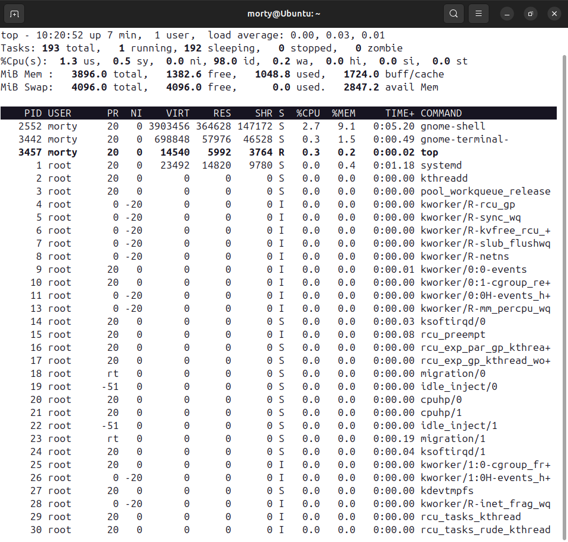

По умолчанию интерфейс утилиты отображается в чёрно-белом цвете. В верхней части окна содержится общая информация о системе, а ниже представлена таблица с данными о каждом процессе. Однако, её можно настроить. Вы можете изменить цветовую схему, скрыть ненужные элементы интерфейса, сгруппировать процессы, выбрать режим отображения данных (по отдельным процессорам или всем вместе) и многое другое.

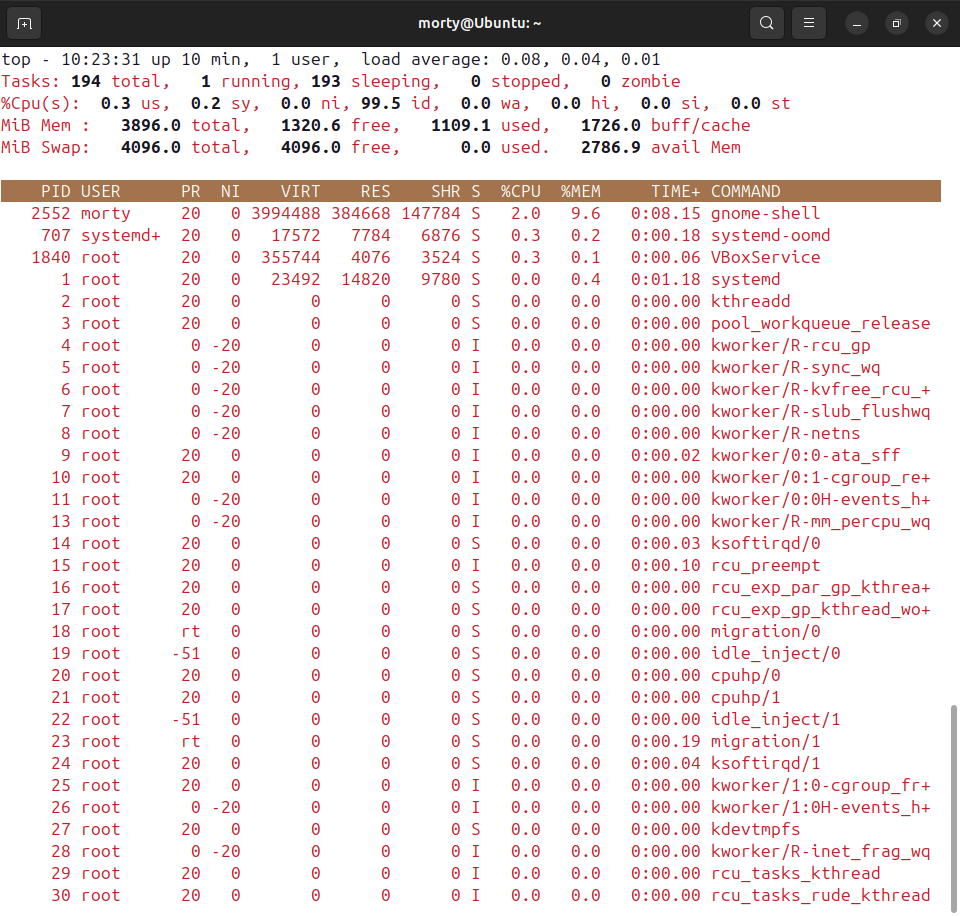

Если хотите узнать больше о возможностях утилиты, нажмите клавишу «?» — перед вами откроется список всех доступных команд, каждая из которых выполняет определенное действие.

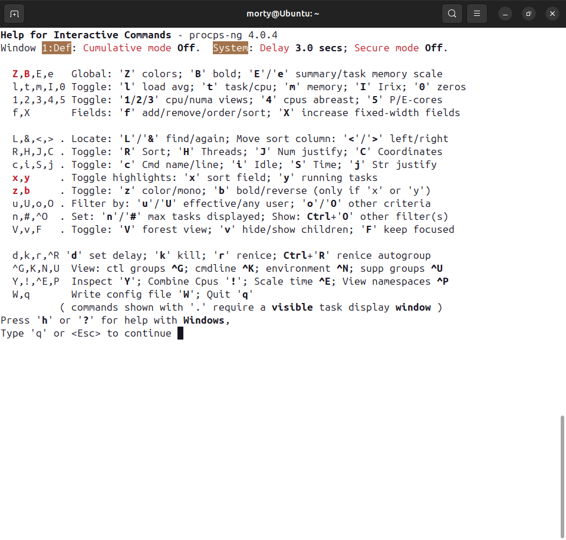

После завершения настроек обязательно сохраните их, нажав комбинацию клавиш Shift + W. Это позволит вам использовать ваши предпочтения при следующем запуске утилиты.

Давайте посмотрим на разделы, связанные с памятью. На скриншоте ниже вы видите две важные строки, выделенные белым цветом.

Первая строка — это информация о физической памяти (MiB Mem):

- Total — это общее количество доступной оперативной памяти.
- Free — объём свободной памяти, которую еще не использовали программы.
- Used — объём памяти, который сейчас занят различными программами и службами.
- Buff/Cache — память, занимаемая буфером и кешем операционной системы.

Если бы у нас был включен swap (файл подкачки), во второй строке отображались бы его параметры: общий объём, сколько свободно, сколько занято, а также доступное количество памяти (avail Mem).

Теперь подробнее рассмотрим доступную память буферов и кэша (buff/cache).

**Буферы (buff)** используются для чтения данных с диска и передачи их далее. Это служебные области системы, и обычно эта память остается занятой. Она может увеличиваться или уменьшаться, но занимает небольшую часть общей памяти. Например, из 600 МБ около 40 МБ могут быть заняты буферами/кэшами.

Остальная часть — это **кэш (cache)**. Он хранит файлы и структуры файловой системы, которые могут потребоваться позже. Система сохраняет часто используемые данные в быстрой памяти, чтобы ускорить работу. Если нужно выделить память для процесса, а свободной мало, система уменьшает кэш. Процессы важнее, чем кэш. Когда памяти много, кэш помогает ускорить работу, но если ее становится недостаточно, кэш уменьшается, и работа замедляется.

Доступная память (avail Mem) — это сумма свободной памяти и памяти кэша. Это та память, которую система может освободить и передать другим процессам.

**Виртуальная память (VIRT) и резидентная память (RES)**

Ещё в top можно посмотреть информацию о каждом процессе, включая **виртуальную память (VIRT)**, которую процесс запрашивает, и **резидентную память (RES)**, то есть реальную физическую память, используемую данным процессом в данный момент времени. Это позволяет вам видеть состояние каждого отдельного процесса.

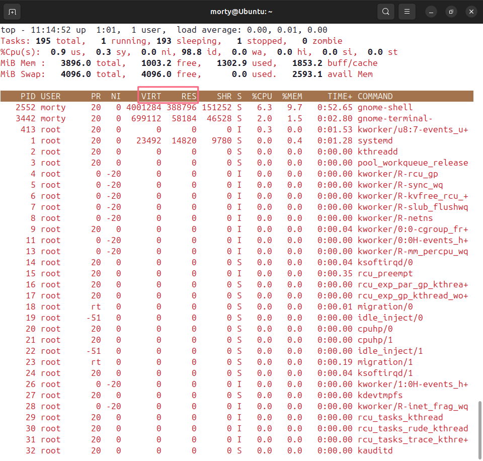

Если в этих столбцах пусто или указаны нули, это означает, что у данного процесса нет выделенной памяти. Чаще всего это процессы ядра или потоки.

**Работа с утилитой htop**

Теперь перейдём к утилите htop, которая немного отличается от top и предназначена для других целей. Здесь информация представлена в виде псевдографики, а использование памяти показано в форме термометра.

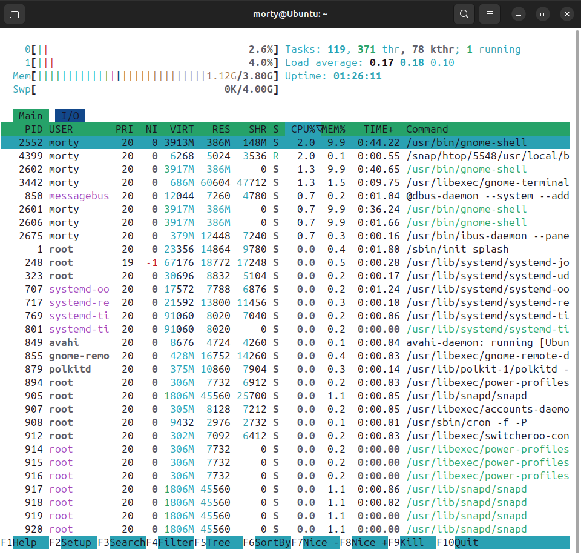

Однако, в отличие от top, здесь мы видим только занятую и общую память. Зато htop предоставляет возможность видеть не только сами процессы, но и их потоки. Но с точки зрения памяти эта утилита менее информативна, чем top.

**Программа free**

Утилита free позволяет нам просматривать информацию о состоянии оперативной памяти системы, аналогичную той, что мы видели ранее, но в немного ином формате.

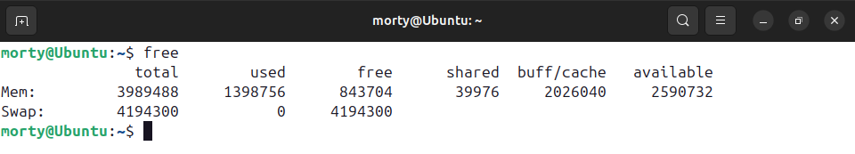

В частности, на скриншоте выше вы можете заметить колонку shared, где отображается память, используемая совместно несколькими процессами. Хотя её значение не всегда очевидно, эта информация может быть полезна, так как даёт представление об использовании ресурсов.

**Выбор единиц измерения**

Одна из особенностей утилиты free заключается в том, что она позволяет выбрать единицы измерения информации. По умолчанию данные выводятся в килобайтах, но вы также можете указать другие единицы через ключи.

- **Ключ -k** оставит всё без изменений, то есть покажет данные в килобайтах.

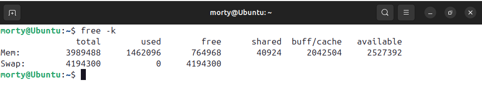

- **Ключ -m** выведет информацию в мегабайтах.

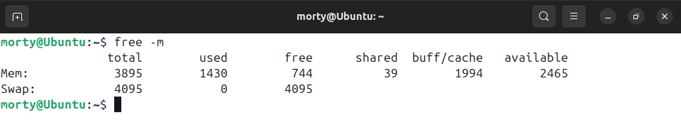

- **Ключ -h** — удобный вариант, который автоматически выбирает подходящие единицы измерения: мегабайт, гигабайт или терабайт, в зависимости от объёма данных.

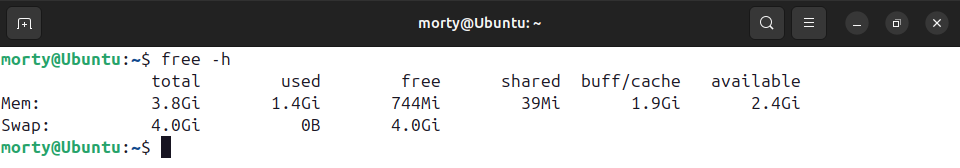

**Команда для мониторинга состояния памяти**

Теперь давайте попробуем выполнить команду с параметрами `-h -s 2 -c 5`. Что произойдёт?

Эта команда запустит мониторинг состояния памяти каждые 2 секунды, выполнив операцию пять раз подряд. Вы увидите динамическое обновление статистики памяти, что позволит вам отслеживать изменения во времени.

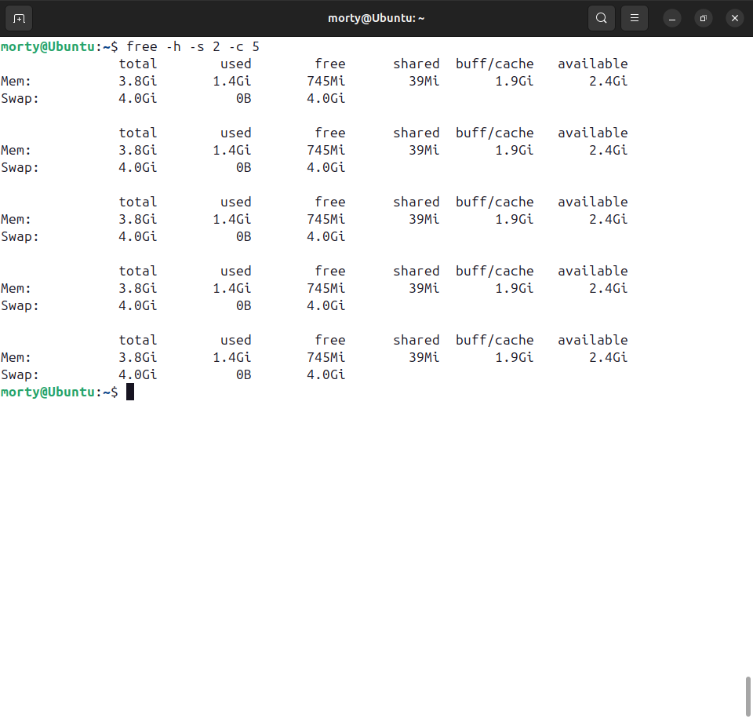

Это особенно полезно, когда нужно наблюдать за изменениями нагрузки на систему. В отличие от утилиты top, которая показывает лишь текущие значения, free предоставляет историю состояний, позволяя анализировать динамику использования памяти.

**Специальная файловая система /proc**

Файловая система /proc создается заново при каждом обращении к ней, основываясь на данных, хранящихся в оперативной памяти. В частности, она использует информацию о переменных ядра, статистике, процессах и их таблицах. Теоретически, вы можете изменять содержимое некоторых файлов в этой системе, тем самым изменяя настройки системы или значения переменных ядра. Однако, обычно эта файловая система используется для чтения информации. Каждый запущенный в системе процесс представлен отдельным подкаталогом внутри /proc, где хранится информация о нём.

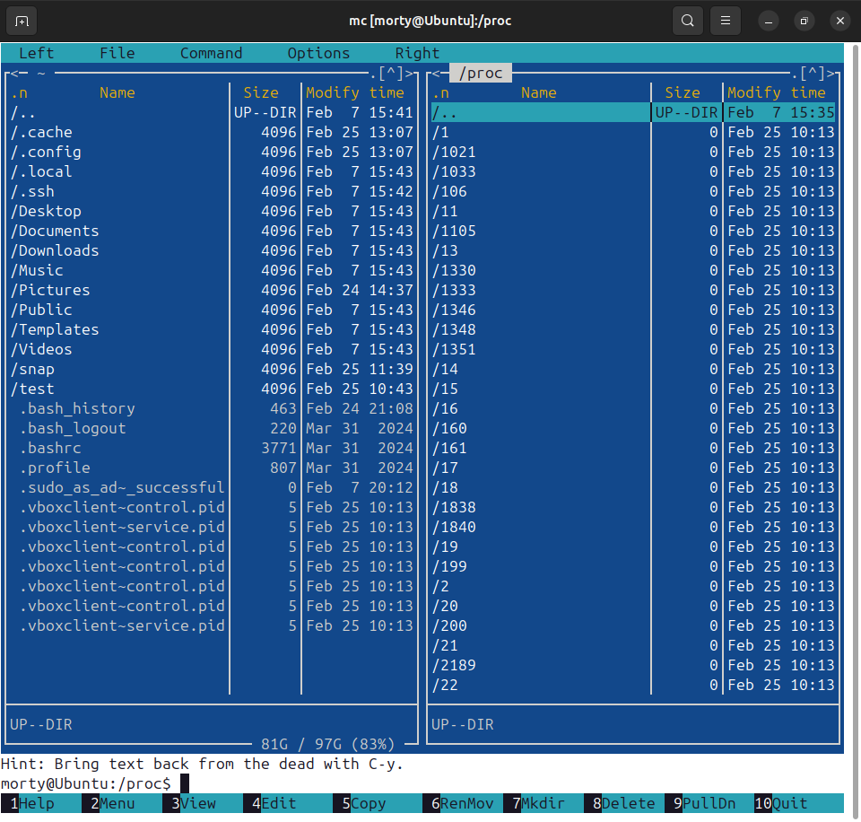

Сейчас давайте рассмотрим файл **/proc/meminfo**, содержащий подробную информацию о состоянии памяти в системе.

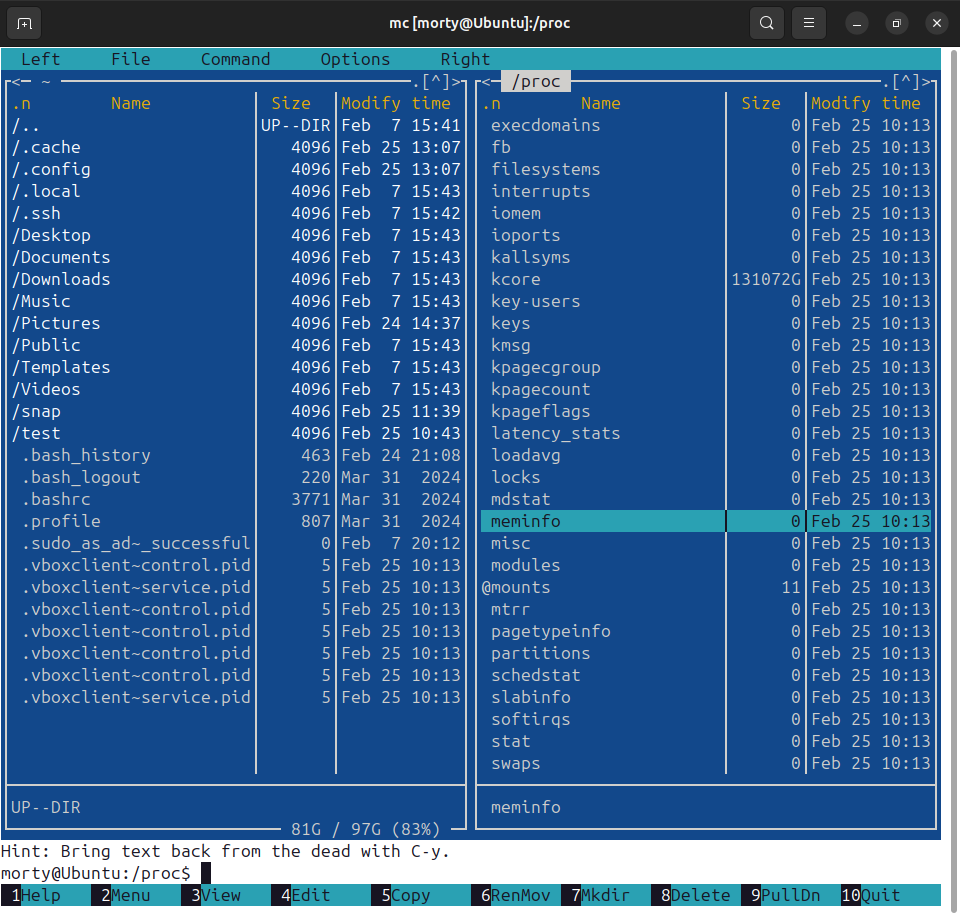

В этом файле вы найдёте данные о различных типах памяти, таких как буферы (Buffers), кэш (Cached), активная и неактивная память (Active, Inactive).

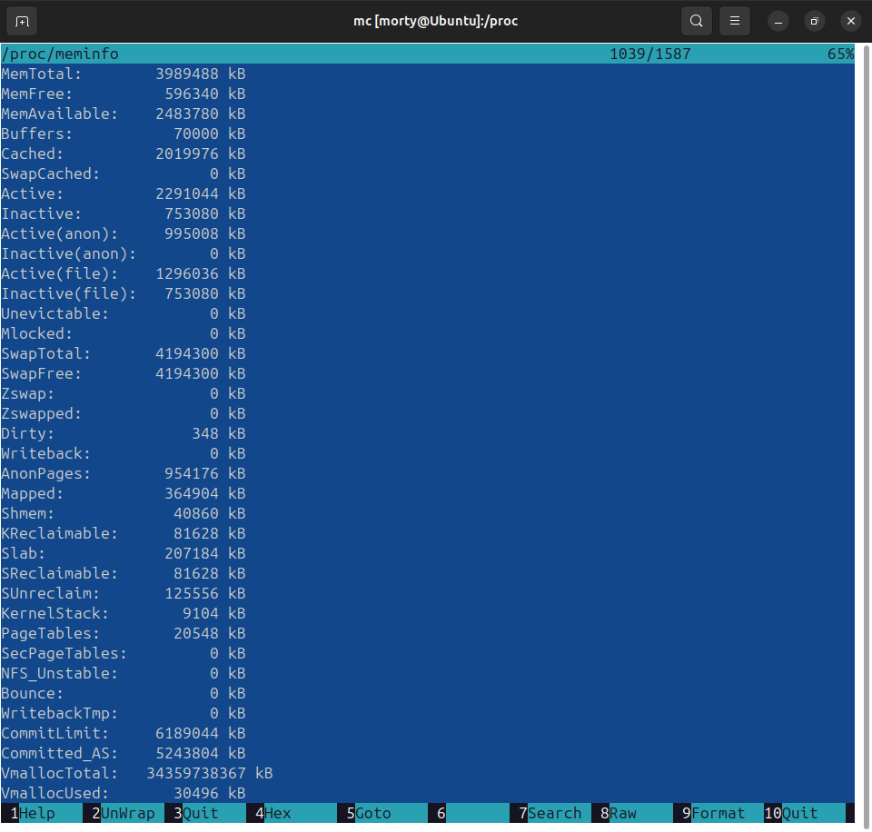

Важно отметить, что неактивная память не относится к завершённым процессам, как иногда ошибочно полагают. На самом деле, это память тех процессов, которые долгое время находились в режиме ожидания, например, ожидая завершения операции ввода-вывода. Такая память принадлежит активным процессам, просто они давно не выполняли никаких действий.

Далее идет разделение памяти на активную анонимную (Active (anon)) и неактивную анонимную (Inactive (anon)), а также активную файловую (Active (file)) и неактивную файловую (Inactive (file)). Напомним, что анонимная память — это память процессов, а файл-ассоциированная память — это та память, в которой отображены файлы, которые этим процессам требуются.

Также в этом файле содержится информация о swap-памяти и больших страницах (HugePages).

**Подведём итоги**

В работе с оперативной памятью Linux предоставляет разнообразные инструменты для анализа и мониторинга:

- top — утилита для мониторинга системных ресурсов, включая оперативную память. Позволяет настраивать интерфейс, сохранять пользовательские настройки и детально изучать использование памяти отдельными процессами.
- htop — вариант утилиты top с псевдографическим интерфейсом. Менее информативна чем top, зато показывает не только процессы, но и их потоки.
- free – утилита для просмотра общего состояния оперативной памяти. Отличается возможностью выбора единиц измерения и мониторинга динамики использования памяти через регулярные интервалы времени.
- Файловая система /proc — специальный механизм для доступа к состоянию памяти и другим системным параметрам. Файлы в этой системе создаются «на лету» и позволяют получить детальные сведения о текущем состоянии системы.

# Cache, TLB, MMU

**Из этого раздела вы узнаете:**

- Что такое кэш и почему он важен
- Как кэш помогает ускорить трансляцию страниц и что происходит, если кэша нет
- Какие виды кэша существуют
- Что такое TLB, его свойства и процесс работы
- Что такое MMU и для чего он нужен

**Cache, TLB, MMU**

- **Cache (кэш)** — промежуточный буфер с быстрым доступом для хранения информации, которая с большой вероятностью будет запрошена.

Кэш — это своего рода «быстрый шкафчик» для хранения информации, которую процессор использует чаще всего. Поскольку доступ к этой памяти происходит значительно быстрее, чем к основной памяти (RAM), программы могут работать эффективнее. Например, если ваш браузер загружает веб-страницу, он сначала сохранит ее в кэш, чтобы при следующем обращении загрузить быстрее.

- **TLB (translation lookaside buffer)** — это специальный кэш, который хранит соответствие страниц в виртуальной и физической памяти, которые с наибольшей вероятностью будут запрошены.

Когда программе нужен определенный участок памяти, вместо того чтобы каждый раз искать его в таблице страниц, она может быстро получить нужный физический адрес из TLB.

- **MMU (memory management unit)** — компонент аппаратного обеспечения компьютера, отвечающий за управление доступом к памяти.

Когда процессору нужен доступ к данным, он просит MMU передать ему нужный адрес. MMU проверяет, есть ли этот адрес в TLB, и если да, то быстро возвращает его. Если нет, MMU сам рассчитывает физический адрес и отправляет его в память.

Вот как все эти компоненты работают вместе:

1. Процессор хочет получить данные из памяти и отправляет запрос с виртуальным адресом в MMU.
2. MMU проверяет наличие этого адреса в TLB. Если адрес найден, MMU сразу получает соответствующий физический адрес.
3. Если адрес отсутствует в TLB, MMU ищет его в таблице страниц и обновляет TLB.
4. После получения физического адреса, MMU отправляет запрос в основную память.
5. Основная память возвращает данные, и MMU передает их обратно в процессор.

**Ускорение трансляции страниц**

Представьте себе, что ваш процессор – это студент, который делает домашнее задание. Он ищет нужную ему информацию и для этого обращается к разным источникам: книгам, интернету, конспектам лекций. В этом процессе важную роль играет кэш-память – своего рода шпаргалка, где хранятся самые важные и часто используемые данные.

Когда процессор делает запрос, он сначала смотрит в кэш. Если нужная информация там есть, это называется «попаданием в кэш» или «хитом». Процессор мгновенно получает доступ к этим данным, и работа продолжается без задержек. Если же данных в кэше нет, происходит «промах» или «низ», и процессор отправляет запрос на получение данных в основной оперативной памяти (RAM).

Когда данные поступают из основной памяти, они записываются в кэш вместе с тем участком памяти, который был запрошен. Это помогает ускорить последующие обращения к той же области памяти. Кэш использует специальный алгоритм, чтобы решить, какие данные оставить, а какие удалить, если кэш заполнен. Этот алгоритм основан на счётчике обращений к каждому блоку данных. Чем больше обращений было сделано к определенному блоку, тем дольше он остается в кэше.

Теперь представьте, что вы только начали работу над заданием. Ваш кэш пуст, поэтому вам нужно много раз обращаться к основным источникам информации. Постепенно кэш заполняется наиболее важными данными, и ваша работа ускоряется. Однако, если вы начинаете работать над другим заданием, кэш очищается, и вам снова придется потратить некоторое время на его прогрев.

*А что если бы кэша не было?*
*Каждый раз, когда процессору требуется информация, он будет вынужден обращаться к более медленной оперативной памяти или даже к накопителю. Это добавит задержки в миллисекунды, а иногда и секунды, которые в масштабах работы всей системы будут накапливаться, значительно снижая производительность. Браузер, вместо мгновенного отображения ранее посещённой страницы, каждый раз загружал бы её заново с сервера, затрачивая больше времени и сетевых ресурсов. Без кэша компьютеры и устройства работали бы заметно медленнее, особенно в задачах, где часто требуется доступ к одним и тем же данным.*

**Что хранит кэш**

В кэше могут храниться:

- Компоненты исполняемых программ
- Данные, с которыми работают исполняемые программы
- TLB

Теперь давайте разберёмся, почему промахи по кэшу (то есть ситуации, когда нужного элемента нет в кэше) различаются по значимости в зависимости от того, что именно было запрошено: код или данные.

Процессор всегда работает параллельно, выполняя сразу несколько инструкций одновременно. Представьте себе конвейерную линию, где каждая инструкция проходит через разные этапы обработки. Если одна команда завершена, следующая немедленно занимает её место.

Когда процессор запрашивает инструкцию из кэша, но её там нет, ему приходится ждать, пока она будет загружена из основной памяти. Это приводит к задержке во всей работе процессора, так как другие команды уже готовы к выполнению, но не могут продолжить без этой инструкции.

В случае с данными ситуация немного другая. Если нужные данные отсутствуют в кэше, процессор всё равно может продолжать выполнять другие команды, пока ожидаемые данные подтягиваются из памяти. Ведь сам код известен, и возможно, у нас есть все необходимые данные для других команд.

**Виды кэша**

Рассмотрим виды кэша.

- **Полностью ассоциативный кэш**

В полностью ассоциативном кэше мы заполняем ячейки по порядку. Когда кэш полон, новые данные заменяют старые. Вероятность нахождения нужной информации здесь выше, но поиск занимает больше времени, ведь приходится проверять каждую ячейку.

- **Кэш прямого отображения**

Представьте себе кэш размером 256 ячеек, каждая из которых может хранить один байт информации.
В кэше прямого отображения, чтобы определить, куда поместить информацию, мы берем младший байт адреса и используем его как индекс ячейки кэша. Это быстро, потому что нам не нужно выполнять сложные операции поиска. Однако, поскольку много разных адресов могут иметь одинаковый младший байт, шанс найти нужную информацию в такой системе довольно мал.

- **Множественный ассоциативный кэш**

Множественный ассоциативный кэш – это компромисс между двумя предыдущими типами. Здесь наш кэш делится на блоки, например, 16 блоков по 16 ячеек. Чтобы найти нужный блок, мы используем часть младшего байта адреса. Затем внутри этого блока мы проверяем каждую ячейку, чтобы найти нужные данные. Этот метод сочетает быстроту поиска с высокой вероятностью успеха.
Современные компьютеры чаще всего используют множественную ассоциативность с количеством ячеек в блоке равным 2 или 4. Увеличение числа ячеек редко приводит к значительному улучшению производительности, поэтому такие значения считаются оптимальными.
Теперь разберём виды кэша по архитектуре:

- **Cache L1**

  Этот кэш находится ближе всего к процессору и работает быстрее всех остальных. Его размер варьируется от 16 до 64 килобайт. Каждое процессорное ядро имеет свой собственный кэш L1.

- **Cache L2**

  Кэш второго уровня немного медленнее, но зато объемнее – от 128 до 512 килобайт. Как и L1, он принадлежит каждому ядру отдельно.

- **Cache L3**

  Третий уровень кэширования является общим для всех ядер процессора. Он значительно больше предыдущих уровней – примерно от 4 до 32 мегабайт. По мере развития технологий размеры кэша могут увеличиваться.

- **Cache L4**

  Если ваш процессор оснащён четвертым уровнем кэша, то он будет ещё больше и медленнее, чем предыдущие уровни.

**Латентность**

Для сравнения скоростей различных типов кэшей и других компонентов системы посмотрим на следующую таблицу.

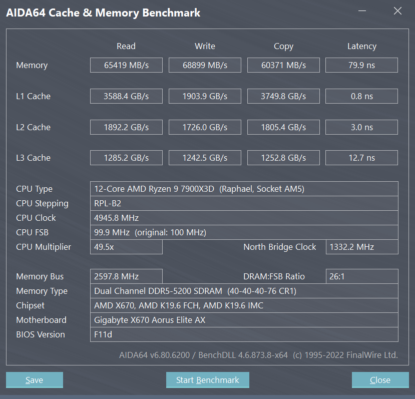

В данном случае нас интересует правая колонка — латентность (Latency).

Латентность – это время, которое проходит между запросом данных и получением первого пакета этих данных.

Например, у Cache L1 латентность может составлять около 1 наносекунды, у Cache L2 – 3 наносекунды, а у Cache L3 – около 13 наносекунд. Память (RAM) работает медленнее – около 80 наносекунд.

У самого быстрого SSD латентность составляет около 100 микросекунд. А у жёстких дисков латентность равна примерно 1,5 миллисекундам.

Как видите, устройства хранения данных намного медленнее оперативной памяти и кэшей.

**TLB, translation lookaside buffer**

**TLB (translation lookaside buffer, буфер ассоциативной трансляции)** — специализированный кэш центрального процессора, используемый для ускорения трансляции адреса виртуальной памяти в адрес физической памяти.

Как устроен TLB?

Подобно другим видам кэшей, TLB имеет несколько уровней. Адреса в нем организованы таким образом, что наиболее часто используемые находятся ближе всего к процессору. По своей скорости работы TLB находится между регистрами и кэш-памятью первого уровня (L1).

Регистр — это ячейка памяти, которая расположена внутри процессора и образует сверхбыструю оперативную память.

Почему важен TLB?

Когда процессор обращается к кэш-памяти L1, ему уже необходим физический адрес, поскольку виртуальный адрес на этом этапе больше не актуален. Поэтому TLB помогает ускорить процесс преобразования виртуальных адресов в физические до того, как начнётся обращение к кэш-памяти или основной памяти.

**Процесс работы TLB**

Теперь давайте пошагово рассмотрим, как происходит работа с TLB:

1. Виртуальный адрес. Сначала процессор получает виртуальный адрес данных, которые ему нужны.
2. Поиск в TLB. Процессор проверяет наличие данного виртуального адреса в TLB. Если такой адрес найден, то немедленно возвращается соответствующий физический адрес.
3. Передача физического адреса. Полученный физический адрес передаётся модулю управления памятью (MMU), который затем начинает поиск данных в кэшах (L1, L2, L3) и, при необходимости, в основной памяти.
4. Неудачный поиск в TLB. Если нужный виртуальный адрес отсутствует в TLB, процессор обращается к таблице страниц, которая содержит информацию обо всех страницах виртуальной памяти. В зависимости от ситуации возможны два сценария:
   - Страница уже отображена в памяти. Если страница уже находится в памяти, её физический адрес считывается, обновляется запись в TLB, и затем процесс продолжается так, как описано выше.
   - Страница не загружена. Если страница ещё не загружена в оперативную память, процессор инициирует чтение соответствующей страницы с диска. После загрузки страницы в память делается соответствующая запись в таблице страниц, и только после этого программа может продолжить работу с данными.

**Свойства TLB**

- **Специализированный аппаратный кэш процессора.**

  Ячейки этого кэша оптимизированы под хранение именно адресной информации и полностью соответствуют разрядности вашего процессора. То есть, если у вас 64-битная система, то и TLB будет работать с 64-битными адресами.

- **TLB хранит часто используемые записи таблицы страниц.**

  Если страница используется редко, она просто не остаётся в TLB. Таким образом, TLB помогает ускорить доступ к памяти за счёт того, что наиболее востребованные данные всегда находятся «под рукой».

- **TLB-кэш внутренне схож с LX-кэшами.**

  Только служит для трансляции виртуальных адресов и представляет собой таблицу из сетов, внутри которых записи: «виртуальный адрес ↔ физический адрес».

  Вы уже знакомы с многоуровневыми кэшами, такими как L1, L2, L3. Так вот, TLB устроен по тому же принципу. Например, в уровне L1 хранятся младшие части адресов, а в уровнях выше добавляются следующие части адреса. На самом верхнем уровне, например, в L4, будут храниться полные адреса.

- **PML4 адресована только по физическим адресам, поэтому может кэшироваться только в L2-L3-кэшах**

  PML4 (верхний уровень таблицы страниц) работает только с физическими адресами, а не с виртуальными. Это значит, что данные из неё могут сохраняться для быстрого доступа только в кэшах уровней L2 и L3 процессора, которые работают с физической памятью. В L1-кэшах, которые чаще используются для виртуальных адресов, её закэшировать нельзя.

**MMU, memory management unit**

**Memory management unit (MMU, модуль управления памятью)** — компонент аппаратного обеспечения компьютера, отвечающий за управление доступом к памяти, запрашиваемым центральным процессором.

Когда процессор инициирует запрос на доступ к данным, MMU начинает свою работу. Первым шагом является преобразование виртуального адреса, который использует программа, в физический адрес, который указывает на конкретное место в оперативной памяти. Это преобразование происходит с помощью таблиц страниц и буфера ассоциативной трансляции (TLB). Если нужная запись находится в TLB, процессор может сразу получить доступ к данным без необходимости обращения к более медленным таблицам страниц.

Получив данные из оперативной памяти, MMU передаёт их в кэш процессора — своего рода «быструю память», где информация хранится временно для быстрого доступа.

Теперь представим, что эти данные понадобятся снова. Вместо того, чтобы каждый раз обращаться к медленной основной памяти, процессор просто обращается к своему кэшу, где уже хранятся нужные данные. Это значительно ускоряет выполнение задач, так как работа с кэшем происходит намного быстрее, чем с основной памятью.

**Подведём итоги:**

- **Cache** — промежуточный буфер с быстрым доступом для хранения часто используемых данных. Уменьшает задержки при доступе к основной памяти (RAM).
- **TLB (Translation Lookaside Buffer)** — специальный кэш для хранения соответствия виртуальных и физических адресов. Тесно связан с работой MMU и помогает ускорить трансляцию адресов. Ячейки TLB оптимизированы под хранение адресной информации и соответствуют разрядности процессора.
- **MMU (Memory Management Unit)** — аппаратный компонент, управляющий доступом к памяти. Обеспечивает трансляцию виртуальных адресов в физические и управляет доступом к основной памяти. Работает совместно с TLB и кэшами для оптимизации доступа к данным.

# SWAP

**Из этого раздела вы узнаете:**

- Что такое SWAP и для чего он используется
- Как SWAP влияет на производительность системы
- Какой объём памяти рекомендуется выделять под SWAP
- Особенности использования SWAP в режиме гибернации

**SWAP (файл подкачки) — механизм виртуальной памяти, при котором часть данных из оперативной памяти (ОЗУ) перемещается на хранение в ПЗУ.**

Представьте себе ситуацию: у вас есть ограниченный объём RAM, и вдруг вам нужно запустить программу, которая требует больше памяти, чем у вас имеется. Вот тут-то и приходит на помощь SWAP. Система выделяет часть вашего жёсткого диска или SSD под так называемый файл подкачки, куда временно перемещаются данные из оперативной памяти, освобождая место для активных задач.

**Как это работает?**

Когда система сталкивается с нехваткой оперативной памяти, она выбирает наименее активные процессы и выгружает их данные в SWAP. Это позволяет освободить оперативную память для выполнения текущих задач. Когда же эти процессы вновь становятся активными, их данные возвращаются обратно в оперативную память из файла подкачки.

Таким образом, мы можем сказать, что SWAP – это своего рода «виртуальное расширение» вашей оперативной памяти. Конечно, скорость доступа к данным на жёстком диске значительно ниже, чем к оперативной памяти, но зато у вас появляется возможность запускать больше программ одновременно.

**Почему использование SWAP может снижать производительность?**

Использование SWAP действительно может снизить общую производительность системы. Дело в том, что доступ к данным на жёстком диске занимает намного больше времени, чем доступ к оперативной памяти. Например, латентность оперативной памяти составляет около 100 наносекунд, тогда как латентность SSD-диска – порядка 100 микросекунд. Разница существенная. И если система часто обращается к файлу подкачки, это может привести к заметному снижению скорости работы.

Однако наличие SWAP полезно в критических ситуациях, когда системе необходимо срочно освободить оперативную память. Без SWAP система могла бы просто зависнуть или начать завершать программы принудительно, что крайне нежелательно.

**Рекомендации по использованию SWAP**

Обычно рекомендуется иметь определенный объем SWAP, даже если ваша система обладает большим количеством оперативной памяти. Это связано с тем, что иногда могут возникать ситуации, когда система неожиданно начнёт потреблять много памяти, например, при работе с большими файлами или запуске ресурсоёмких приложений. Наличие SWAP позволит избежать внезапных сбоев и даст вам время разобраться в проблеме.

На таблице ниже представлены рекомендации по размеру SWAP:

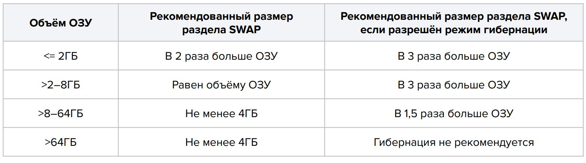

Если посмотреть на эту таблицу внимательно, можно заметить, что в среднем 4 ГБ памяти в SWAP рекомендуется иметь в любом случае. 

**Гибернация и SWAP**

Существуют два состояния, которые система может принимать по необходимости или по команде — это сон (suspend) и гибернация (hibernate).

В состоянии сна все процессы приостанавливаются, процессор переходит в режим наименьшего энергопотребления, но память при этом остаётся активной.

Состоянию гибернации свойственен немного другой процесс.

Гибернация – это особый режим энергосбережения, при котором содержимое оперативной памяти сохраняется на жёсткий диск, а затем система полностью выключается. При следующем включении данные восстанавливаются из файла подкачки, и работа продолжается с того момента, на котором вы остановились.

Этот режим полезен, например, для ноутбуков, когда вам нужно прервать работу, но вы хотите вернуться к тому месту, на котором остановились, без потери данных. Однако для успешной гибернации необходим достаточный объем SWAP, поскольку вся информация из оперативной памяти должна быть сохранена на диск.

**Подведём итоги**

- SWAP представляет собой механизм виртуальной памяти, который позволяет системе использовать часть жёсткого диска или SSD для временного хранения данных из оперативной памяти, освобождая её для более важных процессов.
- Когда системе не хватает оперативной памяти, она переносит менее активные процессы в файл подкачки, освобождая ресурсы для выполнения текущих задач. Когда эти процессы снова становятся активными, их данные возвращаются обратно в оперативную память.
- Несмотря на то, что SWAP расширяет возможности системы работать с большим объемом данных, он снижает общую производительность, так как доступ к данным на жёстком диске происходит медленнее, чем к оперативной памяти.
- Рекомендуется всегда иметь определенное количество места под SWAP, даже если у вас достаточно оперативной памяти. Это поможет предотвратить возможные проблемы при неожиданном увеличении нагрузки на систему.
- Гибернация — это режим энергосбережения, при котором содержимое оперативной памяти сохраняется на жёсткий диск перед полным отключением устройства. Для успешного использования этого режима требуется достаточное количество пространства в файле подкачки.
- В зависимости от объёма оперативной памяти, размер SWAP варьируется. В среднем рекомендуется иметь минимум 4 ГБ выделенного пространства под SWAP.

# Обзор утилит Linux для работы с cache и SWAP

**Из этого раздела вы узнаете:**

- Какие команды позволяют управлять параметрами кэша и его содержимым
- Какие команды используются для настройки SWAP

**Команды Linux для работы с кэшем**

В этом разделе мы перейдём к рассмотрению уже не кэша памяти, а кэша ввода-вывода. Кэш ввода-вывода отличается от кэша памяти тем, что мы можем активно им управлять, в отличие от кэша процессора, где наши возможности сильно ограничены.

Для настройки параметров кэша ввода-вывода используется утилита sysctl. Нас интересуют параметры, содержащие слово dirty, так как именно они управляют поведением кэша.

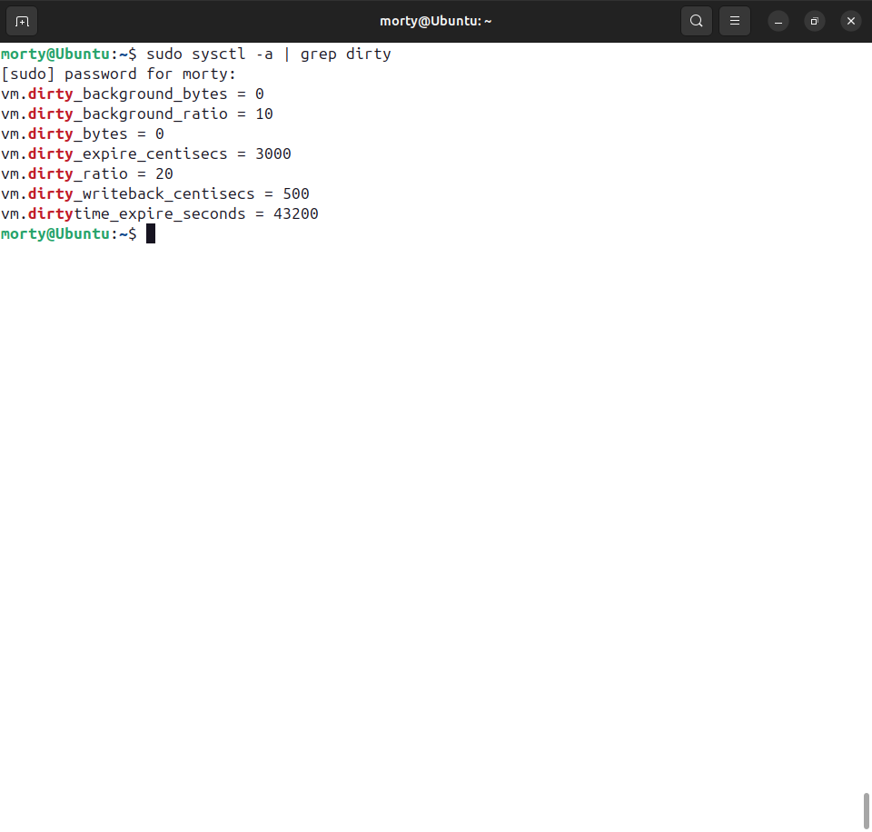

Давайте рассмотрим два основных параметра:

1. **dirty_background_bytes** — определяет количество байт, после которого включается фоновая запись данных на диск.

2. **dirty_background_ratio** — указывает процентное соотношение занятой памяти, после достижения которого также начинается фоновая запись.

Эти параметры позволяют контролировать, когда система начнёт сохранять данные на диск. Например, если количество кэша превышает определенное значение (dirty_background_bytes) или определенный процент от общей памяти (dirty_background_ratio), то активируются фоновые процессы записи данных на диск.

Напомним, что количество кэша можно посмотреть с помощью утилиты top.

Следующая пара параметров:

3. **dirty_bytes** — максимальное количество байт, которое может находиться в кэше перед тем, как будут приостановлены операции ввода-вывода.

4. **dirty_ratio** — максимальный процент от общей памяти, который может занимать кэш перед временной остановкой операций ввода-вывода.

Эти параметры предотвращают переполнение кэша и потерю важных данных при сбоях питания.

5. **dirty_expire_centisecs** — устанавливает время хранения данных в кэше до их автоматической записи на диск. Если данные находятся в кэше дольше указанного времени (например, 30 секунд) и не изменяются, они автоматически сохраняются на диск.

**Команда sync**

Представьте себе ситуацию: вы работаете над важным проектом, и вдруг возникает риск, что ваша система может зависнуть или выключиться из-за проблем с электропитанием. Что делать? Как сохранить свои данные?

Для таких случаев существует команда **sync**.

Она позволяет вам принудительно сбросить все данные из кэшей на диск. После выполнения этой команды управление вернётся к вам только после того, как все данные будут успешно записаны. Это особенно полезно, когда идет интенсивная работа с диском, и вы хотите убедиться, что все изменения сохранены. Например, перед тем как выполнить потенциально опасное действие, которое может вызвать сбой системы, просто выполните команду sync, чтобы минимизировать риски потери данных.

**Очистка кэшей**

Теперь поговорим о том, как очистить кэши. Это вовсе не означает потерю всех изменений. Мы говорим об освобождении памяти от ненужных данных, сохраняя при этом важные изменения. Для этого используется путь **/proc/sys/vm/drop_caches**.

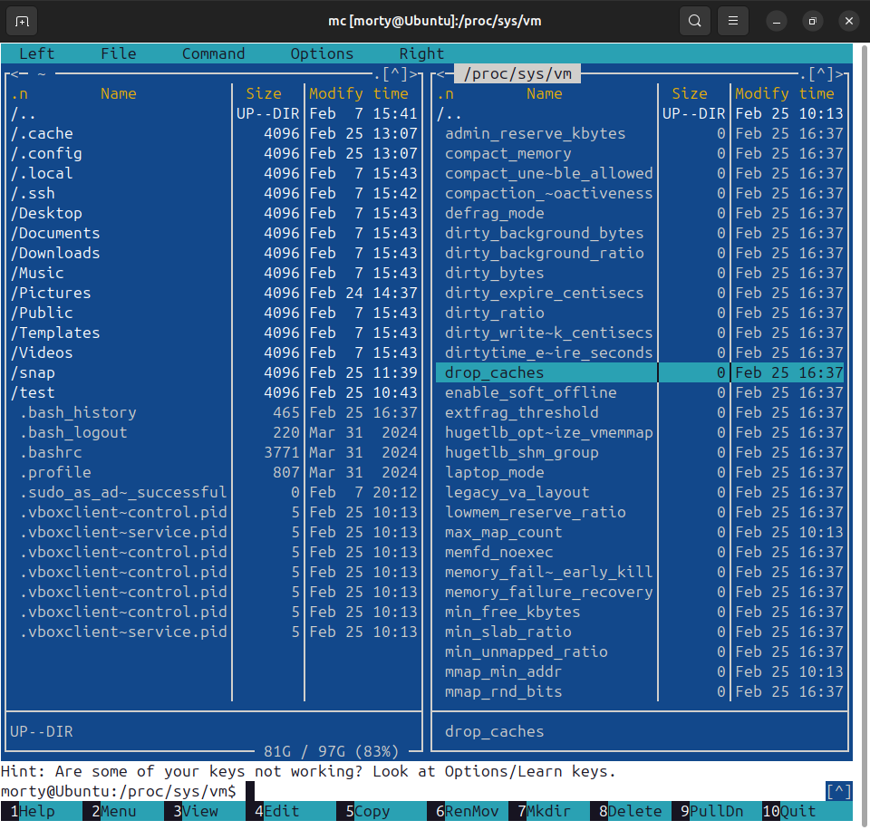

Файл **drop_caches** изначально пуст, потому что он предназначен только для записи (не для чтения). В этот файл можно записать три различных значения:

- **echo 1 > /proc/sys/vm/drop_caches** — очищает PageCache, то есть кэш с данными файлов
- **echo 2 > /proc/sys/vm/drop_caches** — очищает кэш метаданных (inode и dentrie)
- **echo 3 > /proc/sys/vm/drop_caches** — очищает и кэш данных, и кэш метаданных

**Обзор утилит Linux для работы со SWAP**

**Проверка наличия SWAP**

Для начала давайте убедимся, что в нашей системе действительно отсутствует swap. Существует несколько способов проверки:

1. **Утилита top.**

Запускаем top, чтобы посмотреть общую информацию о состоянии системы. Если значение в строке MiB Swap равно 0, значит, swap не используется.

2. **Команда swapon -s.**
Эта команда выводит список всех активных swap-разделов или файлов. Если вывод пустой, значит, в системе нет активного swap.

3. **Файл /proc/meminfo.**
С помощью команды grep Swap /proc/meminfo можно найти строки, связанные с использованием swap. Значения SwapTotal и SwapFree показывают общий объём и свободное пространство swap соответственно. Если оба значения равны 0, значит, swap не используется.

4. **Команда free –h.**
Ещё один способ проверить наличие или отсутствие swap, это команда free -h. На примере ниже мы видим, что все значения напротив строки Swap равны нулю, значит, swap не используется.

**Создание SWAP-файла**

Мы убедились в том, что в нашей системе swap отсутствует. Но что, если нам надо его создать? Посмотрим, как это сделать.

1. **Создаём файл.** Выполните команду: fallocate -l 2G /swapfile
Она создаст файл размером 2 ГБ. Если fallocate не поддерживается вашей файловой системой (например, BTRFS), используйте:

dd if=/dev/zero of=/swapfile bs=1M count=2048

2. **Форматируем файл.** Чтобы файл использовался как swap, выполните: mkswap /swapfile

3. **Настраиваем права доступа.** Для безопасности установите права 600, чтобы только владелец мог читать и писать: chmod 600 /swapfile

4. **Активируем swap.** Сделайте файл активным: swapon /swapfile

Убедитесь, что всё прошло успешно: swapon --show

**Автоматическое подключение SWAP**

Чтобы swap-файл подключался автоматически при загрузке системы, необходимо добавить соответствующую запись в файл **/etc/fstab**.

1. Откройте файл /etc/fstab в любом текстовом редакторе, например: `nano /etc/fstab`

2. Добавьте строку в конец файла:

    `/swapfile none swap sw 0 0`

3. Сохраните изменения и закройте редактор. Теперь swap будет подключаться автоматически при каждом запуске системы.

Здесь `/swapfile` — путь к файлу, `none` означает, что файл не монтируется в какую-либо точку файловой системы, `swap` — тип файловой системы, а `sw 0 0` — параметры монтирования и настройки проверки файловой системы:

  - **sw** — указывает, что это swap (файл для подкачки); 
  - **первый 0** — означает, что не нужно архивировать swap;
  - **второй 0** — указывает, что не требуется выполнять проверку файловой системы (fsck) на swap.

**Отключение SWAP-файла**

Если swap вам больше не нужен, его можно выключить с помощью команды **swapoff /swapfile**

После ввода команды проверяем top и видим, что swap больше не используется в системе.

**Команды для тонкой настройки SWAP**

Рассмотрим подробнее параметр **swappiness**.

Этот параметр определяет, насколько активно система использует swap вместо оперативной памяти. Значение варьируется от 0 до 100. Чем ниже значение, тем реже система обращается к swap. Например, если swappiness установлен на 10, то система будет использовать swap только тогда, когда оперативная память заполнится на 90%.

- Чтобы просмотреть текущее значение swappiness, используйте команду:
    `cat /proc/sys/vm/swappiness`
- Чтобы изменить значение, выполните:
    `sudo sysctl vm.swappiness=10`
- Для постоянного сохранения изменений добавьте строку в файл /etc/sysctl.conf:
    `vm.swappiness=10`

**Подведём итоги**

- Утилиты для управления кэшем регулируют его параметры и содержимое.
    - Параметры **dirty_background_bytes** и **dirty_background_ratio** определяют условия запуска фоновых процессов записи данных на диск.
    - Параметры **dirty_bytes** и **dirty_ratio** устанавливают максимальные пределы заполнения кэша перед временной остановкой операций ввода-вывода.
    - Параметр **dirty_expire_centisecs** задает время хранения данных в кэше перед их автоматической записью на диск.
    - Команда **sync** позволяет принудительно сбросить все данные из кэшей на диск.
    - Очистка кэшей осуществляется через запись значений в файл **/proc/sys/vm/drop_caches**.
- Для работы со SWAP используются следующие команды:
    - Проверку наличия SWAP можно осуществить с помощью команд **top**, **swapon -s**, просмотра файла **/proc/meminfo** или команды **free -h**.
    - Создание SWAP-файла включает этапы создания самого файла (fallocate), его форматирования (mkswap) и активации (swapon).
    - Автоматическая активация SWAP достигается добавлением соответствующей записи в файл **/etc/fstab**.
    - Отключение SWAP выполняется командой **swapoff**.
    - Параметр **swappiness** отвечает за то, насколько активно используется SWAP вместо оперативной памяти.

# Дополнительные материалы к занятию «Память, управление памятью»

• [Статья](https://xakep.ru/2021/03/05/linux-processes-and-memory/) «Процессы и память в Linux. Отрывок из книги «Внутреннее устройство Linux»
• [Статья](https://wiki.archlinux.org/title/Power_management_(%D0%A0%D1%83%D1%81%D1%81%D0%BA%D0%B8%D0%B9)/Suspend_and_hibernate_(%D0%A0%D1%83%D1%81%D1%81%D0%BA%D0%B8%D0%B9)) «Power management/Suspend and hibernate» про управление питанием (оригинальная статья на английском языке)