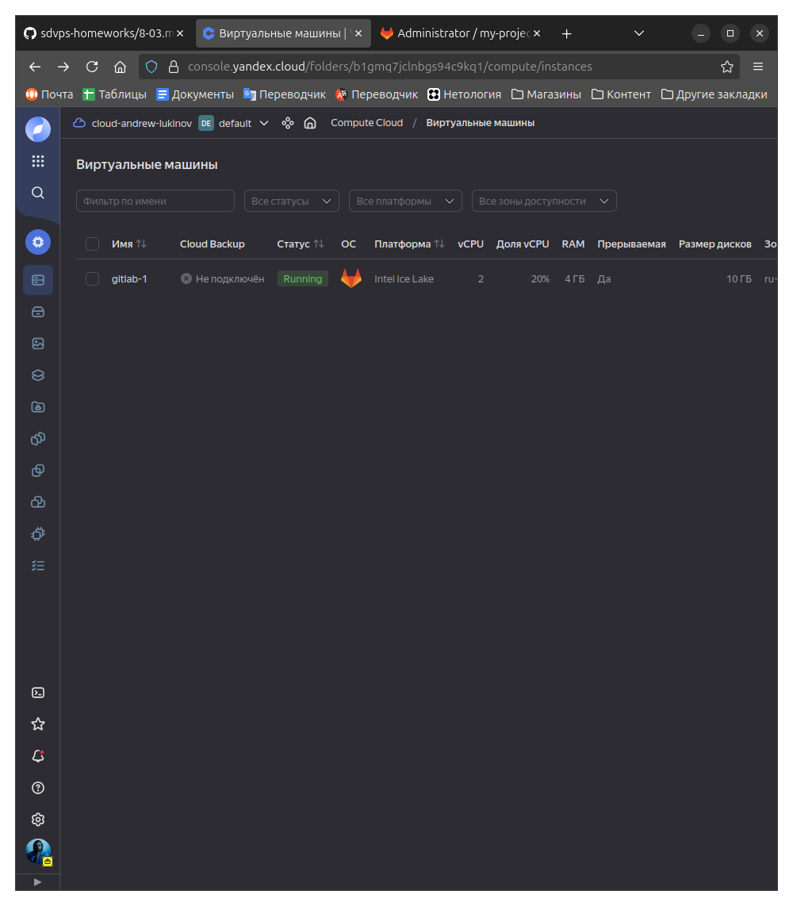
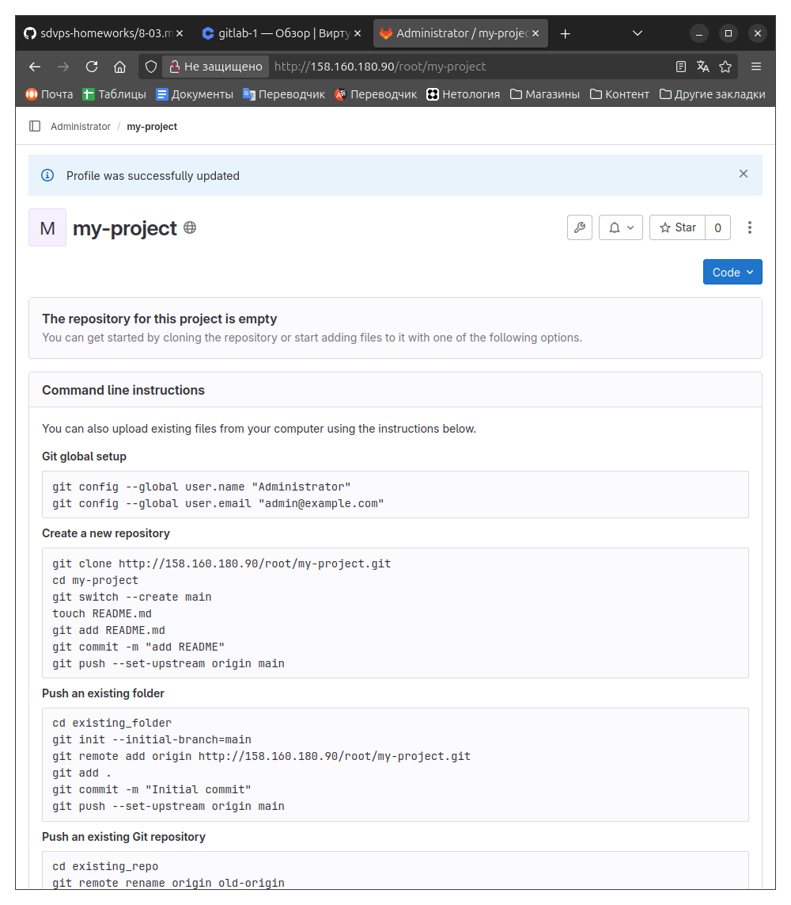
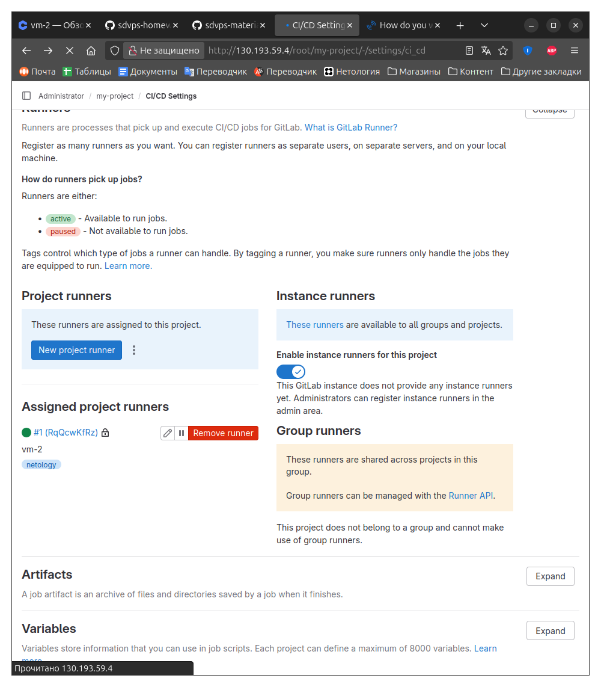
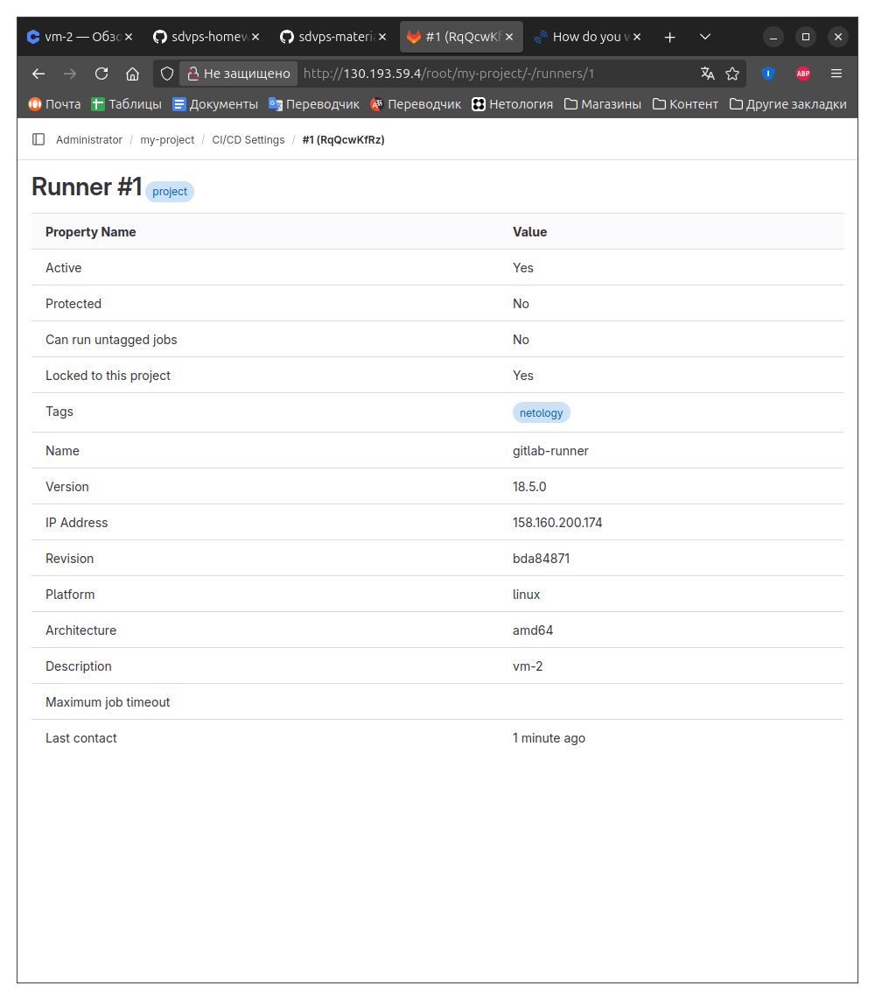
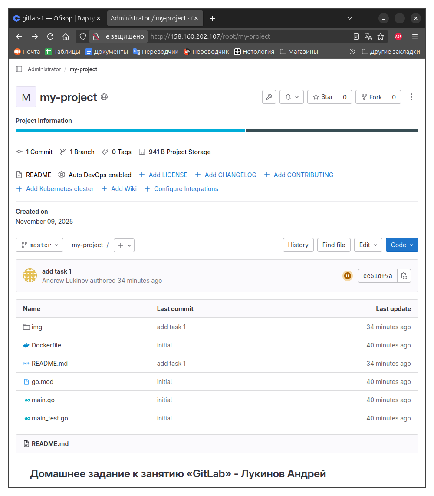
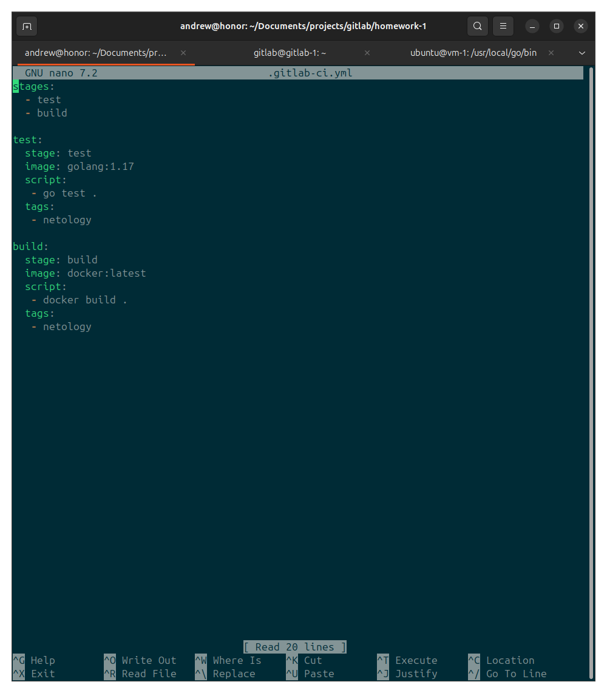
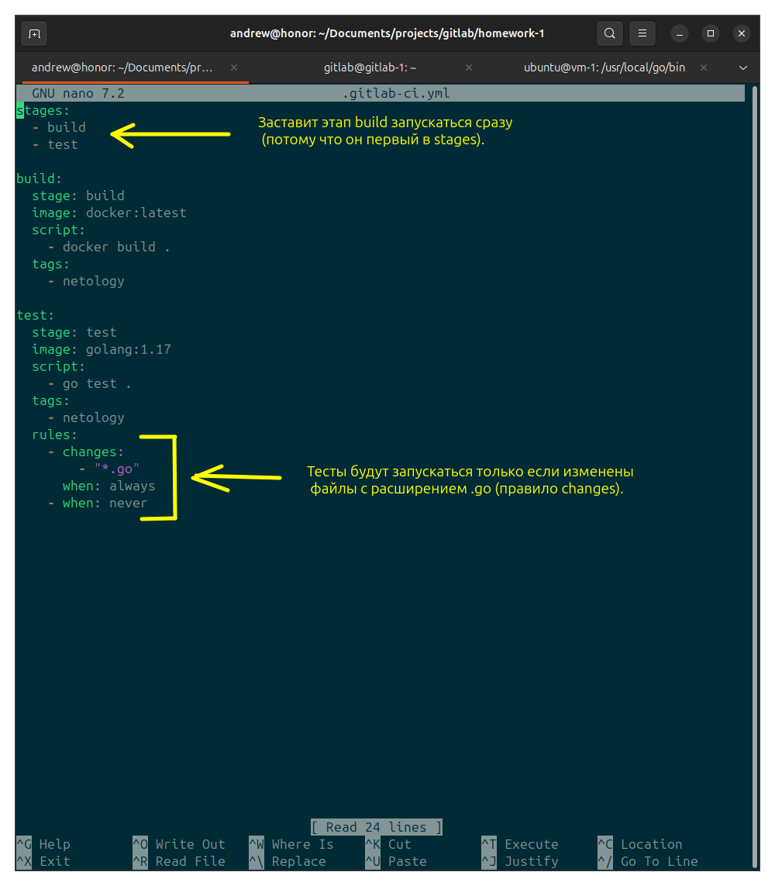

# Домашнее задание к занятию «GitLab» - Лукинов Андрей

## Задание 1

Что нужно сделать:

- Разверните GitLab локально, используя Vagrantfile и инструкцию, описанные в этом репозитории.

- Создайте новый проект и пустой репозиторий в нём.

- Зарегистрируйте gitlab-runner для этого проекта и запустите его в режиме Docker. Раннер можно регистрировать и запускать на той же виртуальной машине, на которой запущен GitLab.

## Задание 2

Что нужно сделать:

- Запушьте репозиторий на GitLab, изменив origin. Это изучалось на занятии по Git.

- Создайте .gitlab-ci.yml, описав в нём все необходимые, на ваш взгляд, этапы.

## Задание 3*

Измените CI так, чтобы:

- Этап сборки запускался сразу, не дожидаясь результатов тестов;
- Тесты запускались только при изменении файлов с расширением *.go.

