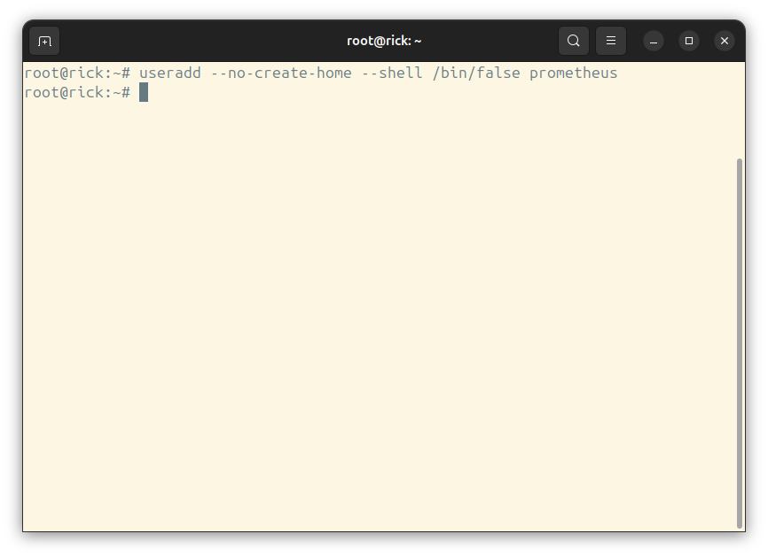
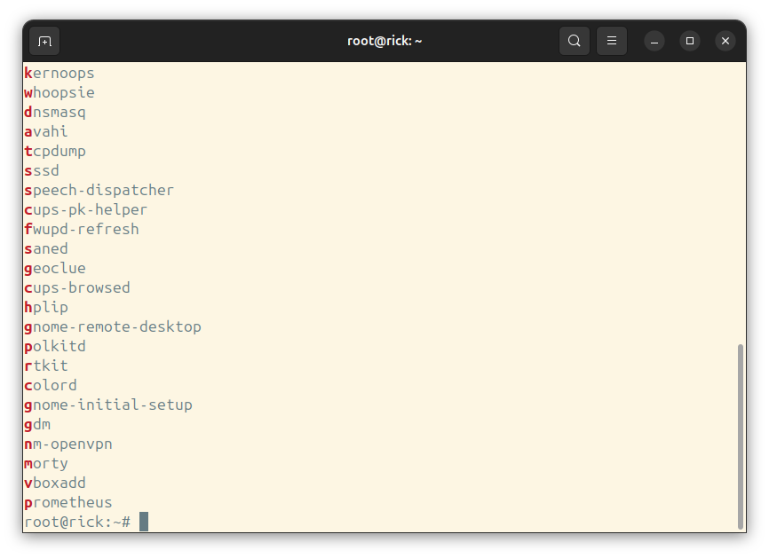
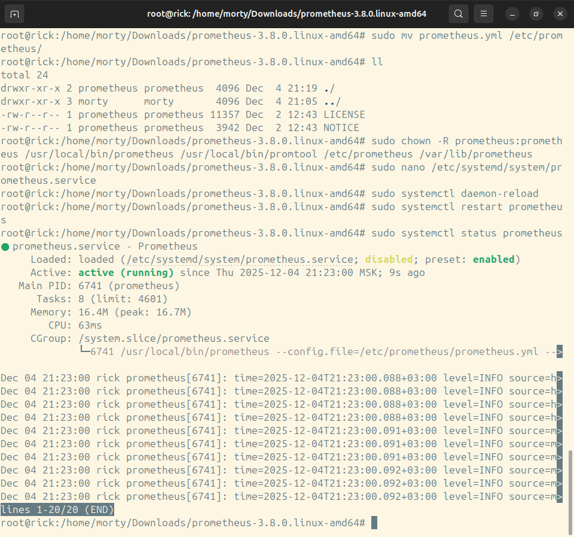
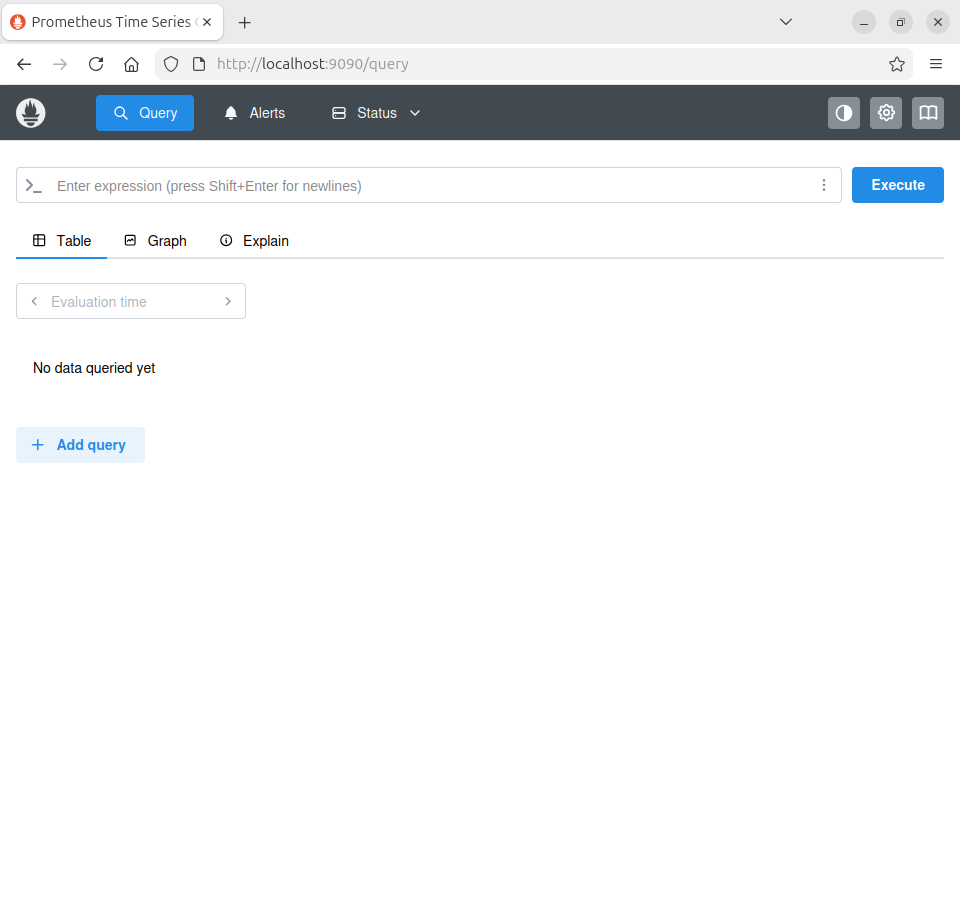
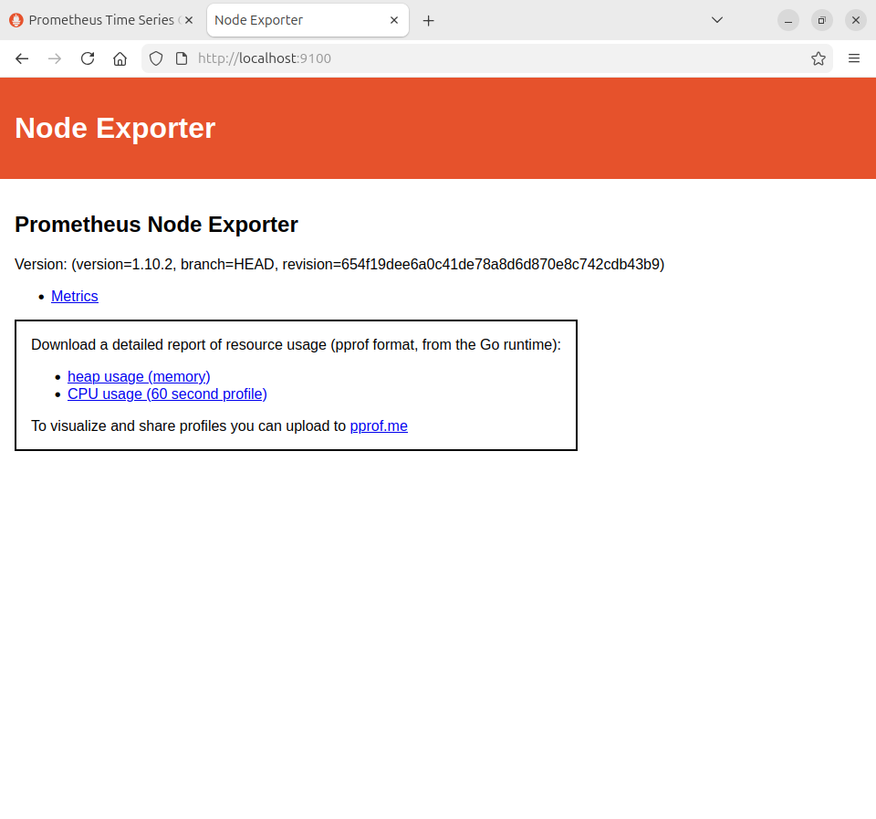
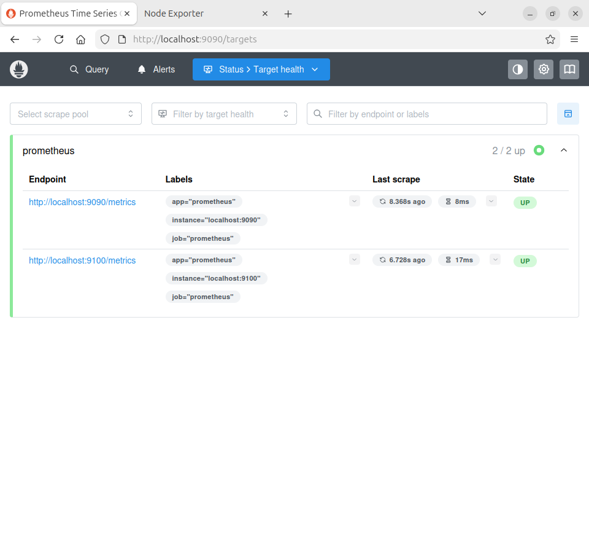

# Домашнее задание к занятию «Система мониторинга Prometheus» - Лукинов Андрей

## Задание 1
Установите Prometheus.

## Процесс выполнения
1. Выполняя задание, сверяйтесь с процессом, отражённым в записи лекции
2. Создайте пользователя prometheus

- sudo useradd -s /sbin/nologin --system -g prometheus prometheus
- sudo mkdir /etc/prometheus
- sudo mkdir /var/lib/prometheus





3. Скачайте prometheus и в соответствии с лекцией разместите файлы в целевые директории

- wget https://github.com/prometheus/prometheus/releases
- tar -zxvf prometheus-*.linux-amd64.tar.gz
- cd prometheus-*-linux-amd64/
- sudo mv prometheus promtool /usr/local/bin/
- sudo mv prometheus.yml /etc/prometheus/
- sudo chown -R prometheus:prometheus /usr/local/bin/prometheus /usr/local/bin/promtool /etc/prometheus /var/lib/prometheus

4. Создайте сервис как показано на уроке

- sudo nano /etc/systemd/system/prometheus.service
    <details>
    <summary>prometheus.service</summary>

    ```bash
    [Unit]
    Description=Prometheus
    Wants=network-online.target
    After=network-online.target

    [Service]
    User=prometheus
    Group=prometheus
    Type=simple
    ExecStart=/usr/local/bin/prometheus \
    --config.file=/etc/prometheus/prometheus.yml \
    --storage.tsdb.path=/var/lib/prometheus/ \
    --web.listen-address=0.0.0.0:9090

    [Install]
    WantedBy=multi-user.target
    ```

    </details>

5. Проверьте что prometheus запускается, останавливается, перезапускается и отображает статус с помощью systemctl

- sudo systemctl daemon-reload
- systemctl enable prometheus.service
- sudo systemctl start prometheus.service





## Задание 2
Установите Node Exporter.

## Процесс выполнения
1. Выполняя ДЗ сверяйтесь с процессом отражённым в записи лекции.
3. Скачайте node exporter приведённый в презентации и в соответствии с лекцией разместите файлы в целевые директории.

- wget https://github.com/prometheus/node_exporter/releases
- tar xvfz node_exporter-1.10.2.linux-amd64.tar.gz
- cd node_exporter-1.10.2.linux-amd64/
- mkdir /etc/prometheus/node-exporter
- mv ./node_exporter /etc/prometheus/node-exporter/
- chown prometheus:prometheus /etc/prometheus/node-exporter/node_exporter

4. Создайте сервис для как показано на уроке

- sudo nano /etc/systemd/system/node-exporter.service
    <details>
    <summary>node-exporter.service</summary>

    ```bash
    [Unit]
    Description=Node Exporter Lesson 9.4
    After=network.target

    [Service]
    User=prometheus
    Group=prometheus
    Type=simple
    ExecStart=/etc/prometheus/node-exporter/node_exporter

    [Install]
    WantedBy=multi-user.target
    ```
    </details>

1. Проверьте что node exporter запускается, останавливается, перезапускается и отображает статус с помощью systemctl

- sudo systemctl daemon-reload
- sudo systemctl enable node-exporter.service
- sudo systemctl start node-exporter.service



## Задание 3
Подключите Node Exporter к серверу Prometheus.

## Процесс выполнения
1. Выполняя ДЗ сверяйтесь с процессом отражённым в записи лекции.
2. Отредактируйте prometheus.yaml, добавив в массив таргетов установленный в задании 2 node exporter

- sudo nano /etc/prometheus/prometheus.yml


3. Перезапустите prometheus

- sudo systemctl restart prometheus.service

4. Проверьте что он запустился



## Задание 4*
Установите Grafana.

- https://grafana.com/grafana/download # Edition: OSS
- sudo apt-get install -y adduser libfontconfig1 musl
- wget https://dl.grafana.com/grafana/release/12.3.0/grafana_12.3.0_19497075765_linux_amd64.deb
- sudo dpkg -i grafana_12.3.0_19497075765_linux_amd64.deb
- sudo systemctl daemon-reload
- sudo systemctl enable grafana-server.service
- sudo systemctl start grafana-server.service


### Задание 5*
Интегрируйте Grafana и Prometheus.

- Configuration -> Data Sources -> Add data source
- Выбрать Prometheus, в поле URL указать http://localhost:9090 (или IP сервера Prometheus)
- Dashboards -> Import
- ID 1860

