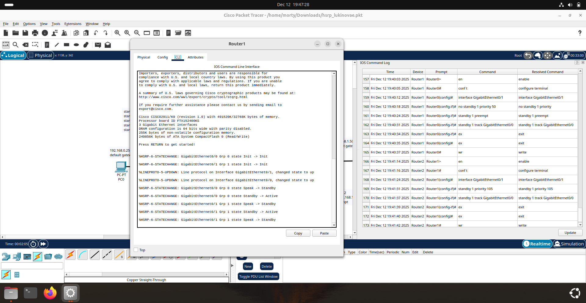
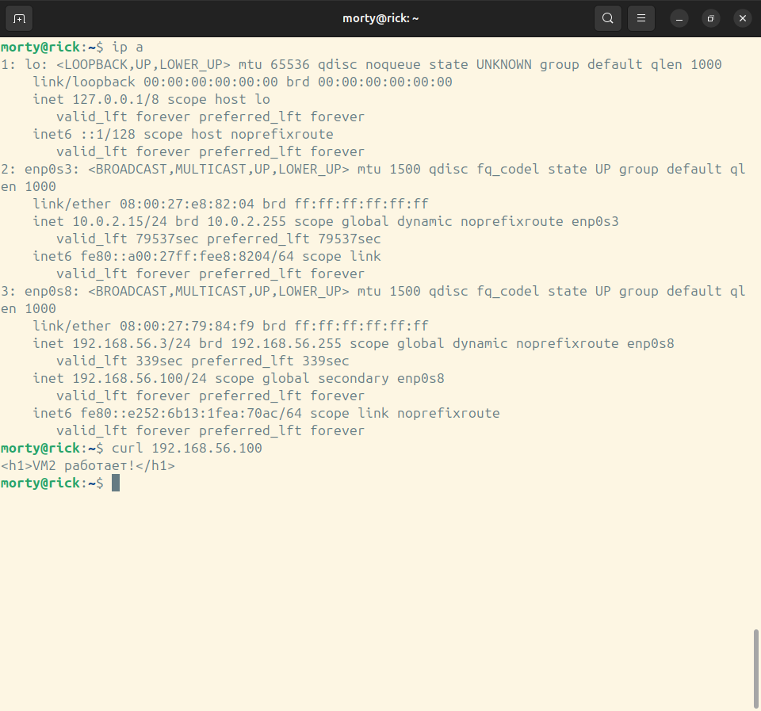

# Домашнее задание к занятию 1 «Disaster recovery и Keepalived» - Лукинов Андрей

## Задание 1
- Дана схема для Cisco Packet Tracer, рассматриваемая в лекции.
- На данной схеме уже настроено отслеживание интерфейсов маршрутизаторов Gi0/1 (для нулевой группы)
- Необходимо аналогично настроить отслеживание состояния интерфейсов Gi0/0 (для первой группы).
- Для проверки корректности настройки, разорвите один из кабелей между одним из маршрутизаторов и Switch0 и запустите ping между PC0 и Server0.
- На проверку отправьте получившуюся схему в формате pkt и скриншот, где виден процесс настройки маршрутизатора.



[Получившаяся схема](./files/hsrp_lukinovae.pkt)

<details>
<summary> Команды, которые использовал для настройки </summary>

```
Router1
en
conf t
interface GigabitEthernet0/1
standby 1 preempt
standby 1 track GigabitEthernet0/0
ex
ex
wr

Router2
en
conf t
interface GigabitEthernet0/1
standby 1 priority 105
standby 1 track GigabitEthernet0/0
ex
ex
wr
```
</details>

## Задание 2
- Запустите две виртуальные машины Linux, установите и настройте сервис Keepalived как в лекции, используя пример конфигурационного [файла](1/keepalived-simple.conf).
- Настройте любой веб-сервер (например, nginx или simple python server) на двух виртуальных машинах
- Напишите Bash-скрипт, который будет проверять доступность порта данного веб-сервера и существование файла index.html в root-директории данного веб-сервера.
- Настройте Keepalived так, чтобы он запускал данный скрипт каждые 3 секунды и переносил виртуальный IP на другой сервер, если bash-скрипт завершался с кодом, отличным от нуля (то есть порт веб-сервера был недоступен или отсутствовал index.html). Используйте для этого секцию vrrp_script
- На проверку отправьте получившейся bash-скрипт и конфигурационный файл keepalived, а также скриншот с демонстрацией переезда плавающего ip на другой сервер в случае недоступности порта или файла index.html

<details>
<summary> Код, который использовал для установки </summary>

- sudo apt install nginx keepalived -y
- sudo systemctl enable nginx keepalived
- sudo systemctl start nginx

- **vm-1**
  - echo ```'<h1>VM1 работает!</h1>' | sudo tee /var/www/html/index.html```
  - sudo nano /usr/local/bin/check_web.sh
  - sudo chmod +x /usr/local/bin/check_web.sh
  - cd /usr/local/bin/
  - ./check_web.sh 

- **vm-2**
  - echo ```'<h1>VM2 работает!</h1>' | sudo tee /var/www/html/index.html```
  - sudo nano /usr/local/bin/check_web.sh
  - sudo chmod +x /usr/local/bin/check_web.sh
  - cd /usr/local/bin/
  - ./check_web.sh

	<details>
	<summary> check_web.sh </summary>

	```bash
	#!/bin/bash
	PORT=80
	WEBROOT=/var/www/html
	INDEX_FILE=$WEBROOT/index.html

	# Проверка порта (bash /dev/tcp)
	if ! timeout 1 bash -c "cat < /dev/null > /dev/tcp/localhost/$PORT" 2>/dev/null; then
		exit 1
	fi

	# Проверка файла index.html
	if [ ! -f "$INDEX_FILE" ]; then
		exit 1
	fi

	exit 0
	```
	</details>

- sudo nano /etc/keepalived/keepalived.conf
	<details>
	<summary> keepalived.conf </summary>

	```py
	global_defs {
		router_id LVS_DEVEL
	}

	vrrp_script check_web {
		script "/usr/local/bin/check_web.sh"
		interval 3
		fall 2
		rise 2
	}

	vrrp_instance VI_1 {
		interface enp0s8 # Указываем свой интерфейс, ip a
		state MASTER # Сменить на BACKUP
		virtual_router_id 100 # Указываем последний октет виртуальной сети
		priority 200 # Понизить приоритет на BACKUP
		advert_int 1
		authentication {
			auth_type PASS
			auth_pass secret
		}
		virtual_ipaddress {
			192.168.56.100/24 
		}
		track_script {
			check_web
		}
	}
	```
	</details>	

- sudo systemctl restart keepalived

</details>

[Bash-скрипт](./files/check_web.sh)

[Конфигурационный файл keepalived](./files/keepalived.conf)





## Задание 3*
- Изучите дополнительно возможность Keepalived, которая называется vrrp_track_file
- Напишите bash-скрипт, который будет менять приоритет внутри файла в зависимости от нагрузки на виртуальную машину (можно разместить данный скрипт в cron и запускать каждую минуту). Рассчитывать приоритет можно, например, на основании Load average.
	- sudo nano /usr/local/bin/keepalived_load.sh
		<details>
		<summary>keepalived_load.sh</summary>

		```bash
		#!/usr/bin/env bash

		TRACK_FILE="/var/run/keepalived_load"

		# 1‑минутный load average
		LOAD_1M=$(cut -d' ' -f1 /proc/loadavg)

		# Максимальное «штрафное» значение (по модулю)
		MAX_PENALTY=50

		# Простая формула: чем выше load, тем ниже приоритет.
		# Например: priority_delta = 50 - (LOAD_1M * 10)
		# При маленьком load (0.2) ~ 48, при большом (5.0) ~ 0 или ниже.
		PRIO_DELTA=$(awk -v l="$LOAD_1M" -v max="$MAX_PENALTY" 'BEGIN{
		v = max - int(l * 10);
		if (v < -max) v = -max;
		if (v > max) v = max;
		print v
		}')

		# Обеспечим существование каталога
		mkdir -p "$(dirname "$TRACK_FILE")"

		# Записываем число в файл
		echo "$PRIO_DELTA" > "$TRACK_FILE"
		```
		</details>
	- sudo chmod +x /usr/local/bin/keepalived_load.sh
	- sudo crontab -e
	- `* * * * * /usr/local/bin/keepalived_load.sh >/dev/null 2>&1`

- Настройте Keepalived на отслеживание данного файла.
	- sudo nano /etc/keepalived/keepalived.conf
		<details>
		<summary>keepalived.conf</summary>

		```bash
		vrrp_track_file load_track {
			file "/var/run/keepalived_load"
			}

		vrrp_instance VI_1 {
			state MASTER # BACKUP для второго сервера
			interface enp0s8 
			virtual_router_id 100
			priority 200 # Понизить приоритет для второго сервера
			advert_int 1

			authentication {
				auth_type PASS
				auth_pass 12345
			}

			virtual_ipaddress {
				192.168.56.100/24 
			}

			track_file {
				load_track
			}
		}

		```
		</details>
- Нагрузите одну из виртуальных машин, которая находится в состоянии MASTER и имеет активный виртуальный IP и проверьте, чтобы через некоторое время она перешла в состояние SLAVE из-за высокой нагрузки и виртуальный IP переехал на другой, менее нагруженный сервер.
	- sudo apt install stress-ng
	- stress-ng -c 4 -l 100
- Попробуйте выполнить настройку keepalived на третьем сервере и скорректировать при необходимости формулу так, чтобы плавающий ip адрес всегда был прикреплен к серверу, имеющему наименьшую нагрузку.
- На проверку отправьте получившийся bash-скрипт и конфигурационный файл keepalived, а также скриншоты логов keepalived с серверов при разных нагрузках

Доделаю позже.