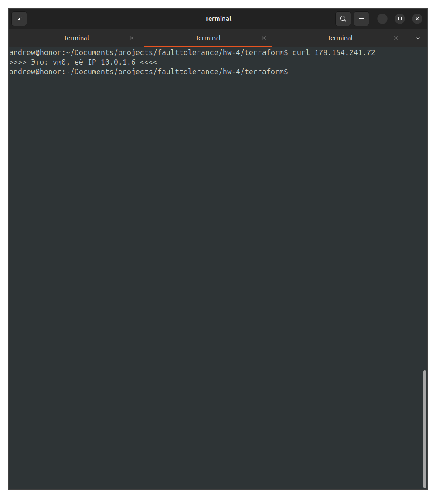

# Домашнее задание к занятию «Отказоустойчивость в облаке» - Лукинов Андрей

## Задание 1 

1. Cделайте [terraform playbook](terraform/main.tf), который:

- создаст 2 идентичные виртуальные машины. Используйте аргумент [count](https://www.terraform.io/docs/language/meta-arguments/count.html) для создания таких ресурсов;

    <details>
    <summary>Использованный код</summary>

    ```bash
    resource "yandex_compute_instance" "vm" {
        count = 2

        name = "vm${count.index}"
        platform_id = "standard-v1"

        boot_disk {
            
            initialize_params {
            image_id = "fd883qojk2a3hruf8p7m"
            type     = "network-hdd"
            size     = 10
            }
        }

        network_interface {
            subnet_id          = yandex_vpc_subnet.subnet1.id
            nat                = true
        }

        resources {
            cores         = 2
            memory        = 1
            core_fraction = 20
        }

        scheduling_policy {
            preemptible = true
        }

        metadata = {
            ssh-keys = "ubuntu:${file("~/.ssh/id_ed25519.pub")}"
        }
    }
    ```
    </details>

- создаст [таргет-группу](https://registry.terraform.io/providers/yandex-cloud/yandex/latest/docs/resources/lb_target_group). Поместите в неё созданные на шаге 1 виртуальные машины;

    <details>
    <summary>Использованный код</summary>

    ```bash
    resource "yandex_lb_target_group" "group1" {
      name = "group1"

      dynamic "target" {
        for_each = yandex_compute_instance.vm
        content {
          subnet_id = yandex_vpc_subnet.subnet1.id
          address   = target.value.network_interface.0.ip_address
        }
      }
    }
    ```
    </details>

- создаст [сетевой балансировщик нагрузки](https://registry.terraform.io/providers/yandex-cloud/yandex/latest/docs/resources/lb_network_load_balancer), который слушает на порту 80, отправляет трафик на порт 80 виртуальных машин и http healthcheck на порт 80 виртуальных машин.

    <details>
    <summary>Использованный код</summary>

    ```bash
    resource "yandex_lb_network_load_balancer" "balancer1" {
      name                = "balancer1"
      deletion_protection = "false"

      listener {
        name = "my-lb1"
        port = 80
        external_address_spec {
          ip_version = "ipv4"
        }
      }

    attached_target_group {
        target_group_id = yandex_lb_target_group.group1.id

        healthcheck {
          name = "http"
          http_options {
            port = 80
            path = "/"
          }
        }
      }
    }
    ```
    </details>

2. Установите на созданные виртуальные машины пакет Nginx любым удобным способом и запустите Nginx веб-сервер на порту 80.

3. Перейдите в веб-консоль Yandex Cloud и убедитесь, что: 

- созданный балансировщик находится в статусе Active,
- обе виртуальные машины в целевой группе находятся в состоянии healthy.

  

4. Сделайте запрос на 80 порт на внешний IP-адрес балансировщика и убедитесь, что вы получаете ответ в виде дефолтной страницы Nginx.

  (Запрос к ВМ0)

  (Запрос к ВМ1)

  (Запрос к балансировщику)

## Задание со звёздочкой доделаю позже. 

## Задание 2*

1. Теперь вместо создания виртуальных машин создайте [группу виртуальных машин с балансировщиком нагрузки](https://cloud.yandex.ru/docs/compute/operations/instance-groups/create-with-balancer).

2. Nginx нужно будет поставить тоже автоматизированно. Для этого вам нужно будет подложить файл установки Nginx в user-data-ключ [метадаты](https://cloud.yandex.ru/docs/compute/concepts/vm-metadata) виртуальной машины.

- [Пример файла установки Nginx](https://github.com/nar3k/yc-public-tasks/blob/master/terraform/metadata.yaml).
- [Как подставлять файл в метадату виртуальной машины.](https://github.com/nar3k/yc-public-tasks/blob/a6c50a5e1d82f27e6d7f3897972adb872299f14a/terraform/main.tf#L38)

3. Перейдите в веб-консоль Yandex Cloud и убедитесь, что: 

- созданный балансировщик находится в статусе Active,
- обе виртуальные машины в целевой группе находятся в состоянии healthy.

4. Сделайте запрос на 80 порт на внешний IP-адрес балансировщика и убедитесь, что вы получаете ответ в виде дефолтной страницы Nginx.

*В качестве результата пришлите*

*1. Terraform Playbook.*

*2. Скриншот статуса балансировщика и целевой группы.*

*3. Скриншот страницы, которая открылась при запросе IP-адреса балансировщика.*
