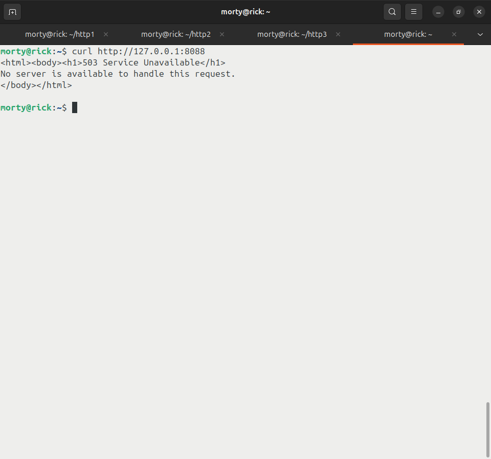

# Домашнее задание к занятию 2 «Кластеризация и балансировка нагрузки» - Лукинов Андрей

## Задание 1
- Запустите два simple python сервера на своей виртуальной машине на разных портах
    <details>
    <summary>Использованные команды</summary>

    - `sudo mkdir http1 && cd ~/http1`
    - `sudo nano index.html`
      - Server 1 :8888
    - `python3 -m http.server 8888 --bind 0.0.0.0`
    - `sudo mkdir http2 && cd ~/http2`
    - `sudo nano index.html`
      - Server 2 :9999
    - `python3 -m http.server 9999 --bind 0.0.0.0`
    </details>
- Установите и настройте HAProxy, воспользуйтесь материалами к лекции.
    <details>
    <summary>Использованные команды</summary>

    - `sudo apt-get install haproxy`
    - `sudo nano /etc/haproxy/haproxy.cfg`
        <details>
        <summary>haproxy.conf</summary>

        Добавить в конец файла

        ```bash
        listen stats
                bind                    :888
                mode                    http
                stats                   enable
                stats uri               /stats
                stats refresh           5s
                stats realm             Haproxy\ Statistics

        frontend example
                mode http
                bind :8088
                default_backend web_servers

        backend web_servers
                mode http
                balance roundrobin
                option httpchk
                http-check send meth GET uri /index.html
                server s1 127.0.0.1:8888 check
                server s2 127.0.0.1:9999 check
        ```
        </details>
    - `sudo systemctl reload haproxy`
    </details>
- Настройте балансировку Round-robin на 4 уровне.
    <details>
    <summary>Использованные команды</summary>

    - `sudo nano /etc/haproxy/haproxy.cfg`
        <details>
        <summary>haproxy.conf</summary>

        Добавить в конец файла

        ```bash
        listen web_tcp
                bind :1325
                server s1 127.0.0.1:8888 check inter 3s
                server s2 127.0.0.1:9999 check inter 3s
        ```
        </details>
    - `sudo systemctl reload haproxy`
    </details>
- На проверку направьте конфигурационный файл haproxy, скриншоты, где видно перенаправление запросов на разные серверы при обращении к HAProxy.
    <details>
    <summary>Скриншоты и конфиг файл</summary>

    - 

    - 

    - [Файл haproxy.cfg](files/haproxy_1.cfg)
      </details>

## Задание 2
- Запустите три simple python сервера на своей виртуальной машине на разных портах
    <details>
    <summary>Использованные команды</summary>

    - `sudo mkdir http1 && cd ~/http1`
    - `sudo nano index.html`
      - Server 1 :8888
    - `python3 -m http.server 8888 --bind 0.0.0.0`
    - `sudo mkdir http2 && cd ~/http2`
    - `sudo nano index.html`
      - Server 2 :9999
    - `python3 -m http.server 9999 --bind 0.0.0.0`
    - `sudo mkdir http3 && cd ~/http3`
    - `sudo nano index.html`
      - Server 3 :6666
    - `python3 -m http.server 6666 --bind 0.0.0.0`
    </details>
- Настройте балансировку Weighted Round Robin на 7 уровне, чтобы первый сервер имел вес 2, второй - 3, а третий - 4

    - `sudo nano /etc/haproxy/haproxy.cfg`
        <details>
        <summary>haproxy.cfg</summary>
        
        Заменить в файле блок

        ```bash
        backend web_servers
                mode http
                balance roundrobin
                option httpchk
                http-check send meth GET uri /index.html
                server s1 127.0.0.1:8888 weight 2 check
                server s2 127.0.0.1:9999 weight 3 check
                server s3 127.0.0.1:6666 weight 4 check
        ```
        Удалить в файле блок

        ```bash
        listen web_tcp
                bind :1325
                server s1 127.0.0.1:8888 check inter 3s
                server s2 127.0.0.1:9999 check inter 3s
        ```
        </details>
    - `sudo systemctl reload haproxy`

- HAproxy должен балансировать только тот http-трафик, который адресован домену example.local
    
    - `sudo nano /etc/haproxy/haproxy.cfg`
        <details>
        <summary>haproxy.cfg</summary>
        
        Добавить в блок *`frontend example`*
        ```bash
            acl ACL_example1 hdr(host) -i example.local
            use_backend web_servers if ACL_example1
        ```
        </details>

    - `sudo systemctl reload haproxy`

- На проверку направьте конфигурационный файл haproxy, скриншоты, где видно перенаправление запросов на разные серверы при обращении к HAProxy c использованием домена example.local и без него.
    
    <details>
    <summary>Скриншоты и конфиг файл</summary>
    
    

    

    [Файл haproxy.cfg](files/haproxy_2.cfg)
    </details>

# **Задания со звёздочками доделаю позже.**

## Задание 3*
- Настройте связку HAProxy + Nginx как было показано на лекции.
- Настройте Nginx так, чтобы файлы .jpg выдавались самим Nginx (предварительно разместите несколько тестовых картинок в директории /var/www/), а остальные запросы переадресовывались на HAProxy, который в свою очередь переадресовывал их на два Simple Python server.
- На проверку направьте конфигурационные файлы nginx, HAProxy, скриншоты с запросами jpg картинок и других файлов на Simple Python Server, демонстрирующие корректную настройку.

## Задание 4*
- Запустите 4 simple python сервера на разных портах.
- Первые два сервера будут выдавать страницу index.html вашего сайта example1.local (в файле index.html напишите example1.local)
- Вторые два сервера будут выдавать страницу index.html вашего сайта example2.local (в файле index.html напишите example2.local)
- Настройте два бэкенда HAProxy
- Настройте фронтенд HAProxy так, чтобы в зависимости от запрашиваемого сайта example1.local или example2.local запросы перенаправлялись на разные бэкенды HAProxy
- На проверку направьте конфигурационный файл HAProxy, скриншоты, демонстрирующие запросы к разным фронтендам и ответам от разных бэкендов.