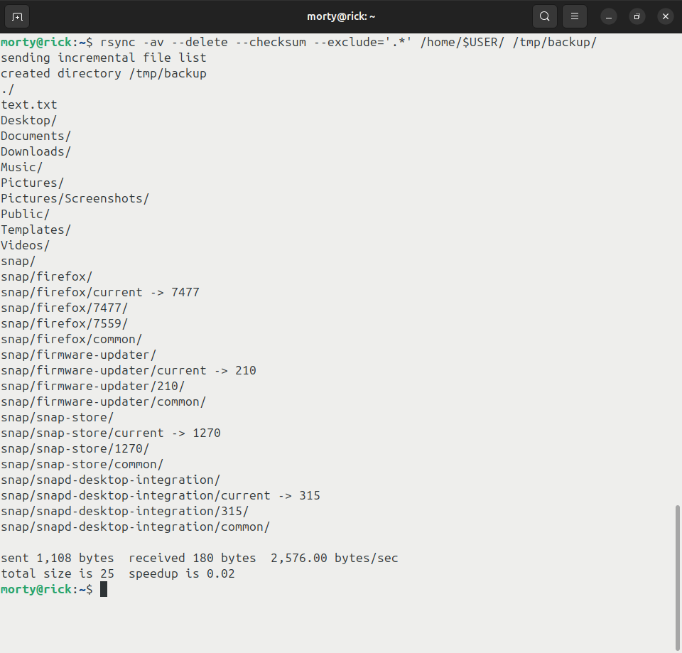
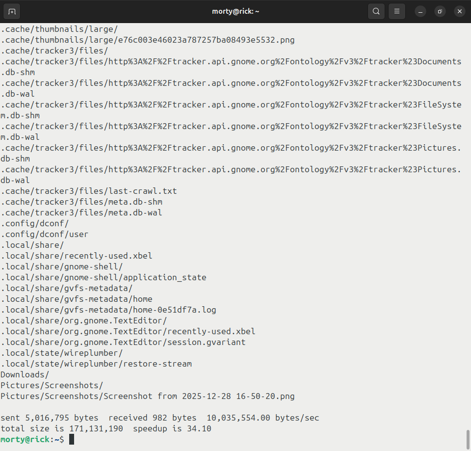
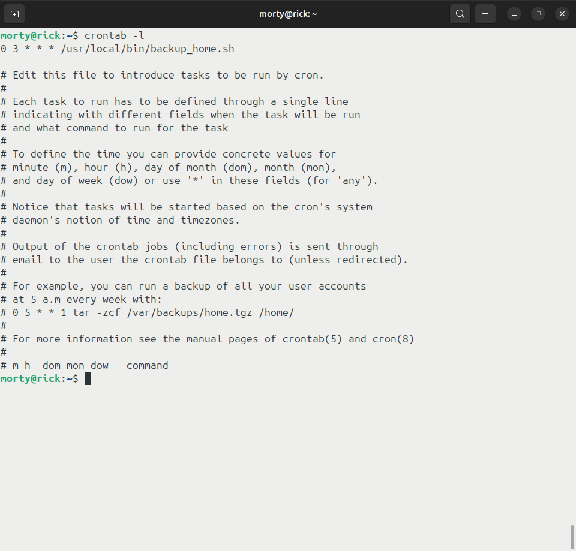

# Домашнее задание к занятию 3 «Резервное копирование»

## Задание 1
- Составьте команду rsync, которая позволяет создавать зеркальную копию домашней директории пользователя в директорию `/tmp/backup`
- Необходимо исключить из синхронизации все директории, начинающиеся с точки (скрытые)
- Необходимо сделать так, чтобы rsync подсчитывал хэш-суммы для всех файлов, даже если их время модификации и размер идентичны в источнике и приемнике.
- На проверку направить скриншот с командой и результатом ее выполнения

    <details>
    <summary>Решение</summary>

    *Использованная команда: `rsync -av --delete --checksum --exclude='.*' /home/$USER/ /tmp/backup/`*

    - `rsync` - утилита для синхронизации файлов и создания резервных копий.
    - `-a` - архивный режим: сохраняет права, владельца, ссылки, время и рекурсивно копирует поддиректории.
    - `-v` - подробный вывод.
    - `--delete` - удаляет в `/tmp/backup` файлы, которых уже нет в `/home/$USER`, то есть получается зеркальная копия.
    - Вместо `$USER` - подставляем свой логин, если несколько пользователей.
    
    *Исключение скрытых директорий*

    - `--exclude='.*'` — исключает все файлы и директории, чьё имя начинается с точки.
    - Благодаря этому в `/tmp/backup` не попадут скрытые каталоги из домашней директории, но обычные файлы и папки будут скопированы.
    
    *Подсчёт хэш-сумм (checksum)*

    - `--checksum` заставляет rsync сравнивать файлы по содержимому (хэш-сумме), а не только по времени и размеру.
    - Это значит: даже если размер и время модификации совпадают, rsync всё равно прочитает файлы целиком и проверит, одинаковы ли они по содержимому.

    *Важно про слэш в пути*
    
    - В источнике `/home/$USER/` есть завершающий слэш, поэтому rsync копирует содержимое домашней директории в `/tmp/backup`, а не создаёт `/tmp/backup/$USER`.
    - Без слэша поведение было бы другим: копировалась бы сама директория как подкаталог в `/tmp/backup`.​
  
    

    </details>

## Задание 2
- Написать скрипт и настроить задачу на регулярное резервное копирование домашней директории пользователя с помощью rsync и cron.
- Резервная копия должна быть полностью зеркальной
- Резервная копия должна создаваться раз в день, в системном логе должна появляться запись об успешном или неуспешном выполнении операции
- Резервная копия размещается локально, в директории `/tmp/backup`
- На проверку направить файл crontab и скриншот с результатом работы утилиты.

    <details>
    <summary>Решение</summary>

    - Создаём файл, к примеру, `backup_home.sh`.
        <details>
        <summary>backup_home.sh</summary>

        ```bash
        #!/bin/bash

        SRC="/home/$USER/"
        DEST="/tmp/backup/"
        LOGTAG="rsync-backup"

        mkdir -p "$DEST"

        rsync -av --delete "$SRC/" "$DEST/"
        STATUS=$?

        if [ $STATUS -eq 0 ]; then
            logger -t "$LOGTAG" -p user.info "Backup OK: $SRC -> $DEST"
        else
            logger -t "$LOGTAG" -p user.err "Backup FAILED (code $STATUS): $SRC -> $DEST"
        fi
        ```
        </details>
    - Делаем скрипт исполняемым `sudo chmod +x /usr/local/bin/backup_home.sh`.
    - Настраиваем cron на ежедневный запуск.
      - `crontab -e`
      - Добавляем в файл строку: `0 3 * * * /usr/local/bin/backup_home.sh`
    
    (Запуск команды `/usr/local/bin/backup_home.sh`)
    
    (Запуск команды `crontab -l`)
    
    (Файлы в папке `/tmp/backup/`)
    
    (Вывод команды `journalctl -t rsync-backup --since "today"` )

    [Файл crontab](files/morty)

    </details>


## Задания со звёздочками доделаю позже.

## Задание 3*
- Настройте ограничение на используемую пропускную способность rsync до 1 Мбит/c
- Проверьте настройку, синхронизируя большой файл между двумя серверами
- На проверку направьте команду и результат ее выполнения в виде скриншота

## Задание 4*
- Напишите скрипт, который будет производить инкрементное резервное копирование домашней директории пользователя с помощью rsync на другой сервер
- Скрипт должен удалять старые резервные копии (сохранять только последние 5 штук)
- Напишите скрипт управления резервными копиями, в нем можно выбрать резервную копию и данные восстановятся к состоянию на момент создания данной резервной копии.
- На проверку направьте скрипт и скриншоты, демонстрирующие его работу в различных сценариях.