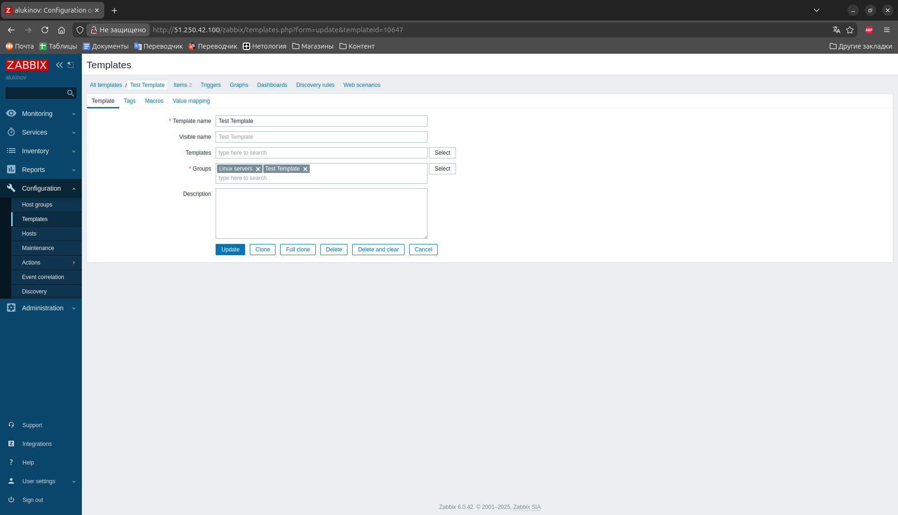
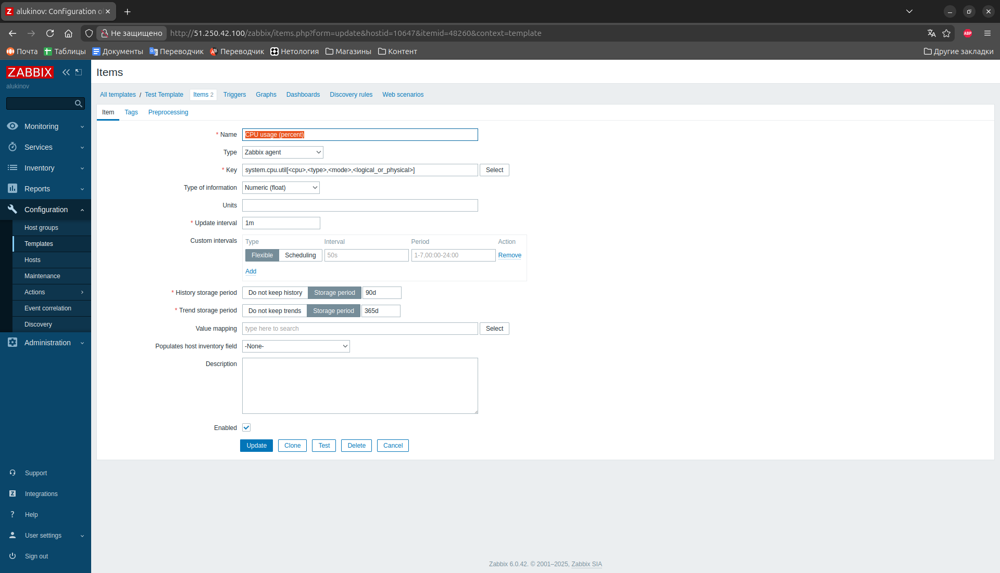
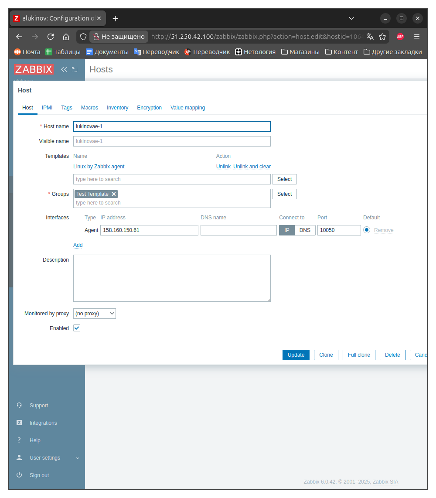
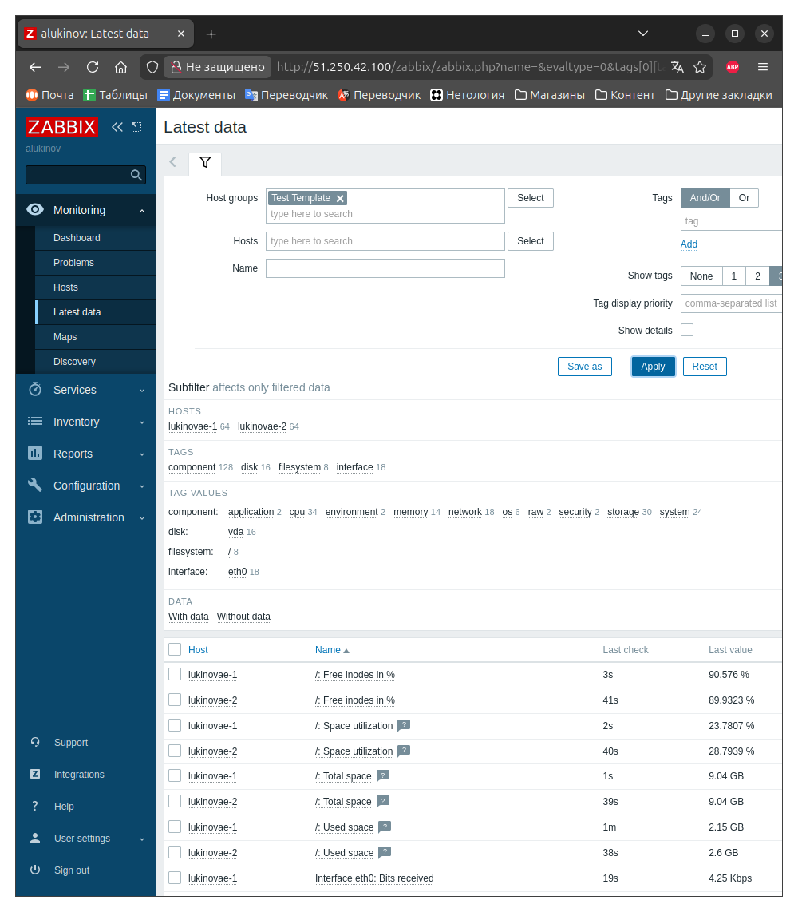
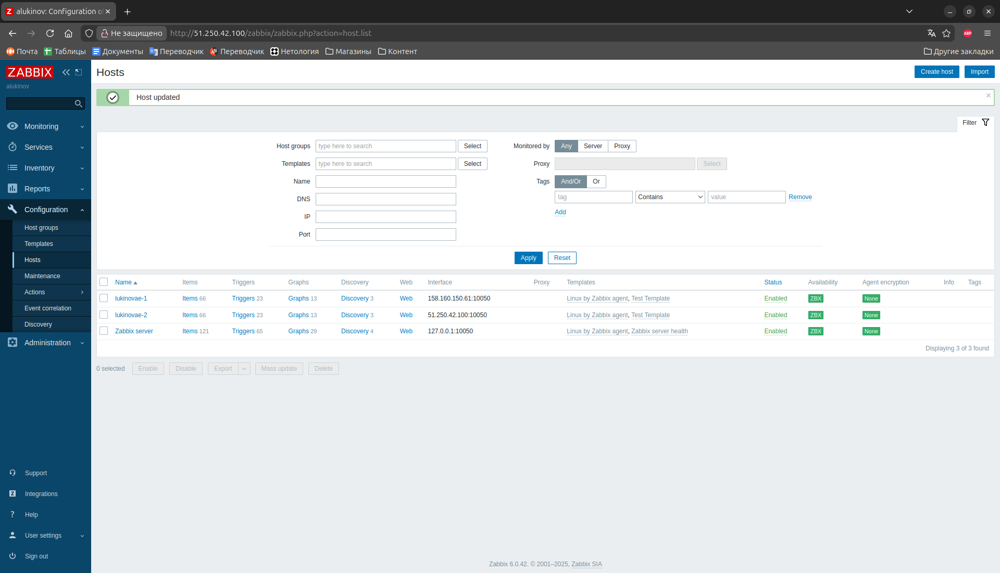
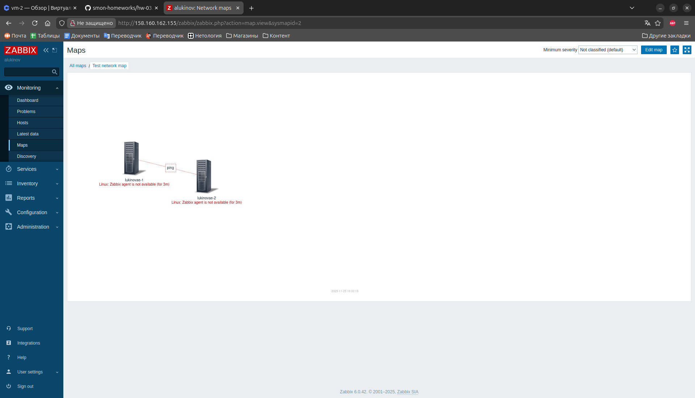
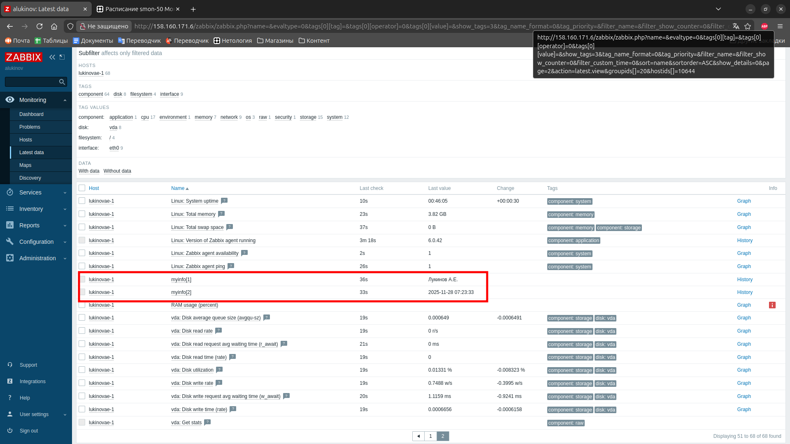
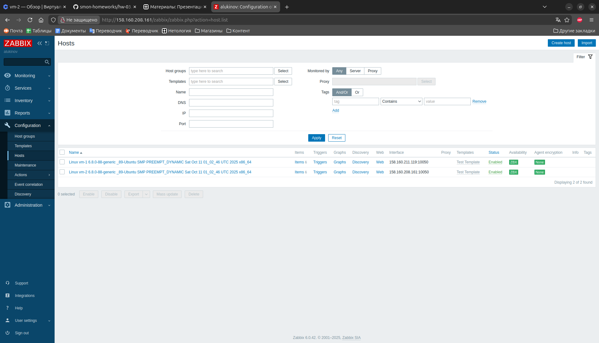

# Домашнее задание к занятию «Система мониторинга Zabbix. Часть 2» - Лукинов Андрей

---

## Задание 1
Создайте свой шаблон, в котором будут элементы данных, мониторящие загрузку CPU и RAM хоста.

### Процесс выполнения
1. Выполняя ДЗ сверяйтесь с процессом отражённым в записи лекции.
2. В веб-интерфейсе Zabbix Servera в разделе Templates создайте новый шаблон

3. Создайте Item который будет собирать информацию об загрузке CPU в процентах

4. Создайте Item который будет собирать информацию об загрузке RAM в процентах

---

## Задание 2
Добавьте в Zabbix два хоста и задайте им имена <фамилия и инициалы-1> и <фамилия и инициалы-2>. Например: ivanovii-1 и ivanovii-2.

### Процесс выполнения
1. Выполняя ДЗ сверяйтесь с процессом отражённым в записи лекции.
2. Установите Zabbix Agent на 2 виртмашины, одной из них может быть ваш Zabbix Server
3. Добавьте Zabbix Server в список разрешенных серверов ваших Zabbix Agentов
4. Добавьте Zabbix Agentов в раздел Configuration > Hosts вашего Zabbix Servera
5. Прикрепите за каждым хостом шаблон Linux by Zabbix Agent

6. Проверьте что в разделе Latest Data начали появляться данные с добавленных агентов

---

## Задание 3
Привяжите созданный шаблон к двум хостам. Также привяжите к обоим хостам шаблон Linux by Zabbix Agent.

### Процесс выполнения
1. Выполняя ДЗ сверяйтесь с процессом отражённым в записи лекции.
2. Зайдите в настройки каждого хоста и в разделе Templates прикрепите к этому хосту ваш шаблон
3. Так же к каждому хосту привяжите шаблон Linux by Zabbix Agent
4. Проверьте что в раздел Latest Data начали поступать необходимые данные из вашего шаблона

---

## Задание 4
Создайте свой кастомный дашборд.

### Процесс выполнения
1. Выполняя ДЗ сверяйтесь с процессом отражённым в записи лекции.
2. В разделе Dashboards создайте новый дашборд
3. Разместите на нём несколько графиков на ваше усмотрение.

---

## Задание 5* со звёздочкой
Создайте карту и расположите на ней два своих хоста.

### Процесс выполнения
1. Настройте между хостами линк.
2. Привяжите к линку триггер, связанный с agent.ping одного из хостов, и установите индикатором сработавшего триггера красную пунктирную линию.
3. Выключите хост, чей триггер добавлен в линк. Дождитесь срабатывания триггера.

---

## Задание 6* со звёздочкой
Создайте UserParameter на bash и прикрепите его к созданному вами ранее шаблону. Он должен вызывать скрипт, который:
- при получении 1 будет возвращать ваши ФИО,
- при получении 2 будет возвращать текущую дату.

---

## Задание 7* со звёздочкой
Доработайте Python-скрипт из лекции, создайте для него UserParameter и прикрепите его к созданному вами ранее шаблону. 
Скрипт должен:
- при получении 1 возвращать ваши ФИО,
- при получении 2 возвращать текущую дату,
- делать всё, что делал скрипт из лекции.

---

## Задание 8* со звёздочкой

Настройте автообнаружение и прикрепление к хостам созданного вами ранее шаблона.

---

## Задание 9* со звёздочкой

Доработайте скрипты Vagrant для 2-х агентов, чтобы они были готовы к автообнаружению сервером, а также имели на борту разработанные вами ранее параметры пользователей.

Я никогда не пользовался Vagrant, оставлю это задание на потом.
