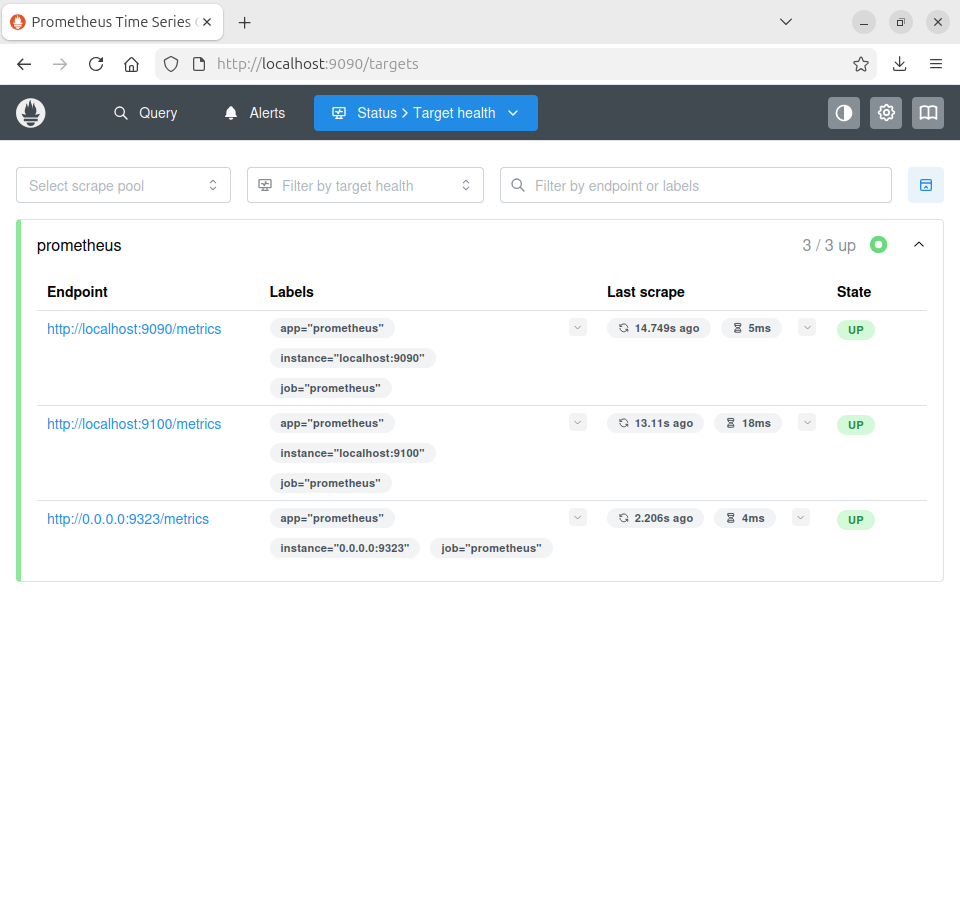
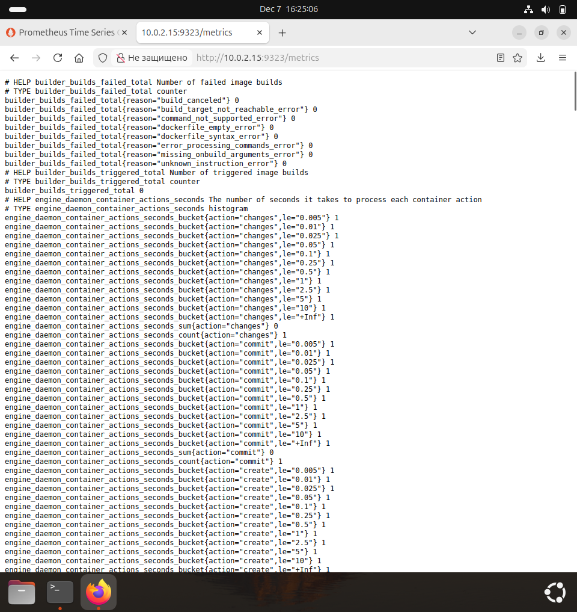
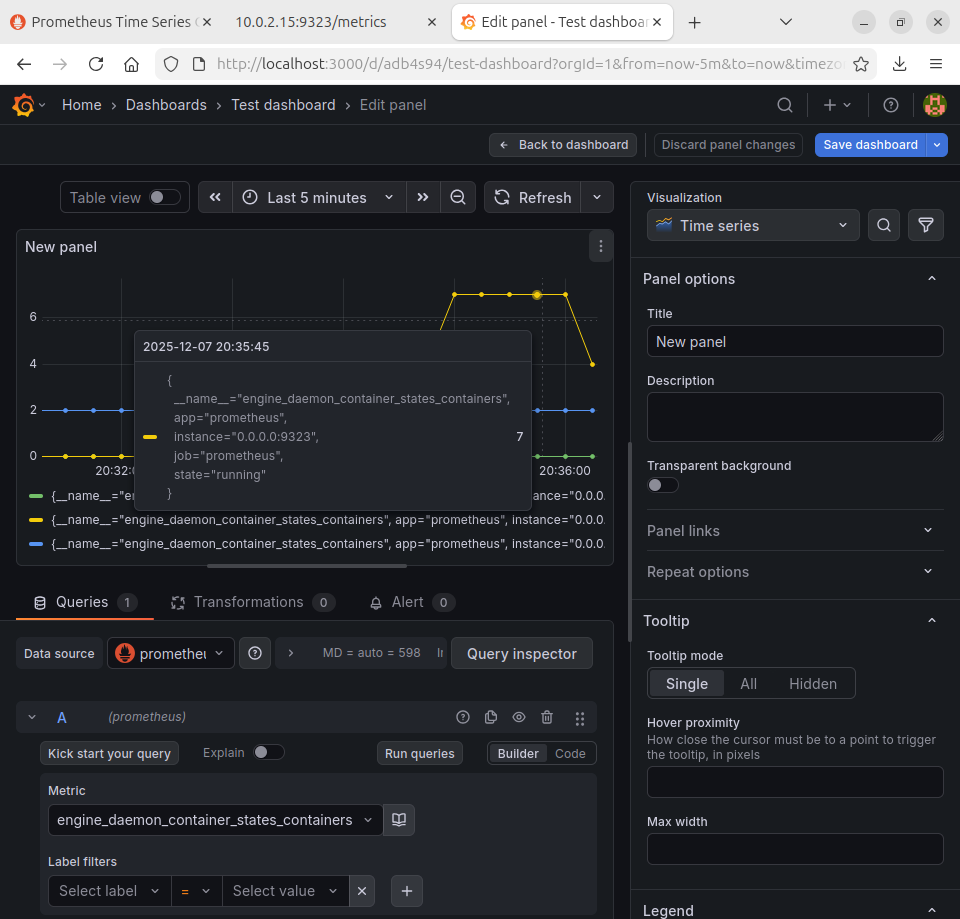

# Домашнее задание к занятию «Prometheus. Часть 2» - Лукинов Андрей

---

## Задание 1
Создайте файл с правилом оповещения, как в лекции, и добавьте его в конфиг Prometheus.

## Требования к результату
Погасите node exporter, стоящий на мониторинге, и прикрепите скриншот раздела оповещений Prometheus, где оповещение будет в статусе Pending


---

## Задание 2
Установите Alertmanager и интегрируйте его с Prometheus.

* https://github.com/prometheus/alertmanager/releases
* wget https://github.com/prometheus/alertmanager/releases/download/v0.29.0/alertmanager-0.29.0.linux-amd64.tar.gz
* tar -xzvf alertmanager-0.29.0.linux-amd64.tar.gz
* cd alertmanager-0.29.0.linux-amd64/
* sudo mv ./alertmanager /usr/local/bin/
* sudo mv ./amtool /usr/local/bin/
* sudo mv ./alertmanager.yml /etc/prometheus/
* sudo chown prometheus:prometheus /etc/prometheus/alertmanager.yml
* sudo nano /etc/systemd/system/prometheus-alertmanager.service
<details>
<summary>prometheus-alertmanager.service</summary>

```
[Unit]
Description=Alertmanager Service
After=network.target

[Service]
EnvironmentFile=-/etc/default/alertmanager
User=prometheus
Group=prometheus
Type=simple
ExecStart=/usr/local/bin/alertmanager --config.file=/etc/prometheus/alertmanager.yml --storage.path=/var/lib/prometheus/alertmanager $ARGS
ExecReload=/bin/kill -HUP $MAINPID
Restart=on-failure

[Install]
WantedBy=multi-user.target
```
</details>

* sudo systemctl daemon-reload
* sudo systemctl enable prometheus-alertmanager.service
* sudo systemctl start prometheus-alertmanager.service
* sudo nano /etc/prometheus/prometheus.yml -> Изменить в Alertmanager configuration -> targets: -localhost:9093
* sudo nano /etc/prometheus/netology-test.yml
<details>
<summary>netology-test.yml</summary>

```
groups:
- name: netology-test
  rules:
  - alert: InstanceDown
    expr: up == 0
    for: 1m
    labels:
      severity: critical
    annotations:
      summary: "Instance {{ $labels.instance }} down"
      description: "{{ $labels.instance }} of job {{ $labels.job }} has been down for more th>

```
</details>

* sudo nano /etc/prometheus/prometheus.yml
* rule_files: -> - "netology-test.yml"
* sudo nano /etc/prometheus/alertmanager.yml
<details>
<summary>alertmanager.yml</summary>

```
global:
route:
  group_by: ['alertname'] # Параметр группировки оповещений — по имени
  group_wait: 30s # Сколько ждать восстановления, перед тем как отправить первое оповещение
  group_interval: 10m # Сколько ждать, перед тем как дослать оповещение о новых сработках по >
  repeat_interval: 60m # Сколько ждать, перед тем как отправить повторное оповещение
  receiver: 'email' # Способ, которым будет доставляться текущее оповещение
receivers: # Настройка способов оповещения
- name: 'email'
  email_configs:
  - to: 'yourmailto@todomain.com'
    from: 'yourmailfrom@fromdomain.com'
    smarthost: 'mailserver:25'
    auth_username: 'user'
    auth_identity: 'user'
    auth_password: 'paS$w0rd'

```
</details>

* sudo systemctl restart prometheus-alertmanager.service
* sudo systemctl stop node-exporter.service

## Требования к результату
Прикрепите скриншот Alerts из Prometheus, где правило оповещения будет в статусе Fireing, и скриншот из Alertmanager, где будет видно действующее правило оповещения


---

## Задание 3

Активируйте экспортёр метрик в Docker и подключите его к Prometheus.

* sudo nano /etc/docker/daemon.json
<details>
<summary>daemon.json</summary>

```

{
 "metrics-addr" : "0.0.0.0:9323",
 "experimental" : true
}

```
</details>

* sudo systemctl restart docker.service
* sudo systemctl status docker.service
* sudo nano /etc/prometheus/prometheus.yml 
* static_configs: targets: -> "0.0.0.0:9323"
* sudo systemctl restart prometheus.service

## Требования к результату
Приложите скриншот браузера с открытым эндпоинтом, а также скриншот списка таргетов из интерфейса Prometheus.*





---

## Задание 4*

Создайте свой дашборд Grafana с различными метриками Docker и сервера, на котором он стоит.

* Dashboards -> New -> Add visualization -> Data source (prometheus) -> Metric (engine_daemon_container_states_containers)




